# 亚太地区增长观察：能源压力缓解，整体表现趋于平衡

本报告汇总了我们所覆盖的亚太经济体的区域及国别增长数据。¹ 报告包含了6月份的采购经理人指数（PMI），但最新的“硬”经济指标大多指向5月份。

最新一轮（6月）PMI数据在环比变化上表现不一，但从相对水平来看，总体与制造业部门的稳健增长相符。中国官方PMI有所走强，而非官方指标则有所减弱。印度的制造业和服务业指数均出现回落，而日本的两项指数则均有所走强。供应商交货延迟仍是该地区许多制造商面临的问题。

- 我们的GS当前活动指标（CAI）在5月份及6月初步数据中普遍保持良好或有所改善。近期，我们上调了许多经济体的GDP增长预测，这反映了能源价格压力的缓解。

■ 近期，大多数经济体的金融状况有所放松，这得益于油价回落等因素。韩国和台湾地区因股市上涨而持续出现大幅放松。泰国的金融状况也有所放松，其中汇率贬值起到了关键作用。相反，印度尼西亚因政策利率上调及股市抛售，其金融状况指数（FCI）出现了明显的收紧。

Andrew Tilton
+852-2978-1802 |
andrew.tilton@gs.com
GS (Asia) L.L.C.

Andrew Boak, CFA
+61(2)9321-8576 |
andrew.boak@gs.com
GS Australia Pty Ltd

Goohoon Kwon, CFA
+852-2978-0048 |
goohoon.kwon@gs.com
GS (Asia) L.L.C.

Hui Shan
+852-2978-6634 | hui.shan@gs.com
GS (Asia) L.L.C.

Tomohiro Ota
+81(3)4587-9984 |
tomohiro.ota@gs.com
GS Japan Co., Ltd.

Santanu Sengupta
+91(22)6616-9042 |
santanu.sengupta@gs.com
GS India SPL

Yuriko Tanaka
+81(3)4587-9964 |
yuriko.tanaka@gs.com
GS Japan Co., Ltd.

Lisheng Wang
+852-3966-4004 |
lisheng.wang@gs.com
GS (Asia) L.L.C.

Chris Poh
+65-6889-3454 | chris.poh@gs.com
GS (Singapore) Pte

（绿色/红色 = 所示经济体增长加快/放缓）
区域增长 - 概览指标
图表1：早期CAI数据显示改善迹象
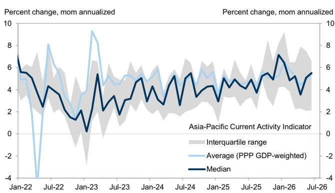
来源：GS全球投资研究

图表2：中国CAI有所改善
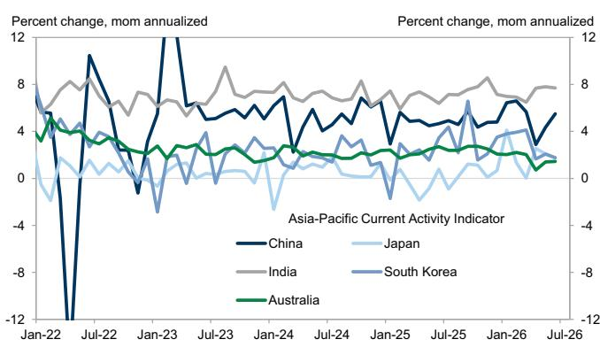
来源：GS全球投资研究

图表3：我们近期上调了许多国家的增长预测
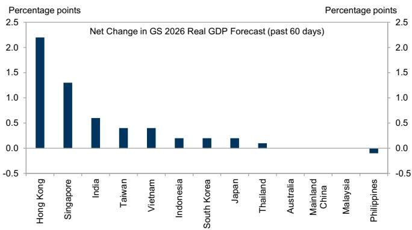
来源：GS全球投资研究

图表4：近期数据在日本超预期，在澳大利亚则低于预期
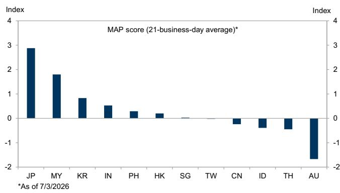
来源：GS全球投资研究

GS当前活动指标（环比，年化率）

<table><tr><td rowspan="2"></td><td colspan="6">2025</td><td colspan="6">2026</td></tr><tr><td>J</td><td>A</td><td>S</td><td>O</td><td>N</td><td>D</td><td>J</td><td>F</td><td>M</td><td>A</td><td>M</td><td>J</td></tr><tr><td>中国大陆</td><td>4.9</td><td>4.6</td><td>5.7</td><td>4.4</td><td>4.8</td><td>4.8</td><td>6.4</td><td>6.6</td><td>5.7</td><td>2.9</td><td>4.4</td><td></td></tr><tr><td>韩国</td><td>4.4</td><td>2.2</td><td>6.6</td><td>1.6</td><td>2.1</td><td>3.5</td><td>3.8</td><td>3.9</td><td>4.1</td><td>1.7</td><td>2.1</td><td></td></tr><tr><td>台湾地区</td><td>3.3</td><td>3.7</td><td>5.2</td><td>3.2</td><td>7.0</td><td>8.5</td><td>9.2</td><td>4.8</td><td>9.3</td><td>3.5</td><td>7.5</td><td></td></tr><tr><td>印度</td><td>7.2</td><td>7.1</td><td>7.6</td><td>7.8</td><td>8.6</td><td>7.1</td><td>7.0</td><td>6.9</td><td>6.5</td><td>7.7</td><td>7.8</td><td>7.7</td></tr><tr><td>印度尼西亚</td><td>5.1</td><td>4.4</td><td>5.1</td><td>5.5</td><td>4.9</td><td>6.0</td><td>5.6</td><td>5.9</td><td>5.2</td><td>8.0</td><td>5.1</td><td></td></tr><tr><td>马来西亚</td><td>9.0</td><td>5.1</td><td>4.9</td><td>9.3</td><td>6.6</td><td>8.9</td><td>7.1</td><td>2.1</td><td>1.7</td><td>15.9</td><td>6.2</td><td></td></tr><tr><td>菲律宾</td><td>6.3</td><td>4.6</td><td>5.2</td><td>6.2</td><td>5.9</td><td>7.3</td><td>6.1</td><td>6.3</td><td>7.1</td><td>5.1</td><td>5.7</td><td></td></tr><tr><td>泰国</td><td>0.6</td><td>-2.7</td><td>11.1</td><td>12.1</td><td>1.7</td><td>8.2</td><td>15.1</td><td>3.8</td><td>2.2</td><td>2.3</td><td>-1.3</td><td></td></tr><tr><td>日本</td><td>-0.9</td><td>0.1</td><td>1.2</td><td>1.1</td><td>0.1</td><td>0.7</td><td>4.1</td><td>1.3</td><td>0.0</td><td>2.5</td><td>2.1</td><td>1.7</td></tr><tr><td>香港地区</td><td>6.3</td><td>5.0</td><td>5.8</td><td>8.5</td><td>6.3</td><td>10.1</td><td>11.4</td><td>6.5</td><td>9.5</td><td>7.9</td><td>8.6</td><td></td></tr><tr><td>新加坡</td><td>8.3</td><td>1.6</td><td>6.0</td><td>11.6</td><td>10.4</td><td>7.1</td><td>9.9</td><td>7.4</td><td>5.5</td><td>9.6</td><td>11.3</td><td>9.5</td></tr><tr><td>澳大利亚</td><td>2.4</td><td>2.4</td><td>2.7</td><td>2.7</td><td>2.5</td><td>2.1</td><td>2.0</td><td>2.2</td><td>2.0</td><td>0.7</td><td>1.4</td><td>1.5</td></tr><tr><td>新西兰</td><td>3.3</td><td>3.0</td><td>3.6</td><td>3.2</td><td>3.4</td><td>4.2</td><td>4.3</td><td>3.9</td><td>3.0</td><td>1.9</td><td>1.8</td><td>2.7</td></tr></table>

注：月度CAI值仅在超过20%的组成数据已报告后显示。
来源：GS全球投资研究

## 区域制造业、服务业与贸易

图表6：综合PMI处于温和扩张区间
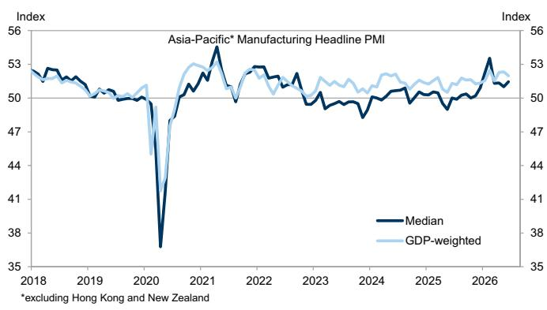
来源：Haver Analytics, GS全球投资研究

图表7：制造业前景展望趋于积极
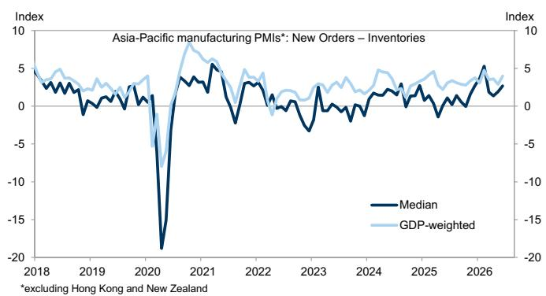
来源：Haver Analytics, GS全球投资研究

图表8：供应链中断问题仍受关注
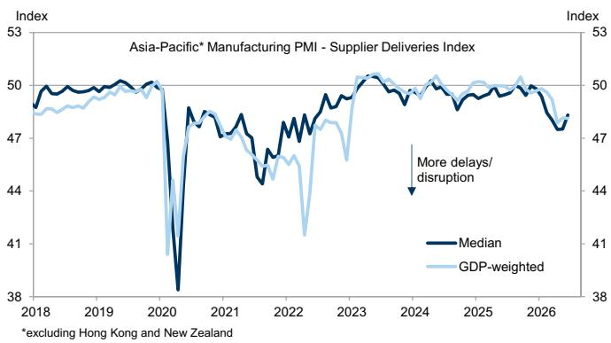
来源：Haver Analytics, GS全球投资研究

图表9：印度服务业PMI下降，日本上升
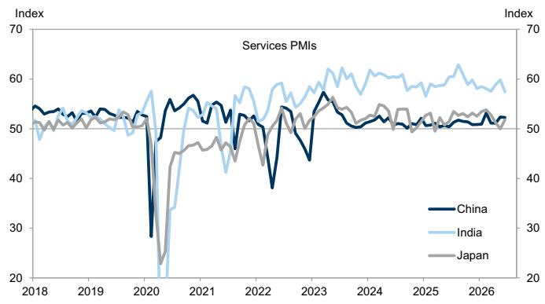
中国数据为国家统计局非制造业PMI与RatingDog服务业PMI的平均值。
来源：Haver Analytics, GS全球投资研究

图表10：贸易活动持续活跃
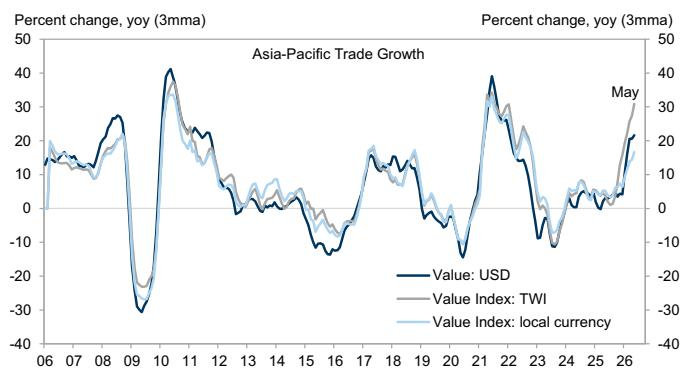
来源：CPB世界贸易监测, Haver Analytics, GS全球投资研究

图表11：东亚地区出口在5月份回升
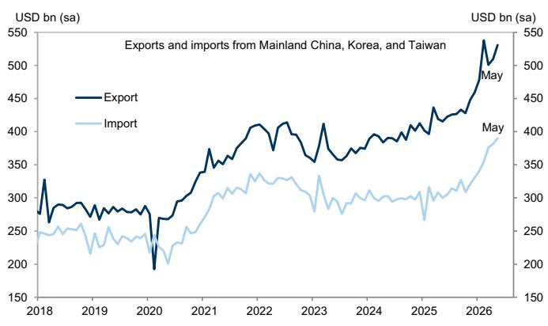
来源：Haver Analytics, GS全球投资研究

## 新兴市场亚洲 - 各经济体增长与金融状况

我们在这些图表中展示了CAI的3个月移动平均值，以平滑结果并便于与GDP数据进行比较。最新的CAI数据和FCI数据可在GS研究门户网站上找到。请注意，我们在2023年更新并修订了中国CAI。

图表12：中国增长与金融状况
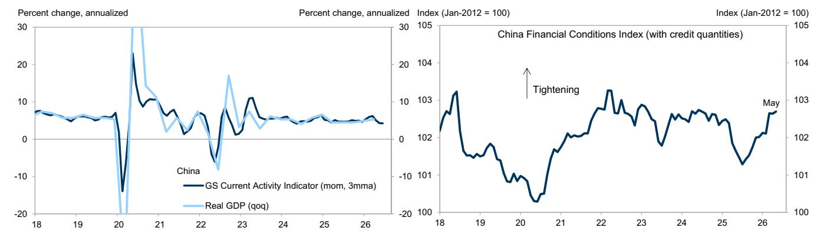
来源：Haver Analytics, GS全球投资研究

图表13：韩国增长与金融状况
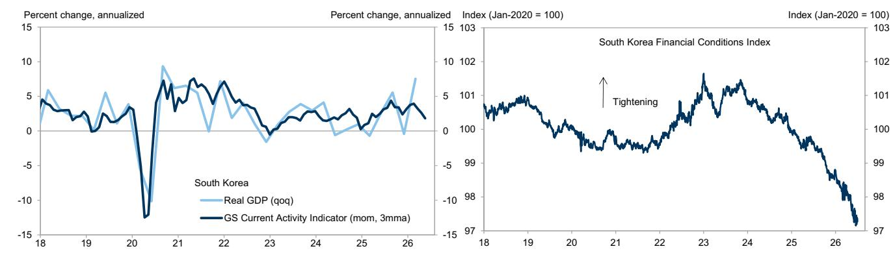
来源：Haver Analytics, CEIC, GS全球投资研究

图表14：台湾地区增长与金融状况
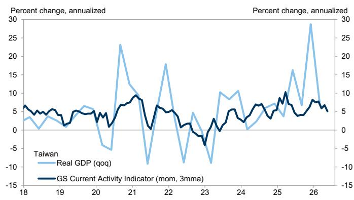
来源：Haver Analytics, CEIC, GS全球投资研究

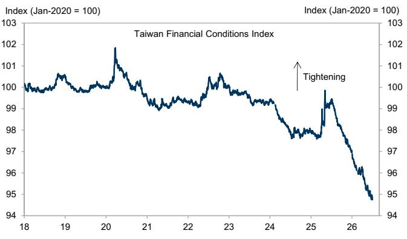

图表15：印度增长与金融状况
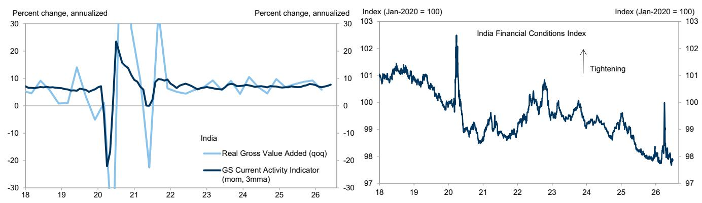
来源：Haver Analytics, CEIC, GS全球投资研究

图表16：印度尼西亚增长与金融状况
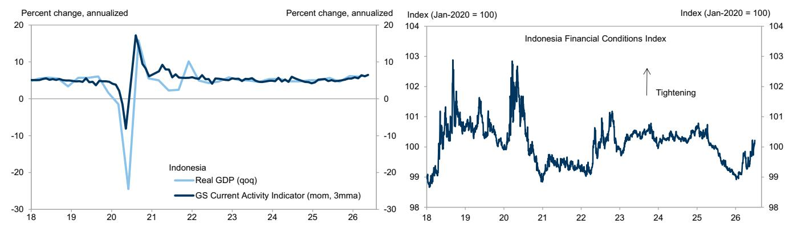
来源：Haver Analytics, CEIC, GS全球投资研究

图表17：马来西亚增长与金融状况
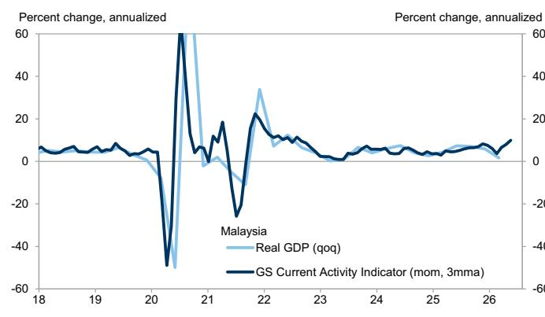
来源：Haver Analytics, CEIC, GS全球投资研究

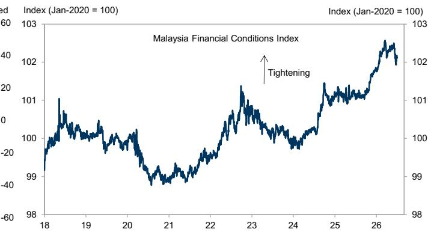

图表18：菲律宾增长与金融状况

来源：Haver Analytics, CEIC, GS全球投资研究

图表19：泰国增长与金融状况
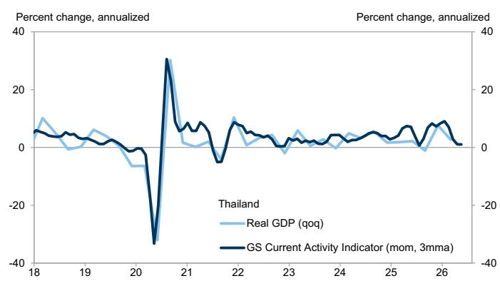
来源：Haver Analytics, CEIC, GS全球投资研究

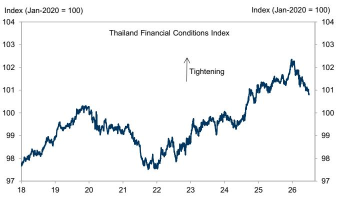

## 发达市场亚洲 - 各经济体增长与金融状况

图表20：日本增长与金融状况
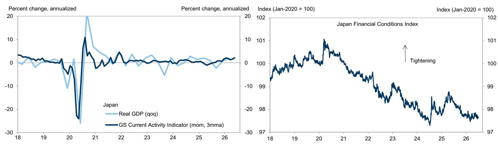
来源：Haver Analytics, CEIC, GS全球投资研究

图表21：香港地区增长与金融状况
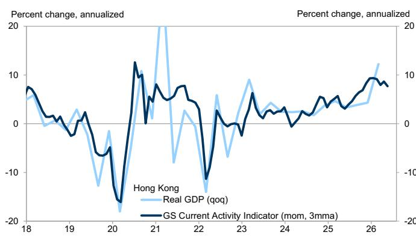

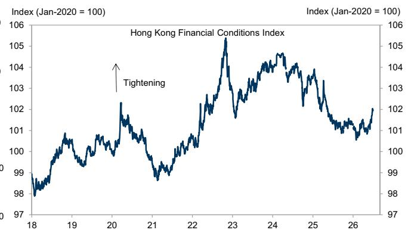
来源：Haver Analytics, CEIC, GS全球投资研究

图表22：新加坡增长与金融状况
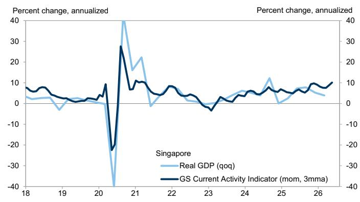
来源：Haver Analytics, CEIC, GS全球投资研究

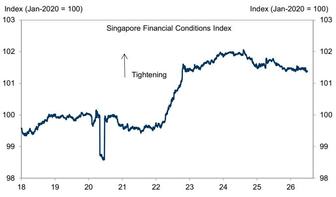

图表23：澳大利亚增长与金融状况
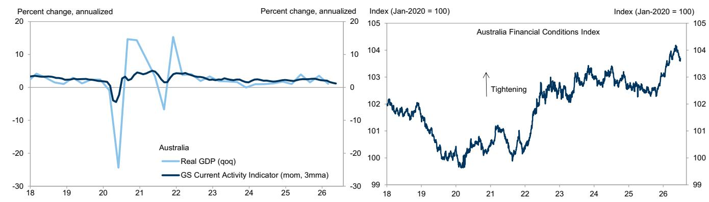
来源：Haver Analytics, CEIC, GS全球投资研究

图表24：新西兰增长与金融状况
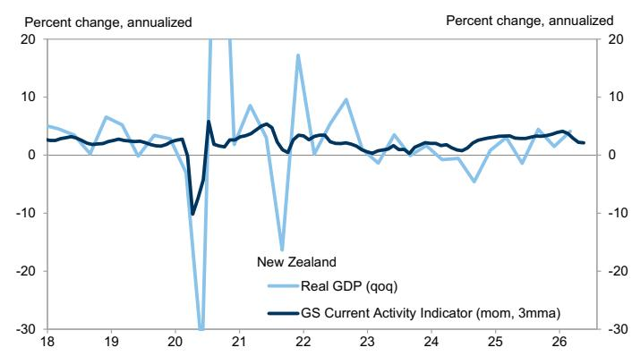
来源：Haver Analytics, CEIC, GS全球投资研究

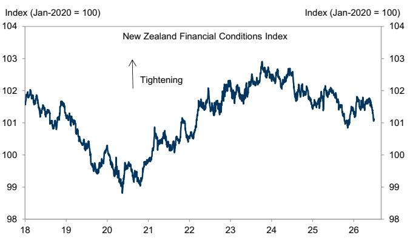

## 披露附录

## Reg AC

本人Andrew Tilton特此证明，本报告中表达的所有观点均准确反映本人的个人观点，且未受公司业务或客户关系考量的影响。

除非另有说明，本报告封面所列人员均为GS全球投资研究部分析师。

撰稿作者：Andrew Tilton GS (Asia) L.L.C., Andrew Boak, CFA GS Australia Pty Ltd, Goohoon Kwon, CFA GS (Asia) L.L.C., Hui Shan GS (Asia) L.L.C., Tomohiro Ota GS Japan Co., Ltd., Santanu Sengupta GS India SPL, Yuriko Tanaka GS Japan Co., Ltd., Lisheng Wang GS (Asia) L.L.C., Chris Poh GS (Singapore) Pte.

除非另有说明，本报告“撰稿作者”披露中列出的人员均为GS全球投资研究部分析师。

## 披露信息

## 监管披露

## 美国法律法规要求的披露

请参见上述针对具体公司的监管披露，以了解本报告所提及公司可能需要的以下任何披露：待处理交易中的主承销商或联合主承销商；1%或以上的持股；特定服务的报酬；客户关系类型；前期公开发行的管理/联合管理；董事职位；对于权益证券，做市和/或专业角色。GS交易或可能作为本金交易本报告所讨论发行人的债务证券（或相关衍生品）。

以下是额外的必要披露：持股与重大利益冲突：GS政策禁止其分析师、向分析师汇报的专业人员及其家庭成员持有分析师覆盖范围内任何公司的证券。分析师薪酬：分析师的薪酬部分取决于GS的盈利能力，其中包括投资银行收入。分析师作为高管或董事：GS政策通常禁止其分析师、向分析师汇报的人员或其家庭成员在分析师覆盖范围内的任何公司担任高管、董事或顾问。非美国分析师：非美国分析师可能不是GS & Co. LLC的关联人员，因此可能不受FINRA规则2241或FINRA规则2242关于与标的公司沟通、公开露面以及交易分析师所覆盖证券的限制。

## 美国以外司法管辖区法律法规要求的额外披露

以下为司法管辖区要求的披露，除非已根据美国法律法规在上文作出说明。澳大利亚：GS Australia Pty Ltd及其关联公司不是澳大利亚的授权存款机构（定义见1959年《银行法》（Cth）），不提供银行服务，也不在澳大利亚开展银行业务。除非GS另有约定，本研究及其任何访问权限仅面向澳大利亚《公司法》定义的“批发客户”。在撰写研究报告时，GS Australia全球投资研究部的成员可能会参加由其研究报告所涵盖的公司及其他实体主办或组织的实地考察和其他会议。在某些情况下，如果GS Australia认为在实地考察或会议的具体情况下是适当且合理的，此类实地考察或会议的部分或全部费用可能由相关发行人承担。如果本文件内容包含任何金融产品建议，则仅为一般性建议，由GS在未考虑客户的目标、财务状况或需求的情况下编制。客户在根据任何此类建议采取行动前，应考虑该建议是否适合其自身的目标、财务状况和需求。某些GS Australia和New Zealand的利益披露声明以及GS澳大利亚卖方研究独立性政策声明的副本可在以下网址获取：https://www.goldmansachs.com/disclosures/australia-new-zealand/index.html。巴西：与CVM第20号决议相关的披露信息可在https://www.gs.com/worldwide/brazil/area/gir/index.html获取。在适用的情况下，根据CVM第20号决议第20条的定义，对本研究报告内容负主要责任的巴西注册分析师为本报告开头指定的第一作者，除非文末另有说明。加拿大：此信息仅供您参考，在任何情况下均不应被解释为GS & Co. LLC为在加拿大购买任何加拿大证券而进行的广告、要约或招揽。GS & Co. LLC未在加拿大任何司法管辖区根据适用的加拿大证券法注册为交易商，通常不被允许交易加拿大证券，并可能被禁止在加拿大某些司法管辖区销售某些证券和产品。如果您希望在加拿大交易任何加拿大证券或其他产品，请联系GS Canada Inc.（The GS Group Inc.的关联公司）或其他注册的加拿大交易商。香港：可应要求从GS (Asia) L.L.C.获取本研究报告所涵盖公司证券的进一步信息。印度：可从GS (India) Securities Private Limited获取本研究报告所提及的标的公司或公司的进一步信息，研究分析师 - SEBI注册号INH000001493，地址：10th Floor, Ascent-Worli, Sudam Kalu Ahire Marg, Worli, Mumbai-400 025, India，企业识别号U74140MH2006FTC160634，电话+91 22 6616 9000，传真+91 22 6616 9001。GS可能实益拥有本研究报告所提及的标的公司或公司1%或以上的证券（定义见1956年《印度证券合约（监管）法》第2(h)条）。SEBI的注册和NISM的认证绝不保证中介机构的业绩，也不向读者提供任何回报保证。GS (India) Securities Private Limited的合规官和读者投诉联系详情、年度合规审计报告副本以及其他相关信息和披露可在以下链接找到：

https://www.goldmansachs.com/worldwide/india/research-analyst。日本：见下文。韩国：除非GS另有约定，本研究及其任何访问权限仅面向《金融服务和资本市场法》定义的“专业读者”。可从GS (Asia) L.L.C.首尔分行获取本研究报告所提及的标的公司或公司的进一步信息。新西兰：GS New Zealand Limited及其关联公司不是新西兰的“注册银行”或“存款接受者”（定义见1989年《新西兰储备银行法》）。除非GS另有约定，本研究及其任何访问权限面向《2008年金融顾问法》定义的“批发客户”。某些GS Australia和New Zealand的利益披露声明副本可在以下网址获取：https://www.goldmansachs.com/disclosures/australia-new-zealand/index.html。俄罗斯：在俄罗斯联邦分发的研究报告不属于俄罗斯法律定义的广告，而是信息和分析，其主要目的不是推广产品，并且不提供俄罗斯评估活动法律意义上的评估。研究报告不构成俄罗斯法律法规定义的个人化研究交流，不针对特定客户，并且是在未分析客户财务状况、投资概况或风险状况的情况下编制的。GS不对客户或任何其他人可能基于本研究报告做出的任何投资决策承担任何责任。新加坡：GS (Singapore) Pte.（公司编号：198602165W）受新加坡金融管理局监管，接受对本研究的法律责任，如有任何与本研究报告相关的事宜，应与其联系。台湾：此材料仅供参考，未经许可不得转载。读者应仔细考虑自身的投资风险。投资结果由个人读者自行负责。英国：在英国被归类为零售客户（定义见金融行为监管局规则）的人士，应结合先前GS关于本报告所涵盖公司的研究阅读本报告，并应参考GS International已发送给他们的风险警告。这些风险警告的副本以及本报告中使用的某些金融术语的词汇表，可应要求从GS International获取。

欧盟和英国：与欧洲委员会授权条例(EU) (2016/958)第6(2)条相关的披露信息（该条例补充了欧洲议会和理事会条例(EU) No 596/2014，包括该授权条例在英国脱离欧盟和欧洲经济区后转化为英国国内法律和法规的情况），涉及研究交流或其他推荐或暗示投资策略的信息的客观呈现技术安排，以及特定利益或利益冲突迹象的披露，可在https://www.gs.com/disclosures/europeanpolicy.html获取，其中阐述了与投资研究相关的利益冲突管理欧洲政策。

日本：GS Japan Co., Ltd.是一家金融工具交易商，在关东财务局注册，注册号为金商第69号，是日本证券业协会、日本金融期货协会、第二类金融工具交易商协会和日本投资管理协会的会员。股票买卖需支付与客户预先确定的佣金加上消费税。有关日本证券交易所、日本证券业协会或日本证券金融公司要求的任何适用披露，请参见针对具体公司的披露。

## 全球产品；分发实体

GS全球投资研究为GS的客户在全球范围内制作和分发研究产品。GS全球各办事处的分析师对行业和公司，以及宏观经济、货币、大宗商品和投资组合策略进行研究。本研究在澳大利亚由GS Australia Pty Ltd (ABN 21 006 797 897)分发；在巴西由GS do Brasil Corretora de Títulos e Valores Mobiliários S.A.分发；GS巴西公共沟通渠道：0800 727 5764 和/或 contatogoldmanbrasil@gs.com。工作日（节假日除外）上午9点至下午6点开放。GS巴西公众沟通渠道：0800 727 5764 和/或 contatogoldmanbrasil@gs.com。营业时间：周一至周五（节假日除外），上午9点至下午6点；在加拿大由GS & Co. LLC分发；在香港由GS (Asia) L.L.C.分发；在印度由GS (India) Securities Private Ltd.分发；在日本由GS Japan Co., Ltd.分发；在韩国由GS (Asia) L.L.C.首尔分行分发；在新西兰由GS New Zealand Limited分发；在俄罗斯由OOO GS分发；在新加坡由GS (Singapore) Pte.（公司编号：198602165W）分发；在美国由GS & Co. LLC分发。GS International已批准本研究在英国的分发。

GS International (“GSI”)，由审慎监管局（“PRA”）授权，受金融行为监管局（“FCA”）和PRA监管，已批准本研究在英国的分发。

欧洲经济区：GS Bank Europe SE (“GSBE”) 是一家在德国注册的信贷机构，在单一监管机制内，接受欧洲中央银行的直接审慎监管，并在其他方面受德国联邦金融监管局（BaFin）和德国联邦银行的监管，并在欧洲经济区内分发研究。

## 一般披露

本研究仅供我们的客户使用。除与GS相关的披露外，本研究基于我们认为可靠的当前公开信息，但我们不保证其准确或完整，也不应依赖于此。本文所含信息、意见、估计和预测截至本文日期，如有更改，恕不另行通知。我们力求适时更新我们的研究，但各种法规可能阻止我们这样做。除某些定期发布的行业报告外，大部分报告由分析师酌情不定期发布。

GS开展全球全方位、综合性的投资银行、投资管理和经纪业务。我们与全球投资研究部所覆盖的相当大比例的公司存在投资银行和其他业务关系。GS & Co. LLC，美国经纪交易商，是SIPC的成员（https://www.sipc.org）。

我们的销售人员、交易员和其他专业人员可能会向我们的客户和自营交易部门提供口头或书面的市场评论或交易策略，这些评论或策略可能反映与本研究中表达的观点相反的意见。我们的资产管理部、自营交易部门和投资业务可能做出与本研究中表达的建议或观点不一致的投资决策。

除非法规或GS政策禁止，我们及我们的关联公司、高管、董事和员工将不时持有本研究所提及证券或衍生品（如有）的多头或空头头寸，作为本金进行交易，以及买入或卖出这些证券或衍生品。

在GS组织的会议上由第三方演讲者（包括来自GS其他部门的个人）表达的观点不一定反映全球投资研究部的观点，也不是GS的官方观点。

本文引用的任何第三方，包括任何销售人员、交易员和其他专业人员或其家庭成员，可能持有与本报告指定分析师表达的观点不一致的所提及产品的头寸。

本研究侧重于跨市场、行业和板块的投资主题。它不试图区分我们描述的任何行业或板块内单个公司的前景或表现，或提供对其的分析。

本研究中关于某个行业或板块内的权益或信用证券或证券的任何交易建议，反映了所讨论的投资主题，并非对任何此类证券的单独建议。

本研究不构成在任何司法管辖区出售或招揽购买任何证券的要约，如果此类要约或招揽在该司法管辖区属非法行为。它不构成个人建议，也未考虑个别客户特定的投资目标、财务状况或需求。客户应考虑本研究中的任何建议或推荐是否适合其特定情况，并在适当时寻求专业建议，包括税务建议。本研究所提及投资的价格和价值及其产生的收入可能会波动。过往表现并非未来表现的指引，未来回报不保证，且可能发生原始资本损失。汇率波动可能对某些投资的价值或价格或由此产生的收入产生不利影响。

某些交易，包括涉及期货、期权和其他衍生品的交易，会产生重大风险，并不适合所有读者。读者应查阅当前的期权和期货披露文件，这些文件可从GS销售代表处或以下网址获取：https://www.theocc.com/about/publications/character-risks.jsp 和 https://www.goldmansachs.com/disclosures/cftc_fcm_disclosures。在需要多次买卖期权（如价差策略）的期权策略中，交易成本可能很高。将应要求提供支持文件。

全球投资研究部提供的不同服务水平：GS全球投资研究部向您提供的服务水平和类型可能与向GS内部及其他外部客户提供的服务有所不同，具体取决于多种因素，包括您个人对沟通频率和方式的偏好、您的风险状况和投资重点及视角（例如，市场范围、特定板块、长期、短期）、您与GS整体客户关系的规模和范围，以及法律和监管限制。例如，某些客户可能要求在特定证券的研究发布时收到通知，某些客户可能要求将分析师基本面分析所依据的特定数据（这些数据可在我们的内部客户网站上获取）通过数据推送或其他方式以电子形式交付给他们。分析师基本面研究观点的任何变化（例如，对权益证券的评级、目标价或盈利预测的重大变化），在通过电子方式向所有有权接收此类报告的客户广泛发布研究报告之前，不会向任何客户传达。

所有研究报告均通过电子方式发布到我们的内部客户网站，同时向所有客户提供。并非所有研究内容都会重新分发给我们的客户或提供给第三方聚合商，GS也不对第三方聚合商重新分发我们的研究负责。对于与一种或多种证券、市场或资产类别相关的研究、模型或其他数据（包括相关服务），请联系您的GS代表或访问https://research.gs.com。

披露信息也可在https://www.gs.com/research/hedge.html获取，或联系Research Compliance, 200 West Street, New York, NY 10282。

## © 2026 GS.

您仅可为自己使用而存储、展示、分析、修改、重新格式化及打印通过本服务向您提供的信息。未经GS明确书面同意，您不得转售或逆向工程此信息以计算或开发任何用于披露和/或营销的指数，或创建任何其他衍生作品或商业产品、数据或服务。未经GS明确书面同意，您不得以任何形式向任何第三方发布、传输或以其他方式复制此信息的全部或部分内容。前述限制包括但不限于，使用、提取、下载或检索此信息的全部或部分内容，以训练或微调机器学习或人工智能系统，或作为任何此类系统的提示或输入提供或复制此信息的全部或部分内容。
