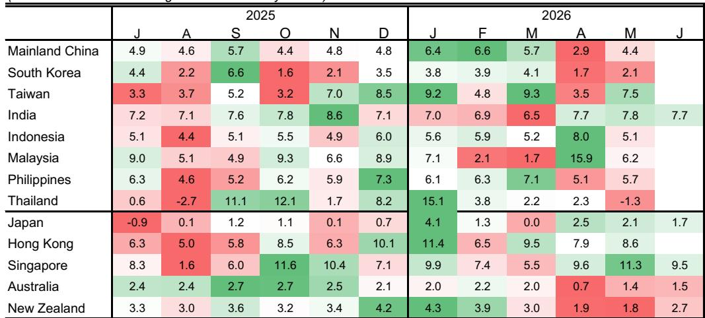
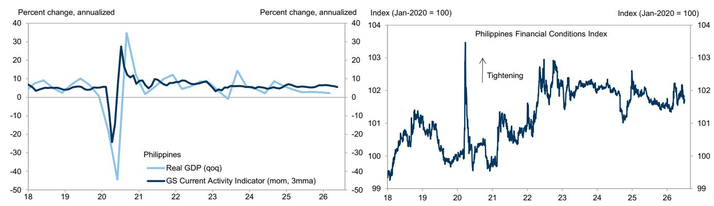

# GS：供应链扰动未消，GS称亚太修复非周期共振

能源价格不确定性的缓解正在为亚太宏观环境带来一轮普遍的修复窗口，但GS最新发布的亚太增长监测报告揭示了一个容易被忽略的结构性差异：宏观环境增长的“量”在回升，但驱动增长的链条正在发生切换，不同地区的修复质量并不相同。

这份定期监测报告覆盖东亚、东南亚及大洋洲主要地区，核心信号是：多数地区的GS当前活动指标（CAI）在5月和6月初保持稳定或改善，同时资金条件因油价回落等因素有所放松。但PMI数据的分化、供应链持续扰动以及资金条件放松的不对称，意味着这一轮修复并非简单的周期共振。

## 1. 增长的反弹更多来自供给端修复，而非需求端扩张

报告最值得关注的判断是：GS近期上调了多个地区的GDP增长预测，调整的直接依据是能源价格不确定性的缓解。这意味着，此轮增长修复的主要驱动力是成本端的改善，而不是终端需求的主动扩张。

6月PMI数据提供了佐证。中国官方PMI走强而民间PMI走弱，印度制造业与服务业PMI均出现回落，日本则双双回升。这种分化说明，当能源成本下降带来的供给改善效应消退后，各地区需求端的真实强度将决定增长的可持续性。

> **KC评论：** 供给端修复带来的增长反弹通常更短、更不可持续。完整报告中各地区的CAI走势图和PMI分项数据，可以帮助判断哪些地区已经在向需求驱动切换，哪些仍停留在成本修复阶段。

## 2. 资金条件放松的分布极不均匀，暗含资金流向的再选择

报告在资金条件指数部分提供了重要线索。韩国和台湾的资金条件大幅放松，主要得益于市场的强劲表现。泰国也出现放松，但驱动因素是汇率贬值。印尼则因加息和市场抛售出现明显的资金条件收紧。

这种分化意味着，亚太地区的资金流向并非均匀分布。市场表现强势的地区正在吸引更多资本流入，形成正向循环；而那些需要通过汇率贬值来缓解资金条件的地区，可能面临资本外流的不确定性。

报告没有完全回答的一个问题是：这种资金条件的分化是否会进一步加剧各地区之间的增长差距？韩国和台湾的市场上涨能否持续支撑资金条件放松，还是已经透支了预期？

## 3. 供应链扰动仍未消除，但性质正在变化

报告中提到，供应商延迟仍然是许多制造商面临的问题。但结合贸易活动持续激增的数据来看，当前供应链不确定性的性质可能已经发生转变——从疫情初期的产能不足，转向需求结构变化带来的匹配摩擦。

东亚出口在5月出现回升，全球贸易活动也在继续扩张。这暗示，尽管供应链仍有扰动，但贸易量的增长正在弥补效率损失。对于依赖出口的地区而言，量的增长能否对冲单位利润的压缩，将是未来几个季度需要持续观察的变量。

报告在这一部分的展开较为克制，没有给出供应链扰动何时能够完全消退的明确时间表。这本身就是一个信号：供应链的重塑可能比市场预期的更持久。

## 4. 报告尚未回答的关键问题：修复的可持续性如何验证

GS上调预测的依据是能源价格不确定性的缓解，但能源价格本身具有不确定性。如果地缘政治不确定性重新推高油价，这一轮增长修复的基础就会被动摇。

另一个未解问题是：日本的经验能否被复制？报告显示日本的宏观环境数据近期意外上行，但日本长期处于低增长、低通胀环境，其修复路径与其他亚太地区并不具有直接可比性。

读者在阅读完整报告时，可以重点关注各地区的CAI趋势图与GDP预测调整表的对应关系，以及资金条件指数中利率、汇率、市场三个分项的权重变化。这些细节将帮助判断哪些地区的修复更具备内生动力。

---

完整报告的中文摘要、GSCAI与FCI图表合集，以及更多关于亚太增长分化的横向比较，已经整理进每日国际信源汇编。适合在跟踪全球宏观叙事时快速对照，也方便后续对特定地区进行深入追问。

For informational purposes only. Portions may be generated,translated,summarized,or edited with AI assistance based on source materials and may contain omissions or errors. Please verify independently. This is not investment,legal,tax,accounting,or other professional advice.

For informational purposes only. Portions may be generated,translated,summarized,or edited with AI assistance based on source materials and may contain omissions or errors. Please verify independently. This is not investment,legal,tax,accounting,or other professional advice.

