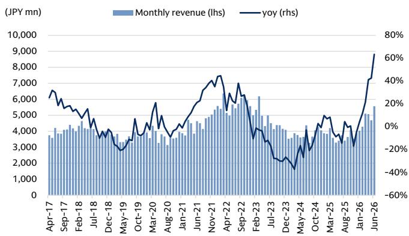
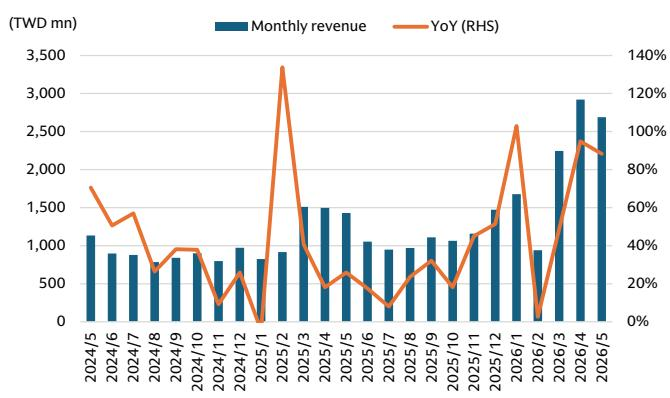
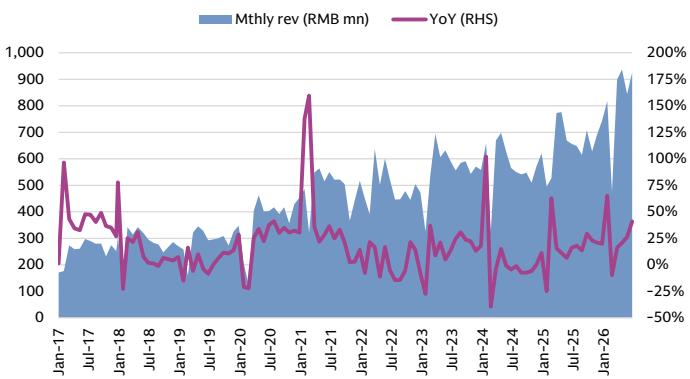

# The Automation Cycle Has Entered a New Phase: The Question Is No Longer Demand, but Delivery and Pricing

The period of simply tracking order momentum in factory automation is over. Based on a detailed research trip to Taiwan in late June, the critical question for observers of Japanese and Asian FA companies has shifted from "how much demand is there?" to two more operationally urgent questions: "can you produce what is ordered?" and "can you raise your prices?" The data from Taiwanese supply-chain intermediaries and component makers is now unambiguous. Supply-demand tightness has moved beyond semiconductors and electronic components and is now visible across a broad swath of FA product categories. Yet the market has not fully priced the implications of this transition, because the dispersion in outcomes is extreme. Some companies are in a position to capture both volume growth and meaningful margin expansion through price increases. Others are facing a share-loss penalty precisely because they cannot deliver. The next several earnings reports will not merely confirm demand strength; they will reveal which companies have the operational and strategic positioning to convert this cycle into sustainable earnings power.

This is not a typical upcycle. The current tightness is not uniform, and the mechanisms driving it are distinct from the demand-led booms of 2016-2018 and 2021-2022. Then, the bottleneck was primarily about capacity. Today, it is about a combination of structural demand shifts from AI and data center buildout, raw material cost inflation, and a supply chain that is still recalibrating after years of disruption. The result is a market where lead times are stretching, but pricing power is being distributed unevenly. Understanding the pattern of who can raise prices and who cannot is now the most important analytical task for anyone engaged in this space.

## Supply-Demand Tightness Has Become Broad-Based, but the Intensity Varies Sharply by Product Category

The most important finding from the Taiwan trip is that the supply-demand imbalance is no longer confined to the high-profile semiconductor and electronic component segments. It has spread into general-purpose FA components. However, the degree of tightness is not uniform. It exists on a spectrum. At one end, electrical and electronic components, particularly sensors, are experiencing the most direct and forceful pass-through of upstream price increases. This is because the upstream semiconductor and electronic component cycle, which is being driven by AI and data center demand, is directly feeding into downstream electrical products. The transmission mechanism is clear: when the cost of the core electronic component rises, the price of the sensor or controller that incorporates it must also rise. For companies like Keyence and Omron, which are positioned closer to the electronic components side of the supply chain, this dynamic is a direct tailwind to revenue and margins.

At the other end of the spectrum, linear motion components tell a more nuanced story. Here, the tightness is concentrated in ball screws, which are seeing lead times extend from roughly two months in late 2025 to over five months currently. This is being driven by robust demand from back-end semiconductor manufacturing equipment and PCB-related products, including connectors. The price response has been clear: a first round of increases for ball screws of approximately 20% was implemented from late 2025 through early 2026, followed by a second round this spring covering all linear motion components, with ball screws up roughly 20% and linear guides up approximately 10%. The difference in magnitude between ball screws and linear guides is instructive. It reflects the degree of direct involvement in data center demand. Ball screws are more deeply embedded in the equipment that builds the data center infrastructure, so the demand pull is stronger. Linear guides, while also tight, are not experiencing the same level of acute shortage.

The key insight here is that the supply-demand tightness is real and broad, but it is not a single, monolithic phenomenon. It is a series of product-specific micro-cycles, each with its own drivers, lead time dynamics, and pricing implications. Observers who treat the entire FA sector as a single trade risk missing the significant dispersion in outcomes.

## The CNC Market Is a Telling Exception: Share Substitution, Not Price Increases, Is the Dominant Dynamic

The CNC (computer numerical control) market provides a stark contrast to the rest of the FA landscape and offers a critical lesson in how supply constraints can reshape competitive dynamics. In this segment, lead time elongation at specific Japanese suppliers, most notably Fanuc, has become a major bottleneck. Lead times have reportedly stretched from two to three months to more than double that. The root cause remains somewhat opaque, but the consequence is clear: Taiwanese CNC maker Syntec Technologies is experiencing an acceleration in revenue growth that is beginning to outpace that of its Japanese counterparts.

This is a classic case of supply-driven share substitution. When a dominant player cannot deliver, customers are forced to qualify alternative suppliers. Once qualified, the switching cost is often low enough that some of that share is permanently lost. The data from Syntec's monthly revenue trends in April and May is consistent with this narrative. The revenue growth rate is not just strong; it is accelerating relative to the broader market.

Critically, and in stark contrast to the sensor and linear motion markets, there are reportedly no signs of price increases in CNC equipment, despite the tightness. This is a deliberate strategic choice. The leading Japanese players, including Fanuc, appear to be absorbing the cost of tightness by not raising prices, precisely to guard against further share loss to Taiwanese competitors. The high profitability of CNC equipment gives them the room to do this. But the calculus is delicate. If tightness persists, the decision to hold prices may simply delay the inevitable erosion of margins without fully stemming the share loss.

This is a powerful reminder that supply-demand tightness does not automatically translate into pricing power. The structure of the market, the competitive dynamics, and the strategic posture of the dominant players matter enormously. In CNC, the observer question is not about margin expansion through pricing. It is about the pace and permanence of the share shift away from Japanese incumbents.

## The Critical Analytical Question the Report Raises but Does Not Fully Answer: How Sustainable Are the Price Increases?

The report makes a compelling case that price hikes are imminent and, in many cases, already being implemented across sensors, ball screws, and linear guides. The logic is sound: rising raw material and labor costs, combined with supply-demand tightness, create a powerful rationale for price increases. However, the report leaves several crucial questions open that any serious observer must consider.

First, how much of the price increase is a genuine reflection of demand-pull inflation versus a one-time catch-up for cost increases? If the price hikes are simply passing through higher input costs, the margin benefit is limited. The real prize is price increases that exceed cost inflation, leading to margin expansion. The report suggests this is happening for ball screws, where the 20% price increase likely outstrips raw material cost growth, but it does not provide a detailed breakdown for each product category.

Second, what is the elasticity of demand at these higher prices? The report notes that supply-demand tightness is driving price increases, but it does not address the risk that higher prices could dampen demand, particularly in price-sensitive segments of the market. The CNC example shows that customers will switch suppliers when faced with delivery delays. Will they also switch when faced with higher prices? The answer likely depends on the product's criticality and the availability of substitutes.

Third, and most importantly, the report does not fully address the sustainability of the current tightness. The AI and data center demand cycle is powerful, but it is also cyclical. How much of the current demand is structural investment in new infrastructure, and how much is inventory building by customers who are worried about supply constraints? If a significant portion is double-ordering or panic buying, then the current pricing power could reverse sharply when the cycle turns. The report's focus on "can you produce?" is correct for the current moment, but the next question, which the report only hints at, is "can you maintain pricing when supply normalizes?"

## A Decision Framework for Observers: Four Questions to Ask About Every FA Holding

Based on the report's findings, observers should evaluate each FA company through a four-part framework that goes beyond simple order growth.

First, assess the product's position in the supply chain. Companies closer to the electronic components side, like Keyence and Omron, appear to be in a stronger position to benefit from direct price pass-through. Companies in linear motion are benefiting from tightness, but the degree varies by product. CNC companies face a more complex competitive dynamic.

Second, evaluate the company's ability to deliver. The report makes clear that the winners in this cycle will be those who can meet demand without disruption. This is not just about having capacity; it is about having a resilient supply chain for the components they need. Companies that can maintain or even reduce lead times while competitors are stretching them will gain share.

Third, analyze the pricing strategy. Is the company in a position to raise prices, and if so, is it doing so? The report shows that pricing power varies enormously. Ball screw suppliers are raising prices aggressively. CNC suppliers are not. The observer must understand which camp a company is in and whether the pricing strategy is sustainable.

Fourth, consider the risk of share substitution. The CNC example is a warning. Even dominant players can lose share if they cannot deliver. Conversely, companies like Syntec that can fill the gap are experiencing a structural tailwind that may persist beyond the current cycle. The question for observers is whether the companies they follow are the ones losing share or gaining it.

## The Next Catalyst Is Earnings Season, Which Will Confirm or Challenge the Taiwan Trip Findings

Beginning with Yaskawa Electric's first-quarter earnings on July 10, the market will get its first major opportunity to verify the trends observed in Taiwan. The June monthly revenue data from Taiwanese companies, including Suzuden and AirTAC, is already pointing to accelerating growth. Suzuden's June revenue grew over 60% year-over-year, accelerating from the 40%-plus growth seen in April and May. AirTAC's trends are similarly strong. This data suggests that the demand environment is even firmer than many models assume.

However, the market's focus will quickly shift from the magnitude of demand to the quality of earnings. Observers will be looking for evidence of margin expansion through pricing, not just revenue growth. They will also be looking for commentary on lead times, capacity constraints, and the ability to meet demand. Companies that can credibly demonstrate both volume growth and pricing power will be rewarded. Those that show revenue growth but flat or declining margins due to cost pressures or inability to deliver will face a more skeptical market.

The report maintains a positive view on the Japan FA sector, with observations on Keyence, Omron, and Yaskawa. The logic is sound, but the dispersion in outcomes means that stock selection is more important than sector exposure. The companies that can answer "yes" to both "can you produce?" and "can you raise prices?" will define the winners of this cycle.

---

The analysis above is based on a detailed research report from a recent Taiwan trip. It provides a structured view of the supply-demand dynamics in the FA sector, but it leaves several critical questions open, particularly around the sustainability of pricing power and the risk of demand elasticity. For those who want to dig deeper into the specific data points, the original charts on Suzuden, Syntec, and AirTAC monthly revenue trends, as well as the full list

Join the community to read the full report and review the original charts.

*For informational purposes only. Portions may be generated, translated, summarized, or edited with AI assistance based on source materials and may contain omissions or errors. Please verify independently. This is not professional advice.*

For informational purposes only. Portions may be generated, translated, summarized, or edited with AI assistance based on source materials and may contain omissions or errors. Please verify independently. This is not professional advice.

