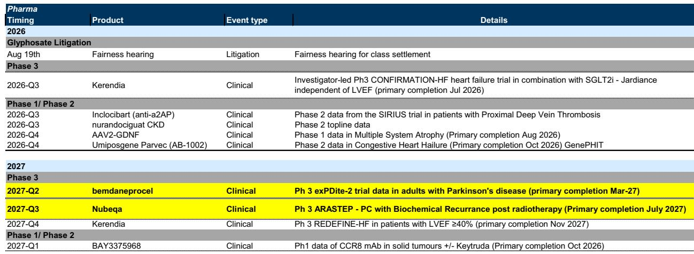
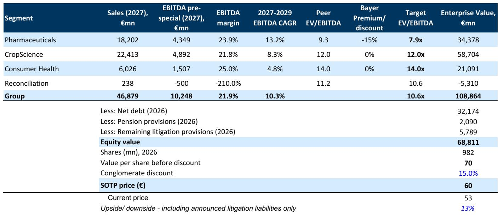
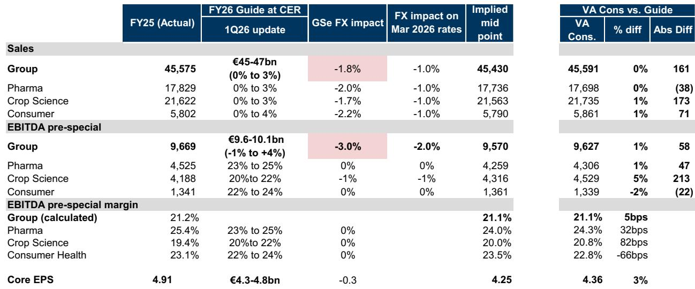

# GS：拜耳制药折价收窄至15%，市场误判了研发效率

一家曾因草甘膦诉讼被市场长期折价的公司，正在悄悄改变自己的叙事。核心驱动力不是诉讼和解，而是对制药业务的重新定价。

这份报告发表于7月初，正值拜耳二季度财报（8月4日）前夕。市场注意力仍集中在草甘膦集体诉讼的和解听证会推迟至8月19日，以及公司将草甘膦业务整合至新实体Ruveon。但GS的分析框架指向一个更深层的变化：读者正在将拜耳的制药业务视为一个独立的、接近行业平均水平的资产，而非集团内部的折价部分。

> **KC评论：** 拜耳过去五年被市场贴上的标签是“诉讼缠身的化工集团”，但GS认为，随着法律不确定性逐步收窄，市场会重新审视其制药业务的价值。制药才是这家公司真正的锚。

## 1. 草甘膦诉讼的终局方案已经浮现，但市场可能低估了Ruveon的结构意义

拜耳将草甘膦业务整体装入Ruveon，这一操作被不少读者理解为简单的内部重组。GS的解读更为锐利：Ruveon为未来可能的剥离或分拆铺平了道路。如果拜耳最终将Ruveon分离出去，未来所有草甘膦相关负债——包括当前集体诉讼的赔偿和后续诉讼——都将留在Ruveon体内，而非拜耳母公司。

这意味着拜耳最核心的估值障碍正在被系统性地拆除。GS将加权平均资本成本从9.3%下调至8.8%，直接原因是诉讼不确定性降低影响了公司贝塔值。这个调整虽然只有50个基点，但放在拜耳超过860亿欧元的企业价值上，影响不可忽视。

## 2. 制药业务折价从25%收窄至15%，但研发效率仍是未解问题

GS将制药业务的估值折价从25%大幅压缩至15%，理由是拜耳的制药板块已经展现出“接近行业水平”的前景。二季度预期中，GS对制药利润率的判断比市场共识更为乐观——尽管对Xarelto和Eylea面临仿制药不确定性持谨慎态度，但整体利润率预测仍高于同行预期。

问题在于，拜耳制药的历史研发生产率偏低。GS在报告中明确提到，15%的折价已经“平衡了较低的历史研发生产率”。这意味着，如果拜耳无法在未来证明其研发管线能持续产出有竞争力的新药，这个折价很难进一步收窄。市场需要看到的是管线兑现，而非仅仅是诉讼不确定性消退。

> **KC评论：** GS给制药业务15%的折价，而不是完全消除折价，是一个值得注意的细节。这暗示了一个关键假设：拜耳制药的资产质量仍低于纯制药同行，只是差距在缩小。读者应该追问的是，哪些在研项目能支撑这个判断。

## 3. 二季度财报才是真正的验证节点，市场关注点正在从法律转向运营

拜耳将在8月4日发布二季度业绩。GS的预测略低于市场共识：集团销售额比Visible Alpha共识低2%，但EBITDA基本持平。差距主要来自对制药板块Xarelto和Eylea的仿制药不确定性判断更谨慎，以及对作物科学部门玉米和大豆种子销售节奏的保守估计。

一个值得注意的数据点：GS对核心每股收益的预测比共识低8%，但该机构认为这可能是共识计算问题，因为他们在核心息税前利润和核心净利润层面的预测与共识基本一致。这种差异本身就是一个信号——市场对拜耳盈利能力的预期可能过于乐观，而GS认为二季度会是一个“符合预期但无惊喜”的报表。

## 4. 报告尚未完全回答的关键问题：拆分的时机与结构

GS提到了拜耳潜在的拆分可能，以及由此释放的集团折价——按分项估值计算，目前约10欧元。但报告没有明确回答几个关键问题：Ruveon的剥离时间表是什么？制药和消费者健康业务是否会独立上市？拆分后的资本结构如何安排？

这些问题的答案将决定拜耳能否从当前的“诉讼折价修复”阶段，进入“资产价值释放”阶段。但这是建立在诉讼不确定性持续下降、制药业务折价收窄的假设之上。如果拆分落地，估值框架需要重新搭建。

---

报表数字背后，拜耳正在完成一次叙事切换：从“草甘膦诉讼受害者”到“制药资产被低估的多元化集团”。二季度财报和8月19日的听证会将验证这个叙事是否站得住。完整报告、中文摘要、KC评论和图表合集，适合放在当天国际信源汇编里继续追踪和横向比较。

For informational purposes only. Portions may be generated,translated,summarized,or edited with AI assistance based on source materials and may contain omissions or errors. Please verify independently. This is not investment,legal,tax,accounting,or other professional advice.

For informational purposes only. Portions may be generated,translated,summarized,or edited with AI assistance based on source materials and may contain omissions or errors. Please verify independently. This is not investment,legal,tax,accounting,or other professional advice.

