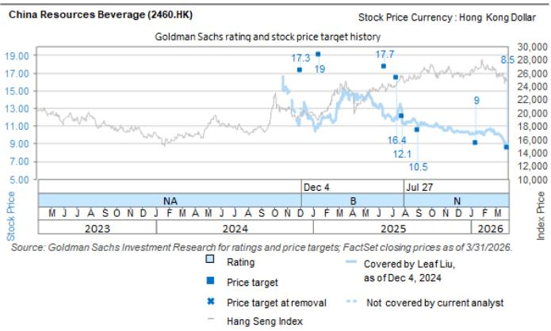

# 华润饮料（2460.HK）：亚太消费与休闲企业日2026要点：渠道主动去库存进行中

亚太消费与休闲企业日

2026年6月29日至7月3日

探索 >

Leaf Liu
+852-3966-4169 | leaf.liu@gs.com
GS (Asia) L.L.C.

Christina Liu
+852-2978-6983 | christina.liu@gs.com
GS (Asia) L.L.C.

Valerie Zhou
+852-2978-0820 | valerie.zhou@gs.com
GS (Asia) L.L.C.

核心观点：我们于7月3日在亚太消费与休闲企业日活动上接待了华润饮料的管理团队。管理层将2026年上半年描述为饮用水和饮料业务的过渡期，优先事项包括渠道去库存、价格纪律以及启动新的增长驱动因素（例如新桶装水、210ml小包装、家庭渠道建设以及核心饮用水业务的低线市场渗透）。由于主动渠道去库存，预计2026年上半年饮用水销售将出现一定幅度的下降，但管理层强调终端销售更具韧性，渠道库存下降约30%，线上/线下价差已基本恢复正常。饮料销售预计因渠道去库存/调整而下降更多。展望2026年全年，公司已基本完成组织架构改革，并维持饮用水销售低个位数增长的目标，同时进行更有纪律的投入，而饮料业务仍处于转型期，重点在于去库存和促销。展望2026年下半年，重点将转向更强的执行力，包括新渠道开发、运营效率和有纪律的营销投入，而净利润将面临比2026年上半年更轻松的对比基数。关于定价，管理层重申没有调整瓶装水价格的计划（此前报道的2.08L价格调整仅针对小范围区域以消除地区差异），饮料业务仍处于投入年。关于行业，公司还指出2026年前5个月瓶装水行业销量表现偏弱，可能是由于行业内部低糖/无糖饮料的替代效应。关于成本，2026年上半年毛利率预计基本持平，得益于2026年前5个月的PET锁价收益（6月因PET价格上涨受到一些负面影响，但7月有所缓和），公司仍在观察2026年下半年的PET价格走势。股东回报：管理层重申对中期盈利增长的信心，并承诺2026-2028年每股派息0.37元人民币（隐含5.5%的回报率），同时宣布了5.3亿港元的股份回购计划（约占当前市值的2.8%，回购股份将注销），强化了对股东回报的承诺。公司当前估值对应2026年/2027年预期市盈率分别为15.4倍/14.6倍。

作者感谢Lily Qi对本报告的贡献。

## 要点总结

## 分业务板块更新

饮用水销售预计2026年上半年同比下降一定幅度，渠道去库存（部分地区渠道库存同比下降30%）对出货量造成影响。管理层指出，与出货量相比，终端零售需求更具韧性。公司还在拓展其“水+”产品组合以重新获取消费场景。家庭用水已成为一项战略性增长举措，由专门团队支持，并已扩展至七个试点城市。因此，管理层仍目标2026年全年瓶装水销量实现低个位数增长。

- 饮料业务可能仍处于调整期，以为未来增长做好更充分的准备。2026年上半年部分地区渠道库存也下降了30%以上。继去年广泛推出新产品后，公司今年将主要聚焦于“至本清润”，将资源集中在少数核心品牌上。每瓶1元加1瓶的消费者促销活动在2026年上半年至今改善了终端销售，但也增加了相关的促销费用。

## 渠道更新

- 渠道优化仍是2026年上半年的关键重点。公司收紧了线上价格管理，显著缩小了线上/线下价差，同时主动减少了对扰乱定价的渠道的投入。

管理层强调了2026年下半年的三个增量增长驱动因素，包括：1）低线城市，尤其是中国北方和成熟市场，仍是关键的空白市场机会。2）家庭用水渠道在前期投入后正进入推广阶段。3）新兴渠道如折扣零售商也被视为新的增长引擎。公司近期与万辰集团签署了总部对总部的协议，并正在与其他折扣零售商/KA渠道进行讨论。将提供专用的520ml瓶装水SKU（零售价每瓶1.2元人民币）给折扣零售商渠道，以保护批发渠道（主要为555ml SKU）的现有价格体系。管理层还指出，线上销售增速快于线下，但对利润率有稀释作用。

## 利润率/成本展望

PET在2026年第二季度（尤其是5-6月）因价格上涨成为不利因素。管理层预计2026年上半年毛利率基本持平，得益于1-4月有利的锁价成本，但如果PET均价维持在每吨7000元人民币左右，2026年全年利润率将面临压力。公司继续通过其他包装材料的采购节约来部分抵消通胀，并重申2026年全年销售费用基本稳定，支出将重新分配至回报率更高的项目。

## 产能

管理层预计2026年产能利用率将有所改善（对比2025年约50%的水平），得益于目标为低个位数增长的瓶装水销量恢复以及新举措的推进。公司还将每箱瓶装水的单位规格从24瓶调整为28瓶（将ASP折扣转化为更高的单位数量），以支持产能利用率。

## 目标价风险与方法论 - 华润饮料

我们对华润饮料给予中性评级，12个月目标价为8.2港元，基于16.5倍2027年预期市盈率，参考了与食品饮料企业康师傅/统一相同的目标市盈率，并使用11.8%的权益成本折现至2027年中。

主要下行/上行风险：1）瓶装水市场竞争激烈程度高于/低于预期；2）饮料业务发展慢于/快于预期；3）原材料价格收益低于/高于预期；4）渠道/分销管理的不确定性；5）声誉风险/食品安全问题。

<table><tr><td>2460.HK</td><td colspan="2">12个月目标价：8.20港元</td><td colspan="2">现价：7.77港元</td><td colspan="2">上行空间：5.5%</td></tr>
<tr><td colspan="2">中性</td><td colspan="5">GS预测</td></tr>
<tr><td colspan="2"></td><td></td><td>12/25</td><td>12/26E</td><td>12/27E</td><td>12/28E</td></tr>
<tr><td rowspan="9" colspan="2">市值：186亿港元 / 24亿美元 企业价值：116亿港元 / 15亿美元 3个月日均交易量：1940万港元 / 250万美元 中国 中国必需消费品 并购排名：3 租赁包含在净债务及企业价值中？：是</td><td>收入（百万元人民币）</td><td>11,002.1</td><td>11,494.6</td><td>12,095.3</td><td>12,726.5</td></tr>
<tr><td>EBITDA（百万元人民币）</td><td>1,650.3</td><td>1,952.2</td><td>2,143.5</td><td>2,540.0</td></tr>
<tr><td>每股收益（人民币）</td><td>0.41</td><td>0.44</td><td>0.46</td><td>0.56</td></tr>
<tr><td>市盈率（倍）</td><td>27.2</td><td>15.4</td><td>14.6</td><td>12.0</td></tr>
<tr><td>市净率（倍）</td><td>2.4</td><td>1.4</td><td>1.3</td><td>1.3</td></tr>
<tr><td>股息率（%）</td><td>3.3</td><td>4.2</td><td>4.8</td><td>5.8</td></tr>
<tr><td>净债务/EBITDA（不含租赁，倍）</td><td>(3.9)</td><td>(3.2)</td><td>(3.0)</td><td>(2.6)</td></tr>
<tr><td>CROCI（%）</td><td>12.1</td><td>10.2</td><td>11.4</td><td>12.5</td></tr>
<tr><td>自由现金流回报表现（%）</td><td>0.1</td><td>1.9</td><td>5.1</td><td>6.8</td></tr>
<tr><td colspan="2"></td><td></td><td>6/25</td><td>12/25</td><td>6/26E</td><td>12/26E</td></tr>
<tr><td colspan="2"></td><td>每股收益（人民币）</td><td>0.34</td><td>0.08</td><td>0.32</td><td>0.12</td></tr>
</table>

来源：公司数据、GS估计、FactSet。价格截至2026年7月3日收盘。

## 披露附录

## Reg AC

我们，Leaf Liu、Christina Liu和Valerie Zhou，特此证明本报告中表达的所有观点准确反映了我们个人对相关公司及其证券的看法。我们还证明，我们的薪酬中没有任何部分直接或间接与本报告中表达的具体建议或观点相关。

除非另有说明，本报告封面所列人员为GS全球研究部门的分析师。

撰稿作者：Leaf Liu GS (Asia) L.L.C.，Christina Liu GS (Asia) L.L.C.，Valerie Zhou GS (Asia) L.L.C.。

除非另有说明，本报告撰稿作者披露中列出的个人是GS全球研究部门的分析师。

## GS因子概况

GS因子概况通过将关键属性与市场（即我们的评级股票池）及其行业同行进行比较，提供股票的研究背景。所描绘的四个关键属性是：增长、财务回报、倍数（例如估值）和综合（增长、财务回报和倍数的复合）。增长、财务回报和倍数是使用每只股票特定指标的标准化排名计算得出的。然后将指标的标准化排名平均并转换为相关属性的百分位数。每个指标的具体计算可能因财年、行业和地区而异，但标准方法如下：

增长基于股票的前瞻性销售增长、EBITDA增长和每股收益增长（对于金融股，仅每股收益和销售增长），较高的百分位数表示增长较高的公司。财务回报基于股票的前瞻性ROE、ROCE和CROCI（对于金融股，仅ROE），较高的百分位数表示财务回报较高的公司。倍数基于股票的前瞻性市盈率、市净率、价格/股息（P/D）、EV/EBITDA、EV/FCF和EV/债务调整后现金流（DACF）（对于金融股，仅市盈率、市净率和P/D），较高的百分位数表示交易倍数较高的股票。综合百分位数计算为增长百分位数、财务回报百分位数和（100% - 倍数百分位数）的平均值。

财务回报和倍数使用GS分析师对未来至少三个季度后的财年末的预测。增长使用对未来至少七个季度后的财年与未来至少三个季度后的财年相比的输入（所有指标均基于每股）。

有关我们如何计算GS因子概况的更详细说明，请联系您的GS代表。

## 并购排名

在我们的全球覆盖范围内，我们使用并购框架审视股票，考虑定性因素和定量因素（可能因行业和地区而异），以纳入某些公司可能被收购的可能性。然后，我们将并购排名作为对我们评级覆盖范围内的公司从1到3进行评分的一种方式，其中1表示公司成为收购目标的可能性较高（30%-50%），2表示中等可能性（15%-30%），3表示较低可能性（0%-15%）。对于排名为1或2的公司，根据我们的标准部门指南，我们将并购组成部分纳入我们的目标价。并购排名为3被视为不重要，因此不会纳入我们的目标价，并且可能在研究中讨论或不讨论。

## Quantum

Quantum是GS的专有数据库，可提供详细的财务报表历史、预测和比率。它可用于对单个公司进行深入分析，或比较不同行业和市场的公司。

## 披露

华润饮料的评级相对于其覆盖范围内的其他公司：安徽古井贡酒、百威亚太、忙碌明集团、中国飞鹤、华润啤酒、华润饮料、重庆啤酒、东鹏饮料（A）、佛山市海天调味食品（A）、佛山市海天调味食品（H）、福建万辰食品、江苏今世缘、江苏洋河、酒鬼酒、中炬高新、贵州茅台、泸州老窖、蒙牛乳业、农夫山泉、千禾味业、上海百润、山西汾酒、四川水井坊、四川天味食品、康师傅、青岛啤酒（A）、青岛啤酒（H）、统一企业中国、宜宾五粮液、颐海国际控股、伊利实业、珍酒李渡

## 公司特定监管披露

以下披露涉及GS集团（及其附属公司，“GS”）与GS全球研究覆盖的公司之间的关系。

GS预计在未来3个月内将获得或寻求获得投资银行服务报酬：华润饮料（7.77港元）

GS在过去12个月内与以下公司存在投资银行服务客户关系：华润饮料（7.77港元）

## 评级/投资银行关系分布

GS研究全球股票覆盖范围

<table>
<tr><td rowspan="2"></td><td colspan="3">评级分布</td><td colspan="3">投资银行关系</td></tr>
<tr><td>买入</td><td>持有</td><td>卖出</td><td>买入</td><td>持有</td><td>卖出</td></tr>
<tr><td>全球</td><td>50%</td><td>34%</td><td>16%</td><td>65%</td><td>60%</td><td>45%</td></tr>
</table>

截至2026年4月1日，GS全球研究对3,074只股票进行了评级。GS将股票指定为买入和卖出，纳入各个地区的名单；未如此指定的股票被视为中性。此类指定等同于FINRA规则要求的上述披露中的买入、持有和卖出。请参阅下面的“评级、覆盖范围和相关定义”。投资银行关系图表反映了每个评级类别中GS在过去十二个月内提供过投资银行服务的公司所占的百分比。

## 目标价和评级历史图表

所示目标价应结合所有先前发布的GS报告（可能包含或不包含目标价）以及公司、行业和金融市场的发展情况来考虑。

## 目标价历史表格 - 华润饮料（2460.HK）

报告日期 目标价（港元） 收盘价（港元）

<table>
<tr><td>2026年5月22日</td><td>8.20</td><td>8.09</td></tr>
<tr><td>2026年3月29日</td><td>8.50</td><td>9.01</td></tr>
<tr><td>2026年1月15日</td><td>9.00</td><td>10.39</td></tr>
<tr><td>2025年9月1日</td><td>10.50</td><td>11.17</td></tr>
<tr><td>2025年7月27日</td><td>12.10</td><td>13.00</td></tr>
<tr><td>2025年7月14日</td><td>16.40</td><td>12.04</td></tr>
<tr><td>2025年6月16日</td><td>17.70</td><td>12.28</td></tr>
<tr><td>2025年1月16日</td><td>19.00</td><td>10.98</td></tr>
<tr><td>2024年12月5日</td><td>17.30</td><td>12.54</td></tr>
</table>

表格中所示目标价未针对公司行动进行调整。

## 监管披露

## 美国法律法规要求的披露

请参阅上述公司特定监管披露，了解本报告提及的公司所需的任何以下披露：待定交易中的经理或联合经理；1%或以上的所有权；特定服务的报酬；客户关系类型；前期管理/联合管理的公开发行；董事职位；对于股票，做市和/或专家角色。GS可能作为本报告讨论的发行人的债务证券（或相关衍生品）的自营商进行交易或可能进行交易。

以下是额外要求的披露：所有权和重大利益冲突：GS政策禁止其分析师、向分析师汇报的专业人员及其家庭成员持有分析师覆盖范围内任何公司的证券。分析师薪酬：分析师的薪酬部分基于GS的盈利能力，其中包括投资银行收入。分析师作为高管或董事：GS政策通常禁止其分析师、向分析师汇报的人员或其家庭成员在分析师覆盖范围内的任何公司担任高管、董事或顾问。非美国分析师：非美国分析师可能不是GS & Co. LLC的关联人员，因此可能不受FINRA规则2241或FINRA规则2242关于与目标公司沟通、公开露面以及交易分析师所覆盖证券的限制。

## 美国以外司法管辖区法律法规要求的额外披露

以下披露是相关司法管辖区要求的，除非已根据美国法律法规在上文作出。澳大利亚：GS Australia Pty Ltd及其附属公司不是澳大利亚的授权存款机构（该术语在《1959年银行法》（联邦）中定义），不提供银行服务，也不在澳大利亚开展银行业务。除非GS另有约定，本研究及其访问权限仅面向“批发客户”（定义见澳大利亚《公司法》）。在编制研究报告时，GS Australia全球研究部门的成员可能会参加由其研究报告所涉及的公司和其他实体主办或组织的实地考察和其他会议。在某些情况下，如果GS Australia认为在实地考察或会议的具体情况下适当且合理，此类实地考察或会议的费用可能部分或全部由相关发行人承担。如果本文档内容包含任何金融产品建议，则仅为一般性建议，由GS在未考虑客户的目标、财务状况或需求的情况下编制。客户在根据任何此类建议采取行动之前，应考虑该建议是否适合其自身的目标、财务状况和需求。某些GS Australia和New Zealand的利益披露以及GS的澳大利亚卖方研究独立性政策声明的副本可在以下网址获取：https://www.goldmansachs.com/disclosures/australia-new-zealand/index.html。巴西：有关CVM第20号决议的披露信息可在以下网址获取：https://www.gs.com/worldwide/brazil/area/gir/index.html。在适用的情况下，根据CVM第20号决议第20条的定义，本研究报告内容的主要巴西注册分析师为本报告开头指定的第一作者，除非文末另有说明。加拿大：此信息仅供您参考，在任何情况下均不应被解释为GS & Co. LLC为在加拿大购买证券而向加拿大证券购买者发布的广告、要约或招揽。GS & Co. LLC未根据适用的加拿大证券法在任何加拿大司法管辖区注册为交易商，通常不允许交易加拿大证券，并且可能被禁止在加拿大的某些司法管辖区销售某些证券和产品。如果您希望在加拿大交易任何加拿大证券或其他产品，请联系GS Canada Inc.（GS集团公司的附属公司）或其他注册的加拿大交易商。香港：有关本研究所涵盖公司证券的更多信息，可向GS (Asia) L.L.C.索取。印度：有关本研究所提及的公司或公司的更多信息，可从GS (India) Securities Private Limited获取，研究分析师 - SEBI注册号INH000001493，地址：10th Floor, Ascent-Worli, Sudam Kalu Ahire Marg, Worli, Mumbai-400 025, India，企业识别号U74140MH2006FTC160634，电话+91 22 6616 9000，传真+91 22 6616 9001。GS可能实益拥有本研究报告所涉及公司（定义见印度《1956年证券合约（监管）法》第2(h)条）1%或以上的证券。SEBI的注册和NISM的认证绝不保证中介机构的业绩或向读者提供任何回报保证。GS (India) Securities Private Limited的合规官和读者投诉联系详情、年度合规审计报告副本以及其他相关信息和披露可在以下链接找到：https://www.goldmansachs.com/worldwide/india/research-analyst。日本：见下文。韩国：除非GS另有约定，本研究及其访问权限仅面向“专业读者”（定义见《金融服务和资本市场法》）。有关本研究所提及的公司或公司的更多信息，可从GS (Asia) L.L.C.首尔分行获取。新西兰：GS New Zealand Limited及其附属公司不是新西兰的“注册银行”或“存款接受者”（定义见《1989年新西兰储备银行法》）。除非GS另有约定，本研究及其访问权限面向“批发客户”（定义见《2008年金融顾问法》）。某些GS Australia和New Zealand的利益披露副本可在以下网址获取：https://www.goldmansachs.com/disclosures/australia-new-zealand/index.html。俄罗斯：在俄罗斯联邦分发的研究报告不属于俄罗斯法律定义的广告，而是信息和分析，其主要目的不是推广产品，并且不提供俄罗斯评估活动法律意义上的评估。研究报告不构成俄罗斯法律法规定义的个人化研究交流，不针对特定客户，并且在未分析客户的财务状况、投资概况或风险状况的情况下编制。GS不对客户或任何其他人基于本研究报告可能做出的任何投资决策承担责任。新加坡：GS (Singapore) Pte.（公司编号：198602165W），受新加坡金融管理局监管，接受对本研究的法律责任，如有任何与本相关的事宜，应与其联系。台湾：此材料仅供参考，未经许可不得转载。读者应仔细考虑自身的投资风险。投资结果由个人读者自行负责。英国：在英国被归类为零售客户（定义见金融行为监管局规则）的人士，应结合先前GS关于本报告所涉及公司的报告阅读本研究，并应参考GS International已发送给他们的风险警告。这些风险警告的副本以及本报告中使用的某些金融术语的词汇表，可向GS International索取。

欧盟和英国：有关欧洲委员会授权条例（EU）（2016/958）第6(2)条的披露信息（该条例补充了欧洲议会和理事会条例（EU）第596/2014号，包括该授权条例在英国脱离欧盟和欧洲经济区后转化为英国国内法律和法规的情况），涉及研究交流或其他建议或暗示投资策略的信息的客观呈现的技术安排，以及特定利益或利益冲突迹象的披露，可在以下网址获取：https://www.gs.com/disclosures/europeanpolicy.html，其中说明了与投资研究相关的利益冲突管理的欧洲政策。

日本：GS Japan Co., Ltd.是在关东财务局注册的金融工具交易商，注册号为金商第69号，是日本证券业协会、日本金融期货协会、第二类金融工具交易商协会和日本投资管理协会的成员。股票的买卖需收取与客户预先确定的佣金加上消费税。有关日本证券交易所、日本证券业协会或日本证券金融公司要求的任何适用披露，请参阅公司特定披露。

## 评级、覆盖范围和相关定义

买入（B）、中性（N）、卖出（S）分析师建议将股票作为买入或卖出纳入各个地区的名单。被指定为买入或卖出取决于该股票相对于其覆盖范围的总回报潜力。任何未被指定为买入或卖出且具有有效评级（即未被暂停评级、未评级、早期生物科技、暂停覆盖或未覆盖的股票）的股票被视为中性。每个地区管理地区信心名单，这些名单选自各自地区名单上的报告评级股票，代表侧重于总回报潜力大小和/或在其各自覆盖范围内实现回报的可能性的研究交流。将股票加入或移出此类信心名单由每个地区的投资审查委员会或其他指定委员会管理，并不代表分析师对该等股票的投资评级发生变化。

总回报潜力代表当前股价与目标价之间的上行或下行差异，包括目标价相关时间范围内预期已支付或预期的所有股息。所有覆盖的股票都需要目标价。总回报潜力、目标价和相关时间范围在每份添加或重申名单成员资格的报告中均有说明。

覆盖范围：每个覆盖范围内的所有股票列表可通过主要分析师、股票和覆盖范围在以下网址获取：https://www.gs.com/research/hedge.html。

未评级（NR）。当GS在涉及该公司的合并或战略交易中担任顾问角色时，当由于GS参与交易而存在法律、监管或政策限制时，以及在特定其他情况下，根据GS政策，投资评级、目标价和盈利预测（如相关）将被移除。早期生物科技（ES）。当该公司既没有通过II期临床试验的药物、治疗或医疗设备，也没有分销后II期药物、治疗或医疗设备的许可时，根据GS政策，不分配投资评级和目标价。评级暂停（RS）。GS已暂停对该股票的投资评级和目标价，因为没有足够的基本面基础来确定投资评级或目标价。之前的投资评级和目标价（如有）不再对该股票有效，不应依赖。覆盖暂停（CS）。GS已暂停对该公司的覆盖。未覆盖（NC）。GS不覆盖该公司。

## 全球产品；分发实体

GS全球研究在全球范围内为GS客户制作和分发研究产品。位于GS全球各办事处的分析师对行业和公司以及宏观经济、货币、大宗商品和投资组合策略进行研究。本研究在澳大利亚由GS Australia Pty Ltd（ABN 21 006 797 897）分发；在巴西由GS do Brasil Corretora de Títulos e Valores Mobiliários S.A.分发；GS巴西公共沟通渠道：0800 727 5764 和/或 contatogoldmanbrasil@gs.com。工作日（节假日除外），上午9点至下午6点。在加拿大由GS & Co. LLC分发；在香港由GS (Asia) L.L.C.分发；在印度由GS (India) Securities Private Ltd.分发；在日本由GS Japan Co., Ltd.分发；在韩国由GS (Asia) L.L.C.首尔分行分发；在新西兰由GS New Zealand Limited分发；在俄罗斯由OOO GS分发；在新加坡由GS (Singapore) Pte.（公司编号：198602165W）分发；在美国由GS & Co. LLC分发。GS International已批准本研究在英国的分发。

GS International（“GSI”），由审慎监管局（“PRA”）授权，受金融行为监管局（“FCA”）和PRA监管，已批准本研究在英国的分发。

欧洲经济区：GS Bank Europe SE（“GSBE”）是一家在德国注册的信贷机构，在单一监管机制下，接受欧洲中央银行的直接审慎监管，并在其他方面受德国联邦金融监管局（BaFin）和德意志联邦银行监管，并在欧洲经济区内分发研究。

## 一般披露

本研究仅供我们的客户使用。除与GS相关的披露外，本研究基于我们认为可靠的当前公开信息，但我们不保证其准确或完整，也不应依赖于此。本文所含信息、意见、估计和预测截至本文日期，如有更改，恕不另行通知。我们力求适时更新我们的研究，但各种法规可能阻止我们这样做。除某些定期发布的行业报告外，大部分报告由分析师酌情以不规则的间隔发布。

GS开展全球全方位服务、综合性的投资银行、投资管理和经纪业务。我们与全球研究覆盖的相当大比例的公司存在投资银行和其他业务关系。GS & Co. LLC，美国经纪交易商，是SIPC的成员（https://www.sipc.org）。

我们的销售人员、交易员和其他专业人士可能会向我们的客户和自营交易部门提供口头或书面的市场评论或交易策略，这些评论或策略可能反映与本研究中表达的观点相反的意见。我们的资产管理领域、自营交易部门和投资业务可能做出与本研究中表达的建议或观点不一致的投资决策。

本报告中指定的分析师可能不时与我们的客户（包括GS销售人员和交易员）讨论，或可能在本报告中讨论，提及可能对本报告讨论的股票市场价格产生近期影响的催化剂或事件的交易策略，这种影响可能在方向上与分析师对该等股票公布的预期目标价相反。任何此类交易策略均不同于且不影响分析师对该等股票的基本面评级，该评级反映了该股票相对于其覆盖范围的总回报潜力，如本文所述。

我们及我们的关联公司、高级职员、董事和员工将不时持有多头或空头头寸，作为自营商，并买卖本研究中提及的证券或衍生品（如有），除非法规或GS政策禁止。

在GS组织的会议上第三方演讲者所表达的观点，包括来自GS其他部门的个人，不一定反映全球研究的观点，也不是GS的官方观点。

本文引用的任何第三方，包括任何销售人员、交易员和其他专业人士或其家庭成员，可能持有与本报告指定分析师表达的观点不一致的所提及产品的头寸。

本研究不构成在任何司法管辖区出售或招揽购买任何证券的要约，如果此类要约或招揽在该司法管辖区属于非法。它不构成个人建议，也未考虑个别客户的具体投资目标、财务状况或需求。客户应考虑本研究中的任何建议或推荐是否适合其特定情况，并在适当的情况下寻求专业建议，包括税务建议。本研究中提及的投资的价格和价值以及从中获得的收入可能会波动。过往表现并非未来表现的指引，未来回报不保证，可能发生原始资本损失。汇率波动可能对某些投资的价值或价格或从中获得的收入产生不利影响。

某些交易，包括涉及期货、期权和其他衍生品的交易，会产生重大风险，并不适合所有读者。读者应审查当前的期权和期货披露文件，这些文件可从GS销售代表或以下网址获取：https://www.theocc.com/about/publications/character-risks.jsp 和 https://www.goldmansachs.com/disclosures/cftc_fcm_disclosures。在需要多次买卖期权的期权策略（如价差）中，交易成本可能很高。将根据要求提供支持文件。

全球研究提供的不同服务级别：GS全球研究向您提供的服务级别和类型可能与向GS内部和其他外部客户提供的服务级别和类型不同，具体取决于多种因素，包括您个人对沟通频率和方式的偏好、您的风险状况和投资重点及视角（例如，市场范围、行业特定、长期、短期）、您与GS整体客户关系的规模和范围，以及法律和监管限制。例如，某些客户可能要求在发布特定证券的研究时收到通知，某些客户可能要求将分析师基本面分析所依据的特定数据（在我们的内部客户网站上提供）通过数据馈送或其他方式以电子方式交付给他们。分析师基本面研究观点的任何变化（例如，对股票的评级、目标价或盈利预测的重大变化）都不会在通过电子方式广泛发布到我们的内部客户网站或通过其他必要方式向所有有权接收此类报告的客户发布此类信息之前，传达给任何客户。

所有研究报告同时通过电子方式发布到我们的内部客户网站，供所有客户使用。并非所有研究内容都会重新分发给我们的客户或提供给第三方聚合商，GS也不对第三方聚合商重新分发我们的研究负责。对于与一只或多只证券、市场或资产类别相关的研究、模型或其他数据（包括相关服务），请联系您的GS代表或访问 https://research.gs.com。

披露信息也可在 https://www.gs.com/research/hedge.html 获取，或联系研究合规部，地址：200 West Street, New York, NY 10282。

## © 2026 GS.

您仅可为自己使用而存储、显示、分析、修改、重新格式化及打印通过本服务向您提供的信息。未经GS明确书面同意，您不得转售或逆向工程此信息以计算或开发任何用于披露和/或营销的指数，或创建任何其他衍生作品或商业产品、数据或服务。未经GS明确书面同意，您不得以任何格式向任何第三方发布、传输或以其他方式复制此信息的全部或部分。前述限制包括但不限于使用、提取、下载或检索此信息的全部或部分，以训练或微调机器学习或人工智能系统，或向任何此类系统提供或复制此信息的全部或部分作为提示或输入。
