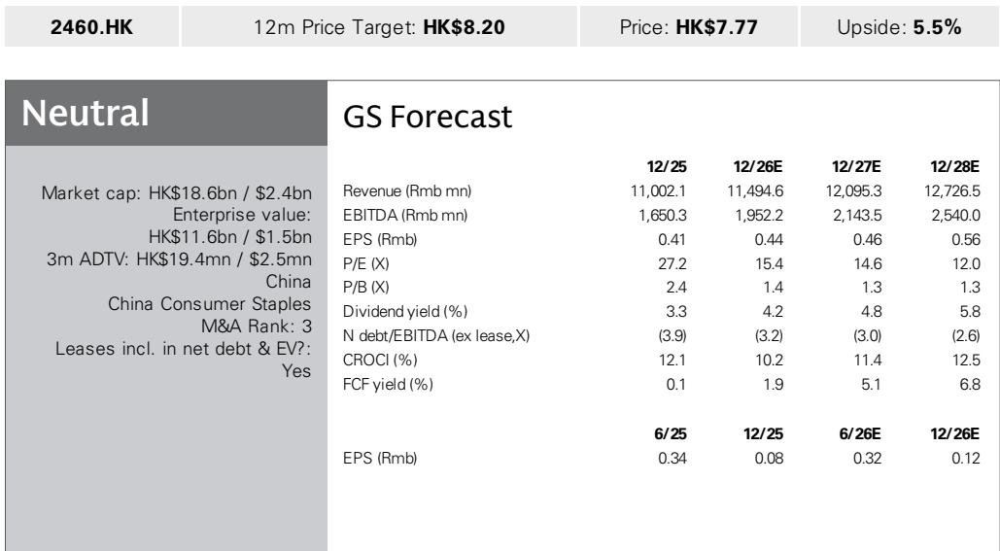
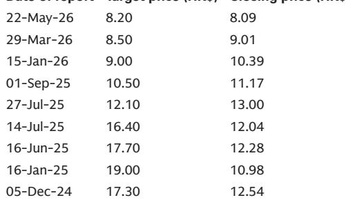

# GS：华润饮料未全国涨价，2.08L调价仅限局部区域

华润饮料正在经历一次主动的渠道调整，其力度在1H26数据中已经清晰可见。GS在近期举办的亚太消费与休闲企业日上与管理层交流后，于7月3日发布的报告中披露了一个关键判断：公司上半年包装水销售预计同比下滑中个位数，饮料业务下滑幅度更大，但管理层的核心焦点并非短期收入，而是渠道库存压降、价格体系修复，以及为下半年更轻的比较基数做准备。这份报告值得关注的核心信号不是“业绩需要继续观察”，而是“公司在用短期调整换取中长期渠道健康”。

报告同时指出，包装水行业在5M26出现了明显的行业性销量变化，部分原因来自低糖/无糖饮料的品类替代效应。华润饮料的管理层明确表示，没有对瓶装水进行普遍调价的计划——此前关于2.08L产品调价的信息仅限于局部区域的价格统一，并非全国性涨价信号。这一点对于市场此前的一些猜测是明确的回应。

## 1. 渠道库存下降30%，管理层更看重报告观点-out而非报告观点-in

GS报告显示，华润饮料在部分区域的渠道库存同比下降约30%，线上线下的价差已基本恢复正常。管理层在交流中强调，终端零售需求比出货量更具韧性。这意味着，公司上半年的收入下滑更多是主动去库存的结果，而非需求端的根本性变化。

> **KC评论：** 渠道库存压降30%是一个相当深的调整。对于跟踪消费品公司的读者而言，这里的关键观察指标不是1H26的报表收入，而是2H26的补库存节奏。报告提到下半年比较基数更轻，但补库存的力度取决于终端动销恢复的速度，这一点报告没有给出明确假设，需要后续数据验证。

饮料业务的调整幅度更大，原因不仅是去库存，还包括去年大量新品上市后的聚焦调整。公司今年将资源集中在“至本清润”等核心品牌上，并推出了“加1元多1瓶”的消费者促销，虽然提升了动销，但也增加了促销费用。饮料业务仍处于“研究年”阶段。

## 2. 家庭渠道与下沉市场是下半年增量抓手，但规模仍需验证

报告披露了华润饮料为2H26规划的三条增量路径：低线城市渗透（尤其是北方和成熟市场的空白区域）、家庭水渠道的规模化推广、以及以硬折扣/量贩店为代表的新兴渠道。公司近期已与万辰集团签署了总部对总部的合作协议，并正在与其他量贩/KA渠道洽谈。

值得注意的是，公司为量贩渠道单独设计了520ml规格（零售价1.2元/瓶），以保护批发渠道555ml主规格的价格体系。这是一个精细化的渠道区隔策略，但量贩渠道的毛利率通常低于传统渠道，其对整体盈利能力的稀释效应，报告没有完全展开。

> **KC评论：** 量贩渠道是当前中国快消品行业最受关注的增量渠道之一，但“总部对总部”合作能否真正落地到区域执行层面，是很多同行尚未解决的问题。华润饮料选择用独立SKU区隔价格体系，逻辑上正确，但量贩渠道的运营效率和管理成本，仍需要持续跟踪。

## 3. PET成本是2H26的潜在不确定性，但并非相对少见变量

PET价格在2Q26成为成本端的逆风，尤其是5-6月涨幅明显。公司表示，1H26毛利率大致持平，得益于1-4月的锁价红利；但如果PET均价维持在7000元/吨以上，全年毛利率将面临不确定性。公司通过其他包装材料的采购节约来部分对冲，同时强调全年销售费用率基本稳定，只是投向更高回报的渠道。

报告未回答的一个关键问题是：如果PET价格持续偏高，公司是否会在下半年调整促销力度或产品结构来保护利润率？目前管理层给出的指引是“仍在观察”，这意味着2H26的利润率存在不确定性。

## 报告尚未完全回答的关键问题：品类替代的长期影响

GS报告中提到，包装水行业5M26销量变化，部分原因是低糖/无糖饮料的品类替代。这是一个值得深挖的结构性变化。如果消费者在“喝水”和“喝有味道的水”之间的切换成为长期趋势，那么包装水企业的增长逻辑可能需要重新校准——是继续在存量市场争夺份额，还是主动拓展“水+”品类（如苏打水、风味水）来获取新的消费场景？

华润饮料已经在推进“水+”产品组合的拓展，但报告没有给出具体的规模预期或竞争格局分析。这个问题的答案，可能需要等待下半年更多行业数据和管理层的进一步沟通。

---

完整报告、中文摘要、KC评论和图表合集，会放进当天国际信源汇编。适合快速扫读当日主流叙事，也方便后续追问和横向比较。

For informational purposes only. Portions may be generated,translated,summarized,or edited with AI assistance based on source materials and may contain omissions or errors. Please verify independently. This is not investment,legal,tax,accounting,or other professional advice.

For informational purposes only. Portions may be generated,translated,summarized,or edited with AI assistance based on source materials and may contain omissions or errors. Please verify independently. This is not investment,legal,tax,accounting,or other professional advice.

