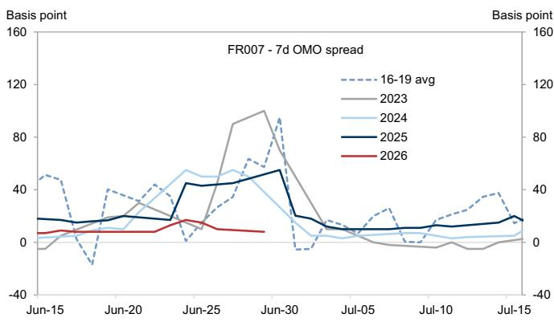

# 关于宏观环境的三点观察

近期宏观环境中有三个值得关注的动态：

**一、官方PMI在6月有所回升**

官方制造业PMI从5月的50.0升至6月的50.3，其中新订单分项指标出现明显改善。季度末月份（3月、6月、9月、12月）读数偏高这一模式，与过去18个月的经验一致。官方非制造业PMI从50.1微升至50.2，建筑业和服务业PMI均小幅上升。

官方制造业PMI在6月回升

来源：国家统计局，GS全球研究

**二、央行启用新的流动性管理工具**

央行于6月29日和30日进行了首次隔夜逆回购操作，合计注入流动性9000亿元。这一新工具使得央行能够在月末、季末和年末防止银行间利率出现大幅波动。往年6月底，7天回购利率常较政策利率高出50个基点以上；今年在央行新工具的作用下，这一情况并未出现。总体而言，这应有助于境内互换利率小幅走低。

## 央行新工具防止了6月底银行间流动性明显收紧

FR007：全金融机构7天银行间回购定盘利率
来源：Wind，GS全球研究

**三、与境内客户的交流观察**

6月最后一周，我们在北京和上海与境内客户进行了交流。过去两个月，随着宏观数据的变化，境内读者对国内经济增长的看法趋于审慎。对于大规模政策宽松的预期仍然不高，读者认为政策制定者更关注科技创新和国家安全，而国内政治周期可能对地方官员提振经济的能力形成一定约束。相比之下，海外客户对居民消费前景的询问有所增加，希望在估值相对合理的背景下寻找研究机会。

## 近期GS宏观研究

## 交流观察与主题研究：

《中国：境内客户如何看待经济？——6月交流观察》，2026年6月30日

《中国观察：聚焦科技》，2026年6月22日

《亚洲经济分析：中国居民资产负债表——去杠杆进程中从不动产向金融资产的结构性转变》，2026年6月17日

## 数据评论与追踪：

《中国经济活动与政策追踪：7月3日》，2026年7月3日

《AEJ周度前瞻：区域通胀、中国信贷、台湾出口、新加坡GDP、马来西亚央行会议》，2026年7月3日

《中国：6月非官方服务业PMI下降》，2026年7月3日

《香港：5月零售销售增长》，2026年7月2日

《中国：6月非官方制造业PMI小幅下降》，2026年7月1日

《中国：6月官方制造业和非制造业PMI均上升》，2026年6月30日

《中国：央行推出隔夜逆回购但利率未披露》，2026年6月30日

《中国：5月工业利润环比下降》，2026年6月27日

《GS中国经济专有指标：6月》，2026年6月24日

《中国：5月扩大财政赤字进一步收紧》，2026年6月23日

## 团队演示材料与网络研讨会回放：

《宏观与策略——全球宏观、财政与活动数据、市场观点（中文）》，2026年6月29日

《中国：GS中国经济展望：2026年7月[演示文稿]》，2026年7月3日

## 中国经济研究团队

Andrew Tilton
+852-2978-1802
andrew.tilton@gs.com
GS (Asia) L.L.C.

Xinquan Chen
+852-2978-2418
xinquan.chen@gs.com
GS (Asia) L.L.C.

Hui Shan
+852-2978-6634
hui.shan@gs.com
GS (Asia) L.L.C.

Yuting Yang
+852-2978-7283
yuting.y.yang@gs.com
GS (Asia) L.L.C.

Lisheng Wang
+852-3966-4004
lisheng.wang@gs.com
GS (Asia) L.L.C.

Chelsea Song
+852-2978-0106
chelsea.song@gs.com
GS (Asia) L.L.C.

## 披露附录

## Reg AC

本人Hui Shan特此证明，本报告中表达的所有观点准确反映本人个人观点，且未受公司业务或客户关系考虑的影响。

除非另有说明，本报告封面所列人员均为GS全球研究部门分析师。

撰稿作者：Hui Shan GS (Asia) L.L.C.

除非另有说明，本报告撰稿作者披露中列出的个人均为GS全球研究部门分析师。

## 披露信息

## 监管披露

## 美国法律法规要求的披露

请参见上述针对本报告提及公司的具体监管披露，以了解以下任何要求的披露：待定交易中的主承销商或联合主承销商；1%或以上所有权；特定服务的报酬；客户关系类型；前期管理/联合管理的公开发行；董事职位；对于股权证券，做市和/或专家角色。GS可能以自营方式交易本报告讨论的发行人的债务证券（或相关衍生品）。

以下为额外要求的披露：所有权和重大利益冲突：GS政策禁止其分析师、向分析师汇报的专业人员及其家庭成员持有分析师覆盖范围内任何公司的证券。分析师薪酬：分析师的薪酬部分基于GS的盈利能力，其中包括投资银行业务收入。分析师作为高管或董事：GS政策通常禁止其分析师、向分析师汇报的人员或其家庭成员在分析师覆盖范围内的任何公司担任高管、董事或顾问。非美国分析师：非美国分析师可能不是GS & Co. LLC的关联人士，因此可能不受FINRA规则2241或FINRA规则2242关于与主题公司沟通、公开露面以及交易分析师所覆盖证券的限制。

## 美国以外司法管辖区法律法规要求的额外披露

以下为指定司法管辖区要求的披露，除非已根据美国法律法规在上文作出披露。澳大利亚：GS Australia Pty Ltd及其关联公司并非澳大利亚《1959年银行法》（联邦）定义的授权存款机构，在澳大利亚不提供银行服务，也不从事银行业务。除非GS另有约定，本研究及其访问权限仅面向《澳大利亚公司法》定义的“批发客户”。在编制研究报告时，GS Australia全球研究部门成员可能参加由其研究报告所涉及的公司及其他实体主办或组织的实地考察和其他会议。在某些情况下，如果GS Australia认为在实地考察或会议的具体情况下适当且合理，此类实地考察或会议的费用可能部分或全部由相关发行人承担。若本文档内容包含任何金融产品建议，则仅为一般性建议，由GS在未考虑客户目标、财务状况或需求的情况下编制。客户在根据任何此类建议采取行动前，应考虑该建议是否适合其自身目标、财务状况和需求。GS Australia和New Zealand的某些利益披露声明以及GS澳大利亚卖方研究独立性政策声明副本可在以下网址获取：https://www.goldmansachs.com/disclosures/australia-new-zealand/index.html。巴西：有关CVM第20号决议的披露信息可在https://www.gs.com/worldwide/brazil/area/gir/index.html获取。如适用，根据CVM第20号决议第20条定义，本研究报告内容的主要巴西注册分析师为本报告开头列出的第一作者，除非文末另有说明。加拿大：此信息仅供您参考，在任何情况下均不应被视为GS & Co. LLC为在加拿大购买证券而进行的广告、要约或招揽。GS & Co. LLC未在加拿大任何司法管辖区根据适用的加拿大证券法注册为交易商，通常不被允许交易加拿大证券，并可能被禁止在加拿大某些司法管辖区销售某些证券和产品。如果您希望在加拿大交易任何加拿大证券或其他产品，请联系GS Canada Inc.（GS Group Inc.的关联公司）或其他注册的加拿大交易商。香港：可应要求从GS (Asia) L.L.C.获取本研究报告所涉覆盖公司证券的进一步信息。印度：可从GS (India) Securities Private Limited获取本研究报告所涉主题公司或公司的进一步信息，研究分析师 - SEBI注册号INH000001493，地址：10th Floor, Ascent-Worli, Sudam Kalu Ahire Marg, Worli, Mumbai-400 025, India，企业识别号U74140MH2006FTC160634，电话+91 22 6616 9000，传真+91 22 6616 9001。GS可能实益拥有本研究报告所涉主题公司或公司1%或以上的证券（定义见印度《1956年证券合同（监管）法》第2(h)条）。SEBI的注册和NISM的认证绝不保证中介机构的业绩或向读者提供任何回报保证。GS (India) Securities Private Limited合规官和读者投诉联系详情、年度合规审计报告副本及其他相关信息和披露可在以下链接找到：https://www.goldmansachs.com/worldwide/india/research-analyst。日本：见下文。韩国：除非GS另有约定，本研究及其访问权限仅面向《金融服务和资本市场法》定义的“专业读者”。可从GS (Asia) L.L.C.首尔分行获取本研究报告所涉主题公司或公司的进一步信息。新西兰：GS New Zealand Limited及其关联公司并非新西兰《1989年新西兰储备银行法》定义的“注册银行”或“存款接受机构”。除非GS另有约定，本研究及其访问权限面向《2008年金融顾问法》定义的“批发客户”。GS Australia和New Zealand的某些利益披露声明副本可在以下网址获取：https://www.goldmansachs.com/disclosures/australia-new-zealand/index.html。俄罗斯：在俄罗斯联邦分发的研究报告不属于俄罗斯法律定义的广告，而是不以产品推广为主要目的的信息和分析，且不提供俄罗斯评估活动法律意义上的评估。研究报告不构成俄罗斯法律法规定义的个人化研究交流，不针对特定客户，且未分析客户的财务状况、投资概况或风险概况。GS不对客户或任何其他人基于本研究报告可能做出的任何投资决策承担责任。新加坡：GS (Singapore) Pte.（公司编号：198602165W）受新加坡金融管理局监管，对本研究承担法律责任，如有任何与本研究报告相关的事宜，应联系该公司。台湾：此材料仅供参考，未经许可不得转载。读者应仔细考虑自身的投资风险。投资结果由个人读者自行负责。英国：在英国被归类为零售客户（定义见金融行为监管局规则）的人士，应结合GS先前关于本报告所涉覆盖公司的研究阅读本报告，并应参考GS International已发送给他们的风险警告。这些风险警告的副本以及本报告中使用的某些金融术语的词汇表，可应要求从GS International获取。

欧盟和英国：有关欧盟委员会授权条例(EU) (2016/958)第6(2)条（该条例补充欧洲议会和理事会条例(EU) No 596/2014，包括该授权条例在英国脱离欧盟和欧洲经济区后转化为英国国内法律和法规的部分）关于研究交流或其他建议或暗示投资策略的信息客观呈现的技术安排以及特定利益或利益冲突迹象披露的技术标准的披露信息，可在https://www.gs.com/disclosures/europeanpolicy.html获取，其中载明了与投资研究相关的利益冲突管理欧洲政策。

日本：GS Japan Co., Ltd.是在关东财务局注册的金融工具交易商，注册号金商第69号，是日本证券业协会、日本金融期货协会、第二类金融工具业协会和日本投资管理协会的会员。股票买卖需按与客户预先确定的佣金加消费税收取。有关日本证券交易所、日本证券业协会或日本证券金融公司要求的任何适用披露，请参见公司特定披露。

## 全球产品；分发实体

GS全球研究为GS客户在全球范围内制作和分发研究产品。全球GS办公室的分析师对行业和公司以及宏观经济、货币、大宗商品和投资组合策略进行研究。本研究在澳大利亚由GS Australia Pty Ltd (ABN 21 006 797 897)分发；在巴西由GS do Brasil Corretora de Títulos e Valores Mobiliários S.A.分发；公共沟通渠道GS Brazil：0800 727 5764和/或 contatogoldmanbrasil@gs.com。工作日（节假日除外）上午9点至下午6点提供服务。Canal de Comunicação com o Público GS Brasil：0800 727 5764 e/ou contatogoldmanbrasil@gs.com。Horário de funcionamento：segunda-feira à sexta-feira (exceto feriados), das 9h às 18h；在加拿大由GS & Co. LLC分发；在香港由GS (Asia) L.L.C.分发；在印度由GS (India) Securities Private Ltd.分发；在日本由GS Japan Co., Ltd.分发；在大韩民国由GS (Asia) L.L.C.首尔分行分发；在新西兰由GS New Zealand Limited分发；在俄罗斯由OOO GS分发；在新加坡由GS (Singapore) Pte.（公司编号：198602165W）分发；在美国由GS & Co. LLC分发。GS International已批准本研究在英国的分发。

GS International（“GSI”），由审慎监管局（“PRA”）授权，受金融行为监管局（“FCA”）和PRA监管，已批准本研究在英国的分发。

欧洲经济区：GS Bank Europe SE（“GSBE”）是在德国注册的信贷机构，在单一监管机制下受欧洲央行直接审慎监管，并在其他方面受德国联邦金融监管局（BaFin）和德意志联邦银行监管，并在欧洲经济区内分发研究。

## 一般披露

本研究仅供我们的客户使用。除与GS相关的披露外，本研究基于我们认为可靠的当前公开信息，但我们不保证其准确或完整，也不应依赖于此。本文所含信息、意见、估计和预测截至本文日期，如有变更，恕不另行通知。我们力求适时更新我们的研究，但各种法规可能阻止我们这样做。除某些定期发布的行业报告外，大部分报告根据分析师的判断不定期发布。

GS开展全球全方位、综合性的投资银行、投资管理和经纪业务。我们与全球研究覆盖的相当大比例的公司存在投资银行和其他业务关系。GS & Co. LLC，美国经纪交易商，是SIPC成员（https://www.sipc.org）。

我们的销售人员、交易员和其他专业人士可能向我们的客户和自营交易部门提供口头或书面的市场评论或交易策略，这些评论或策略反映的观点可能与本研究表达的观点相反。我们的资产管理部、自营交易部门和投资业务可能做出与本研究报告中的建议或观点不一致的投资决策。

除非法规或GS政策另有禁止，我们及我们的关联公司、高级职员、董事和员工可能不时持有本研究报告所述证券或衍生品（如有）的多头或空头头寸，担任自营交易商，并买卖这些证券或衍生品。

在GS安排的会议上由第三方演讲者（包括来自GS其他部门的个人）表达的观点不一定反映全球研究的观点，也不是GS的官方观点。

本文引用的任何第三方，包括任何销售人员、交易员和其他专业人士或其家庭成员，可能持有本报告所述产品中与署名分析师表达的观点不一致的头寸。

本研究侧重于跨市场、行业和板块的投资主题。它不试图区分我们描述的任何行业或板块内单个公司的前景或表现，也不提供对单个公司的分析。

本研究中与股权或信用证券或行业或板块内证券相关的任何交易建议反映了所讨论的投资主题，并非孤立地对任何此类证券的建议。

本研究不构成在任何司法管辖区出售或购买任何证券的要约或招揽，如果此类要约或招揽在该司法管辖区属于非法。它不构成个人建议，也未考虑个别客户的特定投资目标、财务状况或需求。客户应考虑本研究中的任何建议或推荐是否适合其特定情况，并在适当时寻求专业建议，包括税务建议。本研究中提及的投资的价格和价值及其产生的收入可能波动。过往表现并非未来表现的指引，未来回报不保证，且可能损失原始资本。汇率波动可能对某些投资的价值或价格或由此产生的收入产生不利影响。

某些交易，包括涉及期货、期权和其他衍生品的交易，会带来重大风险，并不适合所有读者。读者应查阅当前的期权和期货披露文件，这些文件可从GS销售代表或https://www.theocc.com/about/publications/character-risks.jsp和https://www.goldmansachs.com/disclosures/cftc_fcm_disclosures获取。在需要多次买卖期权的期权策略（如价差）中，交易成本可能很高。将应要求提供支持文件。

全球研究提供的不同服务水平：GS全球研究向您提供的服务水平和类型可能与向GS内部及其他外部客户提供的服务水平和类型有所不同，具体取决于多种因素，包括您个人对沟通频率和方式的偏好、您的风险状况和投资重点及视角（例如，市场整体、特定板块、长期、短期）、您与GS整体客户关系的规模和范围，以及法律和监管限制。

例如，某些客户可能要求在特定证券的研究发布时收到通知，某些客户可能要求将分析师基本面分析所依据的特定数据（这些数据可在我们的内部客户网站上获取）通过数据推送或其他方式以电子方式传送给他们。分析师基本面研究观点的任何变更（例如，评级、目标价或股权证券盈利预测的重大变化）都不会在任何客户之前传达，而是在通过电子方式向我们的内部客户网站广泛发布研究报告或通过其他必要方式向所有有权接收此类报告的客户传达后，才包含在研究报告中进行沟通。

所有研究报告均通过电子方式发布到我们的内部客户网站，同时向所有客户提供。并非所有研究内容都会重新分发给我们的客户或提供给第三方聚合商，GS也不对第三方聚合商重新分发我们的研究负责。如需与一只或多只证券、市场或资产类别（包括相关服务）相关的研究、模型或其他数据，请联系您的GS代表或访问https://research.gs.com。

披露信息也可在https://www.gs.com/research/hedge.html或联系Research Compliance, 200 West Street, New York, NY 10282获取。

## © 2026 GS.

您仅可为自身使用而存储、展示、分析、修改、重新格式化及打印通过本服务向您提供的信息。未经GS明确书面同意，您不得转售或逆向工程此信息以计算或开发任何用于披露和/或营销的指数，或创建任何其他衍生作品或商业产品、数据或产品。未经GS明确书面同意，您不得以任何格式向任何第三方发布、传输或以其他方式复制此信息的全部或部分。前述限制包括但不限于使用、提取、下载或检索此信息的全部或部分，以训练或微调机器学习或人工智能系统，或向任何此类系统提供或复制此信息的全部或部分作为提示或输入。
