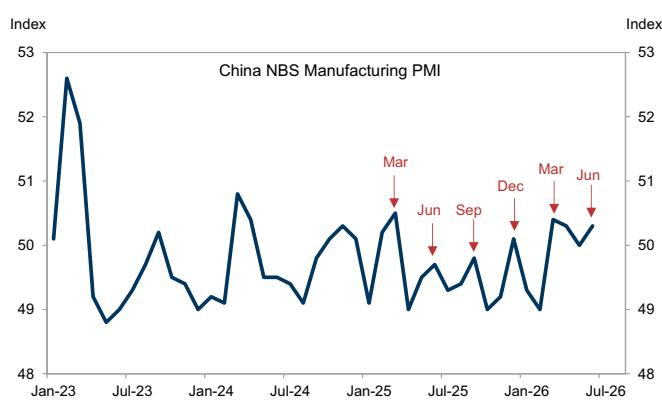

# 宏观环境政策调整已启动，但真正的故事在于国内外观察者信心的分化

6月官方制造业PMI回升至50.3，重新站上扩张区间。非制造业PMI也小幅走高。表面上看，这对一个信号混杂的宏观环境而言是令人欣慰的数据点。然而，这一模式似曾相识：过去18个月中，季度末月份持续录得较高读数，这引发了一个问题——这是真实的动能还是统计上的季节性因素。更重要的变化发生在别处。

6月底，央行部署了一项新的流动性工具，进行了首次隔夜逆回购操作，向体系注入9000亿元。这是对反复出现的脆弱性——银行间利率在季度末容易飙升——的直接回应。历史上，7天回购利率在6月底前后曾较政策利率飙升超过50个基点。今年，这种情况没有发生。这并非微小的技术性调整。它标志着央行操作框架的有意转变，对互换利率、资金成本以及更广泛的货币政策传导机制都具有影响。

但最具启示性的信号来自与客户的交流。在6月的最后一周，与北京和上海的在岸观察者的会面揭示了一个显著模式：国内观察者对宏观增长的看法明显变得更加谨慎，对重大政策宽松的预期仍然较低。他们认为政策制定者优先考虑技术创新和国家安全，而非短期刺激，并且认为地方官员受到政治周期的约束。相比之下，海外客户越来越多地询问居民消费情况，在估值承压的环境中寻找机会。这种情绪上的分化并非噪音。它是当前宏观环境中核心的战略张力。

本文的观点直截了当：宏观环境正在经历微妙但有意义的政策再校准，然而对观察者而言最重要的变量并非数据或工具本身，而是国内外对宏观环境认知之间不断扩大的差距。理解这一差距为何存在及其含义，是把握下一阶段的关键。

## 央行新流动性工具并非微小的技术调整；它反映了央行管理金融条件的结构性转变

隔夜逆回购的推出很容易被忽视。它听起来像是管道工程。但央行在季度末部署这一工具，并成功防止了银行间利率的惯常飙升，这具有战略意义。

多年来，每个季度末都是货币市场可预见的波动来源。7天回购利率相对于政策利率会跳升，形成一种迫使市场参与者将周期性流动性压力计入价格的模式。这不仅仅是成本问题。它扭曲了回报表现曲线，使对冲策略复杂化，并使央行的政策信号更难顺畅传导至实体经济。

央行的新工具改变了这一动态。通过直接在隔夜期限注入流动性，央行可以针对最紧迫的压力点，而无需承诺更广泛的宽松立场。其效果是精准的：它防止利率飙升，同时不暗示政策利率本身发生变化。6月份的情况正是如此。正如报告所指出的，其结果应该是互换利率略有下降。但更深层的含义是，央行正在构建一个更灵活、更精准的工具箱。它正在学习在不诉诸全面刺激的情况下管理金融条件。

这对观察者很重要，因为它改变了固定收益市场的风险特征。如果季度末利率飙升成为过去，杠杆头寸的持有成本将下降，资金成本的可预测性将提高。这对互换市场以及任何依赖稳定短期利率的策略而言，都是一个结构性利好。

## 官方PMI数据显示出反复出现的季度末模式，而非明确突破；观察者应谨慎对待6月读数

制造业PMI从50.0升至50.3，新订单分项指数明显回升。单独来看，这看起来像是温和复苏。但过去18个月的模式不容忽视：PMI在3月、6月、9月和12月持续录得较高读数。这并非巧合。它反映了日历效应、季度末政府支出激增以及可能的统计平滑等因素的综合作用。

问题不在于数据是否真实。问题在于它告诉我们关于潜在趋势的什么信息。如果季度末模式是由暂时性因素驱动的，那么6月份的环比改善并不预示着持久的复苏。它可能仅仅意味着宏观环境在季度末比季度初不那么疲弱。这是一个截然不同的信息。

对观察者而言，这意味着要避免对单一数据点过度解读。PMI作为方向性信号是有用的，但季度末扭曲降低了其作为独立指标的可靠性。更重要的观察是，非制造业PMI也仅从50.1微升至50.2，建筑业和服务业分项指数仅小幅上升。没有证据表明出现广泛的加速。

这一模式表明，宏观环境正在低位企稳，而非获得动能。这与在岸观察者的谨慎基调以及宏观环境正在被管理而非被刺激的广泛叙事是一致的。

## 国内外观察者情绪的分化是当前宏观环境中最被低估的动态

这是最重要的一节。报告中的客户交流揭示了一个显著的不对称性。在岸观察者变得更加谨慎。他们看到宏观数据走弱、政策回应有限以及地方官员面临政治约束。他们不预期会有重大宽松。相比之下，海外客户越来越多地询问居民消费情况，在一个估值承压的市场中寻找机会。

为何出现分化？答案在于不同的参照点。国内观察者关注增长和政策的近期轨迹。他们看到数据实时走弱，并且没有看到政策制定者愿意改变方向的迹象。他们怀疑技术和国家安全优先事项能否在短期内产生提振宏观环境所需的需求。

相比之下，海外观察者关注的是估值。他们看到一个已被打压的市场，并且正在询问居民部门是否可能是隐藏实力的来源。报告6月份关于居民资产负债表的分析，强调了从房地产向金融资产的结构性转变，为这一观点提供了潜在基础。如果居民正在将储蓄从房地产重新配置到金融资产，即使更广泛的宏观环境仍然低迷，这也可能为权益市场创造顺风。

两种观点都有其道理。但分化本身创造了机会。如果国内情绪过于悲观，现在进入的海外观察者可能从重新定价中受益。如果海外情绪过于乐观，风险在于宏观环境继续走弱，估值仍然承压。关键在于识别哪种观点更有可能被证明是正确的。

## 报告未完全回答的问题：央行新工具是更积极宽松的前奏，还是其替代品

这是尚未解决的问题，应使观察者保持警惕。央行的新流动性工具显然是朝着更精细的货币政策管理迈出的一步。但尚不清楚它是更积极宽松的前奏，还是其替代品。

一种解读是，央行正在为更积极的宽松周期构建基础设施。通过开发能够针对特定期限和特定压力点的工具，央行正在准备在需要时更有效地注入流动性。根据这种观点，隔夜逆回购是准备就绪的信号，而非克制的信号。

另一种解读是，央行正在使用这一工具来避免更积极的措施。通过防止季度末利率飙升，央行可以声称流动性条件稳定，而无需下调政策利率或扩大资产负债表。这将与政策制定者优先考虑稳定而非刺激的观点一致。

报告没有解决这个问题，我们也不能。但答案对互换利率、债券回报表现以及宏观环境市场的整体风险偏好具有重要影响。观察者应关注央行未来几个月的行动，特别是下一个季度末前后，以寻找哪种解读正确的线索。

## 观察者的决策框架：三个问题决定您的宏观环境定位

鉴于当前环境的复杂性，观察者需要一个清晰的框架。以下是一个简单的框架，基于报告的逻辑和更广泛的战略背景。

首先，问自己：您是否相信央行的新流动性工具将导致金融条件的持续宽松？如果是，那么为较低的互换利率和更陡峭的回报表现曲线进行定位是有意义的。如果否，那么重点应放在信用选择和久期管理上。

其次，问自己：您信任哪种情绪分化？如果您认为国内观察者过于悲观，那么机会在于被超卖的领域，特别是那些与居民消费和金融资产配置相关的领域。如果您认为海外观察者过于乐观，那么风险在于估值将继续受到压缩，最佳策略是等待更清晰的政策支持信号。

第三，问自己：您对季度末PMI模式赋予多大权重？如果您将其视为企稳的真实信号，那么适度转向周期性领域可能是合理的。如果您将其视为统计假象，那么谨慎的立场是保持防御，并专注于技术、自动化等长期增长主题。

这三个问题不会给您一个单一的答案，但它们会迫使您明确自己的假设。在一个数据模糊、情绪分化的市场中，这种清晰度是您能拥有的最有价值的资产。

---

*仅供参考。部分内容可能基于源材料通过AI辅助生成、翻译、总结或编辑，可能存在遗漏或错误。请独立核实。本文不构成任何专业建议。*
