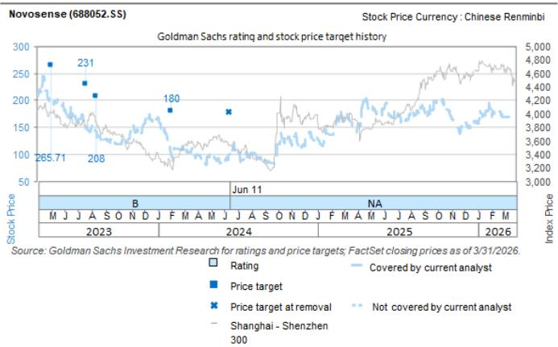

## 关于纳芯微（688052.SS）的近期交流纪要

我们近期与纳芯微（688052.SS）管理层进行了交流。管理层对公司AI服务器电源管理芯片业务持积极看法，主要基于以下因素：AI基础设施投入持续增长、单GPU算力提升对数据中心能效提出更高要求、本土客户更倾向于采用本地供应商，以及纳芯微全面的产品组合。管理层认为，随着营收规模扩大、终端市场布局更加多元化以及产品规格持续升级，公司的盈利能力有望得到提升。

**对华润微的启示：** 管理层对AI服务器电源管理IC终端需求的积极看法，与我们此前对华润微的观点相呼应。我们目前对华润微的看法更为积极，主要基于AI基础设施趋势的推动：（1）电源管理芯片业务：华润微作为本土市场领先的电源管理芯片供应商，已进入主要云服务提供商、AI服务器OEM厂商及电源组件供应商的供应链，并于2026年2月宣布提价（链接），这反映了电源管理芯片供应链正受益于AI数据中心带来的终端需求增长；（2）封装测试业务：华润微正利用其高密度PoP封装技术，拓展至AI服务器电源及光模块电源驱动市场，以把握不断增长的终端需求。详见：华润微：评级上调至中性。

**公司简介：** 纳芯微（688052.SS）成立于2013年，是一家本土模拟与混合信号芯片供应商，专注于传感器、信号链及电源管理IC。公司提供全面的半导体产品与解决方案，覆盖汽车、工业、信息通信及消费电子等多元化终端市场。

**核心要点：** 管理层对其服务器电源管理IC业务保持积极态度，并提到纳芯微提供包括功率器件、功率驱动、传感器、电源管理、信号链、MCU等在内的完整解决方案，覆盖UPS、AC/DC、DC/DC PSU等应用。纳芯微服务于本土主要的AI服务器电源组件供应商，管理层预计公司将受益于本土化趋势以及本土市场AI服务器终端需求的增长，从而支撑公司未来的营收增长。纳芯微于2026年7月推出了面向汽车电子及泛能源应用的新型混合信号芯片（链接），管理层认为，下一代模拟IC的性能将更依赖于供应商的设计与制造能力，这将有利于像纳芯微这样经验丰富的参与者。

Verena Jeng
+852-2978-1681 | verena.jeng@gs.com
GS (Asia) L.L.C.

Allen Chang
+852-2978-2930 |
allen.k.chang@gs.com
GS (Asia) L.L.C.

Yifan Hu
+852-2978-0996 | yifan.hu@gs.com
GS (Asia) L.L.C.

## 附录

## Reg AC

我们，Verena Jeng、Allen Chang 和 Yifan Hu，特此证明本报告中表达的所有观点均准确反映了我们个人对相关公司及其证券的看法。我们还证明，我们的薪酬中没有任何部分（过去、现在或将来）直接或间接与本报告中表达的具体建议或观点相关。

除非另有说明，本报告封面所列人员均为GS全球投资研究部分析师。

撰稿作者：Verena Jeng GS (Asia) L.L.C.，Allen Chang GS (Asia) L.L.C.，Yifan Hu GS (Asia) L.L.C.

除非另有说明，本报告撰稿作者披露中列出的个人均为GS全球投资研究部分析师。

## GS因子概况

GS因子概况通过将股票的关键属性与市场（即我们的评级股票池）及其行业同行进行比较，为股票提供投资背景。所描绘的四个关键属性是：增长、财务回报、倍数（例如估值）和综合（增长、财务回报和倍数的组合）。增长、财务回报和倍数是使用每只股票特定指标的标准化排名计算得出的。然后将指标的标准化排名进行平均，并转换为相关属性的百分位数。每个指标的具体计算可能因财年、行业和地区而异，但标准方法如下：

增长基于股票的未来销售增长、EBITDA增长和EPS增长（对于金融股，仅EPS和销售增长），百分位数越高表示公司增长越快。财务回报基于股票的未来ROE、ROCE和CROCI（对于金融股，仅ROE），百分位数越高表示公司财务回报越高。倍数基于股票的未来P/E、P/B、价格/股息（P/D）、EV/EBITDA、EV/FCF和EV/债务调整后现金流（DACF）（对于金融股，仅P/E、P/B和P/D），百分位数越高表示股票交易倍数越高。综合百分位数计算为增长百分位数、财务回报百分位数和（100% - 倍数百分位数）的平均值。

财务回报和倍数使用GS分析师对未来至少三个季度后的财年末预测。增长使用对未来至少七个季度后的财年输入，与未来至少三个季度后的财年进行比较（所有指标均基于每股）。

有关我们如何计算GS因子概况的更详细说明，请联系您的GS代表。

## M&A排名

在我们的全球覆盖范围内，我们使用M&A框架审视股票，考虑定性因素和定量因素（可能因行业和地区而异），以纳入某些公司可能被收购的可能性。然后，我们分配M&A排名，作为对我们评级覆盖下的公司从1到3进行评分的一种方式，其中1表示公司成为收购目标的可能性高（30%-50%），2表示可能性中等（15%-30%），3表示可能性低（0%-15%）。对于排名为1或2的公司，根据我们的标准部门指南，我们将M&A组成部分纳入我们的目标价。M&A排名为3被认为不重要，因此不计入我们的目标价，并且可能在研究中讨论或不讨论。

## Quantum

Quantum是GS的专有数据库，提供详细的财务报表历史、预测和比率访问。它可用于对单个公司进行深入分析，或比较不同行业和市场的公司。

## 披露

## 公司特定监管披露

以下披露涉及GS集团（及其附属机构，“GS”）与GS全球投资研究所涵盖的公司之间的关系。

截至最近第二个月末，GS实益拥有普通股1%或以上（不包括根据美国证券法无需汇总的关联公司和业务部门管理的头寸）：纳芯微（Rmb257.00）

评级/投资银行关系分布
GS投资研究全球股票覆盖范围

<table><tr><td rowspan="2"></td><td colspan="3">评级分布</td><td colspan="3">投资银行关系</td></tr><tr><td>买入</td><td>持有</td><td>卖出</td><td>买入</td><td>持有</td><td>卖出</td></tr><tr><td>全球</td><td>50%</td><td>34%</td><td>16%</td><td>65%</td><td>60%</td><td>45%</td></tr></table>

截至2026年4月1日，GS全球投资研究对3,074只股票进行了投资评级。GS将股票指定为买入和卖出，纳入各个地区的投资清单；未如此指定的股票被视为中性。为满足FINRA规则要求的上述披露，此类分配等同于买入、持有和卖出。请参阅下面的“评级、覆盖范围和相关定义”。投资银行关系图反映了每个评级类别中GS在过去十二个月内提供过投资银行服务的公司所占的百分比。

## 目标价和评级历史图表

  
所示目标价应结合所有先前发布的GS报告（可能包含或不包含目标价）以及公司、其行业和金融市场的发展情况来考虑。

## 监管披露

## 美国法律法规要求的披露

请参阅上述公司特定监管披露，了解本报告中提及的公司所需的任何以下披露：待处理交易中的经理或联合经理；1%或其他所有权；特定服务的报酬；客户关系类型；先前期间管理/联合管理的公开发行；董事职位；对于股票，做市和/或专家角色。GS可能作为本金交易本报告中讨论的发行人的债务证券（或相关衍生品）。

以下是额外的必要披露：所有权和重大利益冲突：GS政策禁止其分析师、向分析师报告的专业人士及其家庭成员持有分析师覆盖范围内任何公司的证券。分析师薪酬：分析师的薪酬部分基于GS的盈利能力，其中包括投资银行收入。分析师作为高管或董事：GS政策通常禁止其分析师、向分析师报告的人士或其家庭成员担任分析师覆盖范围内任何公司的高管、董事或顾问。非美国分析师：非美国分析师可能不是GS & Co. LLC的关联人士，因此可能不受FINRA规则2241或FINRA规则2242关于与主题公司沟通、公开露面以及交易分析师所覆盖证券的限制。

美国以外司法管辖区法律法规要求的额外披露
以下披露是所指示司法管辖区要求的，除非已根据美国法律在上文作出披露。澳大利亚：GS Australia Pty Ltd及其附属公司不是澳大利亚的授权存款机构（该术语在1959年银行法（Cth）中定义），不提供银行服务，也不在澳大利亚开展银行业务。除非GS另有约定，本研究及其任何访问仅面向澳大利亚公司法含义内的“批发客户”。在制作研究报告时，GS Australia全球投资研究部门的成员可能会参加由其研究报告主题的公司和其他实体主办或组织的实地考察和其他会议。在某些情况下，如果GS Australia认为在实地考察或会议的具体情况下适当且合理，此类实地考察或会议的费用可能部分或全部由相关发行人承担。如果本文档内容包含任何金融产品建议，则仅为一般性建议，由GS在未考虑客户目标、财务状况或需求的情况下编制。客户在根据任何此类建议采取行动之前，应考虑其自身目标、财务状况和需求的适当性。某些GS Australia和New Zealand的利益披露以及GS澳大利亚卖方研究独立性政策声明的副本可在以下网址获取：https://www.goldmansachs.com/disclosures/australia-new-zealand/index.html。巴西：有关CVM决议第20号的披露信息可在https://www.gs.com/worldwide/brazil/area/gir/index.html获取。在适用的情况下，根据CVM决议第20号第20条定义，对本研究报告内容负主要责任的巴西注册分析师是本报告开头指定的第一作者，除非文本末尾另有说明。加拿大：此信息仅供您参考，在任何情况下均不应被解释为GS & Co. LLC为在加拿大购买证券而向加拿大证券购买者发布的广告、要约或招揽。GS & Co. LLC未根据适用的加拿大证券法在任何加拿大司法管辖区注册为交易商，通常不允许交易加拿大证券，并且可能被禁止在加拿大的某些司法管辖区销售某些证券和产品。如果您希望在加拿大交易任何加拿大证券或其他产品，请联系GS Canada Inc.（GS集团公司的附属公司）或其他注册的加拿大交易商。香港：可根据要求从GS (Asia) L.L.C.获取本研究中涵盖的公司证券的进一步信息。印度：可从GS (India) Securities Private Limited获取本研究中提及的主题公司或公司的进一步信息，研究分析师 - SEBI注册号INH000001493，地址：10th Floor, Ascent-Worli, Sudam Kalu Ahire Marg, Worli, Mumbai-400 025, India，公司识别号U74140MH2006FTC160634，电话+91 22 6616 9000，传真+91 22 6616 9001。GS可能实益拥有本研究报告中所提及主题公司或公司1%或以上的证券（该术语在1956年印度证券合同（监管）法第2(h)条中定义）。SEBI的注册和NISM的认证绝不保证中介机构的业绩或向读者提供任何回报保证。GS (India) Securities Private Limited的合规官和读者投诉联系详情、年度合规审计报告副本以及其他相关信息和披露可在此链接找到：https://www.goldmansachs.com/worldwide/india/research-analyst。日本：见下文。韩国：除非GS另有约定，本研究及其任何访问仅面向金融服务和资本市场法含义内的“专业读者”。可从GS (Asia) L.L.C.首尔分行获取本研究中提及的主题公司或公司的进一步信息。新西兰：GS New Zealand Limited及其附属公司不是新西兰的“注册银行”或“存款接受者”（定义见1989年新西兰储备银行法）。除非GS另有约定，本研究及其任何访问面向“批发客户”（定义见2008年金融顾问法）。某些GS Australia和New Zealand的利益披露副本可在以下网址获取：https://www.goldmansachs.com/disclosures/australia-new-zealand/index.html。俄罗斯：在俄罗斯联邦分发的研究报告不是俄罗斯立法中定义的广告，而是信息和分析，其主要目的不是推广产品，并且不提供俄罗斯评估活动立法含义内的评估。研究报告不构成俄罗斯法律法规定义的个人化研究交流，不针对特定客户，并且是在未分析客户财务状况、投资概况或风险概况的情况下准备的。GS对客户或任何其他人可能基于本研究报告做出的任何投资决策不承担任何责任。新加坡：GS (Singapore) Pte.（公司编号：198602165W），受新加坡金融管理局监管，接受对本研究的法律责任，如有任何由此产生或与之相关的事宜，应联系该公司。台湾：此材料仅供参考，未经许可不得转载。读者应仔细考虑自身的投资风险。投资结果由个人读者负责。英国：在英国被归类为零售客户（定义见金融行为监管局规则）的人士，应结合先前GS关于本研究报告所涵盖公司的报告阅读本研究，并应参考GS International已发送给他们的风险警告。这些风险警告的副本以及本报告中使用的某些金融术语的词汇表，可应要求从GS International获取。

欧盟和英国：有关欧盟委员会授权条例（EU）（2016/958）第6(2)条（补充欧洲议会和理事会条例（EU）第596/2014号）（包括该授权条例在英国脱离欧盟和欧洲经济区后转化为英国国内法律和法规）关于研究交流或其他建议或暗示投资策略的信息客观呈现的技术安排以及特定利益或利益冲突迹象披露的技术标准的信息，可在https://www.gs.com/disclosures/europeanpolicy.html获取，其中说明了与投资研究相关的利益冲突管理欧洲政策。

日本：GS Japan Co., Ltd.是在关东财务局注册的金融工具交易商，注册号Kinsho 69，并且是日本证券业协会、日本金融期货协会、日本第二类金融工具业协会和日本投资管理协会的成员。股票买卖需支付与客户预先确定的佣金加上消费税。有关日本证券交易所、日本证券业协会或日本证券金融公司要求的任何适用披露，请参阅公司特定披露。

## 评级、覆盖范围和相关定义

买入（B）、中性（N）、卖出（S）分析师建议将股票作为买入或卖出纳入各个地区的投资清单。被指定为投资清单上的买入或卖出取决于股票相对于其覆盖范围的总回报潜力。任何未被指定为投资清单上的买入或卖出且具有有效评级（即，非评级暂停、未评级、早期生物技术、覆盖暂停或未覆盖）的股票被视为中性。每个地区管理区域信念清单，这些清单选自各自地区投资清单上的报告评级股票，代表侧重于其各自覆盖范围内总回报潜力大小和/或实现回报可能性的研究交流。从这些信念清单中添加或移除股票由每个相应地区的投资审查委员会或其他指定委员会管理，并不代表分析师对此类股票的投资评级发生变化。

总回报潜力代表当前股价与目标价之间的上行或下行差异，包括目标价相关时间范围内预期支付或预期的所有股息。所有覆盖的股票都需要目标价。总回报潜力、目标价和相关时间范围在每份添加或重申投资清单成员资格的报告中有说明。

覆盖范围：每个覆盖范围内的所有股票列表可按首席分析师、股票和覆盖范围在https://www.gs.com/research/hedge.html获取。

未评级（NR）。当GS在涉及该公司的合并或战略交易中担任顾问角色时，当由于GS参与交易而存在法律、监管或政策限制时，以及在特定其他情况下，根据GS政策，投资评级、目标价和盈利预测（如相关）将被移除。早期生物技术（ES）。当该公司既没有通过II期临床试验的药物、治疗或医疗设备，也没有分销后II期药物、治疗或医疗设备的许可时，根据GS政策，不分配投资评级和目标价。评级暂停（RS）。GS已暂停对该股票的投资评级和目标价，因为没有足够的基本面基础来确定投资评级或目标价。先前的投资评级和目标价（如有）不再对该股票有效，不应依赖。覆盖暂停（CS）。GS已暂停对该公司的覆盖。未覆盖（NC）。GS不覆盖该公司。

## 全球产品；分发实体

GS全球投资研究为GS的客户在全球范围内制作和分发研究产品。位于全球GS办事处的分析师对行业和公司进行研究，并对宏观经济、货币、大宗商品和投资组合策略进行研究。本研究由以下机构在澳大利亚分发：GS Australia Pty Ltd（ABN 21 006 797 897）；在巴西：GS do Brasil Corretora de Títulos e Valores Mobiliários S.A.；GS巴西公共沟通渠道：0800 727 5764 和/或 contatogoldmanbrasil@gs.com。工作日（节假日除外），上午9点至下午6点。Canal de Comunicação com o Público GS Brasil: 0800 727 5764 e/ou contatogoldmanbrasil@gs.com。Horário de funcionamento: segunda-feira à sexta-feira (exceto feriados), das 9h às 18h；在加拿大：GS & Co. LLC；在香港：GS (Asia) L.L.C.；在印度：GS (India) Securities Private Ltd.；在日本：GS Japan Co., Ltd.；在韩国：GS (Asia) L.L.C.首尔分行；在新西兰：GS New Zealand Limited；在俄罗斯：OOO GS；在新加坡：GS (Singapore) Pte.（公司编号：198602165W）；以及在美国：GS & Co. LLC。GS International已批准本研究在英国的分发。

GS International（“GSI”），由审慎监管局（“PRA”）授权并由金融行为监管局（“FCA”）和PRA监管，已批准本研究在英国的分发。

欧洲经济区：GS Bank Europe SE（“GSBE”）是一家在德国注册的信贷机构，在单一监管机制内，接受欧洲中央银行的直接审慎监管，并在其他方面受德国联邦金融监管局（Bundesanstalt für Finanzdienstleistungsaufsicht, BaFin）和德意志联邦银行监管，并在欧洲经济区内分发研究。

## 一般披露

本研究仅供我们的客户使用。除与GS相关的披露外，本研究基于我们认为可靠的当前公开信息，但我们不声明其准确或完整，并且不应依赖于此。本文所含信息、意见、估计和预测截至本文日期，如有更改，恕不另行通知。我们寻求在适当的时候更新我们的研究，但各种法规可能阻止我们这样做。除某些定期发布的行业报告外，大多数报告根据分析师的判断不定期发布。

GS开展全球全方位、综合性的投资银行、投资管理和经纪业务。我们与全球投资研究所覆盖的相当大比例的公司存在投资银行和其他业务关系。GS & Co. LLC，美国经纪交易商，是SIPC的成员（https://www.sipc.org）。

我们的销售人员、交易员和其他专业人士可能会向我们的客户和自营交易部门提供口头或书面的市场评论或交易策略，这些评论或策略反映了与本研究中表达的意见相反的意见。我们的资产管理部、自营交易部门和投资业务可能做出与本研究中表达的建议或观点不一致的投资决策。

本报告中指定的分析师可能不时与我们的客户（包括GS销售人员和交易员）讨论，或在本报告中讨论，涉及可能对本报告所讨论股票的市场价格产生短期影响的催化剂或事件的交易策略，这种影响可能在方向上与分析师的已发布目标价预期相反。任何此类交易策略均不同于且不影响分析师对此类股票的基本股票评级，该评级反映了股票相对于其覆盖范围的总回报潜力，如本文所述。

我们及我们的关联公司、高级职员、董事和员工将不时持有本研究中提及的证券或衍生品（如有）的多头或空头头寸，作为本金进行交易，并买入或卖出，除非法规或GS政策另有禁止。

在GS安排的会议上归因于第三方演讲者（包括来自GS其他部门的个人）的观点，不一定反映全球投资研究的观点，也不是GS的官方观点。

本文引用的任何第三方，包括任何销售人员、交易员和其他专业人士或其家庭成员，可能持有所提及产品的头寸，这些头寸与本报告指定分析师表达的观点不一致。

本研究不构成在任何司法管辖区出售或招揽购买任何证券的要约，此类要约或招揽在该司法管辖区将是非法的。它不构成个人建议，也未考虑个别客户的特定投资目标、财务状况或需求。客户应考虑本研究中的任何建议或推荐是否适合其特定情况，并在适当时寻求专业建议，包括税务建议。本研究中提及的投资的价格和价值以及从中获得的收入可能会波动。过往表现并非未来表现的指引，未来回报不保证，且可能发生原始资本损失。汇率波动可能对某些投资的價值、价格或收入产生不利影响。

某些交易，包括涉及期货、期权和其他衍生品的交易，会带来重大风险，并不适合所有读者。读者应查阅当前的期权和期货披露文件，这些文件可从GS销售代表处或通过https://www.theocc.com/about/publications/character-risks.jsp 和 https://www.goldmansachs.com/disclosures/cftc_fcm_disclosures 获取。对于要求多次买卖期权（如价差）的期权策略，交易成本可能很高。将应要求提供支持文件。

全球投资研究提供的不同服务水平：GS全球投资研究向您提供的服务水平和类型可能与向GS内部和其他外部客户提供的服务水平和类型不同，具体取决于多种因素，包括您个人对接收沟通频率和方式的偏好、您的风险状况和投资重点及视角（例如，市场范围、特定行业、长期、短期）、您与GS整体客户关系的规模和范围，以及法律和监管限制。例如，某些客户可能要求在特定证券的研究发布时收到通知，某些客户可能要求将我们内部客户网站上提供的分析师基本面分析的特定基础数据通过数据馈送或其他方式以电子方式交付给他们。分析师基本面研究观点的任何变化（例如，评级、目标价或股票盈利预测的重大变化），在通过电子方式广泛发布到我们的内部客户网站或通过其他必要方式向所有有权接收此类报告的客户发布之前，不会传达给任何客户。

所有研究报告均通过电子方式同时发布到我们的内部客户网站，并同时向所有客户提供。并非所有研究内容都会重新分发给我们的客户或提供给第三方聚合商，GS也不对第三方聚合商重新分发我们的研究负责。对于与一种或多种证券、市场或资产类别（包括相关服务）相关的研究、模型或其他数据（可能对您可用），请联系您的GS代表或访问https://research.gs.com。

披露信息也可在https://www.gs.com/research/hedge.html 或从研究合规部获取，地址：200 West Street, New York, NY 10282。

## © 2026 GS.

您仅可为自身目的存储、显示、分析、修改、重新格式化及打印通过本服务向您提供的信息。未经GS明确书面同意，您不得转售或逆向工程此信息以计算或开发任何用于披露和/或营销的指数，或创建任何其他衍生作品或商业产品、数据或产品。未经GS明确书面同意，您不得以任何格式向任何第三方发布、传输或以其他方式复制此信息的全部或部分。前述限制包括但不限于，使用、提取、下载或检索此信息的全部或部分，以训练或微调机器学习或人工智能系统，或作为任何此类系统的提示或输入来提供或复制此信息的全部或部分。
