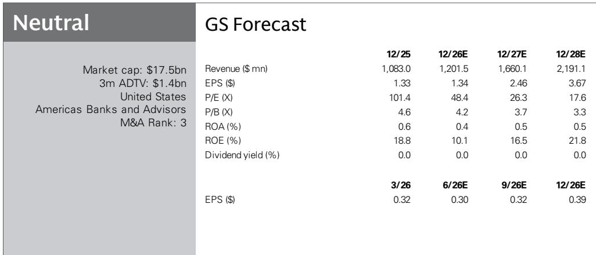
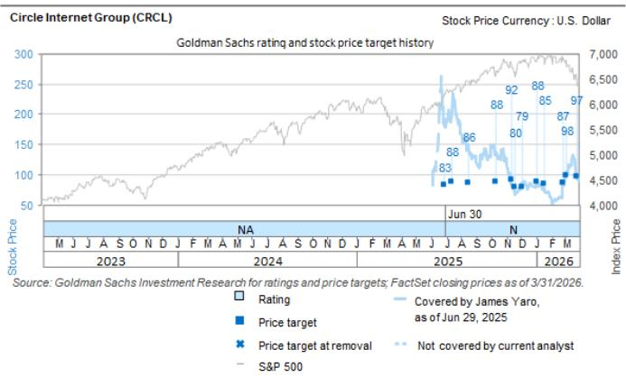

# 稳定币：从加密基础设施到全球资金流动的操作系统

长期以来，关于稳定币的主流叙事一直将其视为加密原生工具：用于交易，在支付领域作用有限，且与数字资产市场的波动周期紧密相连。这种框架正逐渐过时。根据Circle Internet Group近期的管理层评论，稳定币的采用正与更广泛的加密市场脱钩，其在传统金融领域的应用场景（与投机无关）正在加速增长。这并非对单一公司的预测，而是资金流动架构正在被重写的信号。

Circle的管理层指出了五个明确的采用方向：数字资产生态系统、跨境支付与资金管理、消费者商业、资本市场基础设施，以及由人工智能驱动的新兴代理商业类别。每一个方向都代表独立的增长引擎，共同表明稳定币正从一个小众的结算层演变为一个全面的链上金融操作系统。对于研究机构、金融机构和企业资金管理者而言，战略问题已不再是稳定币是否会重要，而是哪种形式的代币化资金将占据主导，以及发行方、银行和新进入者之间的竞争动态将如何展开。

其影响远不止于Circle本身。如果稳定币成为代币化现实世界资产、跨境贸易和机器对机器支付的默认结算货币，那么控制这些网络的分发、流动性和监管基础设施的公司将获得随时间累积的结构性优势。以下分析将审视Circle管理层提出的关键战略论点、尚未解决的问题，以及在评估这一快速变化的格局时应采用的分析框架。

## 稳定币增长与加密市场周期的脱钩，标志着应用场景的结构性转变

多年来，稳定币的市值与加密货币价格和交易量同步变动。当加密市场上涨时，稳定币供应扩大以促进交易；当市场下跌时，稳定币供应收缩。这种模式正在被打破。Circle的管理层强调，即使在加密市场活动较弱的时期，稳定币的交易量和市值仍在持续增长。这并非暂时现象，而是反映了需求的结构性拓宽。

关键在于，稳定币越来越多地被用于与加密货币投机无直接关联的目的。跨境支付通道、企业资金管理和消费者商业接受度正独立于比特币或以太坊的价格波动而增长。这种脱钩具有两大战略意义。首先，它降低了稳定币发行方的相关性风险，使其收入来源对加密市场下行更具韧性。其次，它打开了数万亿美元的传统支付流市场，这些支付流历来由卡网络、电汇和代理银行主导。

这一转变最有力的证据是稳定币在资本市场基础设施中的采用。Circle指出，机构正越来越多地评估将稳定币作为衍生品、代币化资产市场的结算货币以及抵押品。近期美国商品期货交易委员会允许期货佣金商将特定稳定币视为可随时变现的抵押品，这是一个可能显著加速这一趋势的监管催化剂。如果稳定币成为传统金融市场中的标准抵押品形式，以稳定币计价的交易量可能远超当前加密原生使用量。

## USDC的竞争壁垒：网络效应、监管基础设施与新进入者的冷启动难题

Circle的管理层就竞争动态提出了清晰有力的论点：稳定币是网络效应业务，USDC受益于十年积累的复合优势，新进入者难以复制。该公司指出了三个具体的差异化因素：广泛的分发和平台生态系统、跨产品和市场的深度全球流动性，以及在透明度和全球监管方面的差异化基础设施。

其中最重要的是分发。USDC可在庞大的交易所、支付平台和金融应用生态系统中使用。Circle每增加一个新合作伙伴——无论是像Hyperliquid这样的高增长去中心化交易所，还是像Stripe这样的传统支付巨头——都会强化网络的流动性和实用性。这形成了一个良性循环：更多的分发带来更多的流动性，吸引更多用户，进而吸引更多分发合作伙伴。Circle的管理层明确表示，他们愿意与能够推动大规模分发的合作伙伴分享发行收益，这表明他们理解网络扩展是最高战略优先事项。

冷启动问题是新稳定币竞争对手面临的关键障碍。一个分发有限、流动性低的稳定币对大多数用户来说并不实用，无论其技术优势如何。Circle建立其网络已超过十年，积累的分发渠道、监管批准和用户信任形成了一道无法快速复制的壁垒。个别银行提供的代币化存款也面临类似挑战：它们可能局限于专有生态系统内，与开放、公共的稳定币网络相比，互操作性和流动性受限。

这并不意味着USDC无懈可击。报告指出，Coinbase对USDC的持续支持是其成功的一个因素，这种关系的任何变化都可能构成风险。此外，一个资金充足、拥有强大分发合作伙伴的竞争对手的出现，可能在多年时间范围内挑战USDC的主导地位。但冷启动问题表明，此类挑战的窗口可能正在关闭，而非打开。

## 监管环境是顺风而非威胁——但激励结构的细节至关重要

稳定币监管中最具争议的话题之一是，是否应允许发行方与分发合作伙伴分享收入或向持有者提供类似收益的激励。Circle的管理层认为，拟议的CLARITY法案市场结构法案对USDC明显有利，认为它将维持发行方签订收入分享协议的能力，同时建立更清晰的监管框架，可能加速更广泛的数字资产采用。

这里的细微差别很重要。Circle的管理层区分了基于使用的激励和被动收益。他们认为，按目前草案，该法案将鼓励使用稳定币进行交易活动，而非闲置余额积累。这一区分符合Circle的战略利益：如果稳定币主要用于交易，网络效应通过增加交易量和流动性而复合增长。如果稳定币主要用作赚取收益的价值储存，激励结构将转向被动持有，这不会强化网络的实用性。

对于观察者而言，监管问题不仅关乎稳定币是否合法，还关乎允许其遵循何种经济模式。一个允许为分发分享收入但限制被动收益的监管框架，实际上可能加强像Circle这样成熟发行方的竞争地位，因为它们已经拥有使基于交易的激励有效的分发合作伙伴和网络规模。新进入者将面临双重挑战：建立分发渠道，并遵守一个奖励交易量而非余额积累的监管体系。

## 报告未完全解答的问题：Circle基础设施战略的局限性与去中介化风险

尽管Circle的管理层提出了连贯且乐观的愿景，但几个重要问题仍未解决。最显著的是，Circle的三项基础设施产品——ARC Layer 1区块链、Circle支付网络和代理堆栈——是否会产生有意义的独立收入，还是主要服务于强化USDC的实用性。每个产品都代表一个战略赌注，即Circle可以超越稳定币发行方，扩展为更广泛的金融平台。但构建一个成功的Layer 1区块链是一项资本密集且技术挑战巨大的努力，而市场已挤满了成熟的竞争对手。

第二个未解决的问题涉及去中介化风险。随着稳定币更深入地融入传统金融基础设施，像Circle这样的发行方角色可能被降级为商品化的公用事业。如果稳定币成为标准结算层，价值可能流向建立在网络之上的应用程序，而非基础资产的发行方。Circle的管理层认为，其分发、流动性和监管优势创造了持久的壁垒，但技术平台的历史表明，网络所有者往往难以捕获其促成的大部分价值。

第三个问题是关于机构采用的步伐。Circle强调了传统金融机构日益增长的兴趣，但从兴趣到大规模部署的道路漫长且不确定。监管清晰度、风险管理框架和运营整合都需要时间。报告的预测显示，收入将从2026年的12亿美元增长到2028年的22亿美元，但这假设采用持续加速，如果机构部署慢于预期，这一假设可能无法实现。

## 评估稳定币相关机会的分析框架

对于分析Circle或任何稳定币相关机会的研究者，以下框架将关键战略变量组织成结构化评估：

**网络密度与分发广度。** 最重要的指标不仅是市值，而是分发合作伙伴的数量和质量。每个使USDC能在新环境中使用的合作伙伴——支付网关、交易平台、抵押品管理系统——都增加了网络的实用性，并使竞争对手更难复制。应跟踪新分发协议的速率以及所添加平台的规模。

**监管定位与合规基础设施。** 稳定币发行方在快速演变的监管环境中运营。那些在合规、透明度和多司法管辖区监管批准方面投入的公司，将在框架固化时拥有显著优势。Circle对其跨多个司法管辖区的监管基础设施的强调，是一个难以快速复制的竞争资产。

**收入多元化与韧性。** 稳定币增长与加密市场周期的脱钩是积极发展，但并非所有应用场景都同样具有韧性。跨境支付和资金管理可能是比加密交易费用更稳定的收入来源。应评估推动交易量的应用场景组合，以及收入在多大程度上依赖于波动的加密市场活动。

**基础设施扩展与核心聚焦。** Circle在ARC、CPN和代理产品上的投资代表了潜在的上行空间，但也存在执行风险。问题在于这些产品是否会创造新的收入流，还是会分散管理层对核心稳定币业务的关注。历史上最成功的平台公司，在扩展到相邻基础设施之前，都专注于深化其核心网络。

**竞争动态与冷启动壁垒。** 冷启动问题是一个真实的壁垒，但并非相对。一个资金充足、拥有强大分发合作伙伴的竞争对手最终可能克服它。应关注获得主要金融机构或技术平台大力支持的新稳定币发行方的出现，因为它们可能构成最可信的竞争威胁。

## 加入社区阅读完整报告并查看原始图表

本分析所依据的完整报告包含详细的管理层评论、财务预测和竞争分析，无法在一篇文章中完全呈现。对于希望了解具体收入驱动因素、分析师识别的风险因素以及说明稳定币采用趋势的完整图表的读者，原始研究提供了必要的背景。加入社区阅读完整报告并查看原始图表。

*仅供参考。部分内容可能基于源材料通过AI辅助生成、翻译、总结或编辑，可能存在遗漏或错误。请独立核实。这不构成专业建议。*

仅供参考。部分内容可能基于源材料通过AI辅助生成、翻译、总结或编辑，可能存在遗漏或错误。请独立核实。这不构成专业建议。

