# GCC ONLINE FOOD DELIVERY

## Competition and shift to q-commerce outweigh benefits from consolidation: Talabat to Sell from Buy

### Intense competition in food delivery has changed unit-economics

The GCC online food delivery market has seen competition shift away from quality (experience, service and value) to promotions following Keeta's market entry (in 4Q24 in KSA and 2H25 in UAE, Qatar and Kuwait), with platforms focusing on gaining/defending market share through heavy discounting and free delivery. While the overall market has grown over the last two years, the competitive landscape has changed. Keeta now commands a one-third market share and has become the second-largest player in KSA and Kuwait, while also emerging as a fast-growing No.3 player in the UAE and Qatar. This intense competition has led to weaker unit-economics for the online food delivery platforms.

## Recent consolidation speculation has raised expectations of a more rational competitive environment but we believe Keeta's strategy will shape sector profitability

## Rapid expansion into q-commerce supports platform diversification but may dilute margins and increase capital intensity medium term

In response to declining market share and profitability in food delivery, the incumbents are investing heavily in quick(q)-commerce (especially grocery and retail) to build customer loyalty and capture a larger share of consumer wallet. This strategy allows operators to establish an early presence in a fast-growing and still underpenetrated market. Greater scale should support higher average order values (AOV) and improved store through-put, which is important for margins in these verticals. However, we note two structural challenges: (i) q-commerce is generally a low-margin business, characterised by heavy promotions in early years to build adoption, and (ii) it can be capital intensive (investment in dark stores in the case of 1P models) to build out the network. As a result, we believe margins and returns are likely to come under pressure over time as the business mix shifts increasingly toward q-commerce.

We have started seeing consolidation in the industry with Jahez acquiring Snoonu (in Qatar) in 2025 and announcing a strategic partnership with Noon (in Saudi) in 1Q26. In late May, Uber (which increased its stake in Careem to c.63% in June 2026, the No.2/3 player in food delivery across Talabat's core markets) expressed interest in acquiring Delivery Hero (Talabat's largest shareholder with an 80% stake). Following this news, there have also been reports of DoorDash exploring Delivery Hero's Middle East operations, while Saudi start-up Ninja is also reported to have shown interest in Delivery Hero's Saudi operations and certain Talabat operations. The share prices of both Jahez and Talabat reacted positively to these developments, reflecting market expectations that consolidation could reduce competition intensity and ease pressure on profitability. While consolidation would be driven by acquirers' strategic ambitions to expand their Middle East presence and capture synergies (for example, in Uber's case), in our view the sector's profitability outlook will continue to be challenged by Keeta's aggressive expansion plans across GCC markets. Until that dynamic changes, competitive pressures are likely to weigh on profitability.

Updating estimates; adding M&A premiums to valuations; downgrade Talabat to Sell
We update our estimates for both Talabat and Jahez to incorporate current operating dynamics and shifts in business mix. We also update our valuation methodology to EV/EBITDA vs. EBITDA growth (vs. sales growth) to capture the divergence between top-line and EBITDA growth. We introduce an M&A component within our valuation framework to capture the potential for the shares to trade higher on consolidation expectations. While both Talabat and Jahez have outperformed amid expectations of potential industry consolidation, we expect overall fundamentals to remain challenging in the medium term given intense competition and ongoing investment in q-commerce. Our revised 12m PT for Talabat is AED 1.07, implying 12% downside, and we downgrade the shares to Sell from Buy. We remain Neutral on Jahez, with our new SR 13.4 price target implying 2% downside.

We would like to thank Beom Su Choi for his contribution to the note.

Note pricing in this report is as of June 30, 2026

## Keeta's expansion in GCC has shifted competition from quality to subsidy

GCC's online food delivery market has grown by c.20%pa over the last two years as consumers continue to shift towards online food ordering. This growth has been driven by: (i) an increase in TAM, with mid-low income consumers increasingly adopting online food delivery, supported by significant promotions (discounts and free delivery), and (ii) some substitution away from dine-in consumption, especially where consumers look to trade down amid pressure on disposable incomes. We believe Keeta's entry into the GCC market has contributed to the acceleration of online food delivery adoption as its aggressive promotions and discounting have driven pricing down across the industry. Keeta has replicated its success in the Hong Kong market by gaining a strong presence in Saudi Arabia and Kuwait, where it is now the second-largest player with a one-third market share, while also expanding rapidly in the UAE and Qatar.

Exhibit 1: The GCC food delivery market (Kuwait, UAE and KSA) is expected to grow 10% CAGR over 2025-28E  
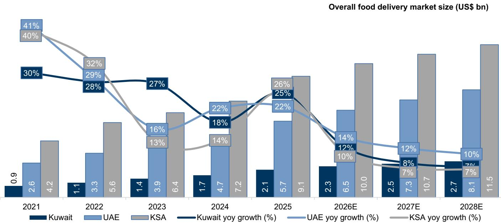  
Source: Euromonitor

Exhibit 2: Keeta has aggressively picked up market share in KSA since its launch in 2024...  
MAU comparison across food delivery players in KSA  
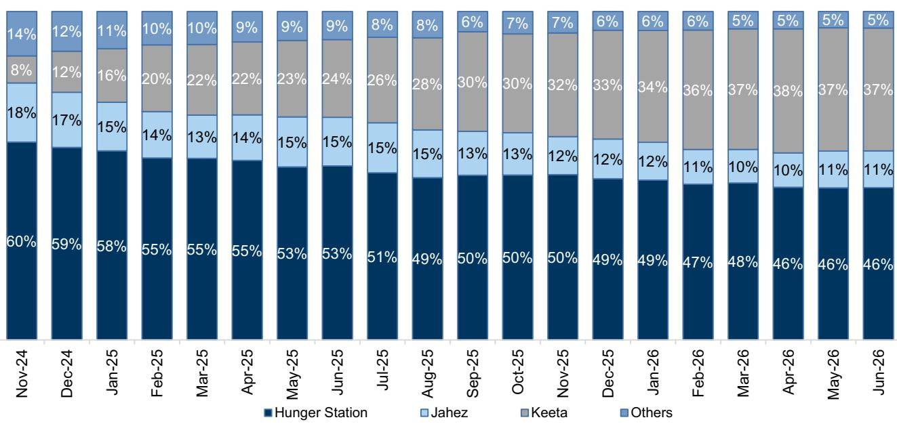  
Source: Sensor Tower

Exhibit 3: ...and it has gained c.1/3rd market share in Kuwait  
MAU comparison across food delivery players in Kuwait  
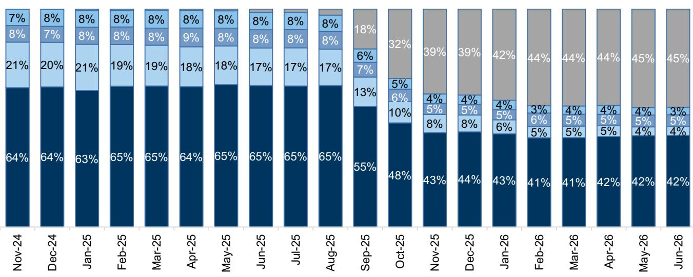  
■ Talabat □ Jahez □ Careem □ Deliveroo □ Keeta  
Source: Sensor Tower

Exhibit 4: Keeta's market share gains in the UAE have been limited as the market is consolidated with strong incumbents...

MAU comparison across food delivery players in UAE  
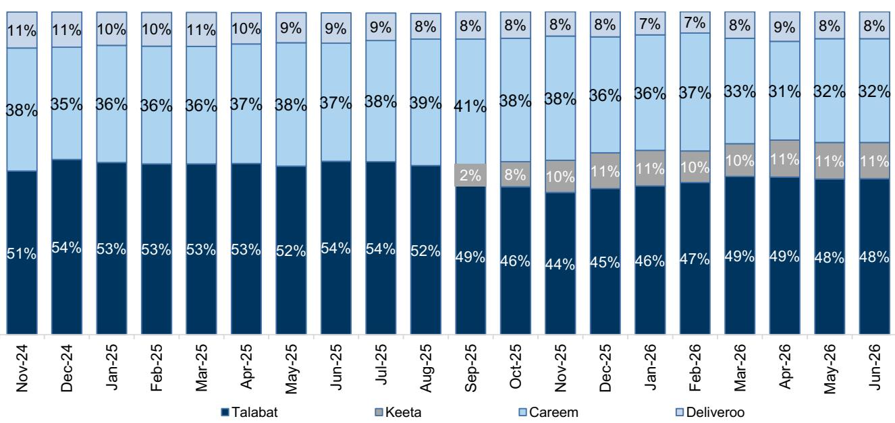  
Source: Sensor Tower

Exhibit 5: ...whereas share has stabilized at mid-teen levels in Qatar  
MAU comparison across food delivery players in Qatar  
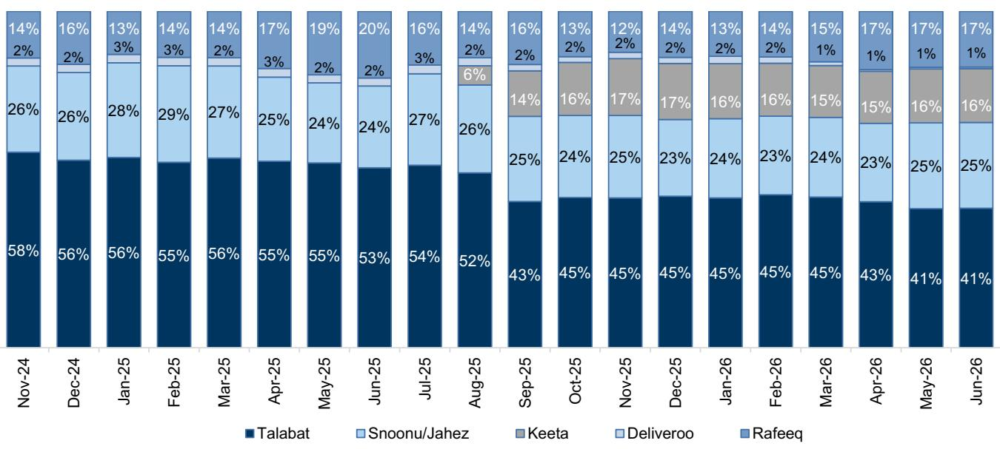  
Source: Sensor Tower

Unit-economics for incumbents are deteriorating as Keeta continues to expand in GCC. Keeta's entry in GCC has shifted competition away from quality (selection, service and value) to promotions (including aggressive discounts, free delivery) which has impacted the unit-economics in the food delivery segment. As a result, food delivery incumbents have seen significant margin compression and cash burn. We expect these pressures to prevail in the near term as Keeta remains focused on market-share expansion through aggressive promotions. While Keeta has recently discontinued discount vouchers and introduced delivery fees in some markets (subject to order value thresholds), it continues to invest heavily in marketing (to create awareness) and customer incentives (to provide value to customers) which, in our view, will remain a key overhang on industry profitability.

Exhibit 6: Jahez KSA: Sharp decline in Adj. EBITDA contribution reflects weaker unit-economics
KSA delivery platform unit economics per order

<table><tr><td>KSA (SR)</td><td>FY24</td><td>FY25</td><td>yoy %</td><td>1Q25</td><td>1Q26</td><td>yoy %</td></tr><tr><td>Net Revenue</td><td>21.2</td><td>19.9</td><td>-6.1%</td><td>19.8</td><td>19.4</td><td>-2.0%</td></tr><tr><td>Cost of Revenue</td><td>-15.4</td><td>-14.7</td><td>-4.5%</td><td>-14.9</td><td>-14.3</td><td>-4.0%</td></tr><tr><td>Margin Contribution</td><td>5.8</td><td>5.1</td><td>-12.1%</td><td>4.9</td><td>5.1</td><td>4.1%</td></tr><tr><td>Operating Costs</td><td>-2.6</td><td>-2.8</td><td>7.7%</td><td>-2.6</td><td>-3.7</td><td>42.3%</td></tr><tr><td>Adj. EBITDA</td><td>3.2</td><td>2.4</td><td>-25.0%</td><td>2.4</td><td>1.5</td><td>-37.5%</td></tr></table>

Source: Company data, GS Global Investment Research  
Exhibit 7: Jahez's GMV in KSA has been declining since 3Q25...  
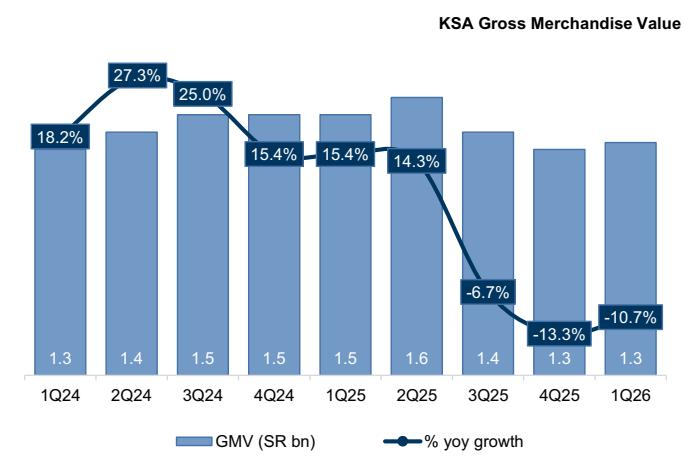  
Source: Company data, GS Global Investment Research  
Group EBITDA and Clean NI margins

Exhibit 8: Likewise, gross revenue in KSA has shown negative yoy growth for the last three quarters...  
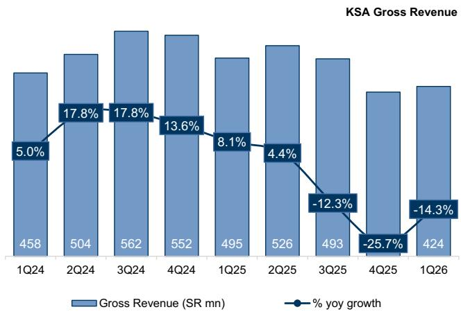  
Source: Company data, GS Global Investment Research  
Exhibit 9: Jahez Group EBITDA and clean net income margins remain under pressure due to competition GS calculated clean EBITDA

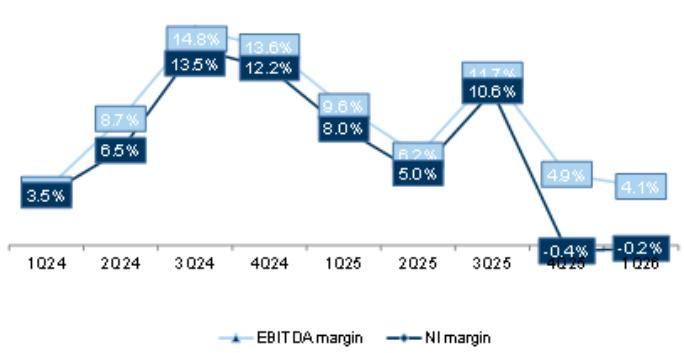  
Source: Company data, GS Global Investment Research

Exhibit 10: FCF margin increased to c.15% in 1Q26  
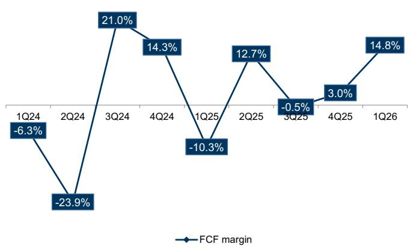  
Source: Company data, GS Global Investment Research  
Exhibit 12: Talabat's GMV has remained healthy but it is early to assess the impact of Keeta, which only started operations in its markets towards 4Q25...
Talabat  
Talabat Gross Merchandise Value

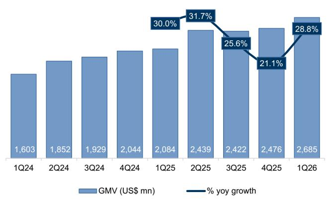  
Source: Company data, GS Global Investment Research

Exhibit 11: 2026 Guidance including Snoonu (acquisition in 2H25) indicates pressure in core/KSA operations
Jahez

<table><tr><td>Jahez</td><td>FY25(A)</td><td>FY25 Pro-forma with Snoonu</td><td>Management Guidance for FY26</td></tr><tr><td>GOV (SR bn)</td><td>9.3</td><td>11.2</td><td>SR 12.2-13.0bn</td></tr><tr><td>GMV (SR bn)</td><td>7.2</td><td>9.0</td><td>SR10.1-10.8bn</td></tr><tr><td>Net Revenue (SR bn)</td><td>2.3</td><td>2.9</td><td>SR 3.1-3.5bn</td></tr><tr><td>Adj. EBITDA (SR mn)</td><td>193</td><td>237</td><td>SR 200-220mn</td></tr><tr><td>Adj. EBITDA margin (% of GMV)</td><td>2.7%</td><td>2.6%</td><td></td></tr></table>

Source: Company data, GS Global Investment Research

Exhibit 13: And likewise revenue growth has remained healthy but is decelerating QoQ...
Talabat  
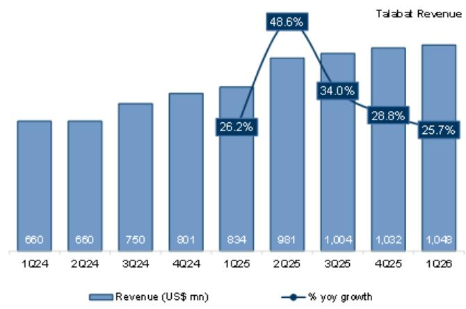  
Source: Company data, GS Global Investment Research

Exhibit 14: Talabat's EBITDA and clean net margins have come under pressure in 1Q26 Talabat  
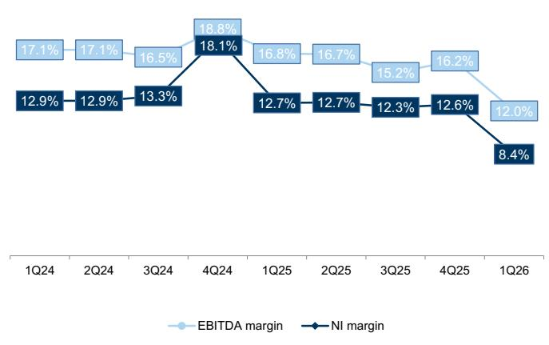  
Source: Company data, GS Global Investment Research

Exhibit 15: FCF margin decreased to 11.5% in 1Q26 Talabat  
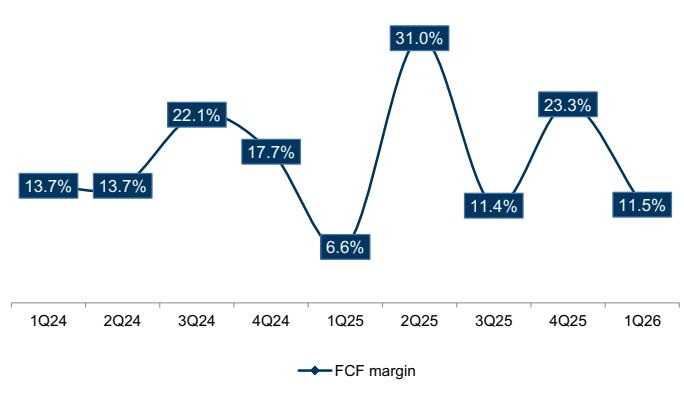  
Source: Company data, GS Global Investment Research

Exhibit 16: 2026 guidance is materially below MT guidance provided at the IPO
Talabat

<table><tr><td>FY26 | US$mn</td><td>MT guidance at time of IPO</td><td>2026 guidance at 4Q25</td><td></td></tr><tr><td>GMV growth</td><td>14%-15%</td><td>11%-14%</td><td>↓</td></tr><tr><td>Revenue Growth</td><td>15%-17%</td><td>14%-17%</td><td>↓</td></tr><tr><td>Adjusted EBITDA</td><td></td><td>510-540</td><td></td></tr><tr><td>Adjusted EBITDA (margin, % of GMV)</td><td>7%-8%</td><td>4.4%-4.8%</td><td>↓</td></tr><tr><td>Net income (Reported)</td><td></td><td>300-330</td><td></td></tr><tr><td>Net income (margin, % of GMV)</td><td>5%-6%</td><td>2.6%-2.9%</td><td>↓</td></tr><tr><td>Adjusted FCF</td><td></td><td>370-400</td><td></td></tr><tr><td>Adjusted FCF (margin, % of GMV)</td><td>6%-6.5%</td><td>3.2%-3.6%</td><td>↓</td></tr><tr><td>Dividends</td><td>90% payout</td><td>270-297</td><td>≈(payout ratio)</td></tr></table>

Source: Company data, GS Global Investment Research

## Accelerating quick-commerce to build scale in multi-vertical eco-systems; adds pressure on margin and FCF

To defend market share, incumbents such as Talabat and Jahez are accelerating investment in quick commerce (especially grocery and retail) to build multi-vertical ecosystems that drive customer loyalty, reduce churn, capture a higher share of the customer basket and optimise logistics networks. Early entry and scale can support higher AOVs and greater store throughput, both of which are important drivers of margin in these verticals. While q-commerce remains significantly underpenetrated across the region at low single digits with prospects for a mid-teens growth outlook, profitability is structurally lower than in food delivery given the inherently low-margin nature of grocery retail. In addition, the business is more asset-intensive, requiring investment in dark stores and inventory, which weighs on cash flow generation and profitability.

Exhibit 17: Online grocery retail in KSA and UAE is expected to grow at a CAGR of c.17% and c.15%, respectively, over 2025-28E...  
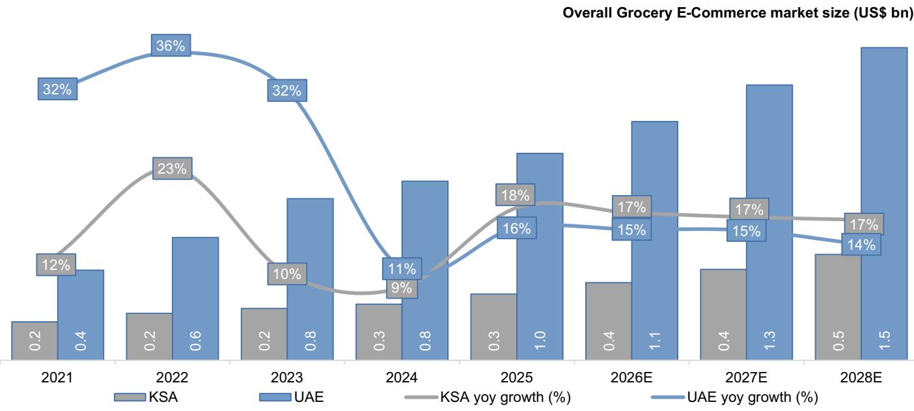  
Source: Euromonitor

Exhibit 18: ...with online grocery penetration increasing to c.6.4% for UAE and 1.1% for KSA by 2028E

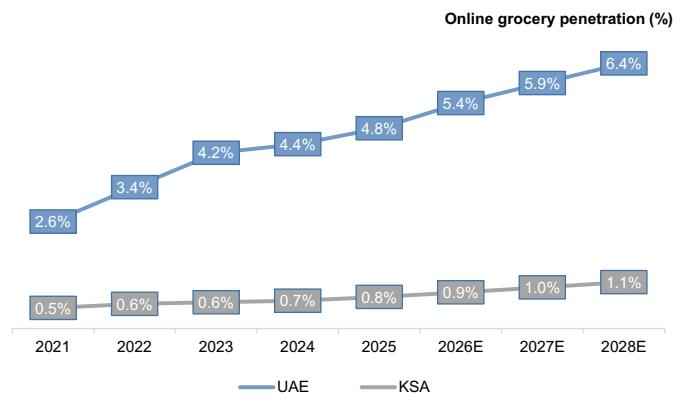  
Source: Euromonitor

Exhibit 19: EBITDA margins are higher for Restaurant players vs Grocery retailers in GCC...
Median EBITDA margin (%)  
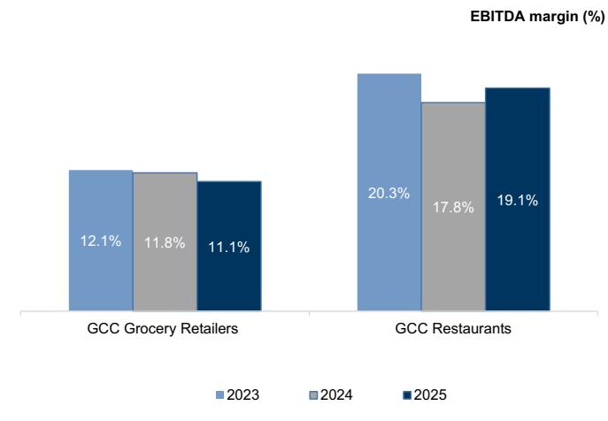  
Source: Company data, GS Global Investment Research, LSEG Data & Analytics

Exhibit 20: Likewise, we note higher median margins for EM Restaurants...
Median EBITDA margin (%)  
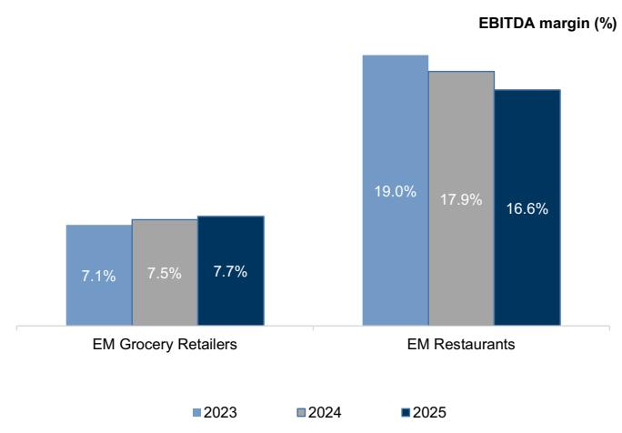  
Source: Company data, GS Global Investment Research, LSEG Data & Analytics

Exhibit 21: We note the same for DM restaurants Median EBITDA margin (%)  
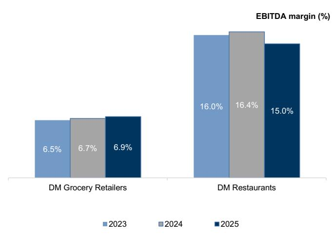  
Source: Company data, GS Global Investment Research, LSEG Data & Analytics

Exhibit 22: We note the quick commerce segment for Zomato in India has healthy growth but negative EBITDA margins...

Zomato Quick Commerce Adjusted Revenue (INR bn) and Adjusted EBITDA margins (calendar quarters)

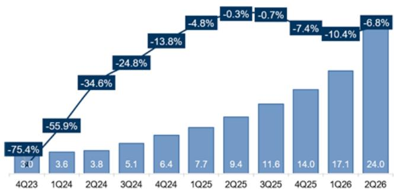  
We've calendarized the quarters to match Dec 31  
Source: Company data  
Exhibit 23: ... and likewise for Swiggy in India  
Swiggy Quick Commerce Adjusted Revenue (INR bn) and Adjusted EBITDA margins (calendar quarters)

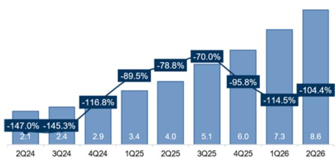  
We've calendarized the quarters to match Dec 31  
Source: Company data  
Exhibit 24: Even Meituan has recorded negative operating margins in the quick commerce segment  
Meituan Instashopping Revenue (RMB bn) and Operating profit margins

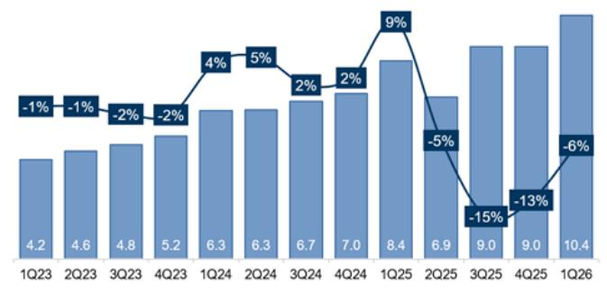  
Source: Company data  
Exhibit 25: Delivery Hero's integrated vertical (largely quick commerce) at a group level achieved break even in 2025  
Delivery Hero Integrated Verticals Revenue (Euro mn) and Adjusted EBITDA margins

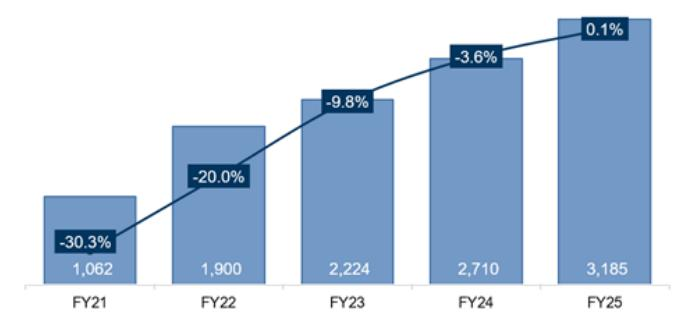  
Source: Company data  
Exhibit 26: Instacart has been profitable but net margins have remained volatile  
Instacart Revenue (USD mn) and Net profit margins

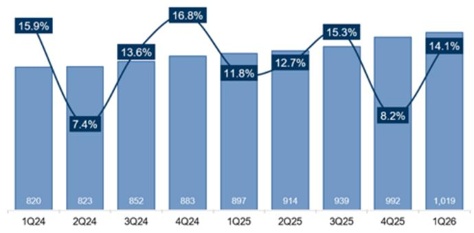  
Source: Company data

## Industry consolidation expectations building, but we believe Keeta's strategy will shape sector profitability

We have started seeing consolidation in the industry, with Jahez acquiring Snoonu (in Qatar) in 2025 and announcing a strategic partnership with Noon (in Saudi) in 1Q26. In late May, Uber (which increased its stake in Careem in June 2026 to c.63%, the No.2/3 player in food delivery across Talabat's core markets) expressed interest to acquire Delivery Hero (Talabat's largest shareholder with an 80% stake). Following this news, there have also been reports of DoorDash exploring Delivery Hero's Middle East operations, while Saudi start-up Ninja is also reported to have shown interest in Delivery Hero's Saudi operations and certain Talabat operations. The share prices of both Jahez and Talabat reacted positively to these developments, reflecting market expectations that consolidation could reduce competition intensity and ease pressure on profitability. While consolidation would be driven by acquirers' strategic ambitions to expand their Middle East presence and capture synergies (for example, in Uber's case), in our view the sector's profitability outlook will continue to be challenged by Keeta's aggressive expansion plans across GCC markets. Until that dynamic changes, competitive pressures are likely to weigh on profitability.

Keeta in Hong Kong: When entering the GCC, Keeta drew from its experience in Hong Kong, its first international market. There, the company quickly established itself as the second-largest player following its launch in May 2023. With its strategy of growth-before-profit and investment by parent Meituan, Keeta launched aggressive pricing promotions and offered high salaries to drivers, which enabled it to capture a 43% share of the order market within its first year of operations, making it the largest food delivery company by order volume and the second-largest by GMV (32%). Due to aggressive competition, Hong Kong is now a two-player market between Keeta and FoodPanda (owned by Delivery Hero) following the exit of Deliveroo in 2025. However, we note that after gaining the scale and market share, Keeta has begun to evolve its strategy. While customer acquisition remains supported by promotional activity, the company appears to have shifted its focus from aggressive price competition toward building a more sustainable ecosystem, culminating in its first reported profit in October 2025.

Keeta in KSA: Keeta's second international expansion was in Saudi Arabia in September 2024, mainly through tier-2 cities, while expanding into tier 1 cities in 1Q25. Similar to Hong Kong, it started with an aggressive pricing strategy — SR 100 voucher for customers on first order (to be used over the next few orders), free delivery, 30-minute delivery guarantees and exclusivity with restaurants. According to Google Trends data, Keeta has a $c.37\%$ market share in Saudi Arabia. While Keeta has pulled back some of its early promotions and introduced delivery fees, it remains aggressive on pricing and marketing spend. Although Keeta has acquired a $c.37\%$ MAU market share, we believe its GMV market share is still in mid- $20\%$ given lower AOV, higher discounts and its initial target customer base which is less affluent. As a result, we believe Keeta is likely to maintain elevated promotional intensity as it seeks to further expand its GMV market share. Consistent with its Hong Kong playbook, we would expect competitive pressures to remain elevated until the company achieves a more substantial position in the market.

Exhibit 27: Keeta aggressively took market share in Hong Kong post its launch in May 2023, driven by significant promotional activity  
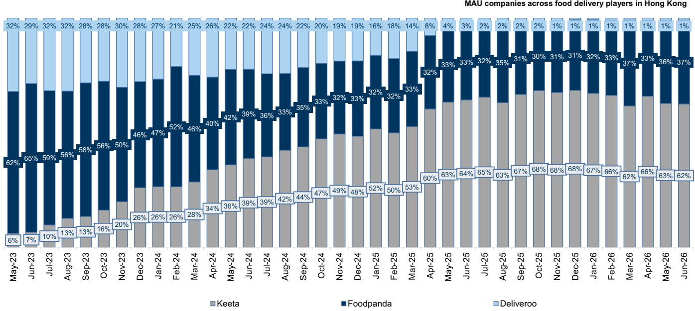  
Source: Sensor tower

Exhibit 28: In all regions, Keeta has rapidly taken market share within the first few months post its launch, supported by aggressive promotions and pricing  
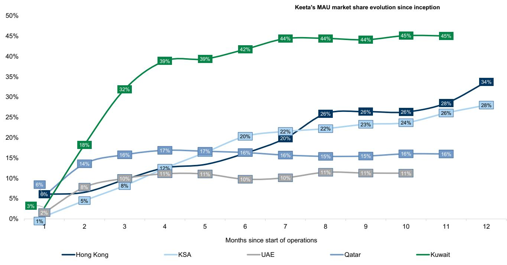  
Source: Sensor tower

## Talabat: Competition and shift to q-commerce outweigh benefits of potential consolidation; down to Sell

Stock has outperformed on growing expectations of industry consolidation
Talabat's stock has outperformed the broader market over the last month, driven by expectations of industry consolidation following news that Uber (which increased its stake to c.63% in Careem in June 2026, the No.2/3 player in food delivery across Talabat's core markets) was interested in acquiring Delivery Hero (Talabat's largest shareholder with an 80% stake). Following this news, there have also been reports of DoorDash exploring Delivery Hero's Middle East operations, while Saudi start-up Ninja is also reported to have shown interest in Delivery Hero's Saudi operations and some operations of Talabat. Against this backdrop, Talabat's shares have rallied approximately 80% from their March 2026 lows, reached during the US-Iran conflict, and are up 46% since mid-May, when reports of Uber's interest in Delivery Hero first emerged.

Exhibit 29: Talabat is up c.80% since the March low reached during the Middle East conflict, outperforming a flat broader market  
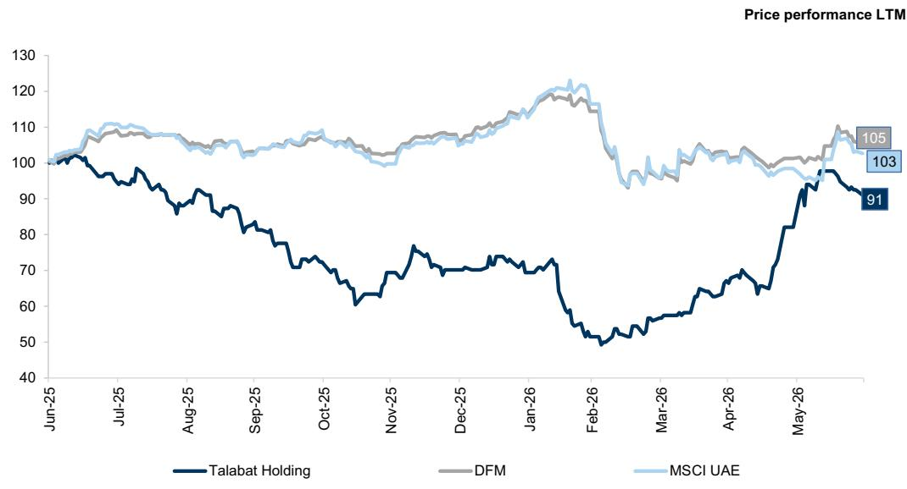  
Source: LSEG Data & Analytics

## Competition and mix shift towards q-commerce to weigh on earnings

We believe the underlying food delivery market will remain competitive as Keeta continues to focus on market share gains through aggressive pricing and promotions, which we expect to weigh on margins. Unlike in Hong Kong and Saudi, where Keeta rapidly established itself as the No.2 player within its first year of operations, its expansion across Talabat's market has been mixed (capturing a one-third market share in Kuwait to achieve the No.2 position player but remaining $< 20\%$ market share in UAE and Qatar). In our view, this is likely to incentivize continued aggressive competition as Keeta seeks to strengthen its position in other GCC markets.

At the same time, we believe Talabat's shift towards q-commerce will support top-line growth but at lower margins (structurally lower-margin business, increased opex to build-out the q-commerce vertical, increased investments in dark stores), implying EBITDA growth below historical average levels.

Exhibit 30: Google Trends data suggests that Talabat's market share has declined across its GCC markets Google Trends data  
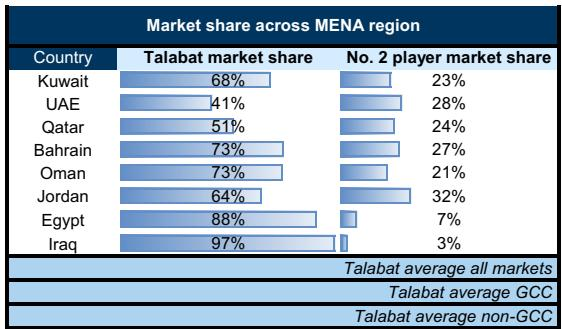  
Source: Google Trends

<table><tr><td colspan="7">Talabat market share evolution</td></tr><tr><td>2020</td><td>2021</td><td>2022</td><td>2023</td><td>2024</td><td>2025</td><td>2026 YTD</td></tr><tr><td>92%</td><td>82%</td><td>82%</td><td>80%</td><td>75%</td><td>70%</td><td>68%</td></tr><tr><td>57%</td><td>57%</td><td>56%</td><td>53%</td><td>49%</td><td>42%</td><td>41%</td></tr><tr><td>93%</td><td>84%</td><td>77%</td><td>67%</td><td>57%</td><td>59%</td><td>51%</td></tr><tr><td>99%</td><td>85%</td><td>90%</td><td>78%</td><td>70%</td><td>71%</td><td>73%</td></tr><tr><td>92%</td><td>93%</td><td>93%</td><td>89%</td><td>89%</td><td>84%</td><td>73%</td></tr><tr><td>67%</td><td>68%</td><td>70%</td><td>65%</td><td>63%</td><td>65%</td><td>64%</td></tr><tr><td>70%</td><td>68%</td><td>67%</td><td>76%</td><td>87%</td><td>90%</td><td>88%</td></tr><tr><td>nm</td><td>100%</td><td>97%</td><td>100%</td><td>98%</td><td>100%</td><td>97%</td></tr><tr><td>81%</td><td>77%</td><td>77%</td><td>72%</td><td>70%</td><td>69%</td><td>66%</td></tr><tr><td>86%</td><td>80%</td><td>80%</td><td>73%</td><td>68%</td><td>65%</td><td>61%</td></tr><tr><td>nm</td><td>79%</td><td>78%</td><td>80%</td><td>83%</td><td>85%</td><td>83%</td></tr></table>

Exhibit 31: While our margin estimates were already below management guidance, increased investment in tMart represents a strategic shift that has led to further downward revisions to our forecasts
EBITDA margins  
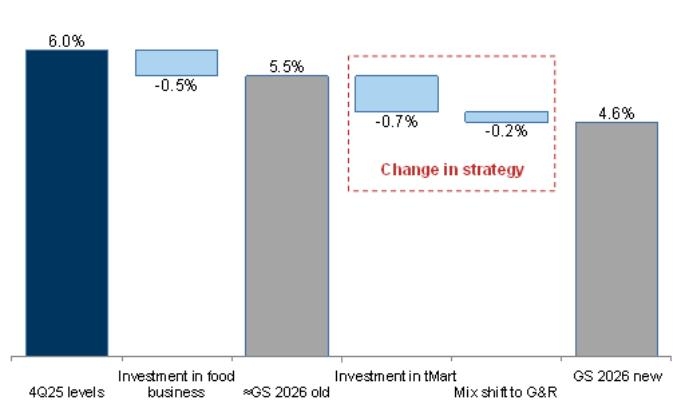  
Source: Company data, GS Global Investment Research

Exhibit 32: We see Talabat's EBITDA growth slowing vs. revenue growth....  
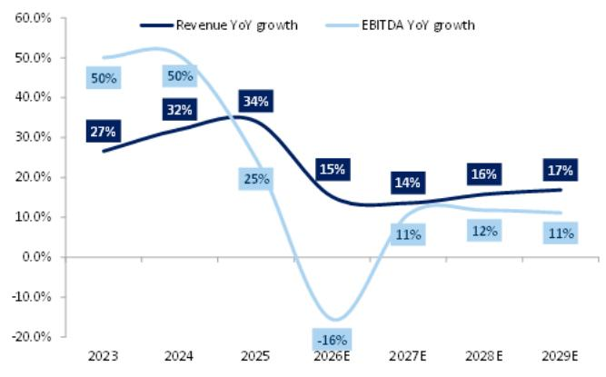  
Source: Company data, GS Global Investment Research

Exhibit 33: ....due to declining margins on account of competition in food delivery and shift to G&R  
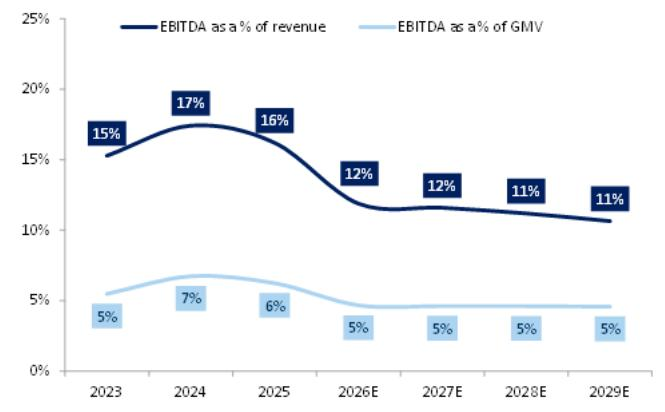  
Source: Company data, GS Global Investment Research

Exhibit 34: We expect margins to remain low single digit owing to the shift in revenue mix towards grocery and retail  
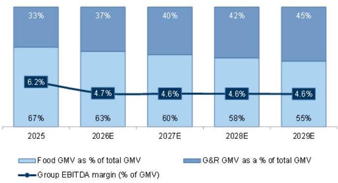  
G&R is grocery and retail

Source: Company data, GS Global Investment Research

## We now include an M&A premium in our valuation methodology

We update our valuation methodology to incorporate an M&A component to capture the potential for the shares to trade higher on consolidation expectations. Across our global coverage, we examine stocks using an M&A framework, considering both qualitative factors and quantitative factors (which may vary across sectors and regions) to incorporate the potential that certain companies could be acquired. We then assign an M&A rank as a means of scoring companies under our rated coverage from 1 to 3, with 1 representing high (30%-50%) probability of the company becoming an acquisition target, 2 representing medium (15%-30%) probability and 3 representing low (0%-15%) probability. For companies ranked 1 or 2, in line with our standard departmental guidelines, we incorporate an M&A component into our target price. An M&A rank of 3 is considered immaterial and therefore does not factor into our price target and may or may not be discussed in research. For companies with an M&A rank of 1, we weight our M&A valuation at 30% in our price target, while for companies with a rank of 2, we weight this component at 15%. In this context, we have increased Talabat's M&A ranking to 2, and weigh our M&A value at 15% within our price target methodology.

## Valuation framework: 15% weight to our M&A-based valuation and 85% to our EV/EBITDA vs. EBITDA growth metric

To derive our M&A valuation for Talabat, we look at past M&A transactions within online food delivery space globally since 2020 and use a 16.0x EV/EBITDA multiple. We observe a strong relationship between transaction multiples and revenue growth across historical M&A transactions in the online food delivery sector. We use this relationship to derive our M&A target multiple for Talabat based on its 2027 revenue growth, while applying a discount to reflect differences in the current operating environment, including (i) slower growth in Talabat's online food delivery business (which we now expect at high-single digit), (ii) more modest EBITDA growth driven by increased competition and (iii) higher capex intensity and operating risk from the ongoing shift toward q-commerce.

Exhibit 35: Historical M&A transactions since 2020  
Transaction multiples refer to FY1 Consensus/company announced multiples

<table><tr><td>Year</td><td>Acquirer</td><td>Target</td><td>TTM EV ($)</td><td>EV/EBITDA</td><td>EV/Revenue</td><td>EV/GMV</td><td>Revenue growth</td></tr><tr><td>2020</td><td>Takeaway.com</td><td>JE</td><td>7.8</td><td>30.7x</td><td>8.0x</td><td>1.2x</td><td>28.0%</td></tr><tr><td>2020</td><td>Uber</td><td>Postmates</td><td>2.7</td><td>NA</td><td>5.3x</td><td>1.0x</td><td></td></tr><tr><td>2020</td><td>JET</td><td>Grubhub</td><td>7.3</td><td>39.2x</td><td>5.6x</td><td>1.2x</td><td>39.0%</td></tr><tr><td>2021</td><td>DH</td><td>Woowa Brothers</td><td>6.8</td><td>nm</td><td>6.2x</td><td>0.5x</td><td></td></tr><tr><td>2022</td><td>DH</td><td>Glovo</td><td>2.6</td><td>NA</td><td>4.0x</td><td>0.8x</td><td></td></tr><tr><td>2022</td><td>DoorDash</td><td>Wolt</td><td>3.5</td><td>NA</td><td>14.6x</td><td>1.3x</td><td></td></tr><tr><td>2022</td><td>Prosus</td><td>iFood</td><td>4.5</td><td>NA</td><td>4.5x</td><td>0.7x</td><td></td></tr><tr><td>2025</td><td>Uber Eats</td><td>Trendyol</td><td>0.8</td><td>NA</td><td>NA</td><td>0.4x</td><td></td></tr><tr><td>2025</td><td>Wonder Group</td><td>Grubhub</td><td>0.7</td><td>6.4x</td><td>0.3x</td><td>0.1x</td><td>1.3%</td></tr><tr><td>2025</td><td>Prosus</td><td>JET</td><td>4.7</td><td>14.7x</td><td>0.9x</td><td>0.2x</td><td>8.4%</td></tr><tr><td>2025</td><td>DoorDash</td><td>Deliveroo</td><td>3.2</td><td>17.1x</td><td>1.2x</td><td>0.3x</td><td>9.0%</td></tr><tr><td>2025</td><td>Jahez</
