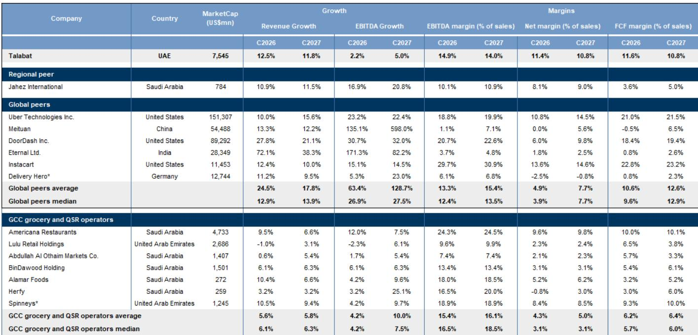
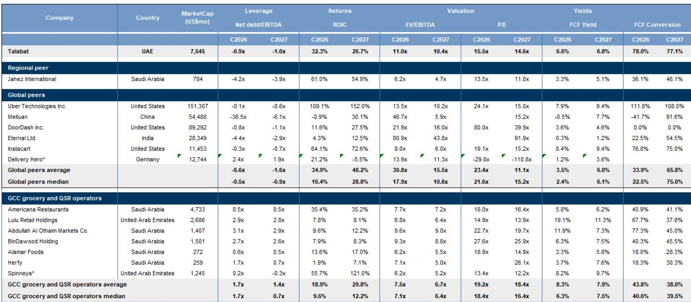

# Keeta’s Expansion Has Fundamentally Shifted the GCC Food Delivery Landscape, and Consolidation Alone May Not Restore Balance

The GCC online food delivery market is experiencing a paradox that observers must confront directly: the industry is growing at roughly 20 percent per year, yet the core players are seeing changes in their profitability. This is not a temporary disruption. It is a structural shift in competitive dynamics that consolidation, no matter how large the acquirer, is unlikely to reverse. The controlling idea of this analysis is straightforward: the entry of Keeta into the GCC has permanently altered the basis of competition from quality and service to price subsidies, and the resulting changes in unit economics will persist regardless of who owns which platform.

The conventional narrative among market participants is that consolidation will bring rationality. When Uber expressed interest in acquiring Delivery Hero, and when DoorDash and Saudi start-up Ninja were reported to be exploring similar moves, share prices of Talabat and Jahez rose sharply. The logic seems intuitive: fewer players means less discounting, higher margins, and a return to the pre-Keeta equilibrium. This interpretation, however, misunderstands the nature of the competitive threat. Keeta is not a rational actor in the traditional sense. It is a platform backed by one of the world's largest technology conglomerates, pursuing a strategy of growth-before-profit that has already been validated in Hong Kong. Until Keeta's own strategic calculus changes, industry profitability will remain under observation.

The second-order implications are equally important. Incumbents are responding to market share erosion by pivoting aggressively into quick commerce, particularly grocery and retail. This diversification strategy makes intuitive sense: build multi-vertical ecosystems to capture a larger share of the consumer wallet. But quick commerce is structurally lower-margin and more capital-intensive than food delivery. The shift in business mix, therefore, is not a solution to the margin question. It is a new source of margin dilution. Those betting on a recovery in platform profitability must grapple with the reality that the earnings composition of these companies is moving toward lower-quality revenue streams.

This article is structured to first explain why Keeta's entry has shifted the competitive equilibrium, then examine why the quick commerce pivot is a double-edged sword, and finally assess why consolidation expectations are likely overstated. One section will identify what the current research does not fully answer, and another will translate these insights into a decision framework for observers.

## Keeta Has Shifted Competition from Quality to Subsidy, and Unit Economics Have Changed as a Result

The most important change in the GCC food delivery market over the past two years is not the growth in total addressable market, but the change in how platforms compete for that market. Before Keeta's entry, competition was primarily based on quality dimensions: restaurant selection, delivery reliability, customer service, and value-for-money. These are factors that allow platforms to differentiate and earn reasonable margins. Keeta changed this by entering with aggressive promotions, deep discounts, and free delivery, effectively forcing the entire industry to compete on price.

The data shows this clearly. In Saudi Arabia and Kuwait, Keeta now commands approximately one-third of the market and has become the second-largest player. In the UAE and Qatar, it has rapidly emerged as a fast-growing number three. The mechanism is straightforward: Keeta uses its parent company's financial resources to subsidize consumer prices, driving order volumes at the expense of profitability. Incumbents are forced to match these subsidies to defend market share, which compresses their own margins.

The result is that unit economics have changed across the board. Gross revenue per order has declined, contribution margins have shrunk, and adjusted EBITDA per order has fallen sharply. This is not a cyclical downturn. It is a structural change in the competitive landscape. Keeta has demonstrated that it is willing to sustain losses for market share, and there is no evidence that it will change this strategy in the near term. Even if Keeta has recently discontinued some discount vouchers and introduced delivery fees in certain markets, it continues to invest heavily in marketing and customer incentives. The implication for observers is clear: the era of high-margin food delivery in the GCC is over for the foreseeable future.

## The Quick Commerce Pivot Diversifies Revenue but Dilutes Margins and Increases Capital Intensity

Faced with changing profitability in food delivery, incumbents are accelerating their investments in quick commerce, particularly grocery and retail. The strategic logic is understandable. Quick commerce remains significantly underpenetrated in the GCC, with penetration rates in the low single digits and a growth outlook in the mid-teens. Building a presence in this segment allows platforms to reduce customer churn, increase average order values, and capture a larger share of consumer spending. It also allows them to optimize their logistics networks by increasing delivery density and utilization.

However, the structural economics of quick commerce are fundamentally different from food delivery. Grocery retail is inherently a low-margin business. The median EBITDA margins for grocery retailers in the GCC are substantially lower than those for restaurant delivery platforms. Moreover, quick commerce is more capital-intensive. It requires investment in dark stores, inventory management systems, and last-mile delivery infrastructure. This combination of lower margins and higher capital intensity means that as the business mix shifts toward quick commerce, overall returns on capital are likely to change.

The evidence from other markets is instructive. In India, both Zomato and Swiggy have reported negative EBITDA margins in their quick commerce segments despite strong revenue growth. Meituan, the parent company of Keeta, has also recorded negative operating margins in its quick commerce operations. Even Instacart, which has achieved profitability, has experienced volatile net margins. The only major player to have broken even in integrated verticals is Delivery Hero, and that was at the group level after years of investment. The implication is that the quick commerce pivot, while strategically necessary for defending market position, will be a factor in profitability for the foreseeable future.

## Consolidation Expectations Are Overstated Because Keeta's Strategy, Not Market Structure, Determines Profitability

The most significant risk to the bullish consolidation thesis is that it confuses market structure with competitive behavior. The argument that fewer players will lead to more rational pricing assumes that all players are profit-maximizing actors who will respond to reduced competition by raising prices. Keeta, however, is not a profit-maximizing actor in the traditional sense. It is a platform backed by a parent company that has demonstrated a willingness to prioritize market share over profitability for extended periods.

This is not speculation. Keeta's track record in Hong Kong provides a clear precedent. After launching in May 2023, Keeta quickly became the second-largest player and eventually the largest by order volume within its first year. It achieved this through aggressive pricing promotions and high driver subsidies. The result was that Hong Kong became a two-player market between Keeta and FoodPanda, with margins remaining under observation. The consolidation of the Hong Kong market into two players did not lead to a recovery in profitability. It simply meant that two players were now competing on subsidies instead of three.

The same dynamic is playing out in the GCC. Even if Uber acquires Delivery Hero, or if DoorDash enters the market, the competitive pressure from Keeta will remain. Keeta's strategy is not driven by the need to generate returns in the GCC market. It is driven by the parent company's broader strategic objectives, which may include building a global presence, testing operational models, or simply deploying capital. Until Keeta's parent company changes its strategic priorities, the industry's profitability will be constrained by Keeta's willingness to subsidize prices.

## What the Current Research Does Not Fully Answer: The Endgame for Keeta

The most important analytical question that remains unresolved is what Keeta's endgame actually is. The current research documents Keeta's aggressive expansion and its impact on industry profitability, but it does not fully explain what conditions would cause Keeta to shift from a growth-before-profit strategy to a profit-maximizing strategy. This is the critical unknown for observers.

There are several plausible scenarios, but each has different implications. One scenario is that Keeta's parent company is using the GCC as a testing ground for operational models that can be applied in larger markets, and that it will eventually seek to monetize its market position once it achieves dominant scale. Another scenario is that Keeta is pursuing a long-term strategy of building a multi-vertical ecosystem that will generate profits from adjacent services rather than from delivery itself. A third scenario is that Keeta's parent company is simply deploying excess capital and has no specific timeline for profitability.

The current research does not provide a definitive answer to this question, and it is unlikely that any single report could. What it does provide is a framework for monitoring the key indicators: Keeta's promotional intensity, its investment in new verticals, and any changes in its pricing strategy. Those who want to position for the eventual resolution of this dynamic must accept that the timing is uncertain and that the interim period will be characterized by continued margin observation.

## A Decision Framework for Observers: How to Evaluate GCC Food Delivery Platforms

Given the structural changes described above, observers need a clear framework for evaluating GCC food delivery platforms. The traditional approach of valuing these companies based on revenue growth and EBITDA margins is no longer sufficient. The divergence between top-line growth and bottom-line profitability means that observers must look at multiple dimensions simultaneously.

The first dimension is competitive positioning. Observers should assess each platform's market share trajectory in its core food delivery business, its exposure to Keeta's aggressive markets, and its ability to differentiate on dimensions other than price. Platforms with strong restaurant relationships, superior logistics networks, or unique customer propositions are better positioned to navigate the subsidy environment.

The second dimension is business mix. As platforms shift toward quick commerce, observers must evaluate the margin profile and capital intensity of each vertical. A platform that is heavily weighted toward quick commerce will have lower overall margins and higher capital requirements than one that is primarily focused on food delivery. This has implications for free cash flow generation and valuation multiples.

The third dimension is consolidation optionality. While we have argued that consolidation alone will not solve the profitability question, it does create the potential for share price appreciation as acquirers pay premiums for strategic assets. Observers should assess which platforms are most likely to be acquisition targets and what premium they might command. However, they should be careful not to confuse this optionality with fundamental improvement in business quality.

The fourth dimension is valuation methodology. The current research has shifted from using sales growth to EBITDA growth as the basis for valuation, which is appropriate given the divergence between revenue and profitability. Observers should apply a similar discipline, focusing on cash flow generation and return on invested capital rather than on top-line metrics that may be influenced by promotional activity.

## Join the Community to Read the Full Report and Review the Original Charts

The analysis presented here is based on a detailed research report that contains extensive data on market shares, unit economics, and competitive dynamics across the GCC. The full report includes charts showing the evolution of market share in each country, the changes in unit economics for individual platforms, and the margin profiles of quick commerce players globally. It also contains detailed financial forecasts and valuation scenarios for both Talabat and Jahez.

For those who want to understand the full picture, including the specific financial models and the assumptions behind them, the complete report is essential reading. The charts alone provide a level of detail that cannot be captured in a summary analysis. Join the community to read the full report and review the original charts.

*For informational purposes only. Portions may be generated, translated, summarized, or edited with AI assistance based on source materials and may contain omissions or errors. Please verify independently. This is not professional advice.*

For informational purposes only. Portions may be generated, translated, summarized, or edited with AI assistance based on source materials and may contain omissions or errors. Please verify independently. This is not professional advice.

