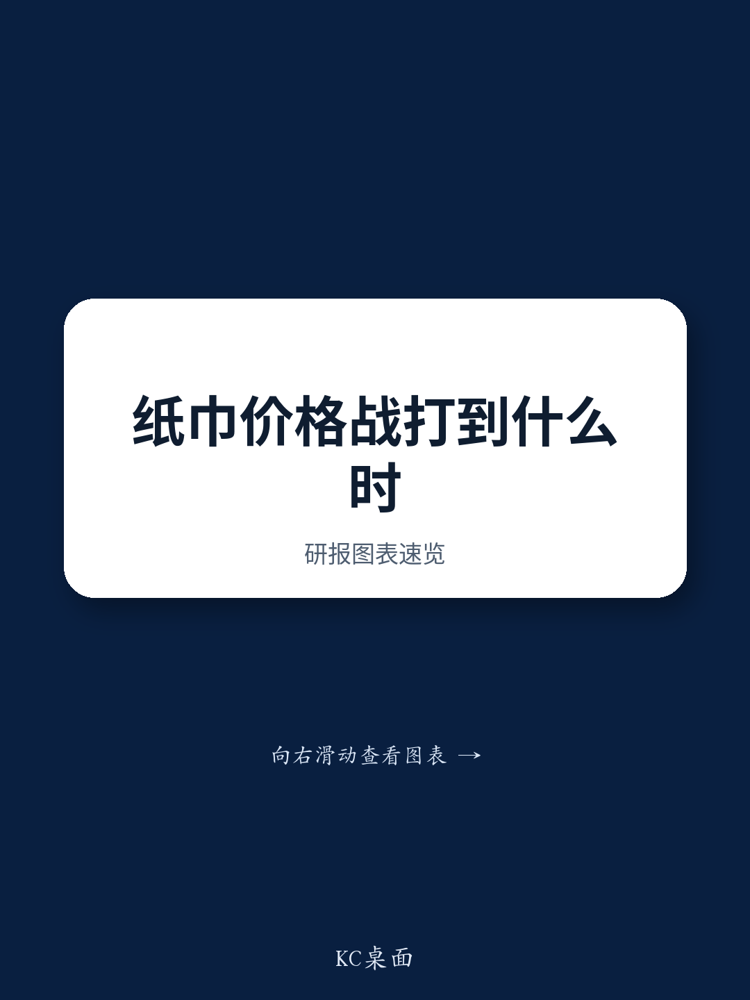

# GS：恒安生活用纸业务观察，年轻化策略能否巩固市场定位

生活用纸和女性护理用品行业的价格竞争，在2026年上半年并未缓和。GS在亚太消费与休闲企业日上听取了恒安国际管理层的最新表态，得到的信息是：竞争强度在二季度明显加剧，公司选择不跟进降价，而是优先保护利润率和品牌定位。

这份报告最值得关注的判断不是恒安短期业绩的走向，而是它在行业“内卷”中做出的战略取舍——放弃销量增长，守住定价权。这个选择在当前市场环境下意味着什么，值得仔细拆解。

## 1. 纸巾销量下滑，但公司主动放弃了价格竞争

恒安纸巾业务在2026年前五个月出现了中到高个位数的同比下滑。管理层明确表示，干纸巾（约占纸巾收入的一半）是最大影响，原因就是价格竞争在二季度显著加剧。公司没有选择跟进降价，而是通过品牌定位和产品差异化来维持增长目标——全年仍希望实现低个位数增长。

湿巾是少数亮点，前五个月增长达到高个位数，且盈利能力更高，但体量尚小。

> **KC评论：** 恒安的选择是典型的“利润优先”策略。在行业价格竞争白热化时，放弃份额保利润，短期会牺牲增速，但长期能否换来品牌溢价，取决于消费者是否愿意为“不降价”买单。报告没有给出消费者反馈数据，这是需要继续跟踪的关键变量。

## 2. 女性护理用品市场格局未改善，恒安押注年轻化和高端化

女性护理用品业务前五个月销售基本持平。管理层承认，行业竞争格局依旧分散且激烈，没有出现结构性的改善。恒安策略仍是聚焦产品品质、高端化和年轻消费者，而不是参与价格竞争。

纸尿裤业务继续承压，下滑幅度同样在高个位数。毛利率方面，女性护理用品和纸尿裤板块整体维持在约60%的水平，相对稳定。

这个细分市场的关键问题是：当行业集中度无法提升时，恒安的高端化策略能否持续支撑定价？报告没有给出市场份额数据，但管理层“领先品牌”的自我定位，仍需要外部数据验证。

## 3. 成本端有不确定性，但公司选择不涨价

成本面，管理层预计上半年纸巾和女性护理用品毛利率同比基本稳定。木浆价格保持平稳，且国内供给增加有望让下半年继续处于有利区间。但石油关联原材料从6月开始出现不确定性，三季度毛利率可能小幅承压。

关键决策是：公司不打算提价。这意味着三季度利润端可能面临双向挤压——成本上升，售价不变，销量还在下滑。

## 4. 报告没有完全回答的两个问题

这份报告透露的信息足够清晰，但有两个关键问题仍然悬而未决。

第一，恒安“保利润”策略的可持续性。如果竞争对手持续降价抢份额，恒安能坚持多久？管理层在成本可控时选择不跟进，但若原材料不确定性在三季度持续，利润空间被压缩后，策略是否会调整？

第二，补贴和汇率这两个外部变量。报告提到前五个月汇兑损失约1亿元人民币，而去年同期是汇兑收益。补贴也预计低于2025年，且趋势可能持续。这两项属于非经营性的影响，但对净利润的影响不可忽视，报告没有量化全年合计影响。

> **KC评论：** 恒安面临的核心矛盾是：行业价格竞争没有缓和迹象，公司选择用利润换品牌定位，但外部成本不确定性和补贴退坡又在挤压利润空间。完整报告里对毛利率季度拆解和竞争格局的细节，值得进一步看。

以上是这份GS研报的核心判断和未解问题。完整报告、中文摘要、KC评论和图表合集，可以放回当天国际主线里继续看，也方便后续追问和横向比较不同消费公司的定价策略。

For informational purposes only. Portions may be generated,translated,summarized,or edited with AI assistance based on source materials and may contain omissions or errors. Please verify independently. This is not investment,legal,tax,accounting,or other professional advice.

For informational purposes only. Portions may be generated,translated,summarized,or edited with AI assistance based on source materials and may contain omissions or errors. Please verify independently. This is not investment,legal,tax,accounting,or other professional advice.

