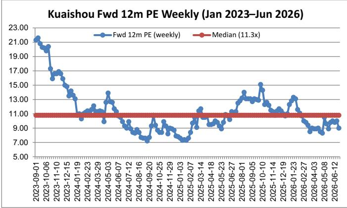
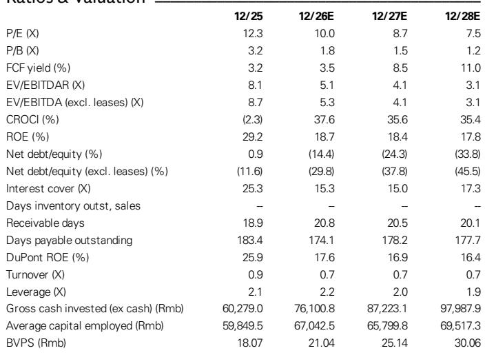
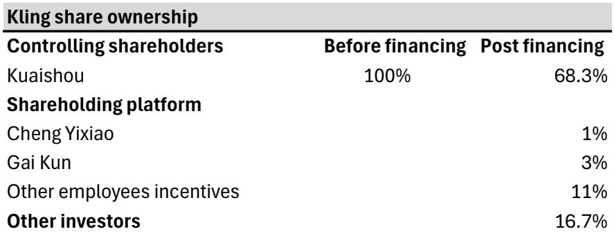

# GS：可灵融资30亿美元，快手AI资产价值开始被定价

快手旗下AI视频生成平台可灵（Kling）的独立融资，可能是今年中国科技公司资产重估中最具信号意义的事件之一。GS在第一时间发布的报告中，将这笔最高30亿美元的融资视为一个转折点——不仅为可灵提供了独立的资本弹药，更重要的是，它为市场建立了一个可验证的估值锚点，让快手的主体业务与AI资产第一次可以被分开定价。

报告的核心判断并不复杂：这轮融资让快手的SOTP（分类加总估值）框架从模糊走向清晰。在可灵以150亿美元投前估值引入外部读者后，快手主体业务隐含的估值被压缩到了一个值得重新审视的区间。

## 1. 30亿美元融资的核心意义不是钱，而是竞争格局的信号

可灵在2025年已实现约11亿元人民币营收，2026年3月ARR（年化经常性收入）达到约5亿美元。这个规模使其跻身全球商业化最成功的AI原生视频应用之列。但报告同时披露，可灵2024年净亏损约5亿元人民币，2025年扩大至19亿元，训练、推理和基础设施投入仍在加速。

GS认为，融资最直接的好处是财务灵活性。但更关键的判断在于：当AI视频生成的竞争从算法创新转向算力资源和生态规模时，能否持续获得资本和人才激励，已经成为核心竞争力的一部分。可灵此次同步推出了覆盖15%股权的员工激励计划，创始人盖坤获得其中最大份额。这组动作表明，快手管理层已经将可灵视为一个需要独立作战的资产，而非集团内部的成本中心。

> **KC评论：** 可灵2025年营收11亿元、ARR在2026年3月达到5亿美元，这两个数字本身已经说明商业化速度。但报告没有展开的一个问题是：ARR从0到5亿美元用了不到两年，这个增速在多大程度上依赖快手原有流量生态的导流？独立融资后，可灵需要证明自己可以脱离快手生态获取企业客户。

## 2. 可灵150亿美元估值，让快手主体业务的定价不再模糊

报告中最值得反复看的一张图，是融资完成后的股权结构：快手持股从100%稀释至68.33%，员工持股平台占15%，外部读者占16.67%。以150亿美元投前估值、180亿美元投后估值计算，快手持有的可灵股权价值约123亿美元。

由此倒推：快手当前市值约232亿美元，减去可灵股权价值后，其主体业务（直播、广告、电商）的隐含市值约为109亿美元。对应2026年净利润预期，这个主体部分的PE倍数约为4倍。

4倍PE对于一家仍能产生正自由现金流、且广告和电商业务仍在增长的平台来说，定价是否合理，是每个读者都需要回答的问题。

，而是一个思考起点。报告没有直接说这个估值低了，但它提供了一个清晰的比较框架——如果你认为快手主体业务值更多，那么可灵的实际价值可能比150亿美元更高；反之亦然。

## 3. 报告尚未完全回答的关键问题：可灵的估值能否在二级市场被持续验证

这轮融资的读者阵容涵盖互联网平台、中国PE和AI产业产品，但GS谨慎地指出，目前没有披露任何具体的战略合作或生态协同安排。外部读者带来的“潜在生态机会”仍停留在假设层面。

更值得追问的是：可灵的150亿美元估值，是基于当前ARR的约30倍PS，还是基于对未来模型能力和应用场景的预期？报告没有给出明确的估值拆分。考虑到可灵目前仍处于亏损扩张阶段，这个估值水平在二级市场能否被接受，取决于接下来几个季度的数据

- 下一轮模型升级的时间和效果（报告提示可能在月内发布）
- 2026年第二季度的ARR趋势
- 是否有进一步分拆或独立上市的计划

这三个变量，将决定可灵从“一级市场定价”到“二级市场定价”的过渡是否顺利。

## 4. 对决策者的观察框架：不再只是看快手，而是看两件事

这笔交易之后，分析快手的方式需要调整。过去市场主要关注其广告收入增速、电商GMV和用户时长，现在需要加入两个新的观察维度

第一，可灵能否在保持增速的同时收窄亏损。报告预计可灵2026年全年营收可达5.76亿美元，但营收增速与亏损拐点之间的关系，将直接影响快手合并报表的利润结构。

第二，快手主体业务的自由现金流能否支撑股东回报与AI投入的双重需求。报告显示，快手2025年资本开支约149亿元，2026年预计升至247亿元。引入外部资本后，快手的现金不确定性有所缓解，但2026年自由现金流预期仅为55亿元，与资本开支之间仍有较大缺口。这意味着，快手需要在提升运营效率、控制AI投入节奏和维持股东回报之间做出权衡。

这些未解问题，恰好也是完整报告中GS用更多图表和假设展开的部分。对于已经建立SOTP框架的读者来说，下一步需要验证的不是估值模型本身，而是可灵的ARR增速能否支撑融资时隐含的增长预期，以及快手主体业务在竞争加剧的环境中能否守住利润底线。

更完整的报告中文摘要、KC评论和关键图表合集，会放进每日国际信源汇编。适合快速扫当天主流叙事，也方便后续追问和横向比较。

For informational purposes only. Portions may be generated,translated,summarized,or edited with AI assistance based on source materials and may contain omissions or errors. Please verify independently. This is not investment,legal,tax,accounting,or other professional advice.

For informational purposes only. Portions may be generated,translated,summarized,or edited with AI assistance based on source materials and may contain omissions or errors. Please verify independently. This is not investment,legal,tax,accounting,or other professional advice.
