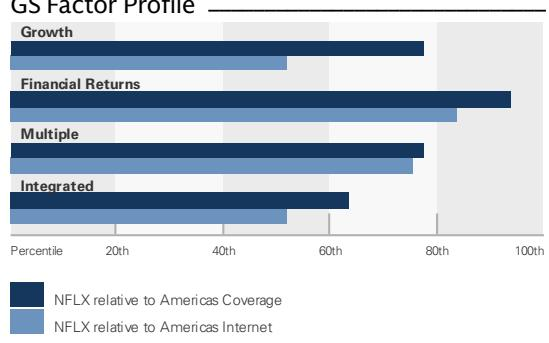
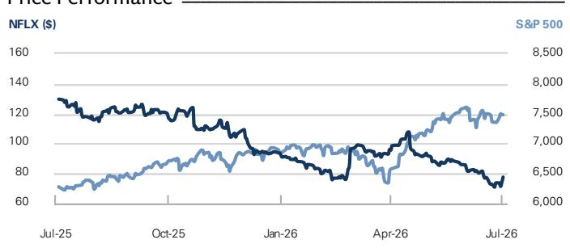
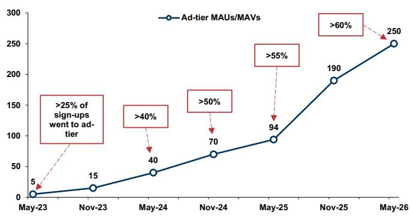
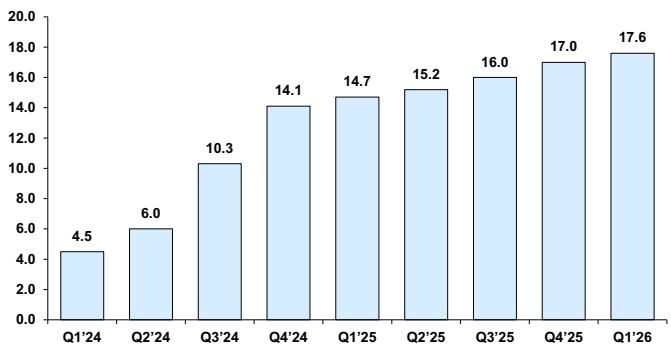
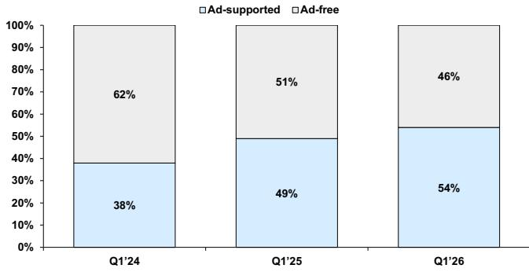
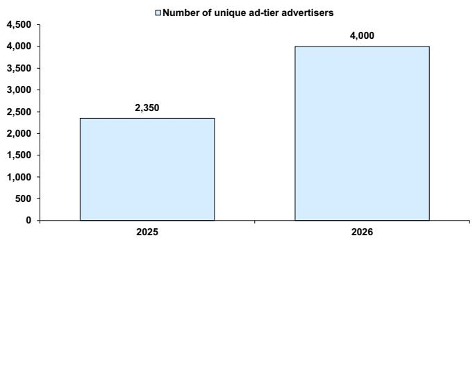

# Netflix Inc. (NFLX)

Q2 2026 业绩前瞻：关键主题与市场讨论框架

NFLX

12个月目标价：\$110.00

当前报价：\$77.65

潜在空间：41.7%

在Q2 2026财报发布前，我们梳理了当前行业数据，并重点分析了第三方数据趋势及NFLX的内容排期。本报告涵盖我们认为读者在Q2'26财报前关注的四个关键主题：

1. 广告业务的当前状态（继5月Netflix广告预售活动之后，链接）——我们认为广告收入正成为总收入中不断增长的组成部分，规模预计从2025年的约15亿美元增长至2027年的约45亿美元，到2030年达到约95亿美元；

2. 直播活动播出策略的演变与影响——我们认为，围绕标志性直播活动的内容与消费趋势正在上升（尽管公司整体的全球努力尚未实现季度间持续稳定的规模化）；直播活动的增加是推动用户增长和广告业务规模化的关键因素；

3. Netflix在竖屏视频领域的机遇——新产品的推出旨在应对年轻用户群体中日益增长的媒体消费习惯变化，并可能推动平台参与度的提升；

4. 公司扩大后的回购授权（及任何进一步潜在空间）的影响——我们更新了基础情景模型，以反映在未来2.5年内大致线性地使用剩余回购授权（约318亿美元），与历史平均约90%年度自由现金流的使用节奏保持一致。

在行业数据方面，我们认为即将发布的财报可能显示用户增长（未报告）和参与度面临来自季节性因素、内容排期以及远离直播活动影响等多方面的综合影响。

## 买入

Eric Sheridan
+1(917)343-8683 | eric.sheridan@gs.com
GS & Co. LLC

Stephen Laszczyk
+1(212)357-9225 | stephen.laszczyk@gs.com
GS & Co. LLC

Antares Tobelem
+1(212)357-2497 | antares.tobelem@gs.com
GS & Co. LLC

## 关键数据

GS预测

<table><tr><td></td><td>12/25</td><td>12/26E</td><td>12/27E</td><td>12/28E</td></tr><tr><td>收入（百万美元）新</td><td>45,183.0</td><td>51,664.2</td><td>58,593.9</td><td>65,816.3</td></tr><tr><td>收入（百万美元）旧</td><td>45,183.0</td><td>51,664.2</td><td>58,593.9</td><td>65,816.3</td></tr><tr><td>EBITDA（百万美元）</td><td>14,647.4</td><td>17,067.2</td><td>20,631.3</td><td>24,563.9</td></tr><tr><td>EBIT（百万美元）</td><td>13,326.6</td><td>16,265.1</td><td>19,744.0</td><td>23,601.6</td></tr><tr><td>每股收益（美元）新</td><td>2.53</td><td>3.60</td><td>3.94</td><td>4.89</td></tr><tr><td>每股收益（美元）旧</td><td>2.53</td><td>3.60</td><td>3.89</td><td>4.74</td></tr><tr><td>市盈率（倍）</td><td>43.4</td><td>21.6</td><td>19.7</td><td>15.9</td></tr><tr><td>股息回报表现（%）</td><td>-</td><td>-</td><td>-</td><td>-</td></tr><tr><td>净债务/EBITDA（倍）</td><td>0.4</td><td>0.3</td><td>0.2</td><td>(0.2)</td></tr><tr><td></td><td>3/26</td><td>6/26E</td><td>9/26E</td><td>12/26E</td></tr><tr><td>每股收益（美元）</td><td>1.23</td><td>0.78</td><td>0.84</td><td>0.75</td></tr></table>

GS因子画像

  
来源：公司数据，GS预测。详情请参阅披露附录。

## Netflix Inc. (NFLX)

评级自2026年4月5日起

比率与估值

<table><tr><td>比率与估值</td><td>12/25</td><td>12/26E</td><td>12/27E</td><td>12/28E</td></tr><tr><td>市盈率（倍）</td><td>43.4</td><td>21.6</td><td>19.7</td><td>15.9</td></tr><tr><td>EV/EBITDA（倍）</td><td>32.2</td><td>19.3</td><td>15.4</td><td>12.2</td></tr><tr><td>EV/销售额（倍）</td><td>10.4</td><td>6.4</td><td>5.4</td><td>4.6</td></tr><tr><td>自由现金流回报表现（%）</td><td>2.0</td><td>4.0</td><td>4.4</td><td>5.7</td></tr><tr><td>EV/DACF（倍）</td><td>41.7</td><td>21.4</td><td>19.9</td><td>15.5</td></tr><tr><td>CROCI（%）</td><td>37.1</td><td>49.7</td><td>47.8</td><td>54.3</td></tr><tr><td>ROE（%）</td><td>42.8</td><td>53.3</td><td>49.2</td><td>48.2</td></tr><tr><td>净债务/EBITDA（倍）</td><td>0.4</td><td>0.3</td><td>0.2</td><td>(0.2)</td></tr><tr><td>净债务/权益（%）</td><td>20.4</td><td>15.2</td><td>9.5</td><td>(10.9)</td></tr><tr><td>利息覆盖倍数（倍）</td><td>17.2</td><td>16.8</td><td>22.7</td><td>29.0</td></tr><tr><td>库存天数</td><td>NM</td><td>NM</td><td>NM</td><td>NM</td></tr><tr><td>应收账款天数</td><td>NM</td><td>NM</td><td>NM</td><td>NM</td></tr><tr><td>应付账款周转天数</td><td>14.1</td><td>13.2</td><td>13.2</td><td>13.5</td></tr></table>

<table><tr><td colspan="5">增长与利润率（%）</td></tr><tr><td></td><td>12/25</td><td>12/26E</td><td>12/27E</td><td>12/28E</td></tr><tr><td>总收入增长</td><td>15.9</td><td>14.3</td><td>13.4</td><td>12.3</td></tr><tr><td>EBITDA增长</td><td>27.1</td><td>22.1</td><td>21.2</td><td>19.3</td></tr><tr><td>每股收益增长</td><td>27.5</td><td>42.4</td><td>9.4</td><td>24.1</td></tr><tr><td>每股股息增长</td><td>NM</td><td>NM</td><td>NM</td><td>NM</td></tr><tr><td>毛利率</td><td>48.5</td><td>50.2</td><td>52.1</td><td>54.0</td></tr><tr><td>EBIT利润率</td><td>29.5</td><td>31.5</td><td>33.7</td><td>35.9</td></tr></table>

价格表现  

<table><tr><td></td><td>3个月</td><td>6个月</td><td>12个月</td></tr><tr><td>相对</td><td>(21.3)%</td><td>(14.7)%</td><td>(39.6)%</td></tr><tr><td>相对标普500</td><td>(30.8)%</td><td>(21.8)%</td><td>(49.7)%</td></tr></table>

来源：FactSet。报价截至2026年7月2日收盘。

利润表（百万美元）

<table><tr><td colspan="5">利润表（百万美元）</td></tr><tr><td></td><td>12/25</td><td>12/26E</td><td>12/27E</td><td>12/28E</td></tr><tr><td>总收入</td><td>45,183.0</td><td>51,664.2</td><td>58,593.9</td><td>65,816.3</td></tr><tr><td>销售成本</td><td>(23,275.3)</td><td>(25,709.6)</td><td>(28,048.9)</td><td>(30,295.0)</td></tr><tr><td>销售、一般及管理费用</td><td>(8,581.1)</td><td>(9,689.5)</td><td>(10,801.0)</td><td>(11,919.7)</td></tr><tr><td>研发费用</td><td>-</td><td>-</td><td>-</td><td>-</td></tr><tr><td>其他营业收支</td><td>-</td><td>-</td><td>-</td><td>-</td></tr><tr><td>EBITDA</td><td>13,660.0</td><td>16,684.2</td><td>20,229.1</td><td>24,141.6</td></tr><tr><td>折旧与摊销</td><td>(333.4)</td><td>(419.1)</td><td>(485.1)</td><td>(539.9)</td></tr><tr><td>EBIT</td><td>13,326.6</td><td>16,265.1</td><td>19,744.0</td><td>23,601.6</td></tr><tr><td>净利息收支</td><td>(776.5)</td><td>(966.6)</td><td>(870.7)</td><td>(812.5)</td></tr><tr><td>联营公司损益</td><td>-</td><td>-</td><td>-</td><td>-</td></tr><tr><td>税前利润</td><td>12,722.6</td><td>18,356.8</td><td>19,091.0</td><td>23,036.3</td></tr><tr><td>所得税拨备</td><td>(1,741.4)</td><td>(3,035.8)</td><td>(2,863.7)</td><td>(3,455.4)</td></tr><tr><td>少数股东权益</td><td>-</td><td>-</td><td>-</td><td>-</td></tr><tr><td>优先股股息</td><td>-</td><td>-</td><td>-</td><td>-</td></tr><tr><td>净利润（扣除非常项目前）</td><td>10,981.2</td><td>15,321.1</td><td>16,227.4</td><td>19,580.8</td></tr><tr><td>净利润（扣除非常项目后）</td><td>10,981.2</td><td>15,321.1</td><td>16,227.4</td><td>19,580.8</td></tr><tr><td>每股收益（基本，扣除非常项目前）（美元）</td><td>2.58</td><td>3.67</td><td>4.01</td><td>4.98</td></tr><tr><td>每股收益（摊薄，扣除非常项目前）（美元）</td><td>2.53</td><td>3.60</td><td>3.94</td><td>4.89</td></tr><tr><td>每股收益（扣除ESO费用，摊薄）（美元）</td><td>--</td><td>--</td><td>--</td><td>--</td></tr><tr><td>每股股息（美元）</td><td>-</td><td>-</td><td>-</td><td>-</td></tr><tr><td>股息支付率（%）</td><td>0.0</td><td>0.0</td><td>0.0</td><td>0.0</td></tr><tr><td>加权平均流通股数（基本）（百万）</td><td>4,249.5</td><td>4,179.8</td><td>4,044.6</td><td>3,930.5</td></tr><tr><td>加权平均流通股数（摊薄）（百万）</td><td>4,343.9</td><td>4,255.4</td><td>4,120.3</td><td>4,006.1</td></tr></table>

<table><tr><td colspan="5">资产负债表（百万美元）</td></tr><tr><td></td><td>12/25</td><td>12/26E</td><td>12/27E</td><td>12/28E</td></tr><tr><td>现金及现金等价物</td><td>9,033.7</td><td>9,654.8</td><td>8,594.6</td><td>15,396.1</td></tr><tr><td>应收账款</td><td>-</td><td>-</td><td>-</td><td>-</td></tr><tr><td>存货</td><td>-</td><td>-</td><td>-</td><td>-</td></tr><tr><td>其他流动资产</td><td>3,986.5</td><td>4,554.6</td><td>5,147.3</td><td>5,777.6</td></tr><tr><td>流动资产合计</td><td>13,020.2</td><td>14,209.4</td><td>13,741.9</td><td>21,173.7</td></tr><tr><td>不动产、厂房及设备净值</td><td>2,004.4</td><td>2,398.4</td><td>2,696.0</td><td>2,954.3</td></tr><tr><td>无形资产净值</td><td>32,778.4</td><td>35,363.6</td><td>38,155.5</td><td>40,927.6</td></tr><tr><td>总投资</td><td>0.0</td><td>0.0</td><td>0.0</td><td>0.0</td></tr><tr><td>其他长期资产</td><td>7,794.1</td><td>9,473.1</td><td>10,713.6</td><td>12,032.9</td></tr><tr><td>资产总计</td><td>55,597.0</td><td>61,444.5</td><td>65,306.9</td><td>77,088.5</td></tr><tr><td>应付账款</td><td>900.6</td><td>958.3</td><td>1,066.2</td><td>1,175.3</td></tr><tr><td>短期债务</td><td>998.9</td><td>-</td><td>-</td><td>-</td></tr><tr><td>流动租赁负债</td><td>460.5</td><td>433.5</td><td>433.5</td><td>433.5</td></tr><tr><td>其他流动负债</td><td>8,621.0</td><td>9,838.9</td><td>11,184.1</td><td>12,614.8</td></tr><tr><td>流动负债合计</td><td>10,980.9</td><td>11,230.7</td><td>12,683.9</td><td>14,223.5</td></tr><tr><td>长期债务</td><td>13,464.0</td><td>14,360.5</td><td>11,942.5</td><td>10,342.5</td></tr><tr><td>非流动租赁负债</td><td>2,052.5</td><td>1,948.2</td><td>1,948.2</td><td>1,948.2</td></tr><tr><td>其他长期负债</td><td>2,484.1</td><td>2,997.8</td><td>3,645.5</td><td>4,334.3</td></tr><tr><td>长期负债合计</td><td>18,000.6</td><td>19,306.5</td><td>17,536.2</td><td>16,625.0</td></tr><tr><td>负债合计</td><td>28,981.5</td><td>30,537.2</td><td>30,220.1</td><td>30,848.6</td></tr><tr><td>优先股</td><td>-</td><td>-</td><td>-</td><td>-</td></tr><tr><td>普通股权益合计</td><td>26,615.5</td><td>30,907.3</td><td>35,086.8</td><td>46,239.9</td></tr><tr><td>少数股东权益</td><td>-</td><td>-</td><td>-</td><td>-</td></tr><tr><td>负债及权益总计</td><td>55,597.0</td><td>61,444.5</td><td>65,306.9</td><td>77,088.5</td></tr><tr><td>每股账面价值（美元）</td><td>6.30</td><td>7.52</td><td>8.81</td><td>11.86</td></tr></table>

<table><tr><td colspan="5">现金流量表（百万美元）</td></tr><tr><td></td><td>12/25</td><td>12/26E</td><td>12/27E</td><td>12/28E</td></tr><tr><td>净利润</td><td>10,981.2</td><td>15,321.1</td><td>16,227.4</td><td>19,580.8</td></tr><tr><td>加回折旧与摊销</td><td>333.4</td><td>419.1</td><td>485.1</td><td>539.9</td></tr><tr><td>加回少数股东权益</td><td>-</td><td>-</td><td>-</td><td>-</td></tr><tr><td>营运资本净变动</td><td>(456.2)</td><td>(752.2)</td><td>(568.9)</td><td>(610.8)</td></tr><tr><td>其他</td><td>(709.1)</td><td>(1,231.5)</td><td>(1,553.1)</td><td>(1,460.2)</td></tr><tr><td>经营活动现金流</td><td>10,149.3</td><td>13,756.4</td><td>14,590.4</td><td>18,049.7</td></tr><tr><td>资本支出</td><td>(688.2)</td><td>(767.3)</td><td>(782.6)</td><td>(798.3)</td></tr><tr><td>收购</td><td>-</td><td>-</td><td>-</td><td>-</td></tr><tr><td>处置</td><td>-</td><td>-</td><td>-</td><td>-</td></tr><tr><td>其他</td><td>1,747.1</td><td>-</td><td>-</td><td>-</td></tr><tr><td>投资活动现金流</td><td>1,041.7</td><td>(1,353.0)</td><td>(782.6)</td><td>(798.3)</td></tr><tr><td>已支付股息</td><td>-</td><td>-</td><td>-</td><td>-</td></tr><tr><td>股份发行/回购</td><td>(8,460.2)</td><td>(11,721.3)</td><td>(12,450.0)</td><td>(8,850.0)</td></tr><tr><td>债务变动</td><td>(1,833.5)</td><td>-</td><td>(2,418.0)</td><td>(1,600.0)</td></tr><tr><td>其他</td><td>383.6</td><td>(51.4)</td><td>-</td><td>-</td></tr><tr><td>融资活动现金流</td><td>(9,962.0)</td><td>(11,782.2)</td><td>(14,868.0)</td><td>(10,450.0)</td></tr><tr><td>现金净变动</td><td>1,228.9</td><td>621.2</td><td>(1,060.2)</td><td>6,801.5</td></tr><tr><td>自由现金流</td><td>9,461.1</td><td>12,989.1</td><td>13,807.8</td><td>17,251.5</td></tr><tr><td>每股自由现金流（基本）（美元）</td><td>2.23</td><td>3.11</td><td>3.41</td><td>4.39</td></tr></table>

来源：公司数据，GS预测。

## 目录

Q2'26财报前关注的主题 5
利用数据分析季度运营表现 15
预测调整、估值与主要风险 26
披露附录 28

## Q2'26财报前关注的主题

我们涵盖读者在Q2'26财报前关注的四个关键主题：1）Netflix预售活动后广告业务的当前状态；2）直播活动播出策略的演变与影响；3）Netflix在竖屏视频领域的机遇；以及4）公司扩大后的回购授权（及任何进一步潜在空间）的影响。

## 构建未来广告增长引擎

我们认为广告收入正成为总收入中不断增长的组成部分，规模预计从2025年的约15亿美元增长至2027年的约45亿美元，到2030年达到约95亿美元。我们认为Netflix在未来几年具备利用多项有利条件的良好定位：(a) 健康的行业背景（全球除中国外，联网电视/流媒体AVOD的5年复合年增长率约为中双位数百分比，并正在获取线性电视广告预算的份额）；(b) 对直播内容/大型“旗舰”活动（NFL、MLB、WWE等）的投入，这有助于提升广告变现能力（下文详述）；以及(c) Netflix广告技术的持续发展（测量/归因、程序化广告购买，包括通过第三方DSP合作伙伴、新广告形式等）。

关于Netflix广告支持用户及参与度、广告套件和内容排期的更多更新，请参阅我们的预售活动要点笔记（首次发布于2026年5月15日）。

图表1：广告支持用户估算（百万）

<table><tr><td></td><td>2024E</td><td>2025E</td><td>2026E</td></tr><tr><td>广告支持MAV总数（年末）</td><td>140.0</td><td>190.0</td><td>280.0</td></tr><tr><td>同比增长率</td><td>204.3%</td><td>35.7%</td><td>47.4%</td></tr><tr><td>每会员户MAV数量</td><td>2.0</td><td>2.0</td><td>2.0</td></tr><tr><td>广告支持MAU总数（年末）</td><td>70.0</td><td>95.0</td><td>140.0</td></tr><tr><td>同比增长率</td><td>204.3%</td><td>35.7%</td><td>47.4%</td></tr><tr><td>每订阅MAU数量</td><td>2.0</td><td>2.0</td><td>2.0</td></tr><tr><td>广告支持订阅用户总数（年末）</td><td>35.0</td><td>47.5</td><td>70.0</td></tr></table>

图表2：Netflix广告支持层级全球MAU/MAV（百万）  
  
2025年末，Netflix将其主要参与度指标从MAU（用户）切换为MAV（观众），以计入同一账户的共同观看者。

图表3：Netflix美国广告支持订阅用户（百万），估算  
  
仅限美国，不包括免费层级、MVPD+电信分销和特定捆绑包  
来源：Antenna，GS全球研究

图表4：按Netflix计划层级划分的美国总广告份额  
  
仅限美国，不包括免费层级、MVPD+电信分销和特定捆绑包  
来源：Antenna，GS全球研究

图表5：公司宣布Netflix广告套件（其专有广告技术平台）将于2027年扩展至15个新国家  
Netflix广告支持市场（已推出与即将推出）

<table><tr><td colspan="2">2022年推出</td><td colspan="2">2027年推出</td></tr><tr><td>国家</td><td>地区</td><td>国家</td><td>地区</td></tr><tr><td>澳大利亚</td><td>亚太</td><td>印度尼西亚</td><td>亚太</td></tr><tr><td>日本</td><td>亚太</td><td>新西兰</td><td>亚太</td></tr><tr><td>韩国</td><td>亚太</td><td>菲律宾</td><td>亚太</td></tr><tr><td>英国</td><td>欧洲、中东和非洲</td><td>泰国</td><td>亚太</td></tr><tr><td>法国</td><td>欧洲、中东和非洲</td><td>奥地利</td><td>欧洲、中东和非洲</td></tr><tr><td>德国</td><td>欧洲、中东和非洲</td><td>比利时</td><td>欧洲、中东和非洲</td></tr><tr><td>意大利</td><td>欧洲、中东和非洲</td><td>丹麦</td><td>欧洲、中东和非洲</td></tr><tr><td>西班牙</td><td>欧洲、中东和非洲</td><td>爱尔兰</td><td>欧洲、中东和非洲</td></tr><tr><td>墨西哥</td><td>拉丁美洲</td><td>荷兰</td><td>欧洲、中东和非洲</td></tr><tr><td>巴西</td><td>拉丁美洲</td><td>挪威</td><td>欧洲、中东和非洲</td></tr><tr><td>美国</td><td>美加</td><td>波兰</td><td>欧洲、中东和非洲</td></tr><tr><td>加拿大</td><td>美加</td><td>瑞典</td><td>欧洲、中东和非洲</td></tr><tr><td></td><td></td><td>瑞士</td><td>欧洲、中东和非洲</td></tr><tr><td></td><td></td><td>哥伦比亚</td><td>拉丁美洲</td></tr><tr><td></td><td></td><td>秘鲁</td><td>拉丁美洲</td></tr></table>

来源：公司数据

图表6：广告支持层级中的独特广告商  
  
来源：公司数据

图表7：我们当前的估算显示广告收入将以约45%的5年复合年增长率增长
GSe Netflix订阅收入、付费用户及每用户平均收入（按地区）

<table><tr><td>Netflix（GSe，百万）</td><td>2024E</td><td>2025E</td><td>2026E</td><td>2027E</td><td>2028E</td><td>2029E</td><td>2030E</td><td>5年复合年增长率</td></tr><tr><td>总收入</td><td>$39,001</td><td>$45,183</td><td>$51,664</td><td>$58,594</td><td>$65,816</td><td>$73,432</td><td>$81,375</td><td>12.5%</td></tr><tr><td>同比增长率</td><td>15.6%</td><td>15.9%</td><td>14.3%</td><td>13.4%</td><td>12.3%</td><td>11.6%</td><td>10.8%</td><td></td></tr><tr><td>订阅收入 - 总计</td><td>$38,401</td><td>$43,683</td><td>$48,664</td><td>$54,094</td><td>$59,516</td><td>$65,557</td><td>$71,925</td><td>10.5%</td></tr><tr><td>同比增长率</td><td>14.7%</td><td>13.8%</td><td>11.4%</td><td>11.2%</td><td>10.0%</td><td>10.1%</td><td>9.7%</td><td></td></tr><tr><td>美加</td><td>$16,897</td><td>$18,877</td><td>$20,548</td><td>$22,633</td><td>$24,313</td><td>$26,229</td><td>$28,208</td><td>8.4%</td></tr><tr><td>同比增长率</td><td>15.2%</td><td>11.7%</td><td>8.9%</td><td>10.1%</td><td>7.4%</td><td>7.9%</td><td>7.5%</td><td></td></tr><tr><td>占总收入比例</td><td>44.0%</td><td>43.2%</td><td>42.2%</td><td>41.8%</td><td>40.9%</td><td>40.0%</td><td>39.2%</td><td></td></tr><tr><td>欧洲、中东和非洲</td><td>$12,320</td><td>$14,327</td><td>$16,214</td><td>$18,113</td><td>$20,145</td><td>$22,334</td><td>$24,626</td><td>11.4%</td></tr><tr><td>同比增长率</td><td>17.0%</td><td>16.3%</td><td>13.2%</td><td>11.7%</td><td>11.2%</td><td>10.9%</td><td>10.3%</td><td></td></tr><tr><td>占总收入比例</td><td>32.1%</td><td>32.8%</td><td>33.3%</td><td>33.5%</td><td>33.8%</td><td>34.1%</td><td>34.2%</td><td></td></tr><tr><td>拉丁美洲</td><td>$4,807</td><td>$5,238</td><td>$5,892</td><td>$6,491</td><td>$7,212</td><td>$7,991</td><td>$8,778</td><td>10.9%</td></tr><tr><td>同比增长率</td><td>8.3%</td><td>9.0%</td><td>12.5%</td><td>10.2%</td><td>11.1%</td><td>10.8%</td><td>9.8%</td><td></td></tr><tr><td>占总收入比例</td><td>12.5%</td><td>12.0%</td><td>12.1%</td><td>12.0%</td><td>12.1%</td><td>12.2%</td><td>12.2%</td><td></td></tr><
