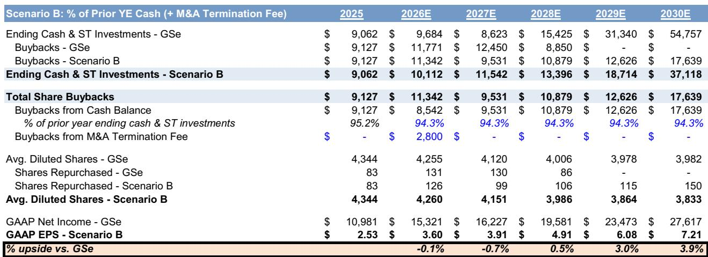
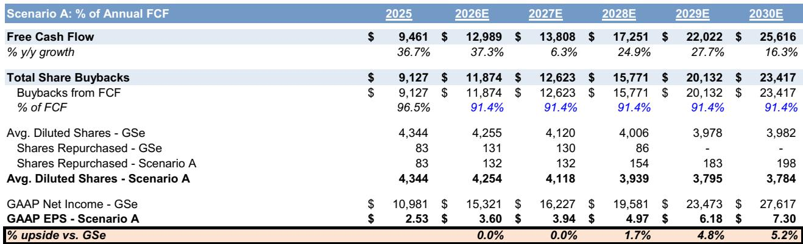
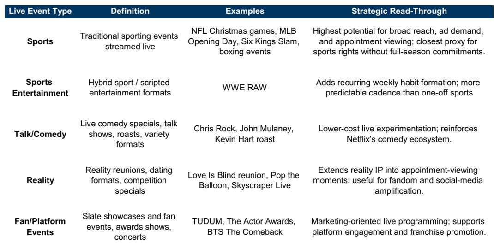

# GS：Netflix用户时长下滑7%，GS称广告业务才是真正引擎

Netflix即将发布2026年第二季度财报。市场普遍关注的焦点仍停留在用户增长是否见顶、竞争格局是否出现变化，但GS这份财报前瞻报告传递了一个更值得注意的信号：Netflix正在从一家订阅费驱动的流媒体公司，转向“订阅+广告”双引擎模式。广告收入预计从2025年的约15亿美元，增长至2027年的约45亿美元，到2030年接近95亿美元。这个数字意味着，广告业务将在未来五年内贡献总收入的15%以上，成为公司利润增长的第二个核心支点。

报告同时覆盖了四个核心议题：广告业务的最新进展、直播内容策略的演变、短视频产品机会，以及扩大后的公司回购计划。但最值得深读的，是广告业务的规模化路径和尚未完全解决的竞争问题。

## 1. 广告收入的增长路径已经清晰，但用户粘性仍是短期影响

GS预计，Netflix广告支持用户将从2025年底的约9500万MAU，增长至2026年底的1.4亿。这一增长主要来自三个结构性推力：全球Connected TV/流媒体AVOD市场以年复合增长率约15%的速度扩张，持续从传统线性电视广告预算中切分份额；Netflix在直播内容上的重金投入（NFL、MLB、WWE等）带来了比剧本内容更高的广告变现效率；以及其自研广告技术平台Netflix Ad Suite的持续迭代，包括程序化购买、第三方DSP合作和新广告格式。

但报告也指出了短期不确定性。基于Sensor Tower数据，Netflix全球月活跃用户在二季度同比下降约3%，美国市场同样下降3%。用户使用时长在美国和全球分别同比下降8%和7%。内容上线数量也比去年同期减少了约17%。这些数据如果被财报确认，将继续引发市场对其竞争地位和用户参与度的关注。

> **KC评论：** 广告业务的增长逻辑很清晰，但前提是用户规模和参与度需要保持稳定。GS认为这些短期因素已被公司此前的业绩指引所覆盖，但读者需要看到下半年内容阵容（原创剧集和直播事件）能否重新激活增长。广告收入占比提升，意味着Netflix的估值框架正在从纯订阅模式向“订阅+广告”混合模式切换，这可能是市场重新定价的关键变量。

## 2. 直播内容策略尚未形成稳定的季度规模

报告指出，尽管Netflix在直播内容上投入巨大，但全球范围内的直播策略尚未实现持续稳定的季度规模。直播内容对用户增长的拉动效果，以及其对广告收入的贡献，目前仍处于验证阶段。GS认为，直播内容的占比提升是推动用户增长和广告规模化的关键驱动力，但这份报告没有完全回答的问题是：直播内容的高成本是否会影响利润率？以及，Netflix能否在直播领域建立起像Netflix原创剧集那样的用户忠诚度？

## 3. 短视频产品：一个尚未被市场定价的战略选项

报告还讨论了Netflix在短视频领域的布局。这是一个新的产品方向，旨在应对年轻用户向短视频平台迁移的消费习惯。GS将其定位为“战略性的位置调整”，而非短期增长引擎。如果Netflix能够成功将短视频嵌入其内容生态，可能会带来平台参与度的增量，但报告没有给出具体的时间表和用户规模预期。这一部分的讨论相对克制，也暗示了短视频战略仍处于早期探索阶段。

> **KC评论：** 短视频是Netflix目前最被关注的战略变量之一。如果成功，它可以解决两个核心问题：一是吸引年轻用户回流，二是为广告业务提供更丰富的库存和更精准的用户画像。但这也是不确定性最高的方向，需要持续跟踪产品落地和用户反馈。

## 4. 回购计划是短期支撑，但长期仍需业绩验证

GS在报告中调整了预期，将剩余约318亿美元的回购授权按线性方式分配到未来2.5年。这意味着，Netflix将继续通过回购来支撑每股收益的增长。但报告也指出：回购计划能否持续推动市场定价，取决于公司能否证明其广告业务的规模化路径是可持续的，以及用户参与度能否在2026年下半年企稳回升。

**报告尚未完全回答的关键问题**：广告收入从15亿到95亿的路径中，哪些是确定性较高的结构性增长，哪些是依赖于外部市场条件和竞争格局的假设？直播内容的高投入是否会导致利润率承压？短视频产品能否真正改变用户行为？这些问题，在完整报告中有更详细的图表和假设拆解。

这份报告的价值在于它清晰地勾勒了Netflix从单一订阅模式向混合商业模式转型的路径和不确定性。对于关注流媒体行业竞争格局和平台型公司商业模式演变的读者，这份报告值得完整阅读。

For informational purposes only. Portions may be generated,translated,summarized,or edited with AI assistance based on source materials and may contain omissions or errors. Please verify independently. This is not investment,legal,tax,accounting,or other professional advice.

For informational purposes only. Portions may be generated,translated,summarized,or edited with AI assistance based on source materials and may contain omissions or errors. Please verify independently. This is not investment,legal,tax,accounting,or other professional advice.

