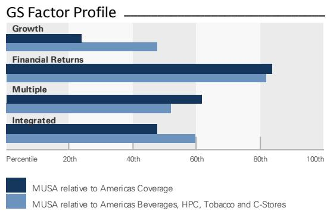
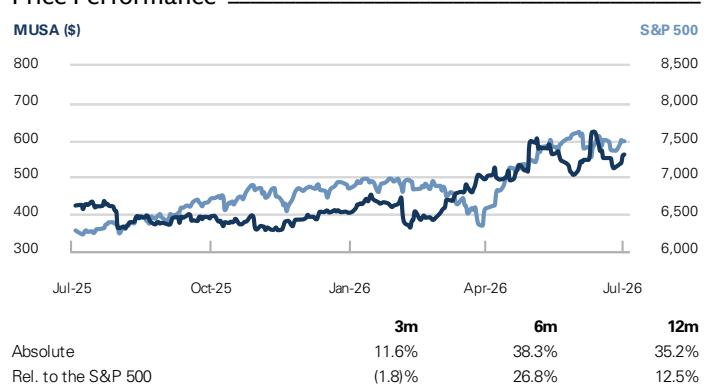
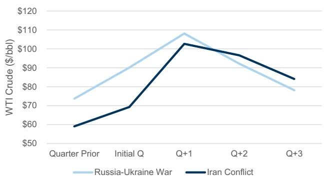
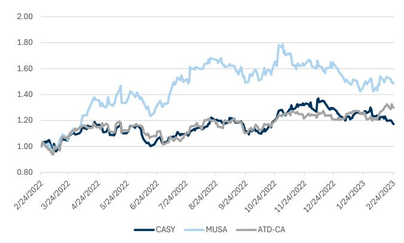
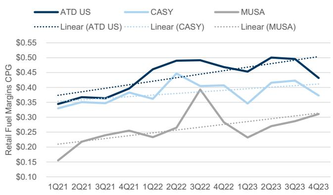
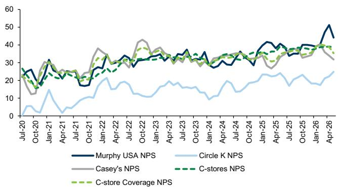
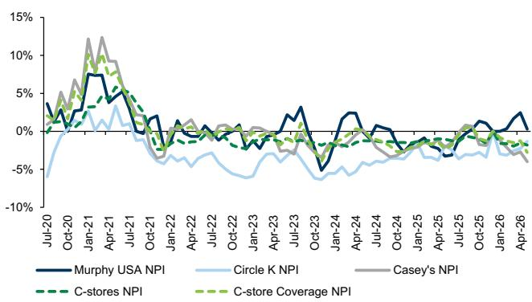

# Murphy USA Inc. (MUSA)

# 宏观环境利好因素有望支撑未来EBITDA增长加速——评级上调至中性

MUSA

12个月目标价：\$550.00

现价：\$560.75

下行空间：1.9%

## 中性

Bonnie Herzog
+1(212)902-0490 | bonnie.herzog@gs.com
GS & Co. LLC

Ethan Huntley
+1(617)772-7940 | ethan.huntley@gs.com
GS & Co. LLC

我们的观点——我们将MUSA评级从卖出上调至中性，因为我们认为该公司的风险回报比现在更加平衡。原油价格下跌有助于推动燃料利润率持续提升——至少在短期至中期内如此——我们认为这将有助于支撑健康的EBITDA表现。基于此，我们现在认为管理层当前FY28长期EBITDA目标12亿美元是可以实现的，尤其是考虑到可能非常强劲的FY26业绩（我们认为）将为公司提供坚实的基础。值得注意的是，根据管理层信息，4月综合燃料利润率在35-40美分/加仑范围内——虽然5月行业燃料利润率数据显示环比有所放缓——但根据OPIS数据，6月行业燃料利润率非常强劲（环比5月增长92%，环比4月增长37%），这得益于原油价格下跌（燃料利润率与原油通常呈负相关）以及持续的波动性（这创造了定价机会）。除了燃料利润率，我们还注意到MUSA在此环境下有潜力成为燃料销量份额的获得者：随着零售燃料价格下跌（我们近期已观察到），并开始趋于平稳——这为公司提供了进一步降低加油站价格的机会（MUSA是低成本领导者），以争取增量市场份额/销量。虽然这种增量市场份额/销量可能会以牺牲部分燃料利润率为代价，但我们认为总的燃料贡献应该会上升。综合考虑这些因素，我们将Q2/FY26/FY27的每股收益预期上调+10%/+14%/+10%至\$9.30/\$32.69/\$31.49（对比FactSet一致预期为\$9.48/\$32.11/\$29.50）——详见下文。我们还预计MUSA将在即将发布的Q2业绩（可能在8月初）中上调FY26指引——特别是考虑到管理层的指引是在4Q25业绩发布时（2月初）提供的，当时尚未出现对MUSA有利的宏观环境变化。自我们于2020年12月1日将MUSA列入卖出名单以来，该公司股价上涨了331.9%，而标普500指数上涨了104.3%。我们认为，鉴于燃料利润率的持久性和上升趋势，该公司的表现优于市场。

Ankit Prasad
+1(212)934-6394 | ankit.prasad@gs.com
GS India SPL

## 关键数据

市值：100亿美元
企业价值：118亿美元
3个月日均交易量：1.843亿美元
美国
美洲饮料、家庭及个人护理、烟草和便利店
并购排名：3

GS预测

<table><tr><td colspan="5">CS预测</td></tr><tr><td></td><td>12/25</td><td>12/26E</td><td>12/27E</td><td>12/28E</td></tr><tr><td>收入（百万美元）新</td><td>19,384.0</td><td>20,782.5</td><td>20,082.7</td><td>20,823.9</td></tr><tr><td>收入（百万美元）旧</td><td>19,384.0</td><td>20,642.4</td><td>20,320.2</td><td>21,067.4</td></tr><tr><td>每股收益（美元）新</td><td>24.92</td><td>32.69</td><td>31.49</td><td>34.78</td></tr><tr><td>每股收益（美元）旧</td><td>24.92</td><td>28.76</td><td>28.53</td><td>31.69</td></tr><tr><td>市盈率（倍）</td><td>17.1</td><td>17.2</td><td>17.8</td><td>16.1</td></tr><tr><td>企业价值/EBITDA（倍）</td><td>9.9</td><td>9.9</td><td>10.1</td><td>9.1</td></tr><tr><td>自由现金流回报表现（%）</td><td>4.7</td><td>7.8</td><td>4.8</td><td>5.7</td></tr><tr><td>股息回报表现（%）</td><td>0.5</td><td>0.5</td><td>0.5</td><td>0.5</td></tr><tr><td>净债务/EBITDA（倍）</td><td>2.1</td><td>1.5</td><td>1.6</td><td>1.5</td></tr><tr><td></td><td>3/26</td><td>6/26E</td><td>9/26E</td><td>12/26E</td></tr><tr><td>每股收益（美元）</td><td>7.26</td><td>9.30</td><td>8.76</td><td>7.37</td></tr></table>

GS因子概况

来源：公司数据，GS估计。详情请参阅披露信息。

<table><tr><td></td><td>3个月</td><td>6个月</td><td>12个月</td></tr><tr><td>相对收益</td><td>11.6%</td><td>38.3%</td><td>35.2%</td></tr><tr><td>相对标普500</td><td>(1.8)%</td><td>26.8%</td><td>12.5%</td></tr></table>

## Murphy USA Inc. (MUSA)

自2026年7月6日起评级

比率与估值

<table><tr><td></td><td>12/25</td><td>12/26E</td><td>12/27E</td><td>12/28E</td></tr><tr><td>市盈率（倍）</td><td>17.1</td><td>17.2</td><td>17.8</td><td>16.1</td></tr><tr><td>企业价值/EBITDA（倍）</td><td>9.9</td><td>9.9</td><td>10.1</td><td>9.1</td></tr><tr><td>企业价值/销售额（倍）</td><td>0.5</td><td>0.6</td><td>0.6</td><td>0.5</td></tr><tr><td>自由现金流回报表现（%）</td><td>4.7</td><td>7.8</td><td>4.8</td><td>5.7</td></tr><tr><td>企业价值/债务调整后现金流（倍）</td><td>10.7</td><td>8.8</td><td>12.2</td><td>10.7</td></tr><tr><td>现金回报率（%）</td><td>24.3</td><td>31.8</td><td>20.0</td><td>20.2</td></tr><tr><td>资本回报率（%）</td><td>18.7</td><td>21.3</td><td>19.1</td><td>19.2</td></tr><tr><td>租金调整后净债务/EBITDAR（倍）</td><td>2.4</td><td>1.8</td><td>1.9</td><td>1.8</td></tr><tr><td>净债务/EBITDA（倍）</td><td>2.1</td><td>1.5</td><td>1.6</td><td>1.5</td></tr><tr><td>应收账款天数</td><td>5.1</td><td>4.4</td><td>4.0</td><td>3.9</td></tr><tr><td>库存天数</td><td>8.7</td><td>7.7</td><td>7.3</td><td>6.7</td></tr><tr><td>应付账款占库存百分比</td><td>204.5</td><td>216.5</td><td>257.9</td><td>301.4</td></tr></table>

利润表（百万美元）

<table><tr><td></td><td>12/25</td><td>12/26E</td><td>12/27E</td><td>12/28E</td></tr><tr><td>总收入</td><td>19,384.0</td><td>20,782.5</td><td>20,082.7</td><td>20,823.9</td></tr><tr><td>销售成本</td><td>(17,024.6)</td><td>(18,137.5)</td><td>(17,466.7)</td><td>(18,068.4)</td></tr><tr><td>销售、一般及管理费用</td><td>(231.5)</td><td>(264.1)</td><td>(251.0)</td><td>(260.3)</td></tr><tr><td>研发费用</td><td>-</td><td>-</td><td>-</td><td>-</td></tr><tr><td>其他营业收支</td><td>(1,111.9)</td><td>(1,189.0)</td><td>(1,247.6)</td><td>(1,313.9)</td></tr><tr><td>EBITDA</td><td>1,019.4</td><td>1,191.9</td><td>1,117.4</td><td>1,181.3</td></tr><tr><td>折旧与摊销</td><td>(276.8)</td><td>(296.7)</td><td>(293.0)</td><td>(321.9)</td></tr><tr><td>息税前利润</td><td>739.2</td><td>895.2</td><td>824.4</td><td>859.4</td></tr><tr><td>净利息收支</td><td>(110.7)</td><td>(108.1)</td><td>(103.7)</td><td>(103.7)</td></tr><tr><td>联营公司损益</td><td>-</td><td>-</td><td>-</td><td>-</td></tr><tr><td>其他</td><td>0.0</td><td>0.0</td><td>0.0</td><td>0.0</td></tr><tr><td>税前利润</td><td>628.5</td><td>787.1</td><td>720.7</td><td>755.8</td></tr><tr><td>所得税拨备</td><td>(144.7)</td><td>(187.0)</td><td>(173.0)</td><td>(181.4)</td></tr><tr><td>少数股东权益</td><td>-</td><td>-</td><td>-</td><td>-</td></tr><tr><td>优先股股息</td><td>-</td><td>-</td><td>-</td><td>-</td></tr><tr><td>净利润（扣除非常项目前）</td><td>483.8</td><td>600.1</td><td>547.8</td><td>574.4</td></tr><tr><td>税后非常项目</td><td>(1.1)</td><td>-</td><td>-</td><td>-</td></tr><tr><td>净利润（扣除非常项目后）</td><td>482.7</td><td>600.1</td><td>547.8</td><td>574.4</td></tr><tr><td>每股收益（基本，扣除非常项目前）（美元）</td><td>25.94</td><td>33.68</td><td>32.39</td><td>35.82</td></tr><tr><td>每股收益（摊薄，扣除非常项目前）（美元）</td><td>24.92</td><td>32.69</td><td>31.49</td><td>34.78</td></tr><tr><td>每股股息（美元）</td><td>2.06</td><td>2.60</td><td>2.81</td><td>3.04</td></tr><tr><td>股息支付率（%）</td><td>7.9</td><td>7.7</td><td>8.7</td><td>8.5</td></tr><tr><td>加权平均流通股数（基本）（百万股）</td><td>18.6</td><td>17.8</td><td>16.9</td><td>16.0</td></tr><tr><td>加权平均流通股数（摊薄）（百万股）</td><td>19.5</td><td>18.4</td><td>17.4</td><td>16.6</td></tr></table>

增长与利润率（%）

<table><tr><td>增长与利润率（%）</td><td>12/25</td><td>12/26E</td><td>12/27E</td><td>12/28E</td></tr><tr><td>总收入增长</td><td>(4.2)</td><td>7.2</td><td>(3.4)</td><td>3.7</td></tr><tr><td>EBITDA增长</td><td>1.3</td><td>16.9</td><td>(6.2)</td><td>5.7</td></tr><tr><td>息税前利润增长</td><td>(2.2)</td><td>21.1</td><td>(7.9)</td><td>4.2</td></tr><tr><td>每股收益增长</td><td>2.3</td><td>31.2</td><td>(3.7)</td><td>10.5</td></tr><tr><td>毛利率</td><td>12.2</td><td>12.7</td><td>13.0</td><td>13.2</td></tr><tr><td>息税前利润率</td><td>3.8</td><td>4.3</td><td>4.1</td><td>4.1</td></tr><tr><td>行业指标</td><td></td><td></td><td></td><td></td></tr><tr><td>同店销售增长（%）</td><td>–</td><td>–</td><td>–</td><td>–</td></tr><tr><td>门店数量</td><td>–</td><td>–</td><td>–</td><td>–</td></tr><tr><td>平均每店销售额（百万美元）</td><td>–</td><td>–</td><td>–</td><td>–</td></tr><tr><td>面积增长（%）</td><td>–</td><td>–</td><td>–</td><td>–</td></tr><tr><td>平均每平方英尺销售额（百万美元）</td><td>–</td><td>–</td><td>–</td><td>–</td></tr></table>

价格表现

来源：FactSet。价格截至2026年7月2日收盘。

资产负债表（百万美元）

<table><tr><td colspan="5">资产负债表（百万美元）</td></tr><tr><td></td><td>12/25</td><td>12/26E</td><td>12/27E</td><td>12/28E</td></tr><tr><td>现金及现金等价物</td><td>28.9</td><td>343.8</td><td>353.1</td><td>418.6</td></tr><tr><td>应收账款</td><td>276.2</td><td>226.2</td><td>219.0</td><td>231.1</td></tr><tr><td>存货</td><td>413.0</td><td>356.2</td><td>341.1</td><td>324.8</td></tr><tr><td>其他流动资产</td><td>29.7</td><td>41.2</td><td>39.9</td><td>42.1</td></tr><tr><td>流动资产合计</td><td>747.8</td><td>967.4</td><td>953.1</td><td>1,016.6</td></tr><tr><td>不动产、厂房及设备净额</td><td>2,962.8</td><td>3,155.6</td><td>3,364.7</td><td>3,563.4</td></tr><tr><td>无形资产净额</td><td>-</td><td>-</td><td>-</td><td>-</td></tr><tr><td>总投资</td><td>0.0</td><td>0.0</td><td>0.0</td><td>0.0</td></tr><tr><td>其他长期资产</td><td>1,015.2</td><td>720.5</td><td>697.6</td><td>736.0</td></tr><tr><td>总资产</td><td>4,725.8</td><td>4,843.6</td><td>5,015.4</td><td>5,315.9</td></tr><tr><td>应付账款</td><td>844.7</td><td>771.0</td><td>879.7</td><td>979.0</td></tr><tr><td>短期债务</td><td>19.0</td><td>19.2</td><td>19.2</td><td>19.2</td></tr><tr><td>流动租赁负债</td><td>20.5</td><td>20.5</td><td>20.5</td><td>20.5</td></tr><tr><td>其他流动负债</td><td>44.9</td><td>36.0</td><td>34.5</td><td>54.6</td></tr><tr><td>流动负债合计</td><td>929.1</td><td>846.7</td><td>953.9</td><td>1,073.3</td></tr><tr><td>长期债务</td><td>2,163.6</td><td>2,137.3</td><td>2,137.3</td><td>2,137.3</td></tr><tr><td>非流动租赁负债</td><td>444.2</td><td>444.2</td><td>444.2</td><td>444.2</td></tr><tr><td>其他长期负债</td><td>565.4</td><td>628.3</td><td>594.1</td><td>651.3</td></tr><tr><td>长期负债合计</td><td>3,173.2</td><td>3,209.8</td><td>3,175.6</td><td>3,232.8</td></tr><tr><td>总负债</td><td>4,102.3</td><td>4,056.5</td><td>4,129.5</td><td>4,306.0</td></tr><tr><td>优先股</td><td>--</td><td>--</td><td>--</td><td>--</td></tr><tr><td>普通股权益合计</td><td>623.5</td><td>787.1</td><td>885.9</td><td>1,009.9</td></tr><tr><td>少数股东权益</td><td>--</td><td>--</td><td>--</td><td>--</td></tr><tr><td>负债及权益合计</td><td>4,725.8</td><td>4,843.6</td><td>5,015.4</td><td>5,315.9</td></tr><tr><td>每股账面价值（美元）</td><td>31.96</td><td>42.88</td><td>50.80</td><td>61.02</td></tr></table>

现金流量表（百万美元）

<table><tr><td>现金流量表（百万美元）</td><td>12/25</td><td>12/26E</td><td>12/27E</td><td>12/28E</td></tr><tr><td>净利润</td><td>470.6</td><td>600.6</td><td>547.8</td><td>574.4</td></tr><tr><td>加回折旧与摊销</td><td>276.8</td><td>296.7</td><td>293.0</td><td>321.9</td></tr><tr><td>加回少数股东权益</td><td>–</td><td>–</td><td>–</td><td>–</td></tr><tr><td>营运资本净变动</td><td>(33.1)</td><td>20.9</td><td>130.7</td><td>121.4</td></tr><tr><td>其他</td><td>99.6</td><td>362.0</td><td>(11.2)</td><td>18.7</td></tr><tr><td>经营活动现金流</td><td>813.9</td><td>1,280.2</td><td>960.3</td><td>1,036.5</td></tr><tr><td>资本支出</td><td>(439.6)</td><td>(497.4)</td><td>(502.1)</td><td>(520.6)</td></tr><tr><td>收购</td><td>–</td><td>–</td><td>–</td><td>–</td></tr><tr><td>剥离</td><td>2.4</td><td>0.2</td><td>–</td><td>–</td></tr><tr><td>其他</td><td>1.2</td><td>(0.4)</td><td>–</td><td>–</td></tr><tr><td>投资活动现金流</td><td>(436.0)</td><td>(497.6)</td><td>(502.1)</td><td>(520.6)</td></tr><tr><td>已支付股息</td><td>–</td><td>–</td><td>–</td><td>–</td></tr><tr><td>股份发行/回购</td><td>(649.9)</td><td>(370.5)</td><td>(400.0)</td><td>(400.0)</td></tr><tr><td>债务增加/减少</td><td>327.9</td><td>(27.8)</td><td>0.0</td><td>–</td></tr><tr><td>其他</td><td>(74.0)</td><td>(69.4)</td><td>(49.0)</td><td>(50.3)</td></tr><tr><td>融资活动现金流</td><td>(396.0)</td><td>(467.7)</td><td>(449.0)</td><td>(450.3)</td></tr><tr><td>总现金流</td><td>(18.1)</td><td>314.9</td><td>9.2</td><td>65.5</td></tr><tr><td>自由现金流</td><td>374.3</td><td>782.8</td><td>458.2</td><td>515.9</td></tr><tr><td>每股自由现金流（美元）</td><td>20.07</td><td>43.93</td><td>27.10</td><td>32.17</td></tr></table>

来源：公司数据，GS估计。

## 目录

MUSA的燃料供应业务 5
我们的估计 6
HundredX洞察 7
附加图表 8
MUSA关键基本面数据 9
估值与风险 11
摘要模型 12
披露附录 13

（部分受地缘政治波动支撑）——这是我们之前低估的因素。总之——我们现在认为MUSA的风险回报更加平衡，因为我们相信他们实现长期指引目标的能力现在已触手可及——并且取决于执行力而非不可控因素。此外，我们认为MUSA的估值相对更具吸引力，该公司目前远期企业价值/EBITDA倍数为11.3倍，相对于ATD和CASY有22%的折价——低于其3年/5年平均折价水平-13%/-9%。然而，展望未来，我们认为MUSA的盈利增长路径可见度有限，特别是考虑到其对燃料业务的依赖（占收入的77%和利润的54%），这使我们保持观望。基于此，我们将MUSA评级从卖出上调至中性。

此次油价冲击与俄乌战争初期影响相比如何？最近几周，我们持续收到读者关于便利店行业的大量问题，特别是考虑到：（1）原油价格上涨速度之快（突破110美元/桶）以及随后的下跌（最近约为70美元/桶）；（2）零售汽油价格大幅上涨（超过4.50美元/加仑）——并且仍然处于高位（约3.90美元/加仑）；（3）人们不断将当前环境与俄乌战争的初期影响进行比较。对此，我们注意到俄乌战争始于2022年2月——这导致原油价格急剧上涨——见图表1——尽管原油价格在2022年第二季度迅速见顶（约108美元/桶——与伊朗战争迄今的峰值相似），随后连续四个季度环比下降，基本回到冲突前约75美元/桶的水平（与当前水平相似）。最终，俄乌战争开始后随后几个季度的原油价格下跌环境被证明是燃料利润率的利好因素——MUSA获得了显著收益（鉴于其较高的燃料业务敞口），这反映在其股价表现中（见图表2）。

图表1：俄乌战争（始于2022年2月）和伊朗冲突前后原油价格比较

伊朗冲突的远期原油价格为EIA截至2026年6月9日的估计——考虑到近期原油价格走势（约70美元/桶），EIA估计可能下调

图表2：俄乌战争前后便利店覆盖组指数化股价表现

来源：FactSet，GS全球投资研究
来源：EIA，GS全球投资研究

令人鼓舞的是，我们覆盖的便利店公司的燃料利润率似乎在俄乌战争后相对于战前水平有所上移——见图表3——这让我们相信伊朗战争后燃料利润率也可能保持在高位。除了这些不可控因素之外，我们继续看到行业燃料价格存在上行趋势（尽管有波动），只要行业中小型边际参与者的盈亏平衡成本保持高位（它们确实如此）。

图表3：俄乌战争前后便利店覆盖组零售燃料利润率（美分/加仑）

来源：公司数据，GS全球投资研究

## MUSA的燃料供应业务

MUSA管理层最近在第一季度业绩中提供了关于其燃料供应业务的更多细节，我们认为这非常有帮助，因为我们确实将此视为公司的竞争优势——并且我们认为读者尚未充分认识到这一点。管理层指出，他们可以将燃料供应业务的结果分解为三个不同的活动，包括：（1）可控活动——包括MUSA可以部署的资产、专业知识和能力，为其约50%的零售量提供稳定且低成本的供应来源——包括从炼油厂采购产品，通过管道运输到终端，与乙醇混合（产生RIN——然后可以出售），并以基于市场的内部转移价格在批发市场出售给其零售业务。考虑到这些能力，并且鉴于美国成品油市场和基础设施保持稳定且供应充足，MUSA能够获得超额利润（即价格套利）的市场条件通常只持续很短的时间（如近期所见）。在正常市场条件下，MUSA的燃料供应业务历史上产生约2-3美分/加仑的利润——公司预计这一水平将持续。第一季度，这些可控活动产生了2.4美分/加仑的利润；（2）价格变化和/或库存变动时机的不可预测性——取决于零售燃料价格变动的幅度和持续时间（上涨或下跌）。鉴于3月份零售燃料价格大幅上涨，MUSA实际上以高于购买价格的价格出售了燃料库存——MUSA燃料供应业务的这一部分在第一季度产生了6.9美分/加仑的利润；（3）批发和终端功能——MUSA的批发燃料部门并非作为独立的利润中心而建立——而是更多地用于管理其零售店购买的大量燃料的物流复杂性。然而，MUSA拥有并运营的七个终端也为约100个其他第三方终端提供燃料——过去几年历史上每月产生约1-2百万美元的利润。MUSA燃料供应业务的这一部分在第一季度产生了0.3美分/加仑的利润。

## 我们的估计

上调每股收益预期以反映更强的燃料利润率和燃料加仑交付量。我们将第二季度综合燃料利润率预期上调至37.0美分/加仑（此前为35.0美分/加仑，一致预期为33.8美分/加仑）——这得益于我们对零售燃料利润率增强的预期，为32.0美分/加仑（此前为30.0美分/加仑，一致预期为29.2美分/加仑）。在其他方面，我们将第二季度同店燃料加仑预期上调至同比持平（此前为-1.8%，一致预期为-0.5%）——因为MUSA很可能在此零售燃料价格下跌环境中成为份额获得者。在其他方面，我们继续预计第二季度同店尼古丁商品销售增长+3.0%（第一季度为+4.9%）——同时我们预计同店非尼古丁商品销售同比持平（第一季度为-1.0%），因为我们看到在此零售燃料价格较高环境中，非必需商品销售可能面临一定压力。综合来看，我们将第二季度每股收益预期上调0.86美元至9.30美元（一致预期为9.48美元）——同时将第二季度EBITDA预期上调至3.28亿美元（同比增长14.5%，此前为3.04亿美元，一致预期为3.34亿美元）。展望未来，我们还将FY26综合燃料利润率预期上调至34.8美分/加仑（此前为33.0美分/加仑，一致预期为32.6美分/加仑）——这得益于我们对零售燃料利润率增强的预期，为30.0美分/加仑（此前为28.2美分/加仑，一致预期为28.7美分/加仑）。在其他方面，我们将同店燃料加仑预期上调至-0.2%（此前为-1.5%）。据此，我们将FY26每股收益预期上调3.93美元至32.69美元（一致预期为32.11美元）——同时将FY26 EBITDA预期上调至11.91亿美元（同比增长16.9%，此前为10.96亿美元，与一致预期一致）。

今年的季度分布考虑。我们注意到MUSA正在超越一个重要的ZYN促销活动（3Q25）——该活动贡献了约1200万美元的增量商品利润，同店商品利润率增长+8.3%——因此，我们预计3Q26尼古丁利润率将面临压力（我们模型假设同比-150个基点至15.3%）。与此相关，MUSA最近指出，近期尼古丁袋装品类出现了许多其他新进入者——其中许多获得了强有力的促销支持，这对MUSA的核心客户群体（偏向低收入人群）具有重要意义。因此，MUSA此前指出，JOEY尼古丁袋装罐目前在MUSA的奖励应用程序上零售价仅为0.99美元——零售参与度很高，尤其是因为MUSA的许多客户经常寻找最便宜的相对价格点产品。这一点很重要，因为MUSA在尼古丁/烟草方面的敞口高于同行——并且考虑到这些较新/较小的进入者（在大量促销支持下）获得份额的速度，这可能会迫使较大的成熟制造商（即ZYN）也继续增加其促销支出。这是一个我们将继续密切关注的变化——我们认为这至少是近期ZYN扫描数据放缓的部分原因。

预计MUSA将上调FY26指引。展望未来，我们预计MUSA将在第二季度业绩中上调FY26指引。提醒一下，MUSA通常不会在第一季度业绩中调整指引（上调/下调）——但历史上会在必要时在第二季度业绩中重新审视其指引。基于此，我们预计MUSA将上调其FY26指引——特别是同店燃料加仑，目前为同比-3%至-1%（而我们更新的预期为-0.2%）。此外，我们还看到管理层（仅用于建模目的）指引存在上行空间：（1）综合或总燃料利润率（目前为30.5美分/加仑，而我们更新的预期为34.8）；（2）净利润（目前为4.39亿美元，而我们更新的预期为6亿美元）；（3）调整后EBITDA（目前为10亿美元，而我们更新的预期为11.92亿美元）。

## HundredX洞察

我们使用HundredX的数据来补充我们的预览。HundredX是一家基于使命的数据和洞察公司，采用创新方法监测消费者认知并收集消费者反馈，以了解80多个行业和3000多个品牌的趋势。HundredX分析日常客户的集体意见，并评估他们的优先事项如何影响购买决策以及对企业和品牌的态度。HundredX的数据组合涵盖自2021年8月以来从44.4万人收集的1360万条反馈。

以下图表分析了净推荐值（NPS）和净消费意向（NCI）。

图表4：MUSA的NPS近期仍稳固高于便利店同行
净推荐值（NPS）表明消费者推荐品牌的可能性

数据代表截至2026年5月的三个月滚动数据
来源：HundredX，GS全球投资研究

图表5：MUSA的净购买意向呈现类似趋势

数据代表截至2026年5月的三个月滚动数据
来源：HundredX，GS全球投资研究

## 附加图表

图表6：MUSA指引

<table><tr><td rowspan="2">指引提供时间：</td><td colspan="2">FY 2026 指引</td><td colspan="2">我们的估计</td></tr><tr><td>4Q25 业绩电话会议 2026年2月4日</
