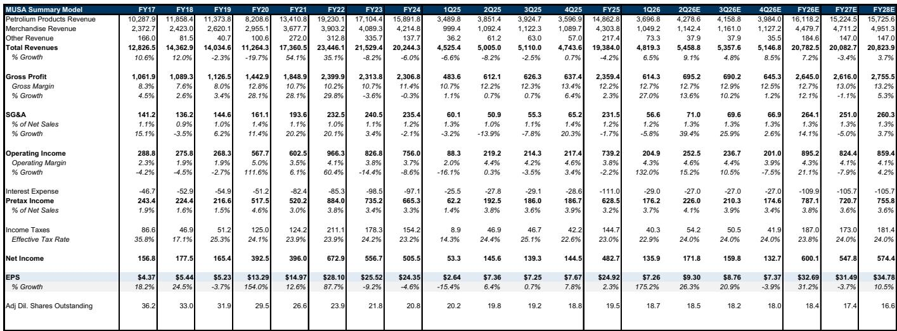
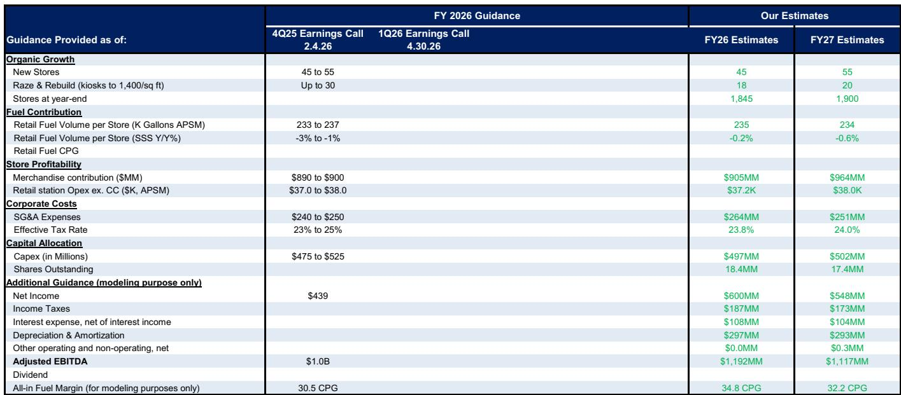
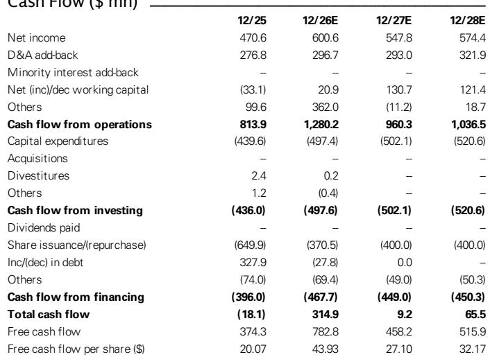

# 原油价格变化重塑燃料零售格局：Murphy USA 迎来发展机遇，但可见度仍是制约因素

原油价格与燃料零售商盈利能力之间的关系从来都不是简单的线性关系，但当前的宏观环境正在形成一种罕见的合力，促使人们重新审视整个便利店行业的研究框架。对于在美国运营着超过1700家低成本燃料和便利店的Murphy USA而言，近期原油价格从每桶110美元以上回落至约70美元，这不仅仅是一个暂时的利好因素。它标志着公司盈利轨迹的结构性转变，使其长期EBITDA目标（12亿美元）从愿景变得更具现实基础。

这一时刻的分析意义不仅在于燃料利润率的扩大，更在于驱动这一利润率的机制与市场历史定价方式存在根本差异。Murphy USA长期以来被视为燃料价格的高贝塔标的，读者通常认为原油价格下跌会压缩利润率并损害盈利。但现有数据表明情况恰恰相反。燃料利润率与原油价格呈负相关关系，当前批发成本下降而零售价格相对坚挺的环境，正在产生公司自2022年俄乌冲突以来未曾见过的利润率扩张。

主要研究机构将Murphy USA的评级从“报告观点”上调至“报告观点”，反映了这种认知的演变。但对于认真的观察者而言，更重要的问题是，这一时刻代表的是周期性机会，还是公司盈利能力的持续重置。答案取决于如何解读宏观波动、竞争定位以及燃料利润率在冲击后环境中的持久性之间的相互作用。上一次地缘政治危机的经验提供了有用的参考，但当前情况具有足够多的独特特征，需要谨慎对待过度外推。

## 燃料利润率回升并非偶然事件，而是与地缘政治波动和行业分散相关的可重复模式

当前环境最具参考价值的类比是2022年2月开始的俄乌冲突。在那次事件中，原油价格飙升至每桶约108美元，随后连续四个季度回落至冲突前每桶70美元中段的水平。随后的原油价格下跌被证明是燃料零售商的强劲利好，而Murphy USA由于其燃料利润率敞口较大，成为主要受益者之一。自2020年12月被纳入“报告观点”名单以来，该公司的报价上涨了331.9%，远超同期标普500指数104.3%的涨幅。

这一模式正在重演。伊朗冲突推动原油价格大幅上涨，峰值接近每桶110美元，随后回落至约70美元。下跌的速度和幅度创造了一个窗口期，零售燃料价格尚未完全向下调整，管理层报告称4月份的全包燃料利润率在每加仑35至40美分之间。根据OPIS数据，即使5月出现一些环比放缓，6月全行业燃料利润率仍较5月飙升92%，较4月飙升37%。这不是噪音，而是表明燃料零售行业的结构性动态并未改变。

使这一模式具有持久性而非短暂性的，是行业边缘参与者的状况。较小的独立运营商继续面临较高的盈亏平衡成本，这阻止了它们在利润率扩张期间积极进行价格竞争。这为像Murphy USA这样规模更大、效率更高的运营商创造了一个环境，使其能够维持比历史平均水平更长的较高利润率。俄乌冲突后的数据显示，便利店覆盖范围内的燃料利润率在冲突后重新设定在高于战前水平的位置。如果伊朗冲突后同样的动态成立，当前的利润率扩张可能比许多观察者预期的更具粘性。

## Murphy USA的燃料供应业务是被大多数观察者误解的隐藏竞争优势

该公司的燃料供应业务历来被市场视为一个黑箱，其盈利来源难以建模。但管理层最近决定将该业务分解为三个不同的活动，这为理解为什么Murphy USA的利润率状况在结构上优于同行提供了一个框架。

第一类包括可控活动。这些活动包括实物资产和运营专业知识，使Murphy USA能够从炼油厂采购产品，通过管道运输至终端，与乙醇混合以生成可再生识别码，并以基于市场的内部转移价格将其“报告观点”给自有零售业务。在正常市场条件下，该板块每加仑可产生约2至3美分的稳定、可预测利润。第一季度，它实现了每加仑2.4美分。这并不非凡，但它是可靠的，而在与商品相关的业务中，可靠性本身就是一种竞争优势。

第二类涉及价格变化和库存变动的不可预测时机。当零售燃料价格剧烈波动时（如3月份的情况），公司管理库存时机的能力会创造难以预测但影响真实的意外收益。第三类包括可再生识别码的销售，这增加了另一层与原油价格方向基本不相关的盈利。

战略含义是明确的。Murphy USA不仅仅是燃料零售商，它是一个集成的燃料供应链运营商，拥有难以复制的成本优势。该公司是其行业的低成本领导者，在原油价格下跌使其能够比竞争对手更积极地降低零售价格的环境中，它有能力在保持健康每加仑利润率的同时获得市场份额和销量。利润率与销量之间的权衡是真实存在的，但总的燃料贡献应该会上升。

## 12亿美元EBITDA目标的实现路径现在更具可信度，但执行必须取代运气

管理层到2028财年实现12亿美元EBITDA的长期目标自公布以来一直受到质疑，这并非没有道理。该目标暗示的盈利增长水平似乎依赖于公司无法控制的因素。但当前的宏观环境改变了这一计算。公司可能实现的强劲2026财年业绩应能为后续发展提供坚实基础，而每股收益预期的上调反映了这一新现实。

研究机构现在估计2026财年每股收益为32.69美元，较此前估计的28.76美元增长14%；2027财年每股收益为31.49美元，较此前估计的28.53美元增长10%。2026财年自由现金流预计将达到7.828亿美元，意味着自由现金流回报表现为7.8%。这些并非激进的假设。它们反映了在高度运营杠杆的商业模式中，燃料利润率提高的机械性影响。

但实现12亿美元目标的路径需要的不仅仅是有利的宏观条件。它要求管理层在股份回购、门店增长和成本控制方面执行到位。公司预计在2026财年回购3.705亿美元的股份，并在2027和2028财年每年回购4亿美元，这将使稀释后股份数量从2025财年的1950万股显著减少至2028财年的1660万股。这是管理层可以控制的杠杆，即使燃料利润率正常化，它也为每股收益增长提供了下限。

风险在于市场可能已经开始消化这一改善的前景。该公司的报价目前为远期市盈率17.2倍和远期EV/EBITDA 9.9倍，按历史标准衡量并不昂贵，但如果燃料利润率比预期更快回归均值，上行空间有限。与Alimentation Couche-Tard和Casey's General Stores等同行相比，折扣已从三年平均的13%收窄至约22%，这表明部分好消息已经反映在价格中。

## 报告未完全回答的问题：重新设定燃料利润率的可持续性以及通过销量激进导致利润率压缩的风险

尽管对当前情况进行了严谨的分析，但仍有两个关键问题悬而未决，而正是这些问题将决定评级上调至“报告观点”是富有远见还是为时过早。

第一个问题是燃料利润率是否会像俄乌冲突后那样重新设定在更高水平，还是当前的扩张是暂时的，会随着原油价格稳定而逆转。历史先例令人鼓舞，但当前环境存在双向差异。积极的一面是，行业边缘参与者仍面临较高的盈亏平衡成本压力，这应能防止利润率快速侵蚀。消极的一面是，原油价格下跌的速度比上一次事件更快，这可能导致零售价格更快调整，进而导致利润率相应压缩。

第二个问题更为微妙但可能更具后果性。Murphy USA正将自己定位为这一环境中的销量份额获得者，利用其低成本结构降低零售价格以抢占市场份额。这一策略在理论上合理，但它引入了一种难以建模的动态。公司获得份额的能力取决于竞争对手是否愿意让出销量，而在一个由许多小型运营商组成的分散行业中，反应函数是不可预测的。如果竞争对手匹配降价，销量增长可能无法实现，利润率扩张可能在价格战中丧失。报告承认了这一权衡，但没有提供量化风险的框架。

这些并非分析中的致命缺陷。它们是区分良好研究与卓越执行的问题。理解宏观利好但在估值和风险方面保持纪律的观察者，将能最好地应对不确定性。

## 观察者的决策框架：如何在当前环境中评估Murphy USA

对于考虑关注Murphy USA的观察者而言，分析挑战在于区分可知因素与投机因素，并构建一个同时考虑机会和风险的决策框架。

框架的第一个维度是宏观敏感性。Murphy USA的盈利与燃料利润率高度相关，而燃料利润率又与原油价格的方向和波动性相关。当前环境有利，但也脆弱。原油价格的任何稳定或逆转都将减少利好因素，而持续上涨则将成为不利因素。观察者应通过模拟燃料利润率在未来两到四个季度回归历史平均水平的场景，来压力测试自己的假设。

第二个维度是竞争定位。Murphy USA的成本优势是真实且持久的。公司集成的燃料供应链、低成本房地产模式和高效的店铺运营创造了结构性优势，即使在正常化的利润率环境中也应能产生高于平均水平的回报。问题在于当前估值是否充分反映了这一优势。以9.9倍远期EV/EBITDA计算，该报价并不昂贵，但也不够便宜，无法在利润率比预期更快正常化的情况下提供安全边际。

第三个维度是资本配置。公司积极的股份回购计划为每股盈利增长提供了强大杠杆，但也增加了财务杠杆并降低了公司的灵活性。净债务与EBITDA比率预计将从2025财年的2.1倍下降至2026财年的1.5倍，这是可控的，但回购的速度意味着任何运营失误都将在每股数据中被放大。

第四个维度是可见度。这是将评级维持在“报告观点”而非“报告观点”的制约因素。Murphy USA 77%的收入和54%的利润来自燃料，这意味着其盈利本质上是波动的，难以精确预测。当前的宏观环境提供了利好，但缺乏对该利好可持续性的可见度，限制了建立头寸的信心。

## 使这个故事值得关注的未解决问题

评级上调至“报告观点”在分析上是合理的，但它留下了几个有意义的问题未得到解答，这些问题将决定该报价是成为引人注目的机会还是价值陷阱。

行业边缘参与者是否会以维持较高利润率的步伐退出？小型运营商的盈亏平衡成本结构已经上升，但便利店行业的整合速度一直较慢。如果当前的利润率环境加速边缘参与者的退出，Murphy USA的结构性利好可能持续数年。如果不是，利润率扩张可能被证明是暂时的。

Murphy USA能否在不破坏自身利润率的情况下获得市场份额？降低零售价格以获取销量的策略是合乎逻辑的，但它需要纪律。如果公司以牺牲利润率为代价追求销量，总贡献可能不会像模型所显示的那样改善。第二季度业绩将提供当前环境下这一策略的首次真正考验。

公司在公布第二季度业绩时是否会提高2026财年指引？报告预计指引会上调，数据也支持这一点。但管理层历来保守，上调幅度将表明他们对当前利润率环境可持续性的信心水平。

这些问题无法通过阅读单一报告来回答。它们需要持续监测行业数据、竞争对手行为和管理层评论。但正是这类问题为愿意付出努力的观察者创造了机会。

加入社区阅读完整报告并查看原始图表。

*仅供参考。部分内容可能基于源材料通过AI辅助生成、翻译、总结或编辑，可能存在遗漏或错误。请独立核实。这不构成专业建议。*

仅供参考。部分内容可能基于源材料通过AI辅助生成、翻译、总结或编辑，可能存在遗漏或错误。请独立核实。这不构成专业建议。

