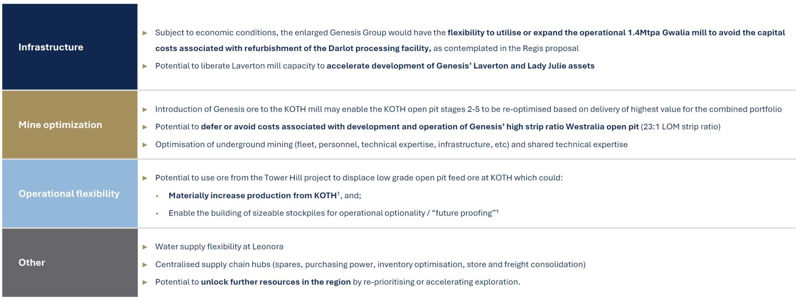
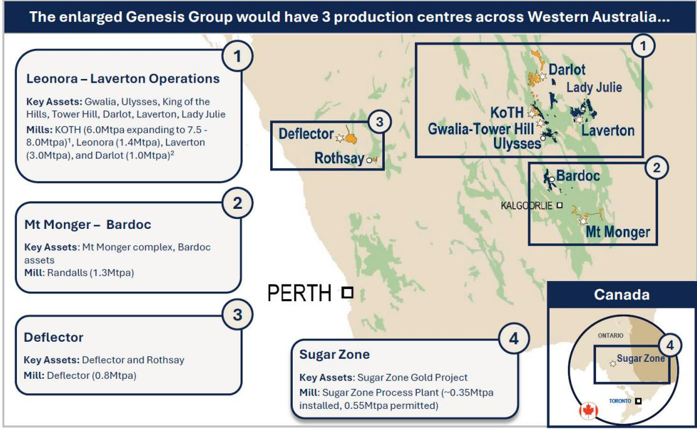
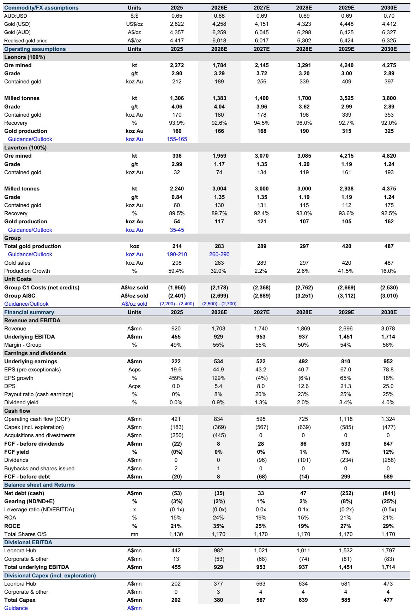

# The Battle for Vault Minerals Reveals a Deeper Truth: Proximity-Driven Synergies Are Reshaping Australian Gold M&A

The unsolicited bid by Genesis Minerals for Vault Minerals is not merely a bidding war against Regis Resources. It is a strategic play that exposes a fundamental shift in how value is created in the Australian gold sector. When Genesis submitted its binding proposal on July 3, 2026, offering Vault shareholders a mix of 0.7629 GMD shares and A$0.475 in cash, the headline numbers told one story: a ~14.5% premium over the Regis offer, a combined pro forma market capitalisation of ~A$12.6 billion, and a projected 600-700kozpa production profile. But the real story lies in the ~A$2.0 billion in post-tax synergies that Genesis claims are unique to this combination. This is not about scale for its own sake. It is about the economic logic of placing two mining operations within 35 kilometres of each other under a single management team.

The timing matters. Gold prices have surged, with the report assuming a USD gold price of $4,258/oz in 2026 and over $4,400/oz by 2030. In this environment, the premium paid for Vault is not the key variable. The key variable is whether the combined entity can convert operational proximity into cash flow faster and more efficiently than either company could alone. That is the question every observer in this space should be asking.

This article dissects the strategic logic of the Genesis-Vault proposal, examines the synergy claims that underpin its value proposition, and identifies the unresolved questions that will determine whether this deal creates or destroys value. More importantly, it provides a decision framework for those trying to assess similar consolidation plays in the resources sector.

## The Genesis Proposal Is an Industrial Logic Play, Not a Financial Engineering Exercise

The most striking feature of the Genesis bid is how explicitly it ties value creation to physical proximity. The synergy estimate of ~A$2.0 billion post-tax is not a vague promise of corporate overhead reduction. It is anchored in specific, quantifiable operational changes. The largest single item is the plan to process Tower Hill ore through Vault's King of the Hills (KOTH) mill, avoiding approximately A$715 million in growth capital expenditure that would have been required to build a new mill at Tower Hill and expand the Laverton mill. This is not a theoretical efficiency. It is a decision to use existing capacity rather than build new capacity, and the capital saving alone accounts for roughly 35% of the total synergy estimate.

This matters because in the gold mining industry, capital discipline is often the difference between a successful consolidation and a value-destroying merger. The report shows that Genesis's standalone capex is projected to rise from A$369 million in 2026E to A$567 million in 2027E and A$639 million in 2028E, largely driven by the Tower Hill and Laverton mill investments. If those investments can be deferred or avoided entirely, the combined entity's free cash flow profile improves dramatically. The report's financial summary for Genesis shows free cash flow turning positive only in 2029E, at A$299 million. By contrast, the synergy-driven scenario implies that the combined group could generate significant free cash flow much earlier.

But the synergy story goes beyond capital avoidance. The report details operating cost reductions from processing Genesis ore through the lower-cost KOTH mill rather than a new Tower Hill mill, from rationalising general and administrative overheads in the Leonora region, and from embedding Vault's owner-operator fleet into Genesis Mining Services. These are not generic cost cuts. They are specific to the geographic overlap of the two companies' assets. The implication is clear: in a district where both companies operate within 35 kilometres of each other, the combined entity can eliminate duplication, optimise ore routing, and reduce unit costs in ways that a more distant combination could not.

## The Synergy Estimate Raises Questions About Execution Risk and Timing

Any synergy estimate of this magnitude deserves scrutiny. The ~A$2.0 billion figure is presented on a post-tax, undiscounted basis over ten years. This means the actual net present value of the synergies, after discounting for the time value of money and the risk that some benefits may not materialise, is likely lower. Observers need to ask: what is the discount rate implied by the market? If the market assigns a high probability to successful execution, the stock prices should already reflect this. If not, there is an opportunity for those who believe the synergies are achievable.

The report flags several operational flexibilities that are not yet quantified. These include displacing low-grade KOTH open pit feed with higher-grade Tower Hill ore, re-optimising KOTH pit stages, deferring the high-strip Westralia open pit (with a life-of-mine strip ratio of 23:1), and avoiding Darlot processing refurbishment costs. These are material but uncertain. The Westralia deferral alone could have significant implications for cash flow timing, given that high strip ratios typically mean high near-term costs. But the report does not provide a dollar estimate for these items, leaving observers to guess at their potential impact.

There is also the question of integration. The Genesis and Vault operations are close, but they are not identical. Different processing technologies, different ore types, different workforces. The report acknowledges that the KOTH mill expansion from 5.3Mtpa to 7.5-8.0Mtpa is currently anticipated to be completed in Q2 FY27. If this expansion is delayed or if the blended ore feed causes processing issues, the synergy realisation could be pushed out. Observers should watch for detailed integration plans in any scheme booklet.

## Regis Resources Faces a Strategic Dilemma That It Cannot Ignore

The Regis Resources offer, which triggered the Genesis counter-bid, is now in a matching period that expires at 11:59pm AWST on July 10, 2026. The Vault board has determined that the Genesis proposal constitutes a "Vault Superior Proposal," meaning Regis must either improve its offer or walk away. This puts Regis in a difficult position.

Regis's original offer was structured as a merger of equals, implying a different strategic logic. Regis's assets are not concentrated in the Leonora-Laverton district; the company operates across multiple regions in Western Australia and New South Wales. The synergy potential of a Regis-Vault combination would be more about financial scale and balance sheet strength than operational proximity. The report's financial summary for Regis shows a company with declining production from its DNO and DSO operations, and a significant capital commitment to the McPhillamys project in New South Wales. For Regis, acquiring Vault would diversify its geographic exposure and add high-quality assets. But the synergy case is fundamentally different from the Genesis case.

If Regis matches the Genesis offer, it will need to justify a higher price. If it does not, it loses Vault and must pursue its standalone strategy, which the report suggests involves significant capex and uncertain production growth. The market will be watching the July 10 deadline closely. The outcome will signal whether Regis believes it can create more value from Vault than Genesis can, or whether it is willing to cede the Leonora-Laverton district to a new dominant player.

## What the Report Does Not Fully Answer: The Sustainability of the Synergy Pipeline

The report provides a detailed breakdown of the first wave of synergies, but it is less clear about what happens after year ten. The ~A$2.0 billion figure is based on a ten-year horizon. After that, the combined entity's competitive advantage may depend on its ability to continue finding new efficiencies or to replace depleting reserves. The report notes a combined mineral endowment of ~9.4Moz in Ore Reserves and ~33.6Moz in Mineral Resources. At a production rate of 600-700kozpa, the reserves alone represent roughly 13-16 years of production. This is adequate, but it does not leave much room for error if grades decline or costs rise.

More importantly, the report does not address the potential for diseconomies of scale. As the combined entity grows, it may face increasing complexity in managing multiple open pits, underground operations, and processing facilities across a single district. The report's own financial projections for Genesis show a significant ramp in production from 289koz in 2027E to 420koz in 2029E and 487koz in 2030E. This is a 68% increase over four years. Rapid production growth often strains management bandwidth, maintenance systems, and supply chains. The synergy estimates assume these challenges can be managed, but the report does not provide a detailed risk assessment.

Another open question is the tax benefit. The report estimates at least A$420 million in tax benefits from a step-up in the depreciable tax base, net of stamp duty and break fees. This is a one-time benefit that depends on the structure of the transaction and the tax treatment of the asset revaluation. If tax laws change or if the Australian Tax Office challenges the valuation, this benefit could be reduced. Observers who are focused on the headline synergy number should understand that approximately 20% of it comes from tax savings, not operational improvements.

## A Decision Framework for Evaluating Similar Consolidation Plays

For those trying to assess whether the Genesis-Vault deal, or any similar mining consolidation, is likely to create value, the following framework is useful. It is derived from the logic of the report and from general principles of M&A analysis.

First, assess the source of synergies. Are they driven by operational proximity, as in this case, or by financial engineering? Proximity-driven synergies, such as shared processing capacity, common infrastructure, and optimised ore routing, are generally more reliable because they are based on physical realities. Financial synergies, such as tax benefits or lower borrowing costs, are more susceptible to changes in market conditions or regulation.

Second, quantify the capital avoidance. The single most powerful synergy in this deal is the avoidance of A$715 million in growth capex. Any consolidation that allows a company to defer or cancel major capital projects should be viewed favourably, because it reduces risk and accelerates free cash flow. Observers should ask: what capex is being avoided, and how certain is the avoidance?

Third, evaluate the integration risk. The report flags operational flexibilities such as re-optimising pit stages and deferring high-strip operations. These are positive, but they also require careful planning. A merger that forces two different operating cultures to work together can create friction. Observers should look for evidence that the acquirer has a clear integration plan and a track record of successful execution.

Fourth, stress-test the commodity price assumptions. The report assumes gold prices above $4,000/oz for the foreseeable future. If gold prices fall to $3,000/oz or lower, the synergy maths changes. The capital savings remain, but the operating cost savings become less significant relative to revenue. Observers should model the deal under a range of gold price scenarios to understand the downside risk.

Finally, consider the competitive response. In this case, Regis has five business days to respond. If it matches the offer, the deal becomes more expensive for Genesis, potentially destroying value for its shareholders. If it does not, Genesis gains a dominant position in the Leonora-Laverton district, which may attract further competition from other mid-tier producers. The market structure after the deal matters as much as the deal itself.

## The Unresolved Analytical Questions That Demand Further Study

This report provides a rich dataset for analysis, but it leaves several meaningful questions unanswered. First, what is the net present value of the synergies under different discount rate assumptions? The report uses undiscounted figures, which are useful for headline purposes but not for rigorous valuation. Second, what is the probability that the Regis matching right will be exercised, and at what price? The report notes that Regis is "considering their position," but it does not provide a detailed analysis of Regis's financial capacity or strategic incentives. Third, how will the combined entity's balance sheet evolve if gold prices decline? The pro forma net cash of ~A$611 million provides a buffer, but the report's projections show the combined entity's leverage ratio remaining near zero. A downturn could change this quickly.

These are not criticisms of the report. They are natural limitations of a transaction that is still in flux. But for those who want to make informed observations, these questions are critical. The full report, with its detailed charts and financial projections, provides the raw material for this analysis. But the interpretation requires judgment.

Join the community to read the full report and review the original charts. The data on production profiles, cost curves, and balance sheet projections are essential for anyone trying to assess the value creation potential of this transaction. The report also includes detailed maps of the Leonora-Laverton district that illustrate the physical proximity driving the synergy case. Without these charts, it is difficult to fully appreciate the strategic logic of the Genesis proposal.

*For informational purposes only. Portions may be generated, translated, summarized, or edited with AI assistance based on source materials and may contain omissions or errors. Please verify independently. This is not professional advice.*

For informational purposes only. Portions may be generated, translated, summarized, or edited with AI assistance based on source materials and may contain omissions or errors. Please verify independently. This is not professional advice.

