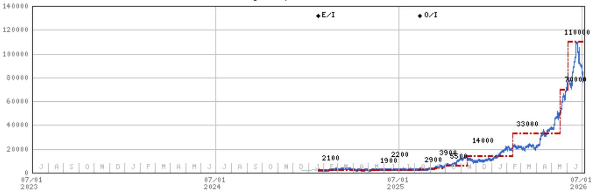

# KIOXIA Holdings (285A) | Japan

# 开始生产BiCS-10

Kioxia已在K2工厂开始生产BiCS-10，并已开始基于新技术的1Tb TLC产品的样品出货。

## 要点

K2工厂此前生产BiCS-8产品，而BiCS-10的引入将推动产能扩张。

与BiCS-8相比，BiCS-10的接口性能提升33%，位密度提高59%，能效也有所增强。

我们预计该技术将在提升KIOXIA面向数据中心和企业级存储应用的产品组合方面发挥重要作用。

Kioxia与SanDisk宣布开始生产BiCS-10：7月3日，KIOXIA宣布已开始出货采用其BiCS-10技术的1Tb TLC产品样品。此外，KIOXIA与SanDisk（由我们的美国半导体分析师Joseph Moore覆盖）宣布，已在北上工厂的K2工厂开始生产BiCS-10。K2工厂于2025年9月投产，此前生产BiCS-8。随着BiCS-10的引入，两家公司计划进一步扩大产量。

KIOXIA的BiCS-8结合了平面缩小、CMOS直接键合阵列（CBA）技术以及增加层数，以提供有竞争力的产品。该公司预计，到2027年3月底，其GB产量的80%将过渡到BiCS-8。

BiCS-10将接口性能从BiCS-8的3.6Gbps提升至4.8Gbps，提升了33%。该技术旨在满足支持PCIe Gen 6和Gen 7的下一代SSD的需求，这些SSD需要更高的带宽来处理AI工作负载。与BiCS-8相比，BiCS-10的位密度提高了59%，写入操作能效提升了18%，读取操作能效提升了30%。

该公司预计，基于BiCS-10的1Tb TLC产品将部署于高性能SSD中，包括KIOXIA CM系列，该系列被设计为高吞吐量、低延迟的SSD，能够支持KV缓存架构，并有效作为内存层次结构的一部分发挥作用。

我们的看法：我们预计，KIOXIA在2026年至2027年上半年期间，数据中心和企业级存储市场收入的增长，以及GB成本的持续下降，将主要由基于BiCS-8技术的产品推动。

从中期来看，该公司旨在将数据中心和企业级产品的收入占比从目前的30-40%提升至60%以上。实现这一目标可能取决于基于BiCS-10技术的SSD的成功商业化。我们将关注BiCS-10产品的认证进展以及K2工厂BiCS-10产能扩张的步伐。

MS MUFG SECURITIES CO., LTD.+

Kazuo Yoshikawa, CFA

股票分析师

Kazuo.Yoshikawa@morganstanleymufg.com +81 3 6836-8408

Hidetaka Suzuki

研究助理

Hidetaka.Suzuki@morganstanleymufg.com

+81 3 6836-8402

## KIOXIA Holdings (285A.T, 285A JP)

日本半导体 | 日本

<table><tr><td>股票评级</td><td>增持</td></tr><tr><td>行业观点</td><td>中性</td></tr><tr><td>目标价</td><td>¥110,000</td></tr><tr><td>目标价上行/下行空间 (%)</td><td>32</td></tr><tr><td>股价，收盘价 (2026年7月3日)</td><td>¥83,300</td></tr><tr><td>市值，当前，基本 (十亿)</td><td>¥45,489.0</td></tr><tr><td>股息率 (03/27e) (%)</td><td>2.2</td></tr></table>

<table><tr><td>财年截止</td><td>03/26</td><td>03/27e</td><td>03/28e</td><td>03/29e</td></tr><tr><td>收入，净额 (十亿日元)</td><td>2,337.6</td><td>8,541.7</td><td>9,487.9</td><td>8,783.1</td></tr><tr><td>营业利润 (十亿日元)*</td><td>870.4</td><td>6,802.3</td><td>7,569.8</td><td>6,722.6</td></tr><tr><td>净利润 (十亿日元)*</td><td>554.5</td><td>4,796.2</td><td>5,379.4</td><td>4,815.1</td></tr><tr><td>每股收益，基本 (日元)*</td><td>1,024.1</td><td>8,782.8</td><td>9,850.9</td><td>8,817.4</td></tr><tr><td>先前每股收益，基本 (日元)*</td><td>-</td><td>-</td><td>-</td><td>-</td></tr><tr><td>每股收益 (日元)**</td><td>1,033.6</td><td>8,784.4</td><td>9,852.4</td><td>8,819.0</td></tr><tr><td>先前每股收益 (日元)**</td><td>-</td><td>-</td><td>-</td><td>-</td></tr><tr><td>市盈率，基本*</td><td>18.6</td><td>9.5</td><td>8.5</td><td>9.4</td></tr><tr><td>市净率，基本</td><td>7.4</td><td>8.7</td><td>4.8</td><td>3.4</td></tr><tr><td>净资产回报表现 (%)*</td><td>75.2</td><td>342.8</td><td>103.2</td><td>50.7</td></tr><tr><td>企业价值/息税折旧摊销前利润，基本</td><td>8.7</td><td>5.9</td><td>4.7</td><td>4.7</td></tr></table>

除非另有说明，所有指标均基于MS ModelWare框架
\* = 基于GAAP或近似GAAP
\*\* = 基于一致预期方法
e = MS估计

MS与所覆盖的公司有业务往来并寻求开展业务。因此，读者应注意，该公司可能存在影响MS客观性的利益冲突。读者应将MS视为做出决策的单一因素之一。

有关分析师认证和其他重要披露，请参阅本报告末尾的披露部分。

+= 受雇于非美国关联公司的分析师未在FINRA注册，可能不是该成员的关联人士，并且可能不受FINRA关于与主题公司沟通、公开露面以及交易研究分析师账户持有的证券的限制。

## 估值方法与风险

## KIOXIA Holdings (285A.T)

FY3/28e 自由现金流回报表现为10%：考虑到公司强劲的自由现金流前景、股东回报政策以及AI推理驱动的显著增长潜力，我们认为约10%的自由现金流回报表现应为公司报价提供足够支撑。基于我们对FY3/28每股收益预测的目标价隐含市盈率为11倍。

## 上行风险

AI驱动的终端需求增长和供给侧调整导致NAND闪存供需状况改善超预期

SSD市场份额增长

## 下行风险

终端需求下降、中国企业产能扩张导致NAND闪存供需状况恶化时间长于预期

日元升值（我们估计日元兑美元每升值1日元，年度营业利润减少约60亿日元）

## 披露部分

MS中的信息和意见由MS MUFG Securities Co., Ltd.及其关联公司（统称“MS”）编制。

有关重要披露、股价图表和本报告所涉公司的股权评级历史，请参阅MS披露网站 www.morganstanley.com/eqr/disclosures/webapp/generalresearch，或联系您的投资代表或MS，地址：1585 Broadway, (Attention: Research Management), New York, NY, 10036 USA。

有关本研究报告中所引用的任何推荐、评级或目标价相关的估值方法和风险，请联系客户支持团队，联系方式如下：美国/加拿大 +1 800 303-2495；香港 +852 2848-5999；拉丁美洲 +1 718 754-5444 (美国)；伦敦 +44 (0)20-7425-8169；新加坡 +65 6834-6860；悉尼 +61 (0)2-9770-1505；东京 +81 (0)3-6836-9000。或者，您也可以联系您的投资代表或MS，地址：1585 Broadway, (Attention: Research Management), New York, NY 10036 USA。

## 分析师认证

以下分析师特此证明，他们对本报告所讨论的公司及其证券的看法准确表达，并且他们没有也不会因表达具体的推荐或观点而直接或间接获得补偿：Kazuo Yoshikawa, CFA。

## 全球研究冲突管理政策

MS已根据我们的冲突管理政策发布，该政策可在 www.morganstanley.com/institutional/research/conflictpolicies 获取。该政策的葡萄牙语版本可在 www.morganstanley.com.br 找到。

## 关于主题公司的重要监管披露

截至2026年5月29日，MS实益拥有MS所覆盖的以下公司一类普通股证券的1%或以上：KIOXIA Holdings、Renesas Electronics、Rohm、Socionext。

在过去12个月内，MS管理或联合管理了KIOXIA Holdings的证券公开发行（或144A发行）。

在过去12个月内，MS已因投资银行服务从HOYA、KIOXIA Holdings获得补偿。

在未来3个月内，MS预计将寻求或打算寻求从HOYA、KIOXIA Holdings、Renesas Electronics、Rohm、Socionext获得投资银行服务补偿。在过去12个月内，MS已向或正在向以下公司提供投资银行服务，或与以下公司存在投资银行客户关系：HOYA、KIOXIA Holdings、Renesas Electronics、Rohm、Socionext。

在过去12个月内，MS已向或正在向以下公司提供非投资银行、证券相关服务，和/或过去已签订协议提供服务，或与以下公司存在客户关系：Renesas Electronics。

主要负责编制MS的股权研究分析师或策略师的薪酬基于多种因素，包括研究质量、读者客户反馈、选股、竞争因素、公司收入和整体投资银行收入。股权研究分析师或策略师的薪酬不与MS执行的投行或资本市场交易或特定交易台的盈利能力或收入挂钩。

MS及其关联公司与MS所覆盖的公司/工具开展业务，包括做市、提供流动性、基金管理、商业银行、信贷扩展、投资服务和投资银行。MS以自营方式向客户买卖MS所覆盖公司的证券/工具。MS可能持有本报告讨论的公司债务或工具的头寸。MS可能作为自营交易商交易作为债务研究报告主题的债务证券（或相关衍生品）。

上述某些披露也是为了遵守非美国司法管辖区的适用法规。

## 股票评级

MS使用相对评级系统，使用诸如增持、等权重、未评级或减持等术语（定义见下文）。MS不对我们覆盖的股票分配买入、持有或报告评级。增持、等权重、未评级和减持不等同于买入、持有和卖出。读者应仔细阅读MS中使用的所有评级的定义。此外，由于MS包含分析师观点的更完整信息，读者应仔细阅读整个MS，而不仅仅从评级推断内容。在任何情况下，评级（或研究）都不应被用作或依赖为研究交流。读者买卖股票的决定应取决于个人情况（例如读者现有持仓）和其他考虑因素。

## 全球股票评级分布

## （截至2026年6月30日）

下文描述的股票评级适用于MS的基础股权研究，不适用于公司生产的债务研究。

出于披露目的（根据FINRA要求），我们在增持、等权重、未评级和减持评级旁边包含了买入、持有和卖出的类别标题。MS不对我们覆盖的股票分配买入、持有或报告评级。增持、等权重、未评级和减持不等同于买入、持有和卖出，而是代表推荐的相对权重（见下文定义）。为满足监管要求，我们将增持（我们最积极的股票评级）对应为买入推荐；我们将等权重和未评级对应为持有，将减持对应为卖出推荐。

<table><tr><td></td><td colspan="2">覆盖范围</td><td colspan="3">投行客户 (IBC)</td><td colspan="2">其他重要投资服务客户 (MISC)</td></tr><tr><td>股票评级类别</td><td>数量</td><td>占总计百分比</td><td>数量</td><td>占IBC总计百分比</td><td>占评级类别百分比</td><td>数量</td><td>占其他MISC总计百分比</td></tr><tr><td>增持/买入</td><td>1544</td><td>42%</td><td>453</td><td>49%</td><td>29%</td><td>757</td><td>44%</td></tr><tr><td>等权重/持有</td><td>1577</td><td>43%</td><td>390</td><td>42%</td><td>25%</td><td>769</td><td>44%</td></tr><tr><td>未评级/持有</td><td>3</td><td>0%</td><td>1</td><td>0%</td><td>33%</td><td>1</td><td>0%</td></tr><tr><td>减持/卖出</td><td>544</td><td>15%</td><td>89</td><td>10%</td><td>16%</td><td>204</td><td>12%</td></tr><tr><td>总计</td><td>3,668</td><td></td><td>933</td><td></td><td></td><td>1731</td><td></td></tr></table>

数据包括当前已分配评级的普通股和ADR。投行客户是指过去12个月内MS从中获得投行服务补偿的公司。由于四舍五入，“占总计百分比”列中的百分比相加可能不等于100%。

## 分析师股票评级

增持 (O)。预计该股票在未来12-18个月内，在风险调整基础上，其总回报将超过分析师行业（或行业团队）覆盖范围的平均总回报。

等权重 (E)。预计该股票在未来12-18个月内，在风险调整基础上，其总回报将与分析师行业（或行业团队）覆盖范围的平均总回报一致。

未评级 (NR)。目前分析师对该股票相对于分析师行业（或行业团队）覆盖范围平均总回报的总回报没有足够的信心。

减持 (U)。预计该股票在未来12-18个月内，在风险调整基础上，其总回报将低于分析师行业（或行业团队）覆盖范围的平均总回报。

除非另有说明，MS中包含的目标价时间范围为12至18个月。

## 分析师行业观点

有吸引力 (A)：分析师预计其行业覆盖范围在未来12-18个月内的表现相对于相关广泛市场基准具有吸引力，如下所示。

中性 (I)：分析师预计其行业覆盖范围在未来12-18个月内的表现将与相关广泛市场基准一致，如下所示。谨慎 (C)：分析师认为其行业覆盖范围在未来12-18个月内的表现相对于相关广泛市场基准需要谨慎，如下所示。各区域基准如下：北美 - 标普500；拉丁美洲 - 相关MSCI国家指数或MSCI拉丁美洲指数；欧洲 - MSCI欧洲；日本 - TOPIX；亚洲 - 相关MSCI国家指数或MSCI次区域指数或MSCI AC亚太（除日本）指数。

## 股价、目标价和评级历史（见评级定义）

11/14/25 : 14000; 2/12/26 : 33000; 5/18/26 : 70000; 6/2/26 : 110000

KIOXIA Holdings (285A.T) - 截至 2026年7月5日 GMT 以日元计价  
行业：日本半导体  
  
股票评级历史：1/20/25 : E/I; 8/12/25 : 0/I  
来源：MS 日期格式：MM/DD/YY 目标价 = 未分配目标价 (NA)  
股价（非当前分析师覆盖）— 股价（当前分析师覆盖）  
股票和行业评级（缩写如下）显示为 ♦ 股票评级/行业观点  
股票评级：增持 (O) 等权重 (E) 减持 (U) 未评级 (NR) 无可用评级 (NA)  
行业观点：有吸引力 (A) 中性 (I) 谨慎 (C) 无评级 (NR)  
自2014年1月13日起，MS亚太地区覆盖的股票将相对于分析师行业（或行业团队）覆盖范围进行评级。  
自2014年1月13日起，MS亚太地区的行业观点基准如下：相关MSCI国家指数或MSCI次区域指数或MSCI AC亚太（除日本）指数。

## MS Smith Barney LLC 客户的重要披露

关于任何可能合理预期会影响MS Smith Barney LLC选择第三方研究提供商或第三方研究报告主题公司的重大利益冲突的重要披露，可在MS财富管理披露网站 www.morganstanley.com/online/researchdisclosures 获取。有关MS的具体披露，您可以参考 https://www.morganstanley.com/eqr/disclosures/webapp/generalresearch。

每份MS报告均代表MS Smith Barney LLC进行审查和批准。此审查和批准由代表MS审查研究报告的同一人进行。这可能会产生利益冲突。

## 其他重要披露

MS政策是根据研究分析师和研究管理层认为适当的情况，基于对发行人、行业或市场可能对其中所述研究观点或意见产生重大影响的发展，更新研究报告。此外，某些研究出版物旨在定期更新（每周/每月/每季度/每年），并且通常会按此频率更新，除非研究分析师和研究管理层根据当前情况确定不同的发布时间表更合适。

MS不担任市政顾问，本文所含意见或观点无意构成，也不构成《多德-弗兰克华尔街改革和消费者保护法》第975条含义内的建议。

MS生产一种称为“战术观点”的股权研究产品。关于特定股票的“战术观点”中包含的观点可能与同一股票研究中表达的推荐或观点相反。这可能是由于不同的时间范围、方法、市场事件或其他因素造成的。有关特定股票的所有研究，请联系您的销售代表或访问Matrix网站 http://www.morganstanley.com/matrix。

MS通过我们专有的研究门户网站Matrix提供给我们的客户，并由MS以电子方式分发给客户。某些（但非全部）MS产品也通过第三方供应商提供给客户，或通过替代电子方式重新分发给客户，以方便起见。要访问所有可用的MS，请联系您的销售代表或访问Matrix网站 http://www.morganstanley.com/matrix。

任何对MS的访问和/或使用均受MS使用条款 (http://www.morganstanley.com/terms.html) 的约束。通过访问和/或使用MS，即表示您已阅读并同意受我们的使用条款 (http://www.morganstanley.com/terms.html) 的约束。此外，您同意MS根据我们的隐私政策和全球Cookie政策 (http://www.morganstanley.com/privacy_pledge.html) 处理您的个人数据并使用Cookie，包括用于设置您的偏好和收集读者数据，以便我们为您提供更好、更个性化的服务和产品。要了解有关MS如何处理个人数据、我们如何使用Cookie以及如何拒绝Cookie的更多信息，请参阅我们的隐私政策和全球Cookie政策 (http://www.morganstanley.com/privacy_pledge.html)。请使用提供的链接查看MS India Company Private Limited的条款和条件以及最重要的条款和条件 (https://www.morganstanley.com/assets/pdfs/about-us-global-offices/india/Terms_and_conditions.pdf)，以及以下链接查看审计报告 (https://ny.matrix.ms.com/eqr/research/webapp/researchdocs/MSICPL_Morgan_Stanley_Research_Audit_Report.pdf)。

如果您不同意我们的使用条款和/或不希望同意MS处理您的个人数据或使用Cookie，请不要访问我们的研究。MS不提供针对个人的研究交流。MS的编制未考虑接收者的个人情况和目标。MS建议读者独立评估特定的投资和策略，并鼓励读者寻求财务顾问的建议。

投资或策略的适当性取决于读者的个人情况和目标。MS中讨论的证券、工具或策略可能不适合所有读者，某些读者可能没有资格购买或参与其中部分或全部。MS不是买入或卖出要约，也不是招揽买入或卖出任何证券/工具或参与任何特定交易策略的要约。您的研究价值和收入可能因利率、汇率、违约率、提前还款率、证券/工具价格、市场指数、公司的运营或财务状况或其他因素的变化而波动。期权或其他证券/工具交易权利的行使可能存在时间限制。过往表现不一定是未来表现的指引。对未来表现的估计基于可能无法实现的假设。如果提供，除非另有说明，封面上的收盘价是主题公司证券/工具主要交易所的收盘价。

主要负责编制MS的固定收益研究分析师、策略师或经济学家的薪酬基于多种因素，包括研究的质量、准确性和价值、公司盈利能力或收入（包括固定收益交易和资本市场盈利能力或收入）、客户反馈和竞争因素。固定收益研究分析师、策略师或经济学家的薪酬不与MS执行的投行或资本市场交易或特定交易台的盈利能力或收入挂钩。

MS中的“关于主题公司的重要监管披露”部分列出了MS持有公司一类普通股证券1%或以上的所有提及公司。对于MS中提及的所有其他公司，MS可能持有少于1%的证券/工具或公司证券/工具衍生品，并且可能以与MS中讨论不同的方式进行交易。未参与MS编制的MS员工可能持有提及公司的证券/工具或衍生品，并且可能以与MS中讨论不同的方式进行交易。衍生品可能由MS或关联人士发行。

除有关MS的信息外，MS基于公开信息。MS尽一切努力使用可靠、全面的信息，但我们不保证其准确或完整。我们没有义务在MS中的意见或信息发生变化时通知您，除非我们打算停止对主题公司的股权研究覆盖。MS中提出的事实和观点未经MS其他业务领域（包括投行人员）的专业人员审查，可能不反映他们所了解的信息。

MS人员可能参与公司活动，例如实地考察，并且通常被禁止接受公司支付相关费用，除非获得研究管理授权成员的预先批准。

MS可能做出与本报告中的推荐或观点不一致的投资决策。

致我们在台湾的读者或在台湾交易证券/工具的读者：在台湾交易的证券/工具信息由MS Taiwan Limited ("MSTL") 分发。此类信息仅供您参考。读者应独立评估投资风险，并对其投资决策全权负责。未经MS明确书面同意，MS不得向公共媒体分发，或被公共媒体引用或使用。在台湾证券交易所推荐规定第7-1条范围内的任何非客户读者访问和/或接收MS，不得将MS提供给任何第三方（包括但不限于关联方、关联公司和任何其他第三方）或从事任何可能产生或造成利益冲突表象的与MS相关的活动。不在台湾交易的证券/工具信息仅供参考，不得解释为推荐或招揽交易此类证券/工具。MSTL不得为客户执行这些证券/工具的交易。

MS非根据中国法律成立，本报告相关研究在中国境外进行。MS不构成在中国境内出售任何证券的要约或招揽购买任何证券的要约。中国读者应具有投资此类证券的相关资格，并应自行负责从相关政府机构获得所有必要的批准、许可、验证和/或注册。本报告或其任何部分均无意作为，也不构成中国法律定义的证券投资咨询或顾问服务。此类信息仅供您参考。

MS在巴西由MS C.T.V.M. S.A. 分发，地址为 Av. Brigadeiro Faria Lima, 3600, 6th floor, São Paulo - SP, Brazil；并受 Comissão de Valores Mobiliários 监管；在墨西哥由MS México, Casa de Bolsa, S.A. de C.V 分发，受 Comision Nacional Bancaria y de Valores 监管，地址为 Paseo de los Tamarindos 90, Torre 1, Col. Bosques de las Lomas Floor 29, 05120 Mexico City；在日本由MS MUFG Securities Co., Ltd. 分发，对于商品相关研究报告，由MS Capital Group Japan Co., Ltd 分发；在香港由MS Asia Limited（对其内容负责）和MS Bank Asia Limited 分发；在新加坡由MS Asia (Singapore) Pte. (注册号 199206298Z) 和/或 MS Asia (Singapore) Securities Pte Ltd (注册号 200008434H) 分发，受新加坡金融管理局监管（对其内容负责，如有任何与本报告相关的问题，应联系该机构），以及由MS Bank Asia Limited, Singapore Branch (注册号 T14FC0118) 分发；在澳大利亚向《澳大利亚公司法》定义的“批发客户”由MS Australia Limited A.B.N. 67 003 734 576 分发，持有澳大利亚金融服务许可证号 233742，对其内容负责；在澳大利亚向《澳大利亚公司法》定义的“批发客户”和“零售客户”由MS Wealth Management Australia Pty Ltd (A.B.N. 19 009 1445 555, 持有澳大利亚金融服务许可证号 240813) 分发，对其内容负责；在韩国由MS & Co International plc, Seoul Branch 分发；在印度由MS India Company Private Limited 分发，公司识别号 (CIN) U22990MH1998PTC115305，受印度证券交易委员会 (SEBI) 监管，持有研究分析师 (SEBI 注册号 INH000001105)、股票经纪人 (SEBI 股票经纪人注册号 INZ000244438)、商人银行家 (SEBI 注册号 INM000011203) 以及国家证券存管有限公司存管参与者 (SEBI 注册号 IN-DP-NSDL-567-2021) 的许可证，注册办公地址为 Altimus, Level 39 & 40, Pandurang Budhkar Marg, Worli, Mumbai 400018, India；电话 +91-22-61181000；合规官详情：Mr. Tejarshi Hardas, 电话：+91-22-61181000 或电子邮件：tejarshi.hardas@morganstanley.com；投诉官详情：Mr. Tejarshi Hardas, 电话：+91-22-61181000 或电子邮件：msic-compliance@morganstanley.com。MS India Company Private Limited (MSICPL) 可能使用AI工具提供研究服务。本文所含所有推荐均由合格的研究分析师做出；在加拿大由MS Canada Limited 分发；在德国和欧洲经济区（如需要）由MS Europe S.E. 分发，由 Bundesanstalt fuer Finanzdienstleistungsaufsicht (BaFin) 授权和监管，参考号 149169；在美国由MS & Co. LLC 分发，对其内容负责。MS & Co. International plc，由审慎监管局授权并由金融行为监管局和审慎监管局监管，在英国分发其自身编制的研究以及其任何关联公司编制的研究，仅面向 (i) 属于《2000年金融服务和市场法（金融促进）2005年令》（经修订，“该令”）第19(5)条范围内的投资专业人士；(ii) 属于该令第49(2)(a)至(d)条范围内的高净值实体；或 (iii) 可以合法地以其他方式传达或促使传达参与投资活动（根据经修订的《2000年金融服务和市场法》第21条的含义）的邀请或诱导的人士。RMB MS Proprietary Limited 是 JSE Limited 和 A2X (Pty) Ltd 的成员。RMB MS Proprietary Limited 是一家合资企业，由 MS International Holdings Inc. 和 RMB Investment Advisory (Proprietary) Limited（由 FirstRand Limited 全资拥有）各占50%股份。MS中的信息由MS Saudi Arabia 分发，受沙特阿拉伯王国资本市场管理局监管，仅面向成熟读者。

MS中的信息由MS & Co. International plc (DIFC Branch) 传达，受迪拜金融服务管理局 (DFSA) 监管，或由MS & Co. International plc (ADGM Branch) 传达，受阿布扎比金融服务监管局 (FSRA) 监管，并且仅面向DFSA或FSRA（视情况而定）定义的专业客户。本研究所涉及的金融产品或金融服务将仅提供给我们确信符合专业客户监管标准的客户。不同MS研究评级或推荐的分布，按所覆盖的每个行业的投资百分比计算，可向您的销售代表索取。

MS中的信息由MS & Co. International plc (QFC Branch) 传达，受卡塔尔金融中心监管局 (QFCRA) 监管，并且仅面向商业客户和市场交易对手，不面向QFCRA定义的零售客户。

根据土耳其资本市场委员会的要求，此处提供的投资信息、评论和建议不属于投资咨询服务的范围。投资咨询服务仅由授权公司根据个人的风险和收益偏好提供。此处提供的评论和建议具有一般性质。这些意见可能不适合您的财务状况、风险和收益偏好。因此，仅依赖此处提供的信息做出投资决策可能不会产生符合您预期的结果。

MS中包含的商标和服务标志是其各自所有者的财产。第三方数据提供商不对其提供的数据的准确性、完整性或及时性做出任何保证或陈述，并且不对由此类数据引起的任何损害承担责任。全球行业分类标准 (GICS) 由 MSCI 和 S&P 开发，是其专有财产。

MS或其任何部分未经MS书面同意不得转载、出售或重新分发。

MS中引用的指标和追踪器不得用作或被视为欧盟2016/1011法规或任何其他类似框架下的基准。

某些固定收益研究报告中推荐或讨论的发行人和/或固定收益产品可能不会被持续跟踪。因此，读者应将此类固定收益研究报告视为提供独立分析，不应期望对此类发行人和/或个别固定收益产品进行持续分析或额外报告。MS可能不时持有研究报告主题公司的重大财务和商业利益。

SEBI授予的注册和印度证券市场协会 (NISM) 的认证绝不保证中介机构的业绩或向读者提供任何回报保证。证券市场投资存在市场风险。投资前请仔细阅读所有相关文件。

## 行业覆盖：日本半导体

<table><tr><td>公司 (股票代码)</td><td>评级 (截至)</td><td>价格* (2026年7月3日)</td></tr><tr><td colspan="3">Kazuo Yoshikawa, CFA</td></tr><tr><td>HOYA (7741.T)</td><td>E (2023年10月30日)</td><td>¥25,930</td></tr><tr><td>KIOXIA Holdings (285A.T)</td><td>O (2025年8月12日)</td><td>¥83,300</td></tr><tr><td>Renesas Electronics (6723.T)</td><td>O (2019年11月26日)</td><td>¥4,820</td></tr><tr><td>Rohm (6963.T)</td><td>++</td><td>¥5,950</td></tr><tr><td>Socionext (6526.T)</td><td>U (2026年1月27日)</td><td>¥2,874</td></tr></table>

股票评级可能会发生变化。请参阅每家公司的最新研究。

\* 历史价格未进行拆股调整。

## © 2026 MS MUFG
