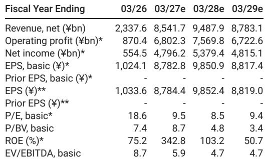

# MS：Kioxia BiCS 10量产，AI存储的下一张牌已经打出

一份关于日本存储芯片公司Kioxia的技术更新研报，看似是产品迭代的常规更新，但放在当前AI基础设施发展的背景下，它揭示了一个更关键的结构性变化：NAND闪存正在从“容量供给”转向“性能架构”竞争。MS在7月初发布的这份报告，核心判断并非BiCS-10本身的技术参数，而是它如何改变Kioxia在数据中心市场的产品定位。

报告发布的时间点值得注意。Kioxia的K2工厂在2025年9月才投产，原本生产BiCS-8产品，如今不到一年就切换至BiCS-10。这种快速迭代背后，是AI推理工作负载对存储带宽和能效的迫切需求——而Kioxia正试图用技术代差，在数据中心和企业级市场打开新的空间。

## 1. 技术参数的跃升，指向的是AI存储架构的重新定义

BiCS-10与上一代BiCS-8的对比数字看似枯燥，但放在特定场景下才有意义。接口性能从3.6Gbps提升至4.8Gbps，提升33%；位密度增加59%；写入能效提升18%，读取能效提升30%。这些参数组合起来，指向的是一个具体目标：支持PCIe Gen 6和Gen 7接口的下一代SSD。

> **KC评论：** 存储芯片行业过去几年最常讲的故事是“层数堆叠”和“容量成本下降”。但BiCS-10的亮点不是层数增加，而是接口带宽和能效的同步提升。这意味着Kioxia判断，AI推理场景下，存储瓶颈已经从容量转移到带宽和功耗。这是一个值得行业关注的信号。

## 2. 数据中心收入占比弹性较高的目标，技术基础已具备，但商业化节奏仍是关键

报告明确指出，Kioxia当前数据中心和企业级产品收入占比为30-40%，公司目标是将其提升至60%以上。中期来看，这一目标的实现高度依赖BiCS-10技术SSD的商业化成功。但短期（2026年至2027年上半年）的收入增长主力，仍将是基于BiCS-8的产品。

这里有一个重要的时间差。BiCS-8到2027年3月才预计完成80%的GB产出切换，而BiCS-10刚刚开始样品出货。这意味着未来12-18个月，Kioxia需要同时管理两代产品的产能爬坡和客户导入。

> **KC评论：** 报告的隐含判断是，BiCS-10的客户认证速度和K2工厂的产能扩张节奏，将直接决定Kioxia能否在2027年后真正兑现数据中心市场的增长故事。这是读者需要持续跟踪的两个关键变量。

## 3. 报告尚未完全回答的关键问题：客户生态与竞争格局

研报对技术细节和产能规划着墨较多，但对两个关键问题着墨有限。第一，BiCS-10的客户认证进展到哪一步？报告提到“将监控BiCS-10产品的认证”，说明目前仍处于早期阶段。第二，在三星、SK海力士、美光等竞争对手的路线图面前，BiCS-10的差异化窗口能持续多久？

另一个未解问题是，Kioxia与SanDisk的合作关系在BiCS-10时代如何具体分工。报告提到双方联合宣布量产，但未展开成本分担和产能分配细节。

这些问题不是报告的缺陷，而是留给读者的思考空间。技术领先是一回事，能否转化为可持续的客户关系和市场份额是另一回事。

## 4. 对产业观察者的框架：从“层数竞赛”到“性能架构”的范式转移

这份报告提供了一个观察NAND闪存行业的新框架。过去十年，行业竞争焦点是3D NAND的层数堆叠，谁层数高谁成本低。但BiCS-10的发布表明，AI工作负载正在改变竞争维度——接口带宽、能效、位密度三者需要同时优化，而非单一指标。

这意味着，未来评估一家NAND厂商的竞争力，不能只看层数和容量，还要看其技术架构能否适配AI存储的特定需求。Kioxia的CMOS直接键合阵列（CBA）技术，以及BiCS-10对KV缓存架构的支持，都是在这一新维度下的布局。

完整报告中包含的技术参数对比表、产能爬坡时间线以及财务预测细节，对于理解这一转型的节奏和幅度至关重要。这些内容已经整理进当天的国际信源汇编，适合与AI基础设施、存储芯片行业的其他报告横向对比阅读。

For informational purposes only. Portions may be generated,translated,summarized,or edited with AI assistance based on source materials and may contain omissions or errors. Please verify independently. This is not investment,legal,tax,accounting,or other professional advice.

For informational purposes only. Portions may be generated,translated,summarized,or edited with AI assistance based on source materials and may contain omissions or errors. Please verify independently. This is not investment,legal,tax,accounting,or other professional advice.

