# Greater China Semiconductors | Asia Pacific

# CPO Supply Chain Updates; More on GlassBridge

GlassBridge appears to be a strong solution, but remains far from mass production. We see TSMC scaling PIC capacity to 25kwpm in 2028, with Ins2 test efficiency improving. We maintain a constructive view on CPO enablers as market expectations are already low.

Further thoughts on GlassBridge impact on FAU: We do not rule out GlassBridge hampering Fiber Array Units' (FAU) TAM in the long run (link), but we have yet see any projects in TSMC's COUPE platform adopt this technology. On the other hand, GlassBridge mainly serves edge coupling and can currently support only one-dimension fiber layouts. However, TSMC's mainstream COUPE platform and key customer (NVIDIA, AMD, Ayar Labs) solutions for the next few years should still stick to grating coupling, as it is easier to achieve mass production, which we expect to see soon in 2H26. In addition, CPO requires integrated design and discussion across the entire ecosystem—including foundry (OE), chip designer, FAU, laser, and even system integrator—so it is difficult to change a design overnight.

Latest developments on PIC capacity: Although several difficulties remain (link), we continue to see green shoots. TSMC plans to ramp PIC capacity from 10kwpm in 2Q26 to 15kwpm in 4Q26, and to at least 25kwpm in 2028. Reflecting limited resources, we believe key COUPE MP customers in 2026–27 could be NVIDIA, Broadcom, and AMD. With more capacity seen for 2028, other customers such as MediaTek, Marvell, and Ayar Labs could mass produce their CPO projects at TSMC.

What about the progress in CPO insertion tests? CPO insertion tests are one of the key bottlenecks to mass production. However, Insertion 2 EPIC wafer test time has improved from a wafer a day in 2H25 to a wafer in six hours now, making the 3–4 hour target in the next 6–12 months no longer a distant dream. Many investors ask whether Insertion 2 could be a skipped process, but we regard this as less likely as it is the first stop/time to conduct simultaneous optical-electrical signal testing.

FOCI – CPO mass production to start in 3Q: We expect CPO MP revenue to begin in July and continue scaling to 2027, mainly for the Spectrum CPO switch. Besides NVIDIA, we expect its FAU shipments to AMD's MI500 series to start from 2H27, along with more MP customers in 2028.

Stock implications: We remain constructive on CPO development in the long run, and think investor expectations are very low for CPO stocks. We hold a positive view on Asia CPO enablers such as TSMC, ASE, FOCI, AllRing, MPI, Winway, and Hon Precision. We think TFC has a competitive edge in high-end FAU, and is less likely to face disruption from GlassBridge as it is more likely to replace low-end FAU at the initial stage. We believe Largan could face more competition if V-Groove is the major product, but if it is making the entire FAU, it needs to show competitiveness vs. existing players. In this report, we revise estimates for FOCI and AllRing.

MS TAIWAN LIMITED+

Tiffany Yeh
Equity Analyst
Tiffany.Yeh@morganstanley.com +886 2 7712-3032

Charlie Chan
Equity Analyst
Charlie.Chan@morganstanley.com +886 2 2730-1725

MS ASIA LIMITED+
Andy Meng, CFA
Equity Analyst
Andy.Meng@morganstanley.com +852 2239-7689

MS & CO. LLC

Meta A Marshall
Equity Analyst
Meta.Marshall@morganstanley.com +1 212 761-0430

MS TAIWAN LIMITED+

Daniel Yen, CFA
Equity Analyst
Daniel.Yen@morganstanley.com +886 2 2730-2863

  
GREATER CHINA TECHNOLOGY SEMICONDUCTORS
Asia Pacific
Industry View Attractive

MS does and seeks to do business with companies covered in MS. As a result, investors should be aware that the firm may have a conflict of interest that could affect the objectivity of MS. Investors should consider MS as only a single factor in making their investment decision.

For analyst certification and other important disclosures, refer to the Disclosure Section, located at the end of this report.

+= Analysts employed by non-U.S. affiliates are not registered with FINRA, may not be associated persons of the member and may not be subject to FINRA restrictions on communications with a subject company, public appearances and trading securities held by a research analyst account.

# What Is GlassBridge, and How Does It Differ from Traditional V-Groove FAU?

Traditional FAU is a mature, high-precision fiber-array assembly: fibers are placed into V-grooves on a glass/silicon/quartz substrate, fixed with a cover and adhesive, polished, and then aligned to a PIC or optical engine. It is proven, customizable, and very low-loss, but assembly becomes more difficult as channel count and density rise. Key FAU suppliers for CPO include vendors such as TFC Communication, FOCI, Senko, Browave and Sumitomo Electric. Corning has also said it is keen to develop several FAU solutions for CPO and NPO.

Exhibit 1: Corning's FAU/CPO demonstration  
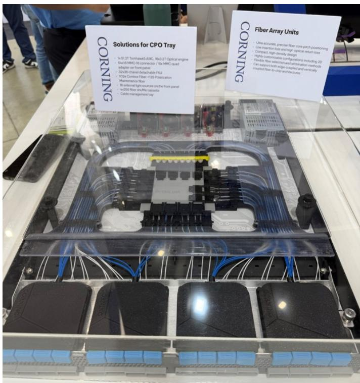  
Source: Corning, MS

Exhibit 2: FAU demonstration at Computex for Ayar Labs scale-up solution  
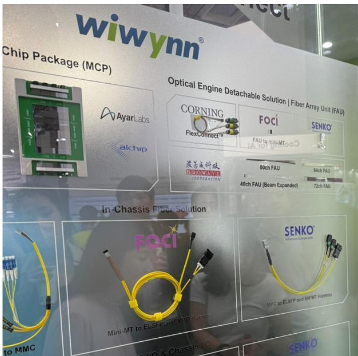  
Source: Wiwynn

Exhibit 3: TFC's FAU  
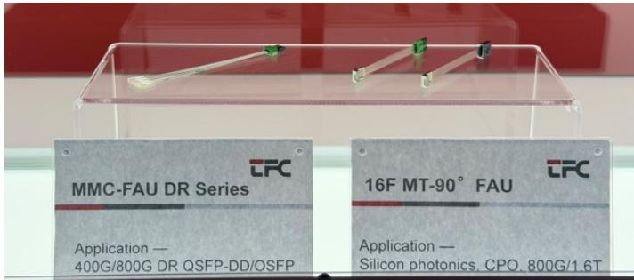  
Source: TFC

Exhibit 4: FOCI's FAU solution for CPO  
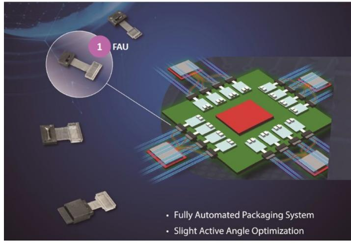  
Source: FOCI

Corning GlassBridge is a newer wafer-based glass interposer / connector approach. Instead of directly presenting a fiber array to the PIC edge, it uses glass ion-exchange waveguides and a detachable, passively aligned connector interface to bridge fiber to PIC. Corning positions it for NPO, CPO, and high-density photonic modules where manufacturability, reworkability, and density become major constraints.

Exhibit 5: GlassBridge Fiber-to-PIC Connector  
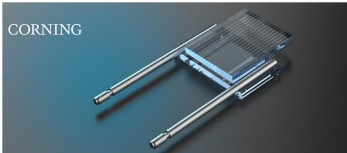  
Source: Corning  
Exhibit 6: Corning cites wafer-based high-volume

manufacturing, customizable pitches, detachable solutions and passive alignments as the key advantages of GlassBridge

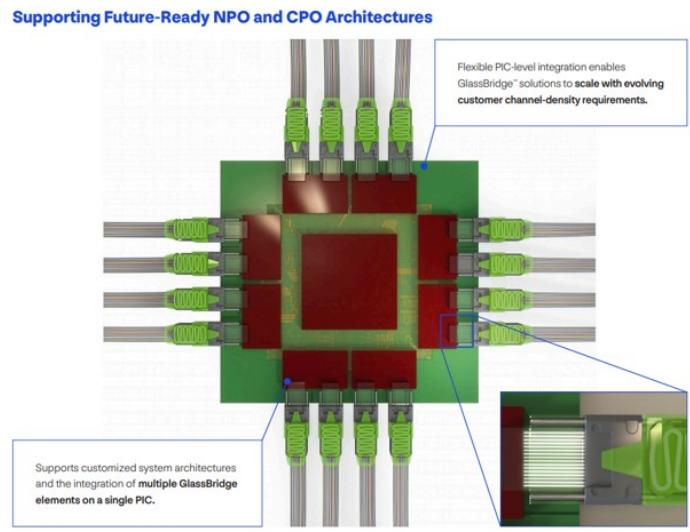  
Source: Corning

The main difference is not simply "new FAU vs old FAU." It is connectorized glass waveguide bridge vs. direct fiber-array attach.

A traditional FAU tries to solve the alignment problem by making the fiber array itself extremely accurate. The fibers are held in V-grooves, polished, and aligned to the optical chip. This is a direct and proven method. FOCI describes the fiber array as a carrier using V-grooves to fix multi-core fiber, with optical-path positioning determined by the precision V-groove and packaging/polishing process.

GlassBridge inserts a glass waveguide connector layer between the fiber side and the PIC side. That gives Corning more design freedom for pitch conversion, compact connector geometry, passive alignment, and detachability. Corning describes GlassBridge as using wafer-based glass ion-exchange waveguides for passive fiber-to-PIC coupling, and as an alternative that improves scalability and system integration at high fiber counts.

GlassBridge may not automatically be "lower loss" than a conventional FAU. Corning's brochure cites 1.5 dB O-band fiber-to-PIC coupling for GlassBridge, while traditional FAU component insertion loss can be far lower, although the final fiber-to-PIC coupling loss depends on the full assembly.

For today's conventional transceivers, PLC/PIC coupling, coherent optics, and many datacenter modules, traditional FAU from suppliers such as TFC, FOCI, Senko and others remains the mainstream solution. For next-generation CPO/NPO optical engines, where hundreds of optical lanes, tight PIC shoreline density, reflow-compatible assembly, testability, and field/service rework become critical, GlassBridge is a more system-level, connectorized architecture rather than just another FAU. It seems better viewed as a way to reduce the scaling pain of FAU-style direct attach, not as a universal replacement for every FAU use case.

Exhibit 7: Side-by-side comparison: Corning GlassBridge vs. Traditional FAU

<table><tr><td>Dimension</td><td>Corning GlassBridge</td><td>Traditional FAU (TFC / FOCI style)</td><td>Implication</td></tr><tr><td>Basic concept</td><td>Wafer-based glass connector/interposer using glass waveguides between fiber interface and PIC.</td><td>Direct fiber array: fibers fixed into precision V-grooves, bonded with cover/adhesive, and polished.</td><td>GlassBridge is more of a connectorized optical bridge; FAU is direct physical fiber positioning.</td></tr><tr><td>Coupling model</td><td>Fiber-to-PIC coupling through glass waveguides and passive alignment features.</td><td>Fiber cores are positioned mechanically by V-groove geometry and then aligned to chip/waveguide facets.</td><td>GlassBridge shifts some coupling complexity into a designed glass-waveguide interface.</td></tr><tr><td>Support</td><td>Edge Coupling</td><td>Could support both Grating and Edge Coupling</td><td>Traditional FAU could support both solution, which Grating coupling is the mainstream solution that TSMC's COUPE is adopting.</td></tr><tr><td>Manufacturing approach</td><td>Wafer-based glass processing with ion-exchange waveguides and scalable connector fabrication.</td><td>Precision dicing/cutting of substrate, fiber placement, adhesive bonding, cover attachment, polishing, and inspection.</td><td>GlassBridge is designed for scalable module assembly; FAU is mature but labor/process intensive at high counts, but now also migrating to automation.</td></tr><tr><td>Pitch flexibility</td><td>Supports pitch conversion between fiber pitch and fine PIC waveguide pitch, e.g., 40/80/127/165 μm classes.</td><td>Highly customizable pitches such as 127/250 μm or reduced-clad options, but physical fiber pitch limits remain important.</td><td>GlassBridge can act like an optical redistribution layer between fiber and PIC.</td></tr><tr><td>Optical loss</td><td>Published positioning emphasizes system-level fiber-to-PIC coupling; cited example around 1.5 dB O-band fiber-to-PIC coupling.</td><td>FAU component insertion loss can be very low; final fiber-to-PIC loss depends heavily on PIC facet, mode converter, gap, angle, and alignment.</td><td>Traditional FAU may win on component-level loss, while GlassBridge targets integration yield and density.</td></tr><tr><td>Thermal / assembly compatibility</td><td>Marketed as compatible with advanced module assembly including solder-reflow-compatible workflows.</td><td>Reliability depends on substrate, adhesive, fiber, and package process; many FAUs are qualified for telecom/datacom environments.</td><td>GlassBridge is attractive when optical attach must fit electronics-like assembly flows.</td></tr><tr><td>Customization</td><td>Likely more standardized around connector/PIC interface architectures and Corning's glass process platform.</td><td>Very customizable: fiber type, pitch, channel count, polishing angle, PM fiber, substrate material, termination, and packaging.</td><td>FAU remains strong for custom optical modules and specialized fiber-array needs.</td></tr><tr><td>Supply-chain maturity</td><td>Newer architecture; adoption tied to next-generation PIC/CPO ecosystems.</td><td>Long-established supplier base and manufacturing know-how across telecom/datacom/CPO.</td><td>FAU is lower adoption risk today; GlassBridge may offer more future scalability.</td></tr><tr><td>Best application fit</td><td>CPO/NPO optical engines, dense PIC shoreline coupling, testable/reworkable modules, and pitch-conversion-heavy designs.</td><td>Transceivers, coherent modules, PLC/AWG/WSS/ROADM, silicon photonics attach, and permanent fiber coupling.</td><td>Choose based on whether the priority is integration scalability or mature direct attach.</td></tr></table>

Source: Company data, MS

## Key Charts for CPO Development

For 2026, we expect total CPO switch shipments to be 23k units, mostly 100T switches, with NVIDIA's Spectrum switch taking the lion's share.

Looking to 2027, we expect total CPO switch shipments to reach 59k units, growing further to 200k units in total in 2030; this implies a 144% CAGR over 2024-30.

Our supply chain checks suggest that TSMC currently has ~500 wafers per month of PIC capacity. TSMC plans to ramp PIC capacity from 10kwpm in 2Q26 to 15kwpm in 4Q26 and to at least 25kwpm in 2028. Reflecting limited resources, we believe key COUPE MP customers in 2026–27 could be NVIDIA, Broadcom, and AMD. With more capacity in 2028, other customers such as MediaTek, Marvell, and Ayar Labs should also be able to mass-produce their CPO projects at TSMC.

## Exhibit 8: TSMC's PIC capacity: likely to reach 25 kwpm in 2027

TSMC PIC Capacity Planning  
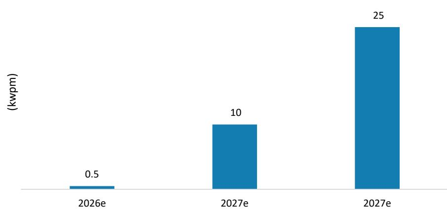  
Source: Company data, MS (e) estimates

Exhibit 9: Annual optical engine output from PIC capacity planning; we think this is likely to increase over time as yield rate ramps

<table><tr><td></td><td>2026e</td><td>2027e</td><td>2027e</td></tr><tr><td>TSMC PIC capacity (kwpm)</td><td>0.5</td><td>10</td><td>25</td></tr><tr><td>Die per wafer</td><td>648</td><td>648</td><td>648</td></tr><tr><td>Annual PIC production (mn)</td><td>4</td><td>78</td><td>194</td></tr><tr><td>SoIC yield rate</td><td>50%</td><td>50%</td><td>50%</td></tr><tr><td>Optical engine production (mn)</td><td>2</td><td>39</td><td>97</td></tr><tr><td>Downstream assembly yield rate</td><td>20%</td><td>20%</td><td>50%</td></tr><tr><td>Actual Optical engine shipment (mn)</td><td>0.39</td><td>7.78</td><td>48.60</td></tr></table>

Source: Company data, MS (e) estimates

Exhibit 10: CPO Insertion Test Flow

<table><tr><td rowspan="2">Test Insertion</td><td rowspan="2">Insertion 1 (wafer-level)</td><td rowspan="2">Insertion 2 (wafer-level)</td><td rowspan="2">Insertion 3 (die-level)/3.5 (package-level)</td><td colspan="2">Insertion 4 (module-level)</td><td rowspan="2">Insertion 5 (potential)</td></tr><tr><td>Insertion 4O</td><td>Insertion 4E</td></tr><tr><td>Test content</td><td>Electronic IC (EIC) & Photonic IC (PIC)</td><td>EIC die to PIC wafer (after SoIC)</td><td>Optical engine (die-to-die)</td><td>CPO package (ASIC+OE) Optical Testing</td><td>CPO package (ASIC+OE)Electrical Testing (2025-2026)Optical+Electrical Testing (starting</td><td>CPO package (ASIC+OE) SLT?</td></tr><tr><td>Testing surface</td><td></td><td></td><td>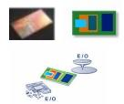</td><td colspan="2">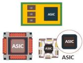</td><td></td></tr><tr><td rowspan="2">Key Product timeline</td><td colspan="5">2025-2026 Scale-out CPO switch (Spectrum+Quantum) products</td><td rowspan="2"></td></tr><tr><td colspan="5">2027e onward: Scale-out CPO switch (Spectrum+Quantum) + Scale-up CPO switch products</td></tr><tr><td>Testing details</td><td>El. & opt. DC, (power, loss, dark current etc.)</td><td>E/O, O/E, O/O, high speed,S-parameters</td><td>Full calibration/DC,high-speed functional,optical loopback,alternatively:S-parameters</td><td>Optical Light Transmission Testing,optical loopback</td><td>BER testing, signal testing</td><td>Full system functional validation</td></tr><tr><td>Testing service provider</td><td>Foundry(Wafer-level)TSMC</td><td>Foundry(Wafer-level)TSMC</td><td>OSAT(Die/chip level)SPIL (ASE Group)</td><td>OSAT(Die/package level)SPIL (ASE Group)</td><td>OSAT(Die/package level)SPIL (ASE Group)</td><td>OSAT(Die/package level)SPIL (ASE Group)</td></tr><tr><td>Equipment and Consumable Vendor</td><td>PIC ATE tester:1) Advantest + TEL + Formfactor2) Chroma (underqualification)EIC tester:1) Teradyne + TELEIC Probe card: FormFactor</td><td>Wafer level testing:1)Ficontec +Formfactor +Teradyne2) Advantest+ MPI</td><td>Die-to-die prober: 1. TEL2. MPIOptical engine E/O tester+laser reliability test+ELS source test head: ChromaOptical and Electrical Test Socket: Winway</td><td>CPO switch tester: Chromahypersocket: Winway</td><td>ATE tester: 1) Advantest (under qualification) 2)TeradyneFT Handler+ELS source testhead+optical alignmnet stage : Hon PrecisionHypersocket: Winway</td><td>CPO SLT tester: Chroma (under qualification)Coaxial socket/Hypersocket: Winway</td></tr></table>

Source: Company data, MS (e) estimates

Exhibit 11: We expect scale-out CPO switch to grow rapidly, from 5k units in 2025 to 200k units in 2030, implying a 144% CAGR over 2023-30  
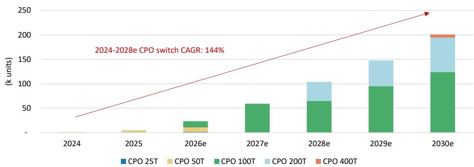  
Source: Yole, MS (e) estimates

Exhibit 12: CPO helps to reach scale-out networking and scale-up computing goal for AI/HPC applications  
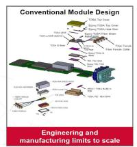  
Source: Broadcom

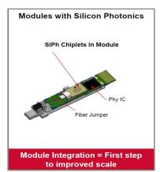

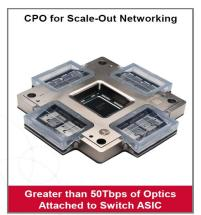

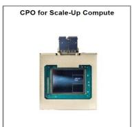

## Exhibit 13: TSMC's COUPE technology: Across SiPh pluggables to 3DIC

## 3D Optical Engine (OE) for Next-Gen Communication

\- Optics is crucial for rapid and reliable data transmission and lowering network power consumption for AI

\- EIC-on-PIC stacked using the SolC-X process (COUPE™*) offers unparalleled interconnect density while maintaining optimal system power

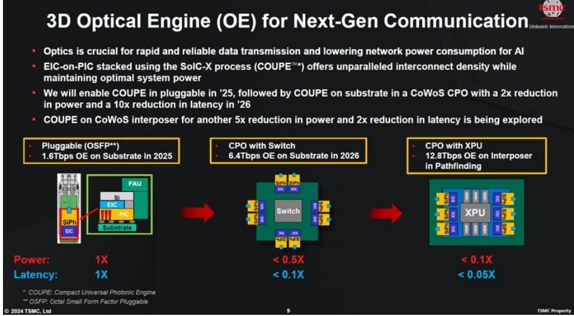

\- We will enable COUPE in pluggable in '25, followed by COUPE on substrate in a CoWoS CPO with a 2x reduction in power and a 10x reduction in latency in '26

• COUPE on CoWoS interposer for another 5x reduction in power and 2x reduction in latency is being explored

Source: TSMC

Exhibit 14: Broadcom's CPO platform

Built for Reliability and Link Performance

> 1M device hours with 0 link flaps observed

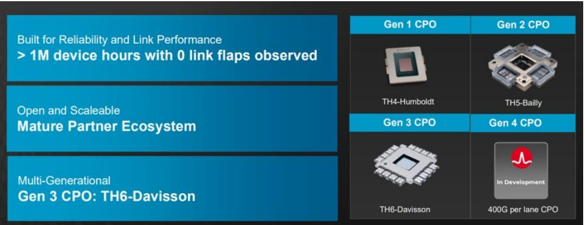

Mature Partner Ecosystem

Open and Scaleable

Multi-Generational

Gen 4 CPO

Gen 3 CPO: TH6-Davisson

Source: Broadcom

# FOCI business – Bottom-up analysis and capacity plan

## FOCI's revenue bottom-up plan

For 2026, we expect Spectrum-X to be the mainstream scale-out CPO switch product, with the optical engine production number being 600k-1mn units, and total switch shipments being ~20k units given production lead time. We expect TFC, FOCI and Senko to be the major FAU suppliers, with FOCI taking around 40% of total market share. Thus, we expect NVIDIA's contribution to FOCI's total revenue to be around 18% in 2026.

Looking to 2027, our industry checks suggest that NVIDIA could introduce a CPO version of the Kyber alternative rack, leveraging two NVL72 architecture, with the launch time likely in 2H27. As a result, we assume 5k and 28k units of CPO Rubin Ultra rack shipments in 2027 and 2028, respectively, with FOCI having around 40% market share. Thus, we expect NVIDIA's total revenue to contribute around 42% and 80% of FOCI's total revenue in 2027 and 2028, respectively.

However, there are more than 10 customers that are doing prototypes and could recognize NRE revenue in 2026, with mass production starting in 2027 and 2028, according to our supply chain checks. We have not fully baked this into our model, and view it as only a bull case scenario as we await additional product launch and shipment signs in the supply chain.

Exhibit 15: Upcoming key CPO projects FAU vendors

<table><tr><td>CPO project</td><td>FAU Vendor</td><td>Introduced Timeline</td></tr><tr><td>NVIDIA Scale-out (Spectrum/Quantum)</td><td>TFC, FOCI, Senko?</td><td>2H26</td></tr><tr><td>NVIDIA Scale-up (OIO)</td><td>FOCI, Senko</td><td>2029 (Feynman Ultra)</td></tr><tr><td>Broadcom scale-out (Tomahawk)</td><td>Twinstar, Senko</td><td>2H24</td></tr><tr><td>AMD scale-up (MI series)</td><td>FOCI, Senko, Teramount?</td><td>2H27-2028 (MI500 small scale; MI600 mainstream)</td></tr><tr><td>Ayar Labs</td><td>FOCI, Senko</td><td>2H27-2028 (standard solution); AWS Trainium 5 (2H28-2029)</td></tr><tr><td>Marvell (COUPE version)</td><td>FOCI, Senko</td><td>2028</td></tr><tr><td>MediaTek</td><td></td><td>2028?</td></tr></table>

Source: Company data, MS estimates

Exhibit 16: Bottom-up analysis: NVIDIA's revenue contribution to FOCI in 2026-28e

<table><tr><td></td><td>2026e</td><td>2027e</td><td>2028e</td></tr><tr><td>Rubin Ultra rack unit (k units)</td><td></td><td>5</td><td>20</td></tr><tr><td>Optical Engine content per Rubin Ultra rack</td><td></td><td>792</td><td>792</td></tr><tr><td>Scale-Up (NVLink switch/Quantum)</td><td></td><td>648</td><td>648</td></tr><tr><td>Scale-out (CX10)</td><td></td><td>144</td><td>144</td></tr><tr><td colspan="4">Other scale-out switch optical engine consumption</td></tr><tr><td>Spectrum-X (k units)</td><td>800</td><td>1,000</td><td>2,112</td></tr><tr><td>Quantum-X (k units)</td><td></td><td>1,000</td><td>1,408</td></tr><tr><td colspan="4">Market Share Assumptions</td></tr><tr><td>FOCI</td><td>35%</td><td>35%</td><td>35%</td></tr><tr><td>Others (TFC, Senko)</td><td>65%</td><td>65%</td><td>65%</td></tr><tr><td colspan="4">FAU ASP Assumptions</td></tr><tr><td>FAU ASP (6.4T; US$)</td><td>180</td><td>180</td><td>180</td></tr><tr><td>FAU ASP (3.2T; US$)</td><td>90</td><td>90</td><td>90</td></tr><tr><td>FAU ASP (1.6T; US$)</td><td>45</td><td>45</td><td>45</td></tr><tr><td colspan="4">FOCI Revenue contribution from NVIDIA</td></tr><tr><td>Revenue contribution (US$mn)</td><td>19</td><td>219</td><td>721</td></tr><tr><td>Revenue contribution (NT$mn)</td><td>567</td><td>6,577</td><td>21,622</td></tr><tr><td>FOCI CY Revenue (NT$mn)</td><td>1,985</td><td>8,694</td><td>23,559</td></tr><tr><td>% of total revenue</td><td>29%</td><td>76%</td><td>92%</td></tr></table>

Source: Company data, MS (e) estimates

Exhibit 17: Spectrum-X CPO Switch  
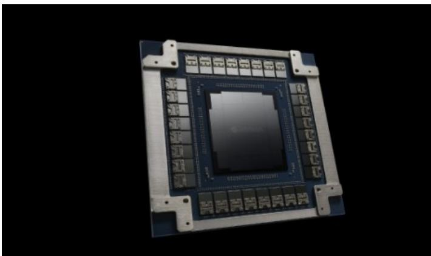  
Source: NVIDIA

Exhibit 18: Quantum-X CPO Switch  
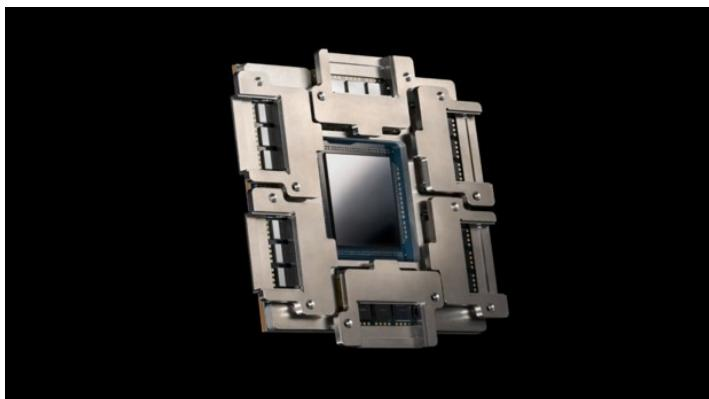  
Source: NVIDIA

For Optical I/O or optical engine on interposer adoption plans, we see NVIDIA exploring multiple solutions for the next generation Feyman and Feyman Ultra's platform, but whether there would be introduction or not still takes time. For other solutions, we see AMD targeting a scale-up CPO version for its MI550 or MI650 rack system in 2027/2028, based on its development progress. We also see ASIC vendors exploring CPO on GPU.

Our supply chain checks suggest that FOCI could see over 10 customers contributing to its Silicon Photonic/CPO revenue in 2026, besides some mass production revenue starting from 1Q26.

## What are FOCI's current plans for capacity?

In its recent public offering disclosure for the SEO, FOCI disclosed its projected revenue and profitability for the NT$1.538bn capex spent (Exhibit 19). The company completed its SEO plan in early February, with total acquired capital of NT$3.1bn. It also announced a new private equity plan on Feb 26, with maximum new share issuance of 10mn units. We expect it to utilize all of the capital for R&D purposes (12.8T research) and further building and expanding its FAU capacity.

Exhibit 19: FOCI's projected revenue and profitability from NT$1.538bn capex spent

<table><tr><td>Year (NT$mn)</td><td>2026</td><td>2027</td><td>2028</td></tr><tr><td>Sales Revenue</td><td>518</td><td>2,398</td><td>3,980</td></tr><tr><td>Gross Profit</td><td>198</td><td>906</td><td>1,598</td></tr><tr><td>Gross margin</td><td>38.2%</td><td>37.8%</td><td>40.1%</td></tr><tr><td>Operating Profit</td><td>38</td><td>483</td><td>1,012</td></tr><tr><td>Operating margin</td><td>7.3%</td><td>20.1%</td><td>25.4%</td></tr></table>

Source: Company data, MS

Exhibit 20: FOCI's SiPh Roadmap  
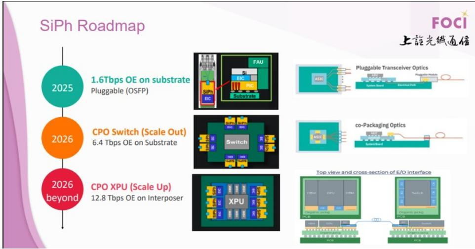  
Source: FOCI

Exhibit 21: FOCI's solutions for CPO  
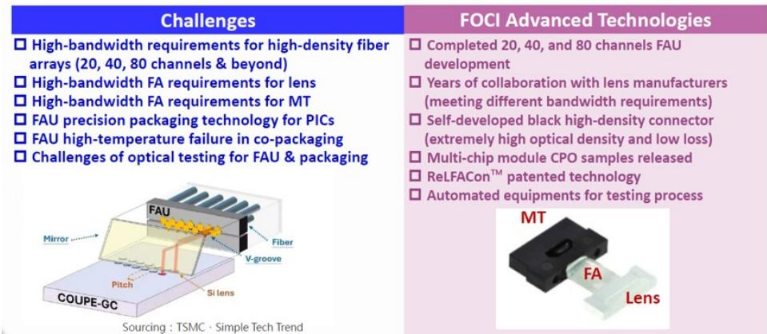  
Source: FOCI

Exhibit 22: ReLFACon enables direct transmission of external photonic signals with MCM modules to achieve reliable signal transmission  
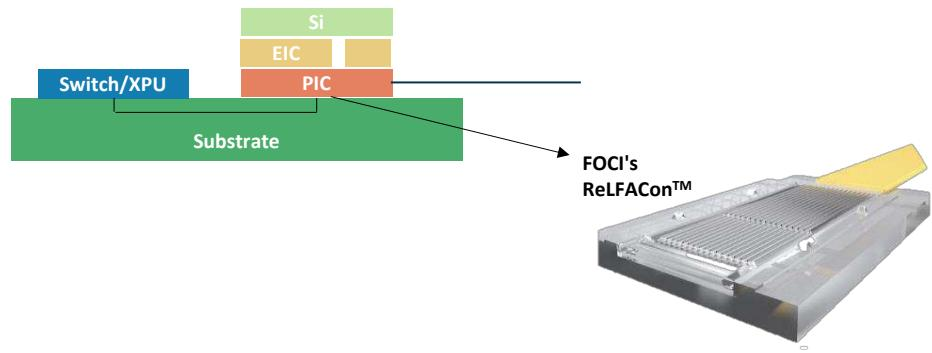  
Source: FOCI

## AllRing Business – Bottom-up Analysis

We expect CoWoS-related revenue to account for 79% of AllRing's total revenue in 2026, with AllRing focusing on oS equipment supply to TSMC and ASE/SPIL. On the other hand, our checks indicate that TSMC's CoWoS capacity is likely to extend to 130kwpm in 2026 year end, with a view to meet strong customer demand. However, we see more non-TSMC 2.5 packaging solution vendors qualifying more Taiwanese CoWoS equipment vendors, creating a new TAM for AllRing, including FoPLP and Intel's EMIB. We expect AllRing's 2027 CoWoS revenue to rise 53% Y/Y (TSMC's CoWoS seen at 200kwpm for 2027), and see it beginning to prepare equipment for CoPoS (if the trial round goes smoothly in 2026) and its AP fab in Arizona (MP likely starting in 2028).

For CPO, AllRing has penetrated the CPO supply chain of NVIDIA for FAU-optical engine coupling and FAU AOI equipment. Our latest supply chain checks suggest that AllRing may have also won the dispensing step after insertion 3, where the optical engine will be mounted onto the CPO package substrate. We expect more clarity from the company on CPO-related revenue in 2H26, and expect it to account for 11%, 19%, and 26% of AllRing's total revenue in 2026, 2027, and 2028, respectively.

For SolC, we expect 2026 SolC capacity to reach 14kwpm. TSMC further expanding its CoWoS capacity in AP7 could cause slightly delays in equipment pull-in. Our latest supply chain checks suggest that TSMC has revised 2027e capacity to 40kwpm (from 45kwpm) and 2028e to 70kwpm (from 75kwpm). AllRing is the sole WoW dispenser supplier for SolC; we expect the delay in SolC to be more than offset by the strong build in CoWoS. In the long run, we still expect it to be the key growth driver for AllRing. SolC is one of the key advanced packaging nodes for TSMC in the coming years, as we see more and more customers adopting this technology to realize chiplet design, including AMD, NVIDIA, Apple, and Broadcom.

Exhibit 23: Bottom-up analysis for AllRing's revenue

<table><tr><td>(NT$mn)</td><td>2024</td><td>2025</td><td>2026e</td><td>2027e</td><td>2028e</td><td>2025 Y/Y</td><td>2026 Y/Y</td><td>2027 Y/Y</td><td>2028 Y/Y</td></tr><tr><td>CoWoS</td><td>3,530</td><td>4,771</td><td>7,405</td><td>11,305</td><td>11,305</td><td>35%</td><td>55%</td><td>53%</td><td>0%</td></tr><tr><td>CPO</td><td>0</td><td>150</td><td>1,050</td><td>3,000</td><td>4,500</td><td>NA</td><td>600%</td><td>186%</td><td>50%</td></tr><tr><td>Flip Chip</td><td>200</td><td>0</td><td>700</td><td>200</td><td>0</td><td>-100%</td><td>NA</td><td>-71%</td><td>-100%</td></tr><tr><td>SoIC</td><td></td><td>120</td><td>150</td><td>600</td><td>700</td><td></td><td>25%</td><td>300%</td><td>17%</td></
