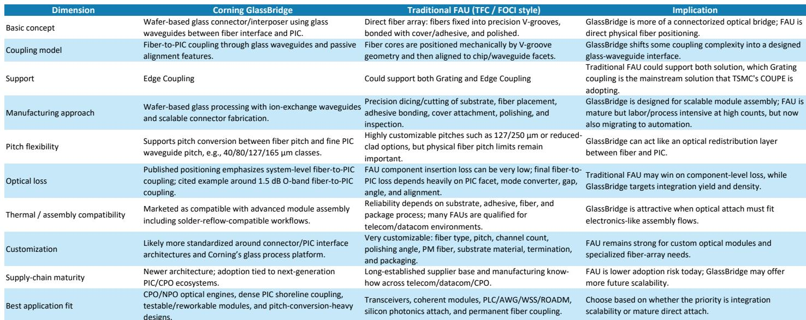
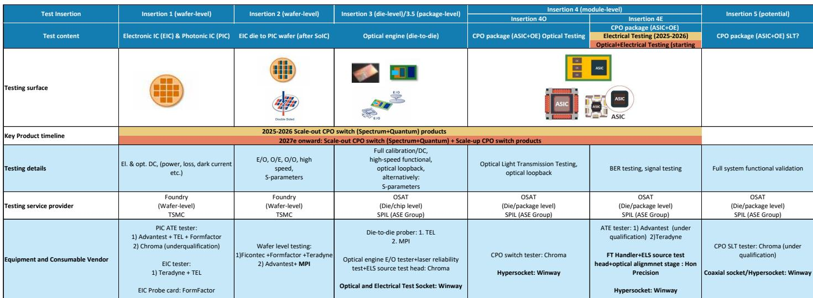

# CPO 进入量产阶段，但供应链赢家将由哪种耦合架构率先规模化决定

共封装光学时代已正式从实验室演示转向量产爬坡。一份全球投行报告证实，台积电正将其光子集成电路产能从2026年第二季度的每月1万片晶圆，扩大到2028年至少每月2.5万片晶圆。首个CPO量产收入预计将于2026年7月开始，由英伟达的Spectrum交换机平台驱动。这不再是推测性论点，而是具有可识别客户、产能计划和测试基础设施的供应链现实。

然而，对于观察者而言，最具深远意义的讨论并非CPO是否会发生，而是哪种耦合架构将在规模化阶段占据主导，进而决定哪些供应商能捕获经济价值。该报告引入了一个许多市场参与者低估的关键变量：康宁的GlassBridge技术。这不仅仅是一种新的光纤阵列单元，而是一种根本不同的光学耦合方法，可能重塑FAU供应商、测试设备供应商乃至代工厂本身的竞争格局。

这一转变的时机至关重要。在经历数个季度的延迟和技术挫折后，市场对CPO相关公司的预期已处于低位。报告明确指出，研究团队之所以仍关注CPO推动者，正是因为预期已被压低。这创造了一个战略窗口。如今浮现的生产数据点是真实的，产能轨迹是清晰的。问题在于哪些公司具备结构性优势，哪些则面临因架构转变带来的风险，而这一转变尚未被广泛市场充分理解。

本分析不试图总结完整报告，而是提取其战略逻辑，识别未解决的分析问题，并为需要在未来十二至二十四个月内进行布局的观察者提供决策框架。

## GlassBridge 并非更好的 FAU，而是一种以特定方式威胁现有供应商的不同光学架构

分析CPO供应链时最常见的错误，是将GlassBridge视为传统光纤阵列单元的升级版。这是不正确的，并会导致有缺陷的结论。传统FAU是一种直接光纤阵列：将单根光纤置于玻璃或硅基板上的精密V形槽中，用粘合剂固定、抛光，然后对准光子芯片。这是一种成熟、可靠且高度可定制的解决方案。TFC Communication、FOCI、Senko和Browave等供应商已围绕此方法建立了可观的业务。

GlassBridge在架构上截然不同。它在光纤侧和PIC侧之间插入了一个基于晶圆的玻璃波导连接器层。这根本不是光纤阵列，而是一个连接器化的光学桥接器，利用玻璃离子交换波导进行间距转换、被动对准和可拆卸耦合。康宁将其定位为解决高密度CPO的特定痛点：可回流焊接组装、现场可返工性以及密集PIC shoreline耦合。

其战略含义颇为微妙。GlassBridge并不自动比传统FAU具有更低的光学损耗。报告引用了康宁公布的约1.5 dB的O波段耦合损耗，而制作精良的传统FAU可实现显著更低的组件级损耗。GlassBridge的优势并非孤立的光学性能，而是在高光纤数下的系统级可制造性和可扩展性。

这一点对现有FAU供应商的颠覆风险最为重要。报告认为，GlassBridge在初期更可能取代低端FAU，而TFC凭借其在高端FAU的竞争优势，面临颠覆的可能性较小。其逻辑是，GlassBridge将首先渗透那些传统FAU组装在大规模生产中变得极其困难或昂贵的应用领域，而非现有供应商拥有深厚工艺专长和客户关系的领域。

悬而未决的问题是，GlassBridge是仅作为最高密度CPO模块的利基解决方案，还是随着台积电将PIC产能扩大至每月2.5万片晶圆而最终成为主导耦合方法。答案取决于康宁能多快展示大规模生产的可靠性和成本竞争力，以及主要CPO客户——英伟达、博通、AMD——是否愿意围绕新的耦合接口重新设计其光学引擎。

## 台积电的 PIC 产能爬坡明确了客户层级，将决定哪些供应商率先受益

该报告提供了关于台积电PIC生产计划的最具体产能数据。当前产能约为每月500片晶圆。到2026年第二季度增至每月1万片晶圆，是二十倍的增长。到2026年第四季度进一步增至每月1.5万片晶圆，以及到2028年至少每月2.5万片晶圆，意味着两年内从当前水平增长五十倍。

这并非线性增长的故事。报告明确指出资源有限，2026年和2027年关键的COUPE量产客户将是英伟达、博通和AMD。其他潜在客户如联发科、Marvell和Ayar Labs将不得不等到2028年更多产能可用时。

对于供应链观察者而言，这种客户分层具有直接影响。第一波客户对设计决策拥有最大影响力，包括耦合架构、测试方法和供应商选择。如果英伟达和博通为其初始CPO产品采用光栅耦合——报告认为这很可能，因为光栅耦合更易实现量产，并预计在2026年下半年看到规模——那么GlassBridge的近期需求将受到限制。

二阶影响是，已通过英伟达和博通认证的FAU供应商拥有强大的现有优势。CPO生态系统需要代工厂、芯片设计商、FAU供应商、激光器供应商和系统集成商之间的集成设计。一夜之间更改耦合设计是不可行的。这为现有供应商提供了多年的窗口期，即使GlassBridge最终在规模化后被证明更优。

报告并未完全回答哪些FAU供应商已通过哪些客户的认证。对于试图区分FOCI、TFC、Browave及其他供应商的观察者而言，这是关键缺失信息。报告特别提供了FOCI和AllRing的收入预估，表明这些是分析团队在自下而上的数据上信心最高的公司。

## 插入测试进展是最被低估的瓶颈，改善轨迹现已可见

CPO插入测试一直是量产最持久的瓶颈之一。报告提供了一个改变叙事的具体数据点：插入2 EPIC晶圆测试时间已从2025年下半年的每天一片晶圆，改善至目前的每六小时一片晶圆。三到四小时的目标如今被描述为不再是遥远的梦想，时间表为六到十二个月。

这是一个有意义的加速。插入2是首个同时进行光学和电信号测试的点，发生在EIC芯片通过台积电的SoIC工艺键合到PIC晶圆之后。报告回应了观察者关于插入2是否可能被完全跳过的疑问，并得出结论认为这不太可能，因为这是进行组合光电测试的首次机会。

其战略含义是，报告中确定的测试设备和耗材供应商拥有结构性增长机会，且独立于哪种耦合架构胜出。无论行业使用GlassBridge还是传统FAU，测试流程仍将相似。设备供应商——包括FormFactor、MPI、Chroma、鸿海精密和Winway——都将从规模增长中受益，无论架构如何。

报告并未完全解决良率假设的问题。关于年度光学引擎输出的图表使用了SoIC 50%的良率，以及下游组装良率从2026年的20%改善至2028年的50%。这些假设对收入建模至关重要，但在生产爬坡的这一阶段本质上具有不确定性。观察者应使用一系列良率结果对自己的模型进行压力测试。

## 决策框架：在布局 CPO 前，每位观察者必须回答的三个问题

该报告提供了大量数据，但并未给出简单的推荐清单。CPO供应链的战略复杂性要求观察者在做出配置决策前回答三个问题。

第一，哪种耦合架构将在2026-2027年的生产窗口期占据主导？证据指向光栅耦合，得到台积电COUPE平台和主要客户的支持。如果正确，那么拥有现有客户关系的传统FAU供应商将处于有利位置，GlassBridge仍是长期风险而非直接威胁。如果GlassBridge的采用速度快于预期，低端FAU供应商面临的颠覆风险将增加。

第二，哪些客户将率先爬坡，他们的合格供应商是谁？报告将英伟达、博通和AMD确定为2026-2027年的关键第一波客户。观察者需要确定哪些FAU供应商、测试供应商和组装合作伙伴已通过这些客户认证。报告暗示FOCI和AllRing是分析团队做了最详细自下而上工作的公司，但报告未提供全面的认证矩阵。

第三，现实的良率轨迹是什么，它如何影响收入可见性？报告的良率假设合理但未经证实。如果良率改善快于模型预测，设备和耗材供应商的收入上行空间可能显著。如果良率停滞，CPO生产带来有意义收入的时间线将进一步延伸至2027年或2028年。观察者应监测插入测试时间改善和台积电及其封装合作伙伴的良率披露，作为最领先的指标。

该报告留下了几个重要的开放性问题。康宁能以多快速度扩大GlassBridge生产，成本如何？英伟达和博通会标准化单一耦合方法，还是会在不同架构间进行双源采购？每个主要CPO客户的实际FAU供应商认证状态如何？这些问题在报告中未得到解答，它们代表了希望超越广泛论点、进入具体公司选择的观察者最重要的分析工作。

## 生产爬坡是真实的，但供应链赢家尚未确定

该报告提出了令人信服的论据，表明CPO正进入真正的生产阶段。台积电的产能计划详细且积极。首个量产收入即将到来。插入测试瓶颈正在改善。客户群是可识别的，包括AI网络领域最重要的公司。

然而，机会并非直截了当。光栅耦合与GlassBridge之间的架构争论、将近期产能限制在三个主要参与者的客户分层，以及围绕良率轨迹的不确定性，共同构成了复杂的风险回报格局。观察者预期较低，这创造了机会，但供应链中各公司的结果差异很大。

该报告最有价值的贡献并非其公司推荐，而是它提供的用于理解哪些变量最重要的分析框架。耦合架构决策、客户认证状态和良率轨迹，是决定哪些供应商能捕获价值、哪些面临颠覆的三个变量。

加入社区阅读完整报告并查看原始图表。

*仅供参考。部分内容可能基于源材料通过AI辅助生成、翻译、总结或编辑，可能存在遗漏或错误。请独立核实。这不构成专业建议。*

仅供参考。部分内容可能基于源材料通过AI辅助生成、翻译、总结或编辑，可能存在遗漏或错误。请独立核实。这不构成专业建议。

