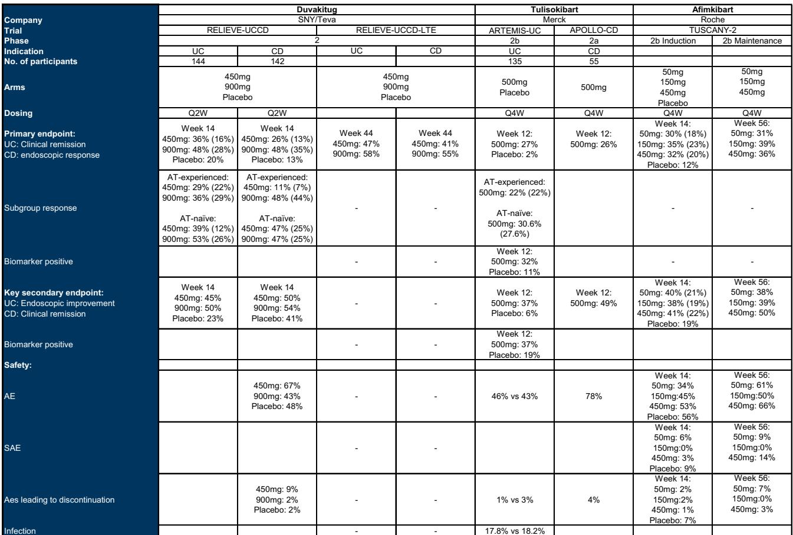
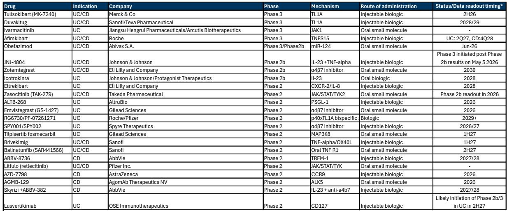
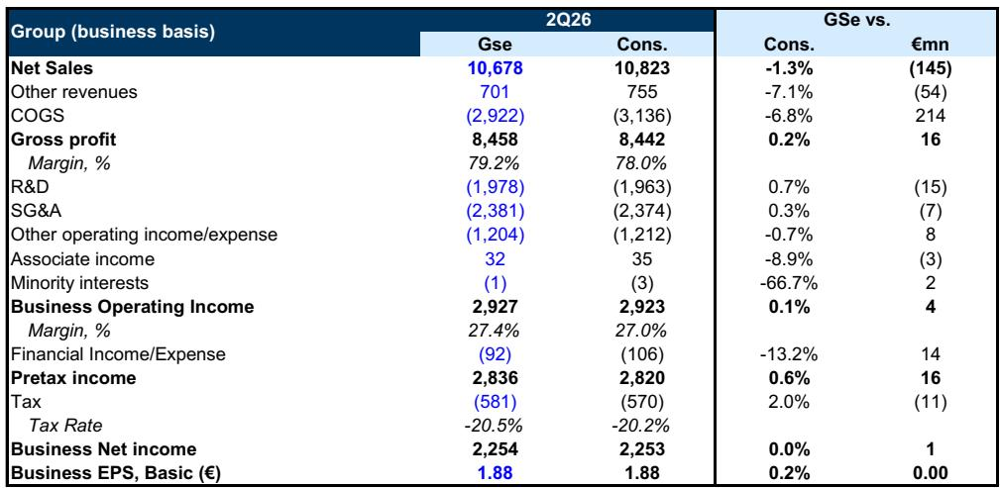

# GS：赛诺菲150亿欧元在手，为何GS仍持谨慎观察？

赛诺菲正处于一个微妙的窗口期。商业引擎依然强劲，Dupixent仍在贡献可观的增长，但研发管线接连受挫之后，市场对这家法国制药巨头的信任已经有所松动。GS最新研究给出了一个直白的判断：重建信心需要时间，而估值尚未提供足够的安全边际。更新公司观点。

这份报告的价值不在于简单的评级调整，而在于它拆解了赛诺菲当前面临的“双重挑战”——如何在维持Dupixent中期动力的同时，重建后Dupixent时代的增长叙事。对于关注欧洲制药板块的读者来说，这不仅是赛诺菲一家公司的问题，也是整个行业在专利悬崖和创新瓶颈面前的结构性课题。

## 1. 150亿欧元的弹药不是万能的，竞争才是真正的约束

GS估算赛诺菲拥有约150亿欧元的交易能力。这个数字听起来充裕，但报告点出了一个容易被忽略的变量：整个行业都在抢资产。免疫学领域的BD交易竞争已经白热化，优质标的的溢价正在上升。赛诺菲不缺钱，缺的是在合理价格内找到能填补管线缺口、且能带来差异化优势的资产。

这意味着，单纯依赖M&A来驱动上行，可能比市场预期的更困难。报告没有明说，但逻辑推演的结果是：如果赛诺菲无法在BD交易中展现出应有的纪律性和执行效率，市场对其资本配置能力的质疑将进一步加深。

> **KC评论：** 150亿欧元的弹药是纸面实力，真正的考验在于赛诺菲能否在竞争激烈的资产竞购中，买到真正能改变增长曲线的标的，而不是为了花钱而花钱。完整报告中对赛诺菲BD能力的评估和近期交易案例的复盘，值得仔细对照。

## 2. 管线的希望与时间错配：duvakitug是亮点，但利润要分给Teva，数据要等到2028年

GS将riliprubart的成功概率从40%下调至10%，同时上调tolebrutinib至100%（基于欧盟批准），这些调整反映了报告对管线不确定性的重新定价。但真正值得关注的变量是duvakitug——GS认为它可能是赛诺菲最具上行潜力的资产之一。

然而，这个判断有两个硬约束。第一，关键数据要到2028年下半年才能读出。第二，利润需要与Teva分享。这意味着，即便duvakitug最终成功，其对赛诺菲利润表的贡献也是延迟且稀释的。对于希望在2026-2027年看到明确拐点的读者来说，这个时间线并不友好。

## 3. 新CEO的首秀：市场想要的不只是高层的方向感

赛诺菲将在2026年7月30日发布二季度业绩，这将是新CEO上任后的首份财报。GS预计，管理层只会给出高层次的战略评论，重点放在初步印象和需要解决的关键领域——研发效率和BD交易。

但市场想要的显然不止于此。在经历了itepekimab、amlitelimab、tolebrutinib等一系列研发挫折之后，读者需要看到的是具体的执行路线图，而不是方向性的表态。新CEO能否在首场业绩会上传递出足够的信心和细节，将直接影响短期市场情绪。

> **KC评论：** 业绩会上的“高层面评论”往往意味着缺乏可量化的里程碑。对于希望判断赛诺菲能否走出低谷的读者来说，完整报告中关于Dupixent生命周期管理、以及管线资产关键数据节点的详细列表，是判断管理层承诺是否可信的重要参照。

## 4. 报告尚未完全回答的关键问题：估值修复的前提是什么？

主要反映了汇率调整、riliprubart成功概率下调、以及Dupixent生物类似药从2033年开始进入的假设。但报告也留下了一个未完全回答的问题：估值修复的真正前提是什么？

从报告的逻辑看，要变得乐观，需要看到Dupixent生命周期管理的实质进展、管线执行力的改善、以及价值创造型的BD交易。但这些条件中，哪些是“必要”的，哪些是“充分”的？报告没有给出明确的优先级排序。对于读者来说，这意味着需要自己去判断：在研发信心尚未重建、Dupixent增长斜率可能节奏变化的背景下，当前约9倍的远期PE是否已经充分反映了不确定性，还是仍有进一步下修的空间。

---

完整报告中对赛诺菲的Dupixent生命周期管理细节、管线资产的差异化数据、以及BD交易的历史复盘，有更深入的拆解。这些内容会放入每日国际信源汇编，适合在更宽的行业叙事框架下横向比较。

For informational purposes only. Portions may be generated,translated,summarized,or edited with AI assistance based on source materials and may contain omissions or errors. Please verify independently. This is not investment,legal,tax,accounting,or other professional advice.

