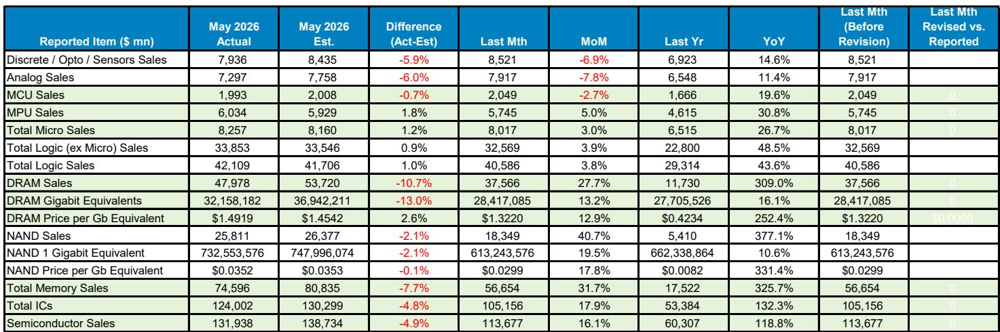
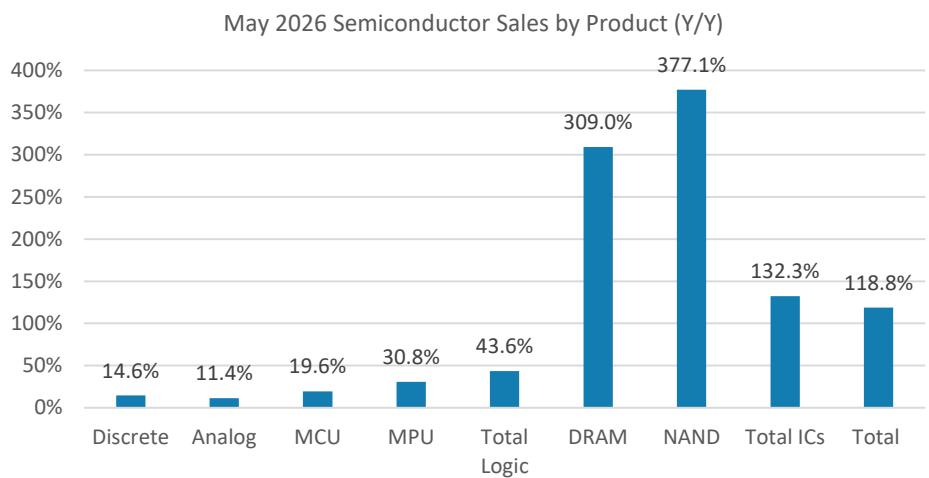
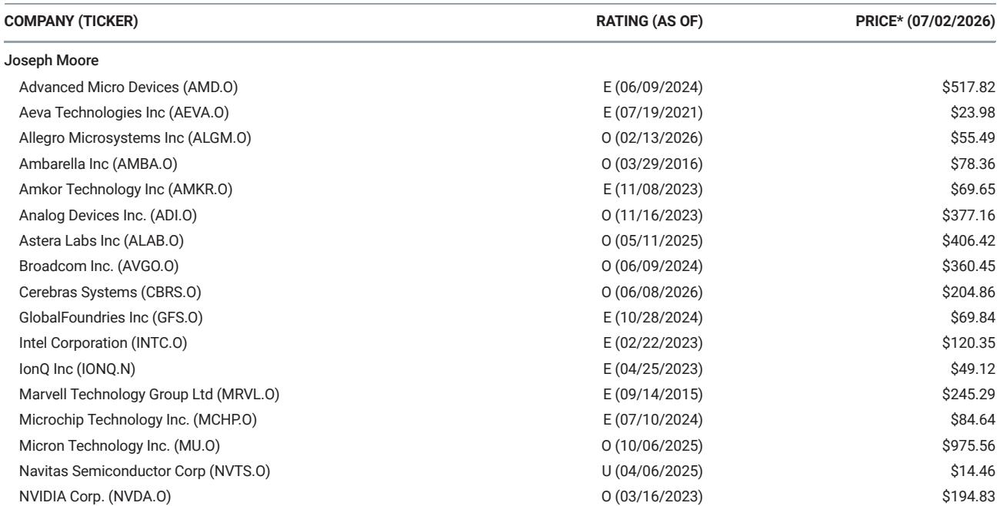

# The GPU Shortage Is Not Over—It Is Being Repackaged as a Rental Market

The market's immediate reaction to Meta's reported cloud services unit was a selloff, driven by a single assumption: that hyperscalers have built too much compute capacity and are now scrambling to find someone to use it. That assumption is almost certainly wrong. A more careful reading of the data and the industry's recent behavior points to the opposite conclusion—GPU compute remains in acute shortage, and what looks like excess supply is actually a structural mismatch between internal demand and external opportunity. The most profitable use of a GPU right now is not to run your own workloads. It is to rent it to someone else.

This distinction matters because it changes the narrative. If the market is worried about a capacity glut, it will undervalue companies that benefit from scarcity. If the real dynamic is a deepening shortage that is being managed through secondary markets, then the winners are those whose chips become the de facto standard for rental compute. The May SIA data, while slightly softer than expected, does not contradict this view. It reinforces a broader picture of an industry that is tightening, not loosening, and where the bottlenecks are shifting from simple availability to the economics of access.

What follows is a strategic interpretation of the report's core findings, organized as a decision framework for those who need to separate signal from noise in the semiconductor cycle.

## The Market Misread Meta's Cloud Services Unit as a Sign of Excess, but the Real Story Is a Structural Shortage of GPU Compute

When Bloomberg reported that Meta was developing a cloud services unit to compete with Azure and AWS, the semiconductor sector sold off. The logic seemed straightforward: if a hyperscaler is renting out its GPUs, it must have more than it needs. But this logic conflates internal utilization with industry-wide supply. The report's authors argue, and the evidence supports, that the opposite is true. Meta's move is not a signal of surplus. It is a signal that external demand for GPU compute is so strong that even a company with massive internal requirements can make more money by subletting its capacity than by reserving it for its own use.

This is not an isolated event. The report notes that similar dynamics are being observed across multiple hyperscalers. The pattern is consistent: companies that built GPU clusters for their own AI workloads are discovering that the marginal return on renting that compute to third parties exceeds the marginal return from internal deployment. That is not a sign of excess capacity. It is a sign of excess demand.

The implication is clear. If the market treats rental announcements as bearish, it will create pricing dislocations in stocks that benefit from compute scarcity. The correct response is to identify which chip architectures are most likely to dominate the secondary rental market. That brings us to the next point.

## NVIDIA's Competitive Advantage Extends Beyond Performance into the Economics of a Secondary GPU Rental Market

The report makes a critical observation about the structure of the GPU rental market. If a hyperscaler has a mismatch between its internal compute needs and the external demand for its capacity, it will naturally favor the chip that is most universally understood and easiest to integrate into a rental offering. That chip is NVIDIA's. ASICs are difficult to sublet because they are customized for specific workloads and lack broad software ecosystems. AMD's GPUs have more ubiquity than ASICs but still command a smaller share of the installed base, which limits the size of the secondary market that can be built around them.

NVIDIA's own messaging at Computex reinforced this point. The company emphasized that its chips deliver the highest tokens per gigawatt, faster bring-up times, longer mean time between failure, and longer asset life. The report adds ubiquity of compute as a distinct advantage. When a customer rents a GPU, they want to know that the software stack, the development tools, and the optimization libraries will work seamlessly. That is a moat that extends well beyond raw performance.

For observers, this means that the rental market dynamic is not uniform across chip vendors. It is a tailwind for NVIDIA and a headwind for competitors whose chips are harder to rent. The question is not whether hyperscalers will sublet capacity. It is which chips will dominate that sublet market. The answer points to the industry standard.

## May SIA Data Was Soft, but the Pattern Confirms a Structurally Tight Cycle Rather Than a Cyclical Peak

The May SIA data came in below the report's estimates, with total semiconductor sales of $131.9 billion versus an estimate of $138.7 billion. Broad markets missed, with discretes and analog both declining month-over-month. Memory also missed, with DRAM coming in at 27.7% month-over-month versus an estimate of 43.0%. On the surface, this looks like a deceleration. But the report argues that the data is consistent with a cycle that is being driven by supply constraints rather than demand weakness.

The key distinction is between a conventional inventory cycle and a structurally constrained AI-led cycle. In a normal recovery, monthly data would be driven by seasonal patterns and inventory restocking. In the current environment, the primary driver is supply tightness. DRAM remains the clearest bottleneck, with prices rising for ten consecutive quarters and 3-month average y/y growth hitting 304.8%. NAND is also holding firm, with ASP growth of 277.5% year-over-year.

The report's interpretation is that customers are not just buying memory because they need it today. They are trying to lock in access before the market loosens. That behavior extends the earnings window and makes the cycle more durable than a typical upturn. The May miss is a data point, not a thesis-changer. It does not alter the view that Q2 will be a very strong quarter and that memory pricing will remain elevated.

## The Report Leaves an Unanswered Question: How Long Can the Rental Market Sustain Itself Without Becoming a Self-Correcting Mechanism?

One of the most interesting analytical gaps in the report is the lack of a clear framework for how the GPU rental market might evolve over time. If hyperscalers are renting out capacity because external demand exceeds internal needs, what happens when internal needs catch up? Or when enough rental capacity comes online to satisfy external demand? The report does not answer these questions, which is appropriate because the data does not yet support a definitive answer.

What we can say is that the rental market is a mechanism for price discovery. If rental prices remain high, it confirms that demand is structurally undersupplied. If rental prices begin to fall, it would signal that the shortage is easing. The report's authors are clearly on the side of the shortage persisting, but they do not model the conditions under which the rental market would saturate.

This is the key uncertainty for observers. The bullish case relies on the rental market being a symptom of enduring scarcity. The bearish case would be that rental markets are a leading indicator of commoditization—that as more capacity becomes available, rental prices fall, and the premium that NVIDIA and memory suppliers currently enjoy begins to erode. The report does not resolve this tension. It identifies the trend but leaves the boundary conditions undefined.

## A Decision Framework for Navigating the Compute Scarcity Cycle

Based on the report's logic, observers should evaluate semiconductor positions through three lenses. First, assess whether a company's product is a standard or a specialty. In a rental market, standards win. NVIDIA's ubiquity gives it a structural advantage that ASICs and lower-share competitors cannot replicate. Second, evaluate the durability of pricing power. The report's memory analysis suggests that DRAM pricing is being driven by structural constraints, not inventory cycles. That supports a longer earnings tail for companies like Micron and SanDisk. Third, watch for signs that the rental market is becoming a self-correcting mechanism. If rental prices decline, it would signal that the shortage is easing and that the cycle is closer to a peak.

This framework suggests that the current selloff in semiconductor stocks is overdone relative to the underlying fundamentals. The market is pricing in a peak-cycle narrative that the data does not support. The rental market dynamic, the SIA data, and the supply constraints all point to a cycle that has more room to run. The risk is not that demand collapses. It is that the market misreads the signals and sells into strength.

## The Full Report Contains the Charts and Data That Make This Argument Actionable

The analysis above is based on a reading of the report's key findings, but the full report contains the original charts, the variance tables, and the quarterly and annual SIA data that underpin the argument. For those who want to see the exact numbers behind the DRAM and NAND pricing trends, or the geographic breakdown of semiconductor sales, or the detailed forecast revisions, the original document is essential.

The report also includes specific company-level analysis that is not summarized here. Understanding which companies are positioned to benefit from the rental market dynamic, which memory suppliers have the most leverage in a constrained supply environment, and which broad-market names are showing signs of recovery requires the full context.

Join the community to read the full report and review the original charts.

---

*For informational purposes only. Portions may be generated, translated, summarized, or edited with AI assistance based on source materials and may contain omissions or errors. Please verify independently. This is not professional advice.*

For informational purposes only. Portions may be generated, translated, summarized, or edited with AI assistance based on source materials and may contain omissions or errors. Please verify independently. This is not professional advice.

