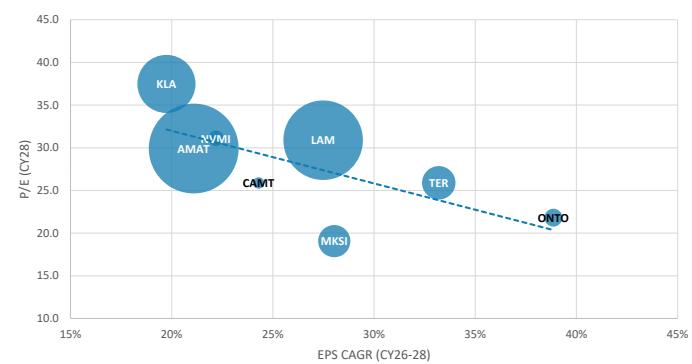
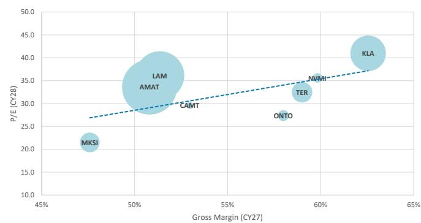
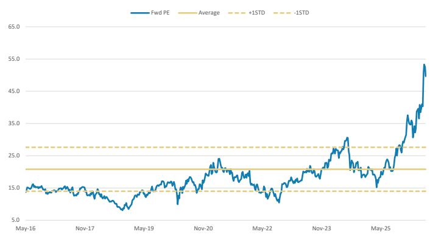
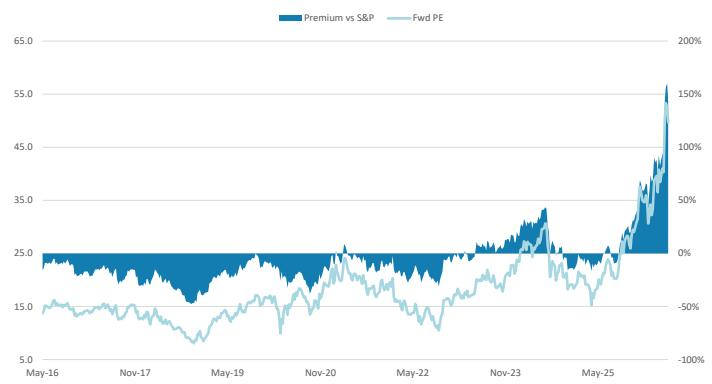
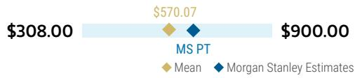
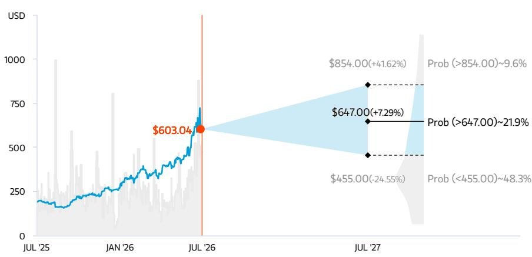
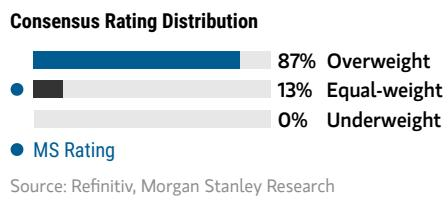
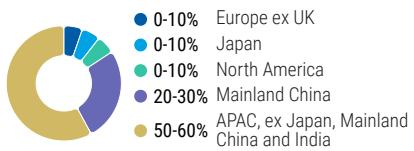

# 半导体资本设备 | 北美市场

## 将估值基准调整至2028年

2027年2000亿美元的WFE（晶圆制造设备）市场已被广泛认知，2028年2500亿美元的市场预期也开始被纳入定价。我们认为MKS和ONTO存在机会，这两家公司2027年的盈利潜力尚未被充分认识。对于大型公司，我们的热情相对较低。

**有何变化？** 我们将2026年的预测从1490亿美元（同比增长27%）上调至1550亿美元（同比增长32%），2027年的预测从1910亿美元（同比增长28%）上调至2020亿美元（同比增长31%），2028年的预测从2150亿美元（同比增长13%）上调至2270亿美元（同比增长13%）。2026-2027年预测调整的主要来源是季度内的存储WFE修正，而2028年的调整则受到代工逻辑业务的推动。

2000亿美元（2027年）已被市场定价。我们覆盖的美国大型SPE公司目前交易在37倍2027日历年度预测的水平，该预测已根据我们更新的WFE展望进行了调整。37倍的市盈率较这些股票自2020年以来21倍的周期平均市盈率溢价75%，较2024年7月30倍的最新峰值溢价超过20%。我们认为2027年2000亿美元的WFE已被市场充分理解，因此将估值基准年调整至2028年。基于我们对2028年2270亿美元的WFE预测，我们覆盖的大型公司目前交易在33倍，这意味着2028年2500亿美元的WFE可能已接近被定价。

2028年超过2500亿美元是可能的，但我们尚未准备好将其纳入模型。过去两周，2028年WFE预期显著上升，但我们质疑在2026年就将如此乐观的预期定价的合理性，以及2500亿美元WFE环境的可行性。我们并不怀疑超过2500亿美元的可能性，但我们正在思考的关键问题是：1）存储：市场能否消化超过800亿美元/300亿美元的DRAM/NAND WFE，这将意味着超过40%的比特供应增长？2）EUV：ASML能否供应所需的约130台设备？3）逻辑：我们是否愿意为TeraFab和Rapidus等公司的重大贡献（超过100亿美元）提供支持？我们正在继续研究这些问题，但在获得更多确定性之前，我们尚未准备好将超过2500亿美元的预期反映在我们的模型中。

我们上调了KLA和AMAT的目标倍数，因为我们看到领先客户群的扩大将使KLA受益，而2026日历年度DRAM WFE的强劲表现将使AMAT受益。鉴于我们尚未看到NAND WFE的修正，我们维持LAM和MKS的目标倍数不变。我们下调了NVMI和CAMT的目标倍数，因为我们对NVMI在2027年能否超越WFE增长存疑，并对CAMT在HBM领域的市场份额感到担忧（详见附件3）。

在我们覆盖的美国SPE公司中，我们偏好那些在2027年2000亿美元WFE环境下盈利潜力尚未被充分认识的公司。具体而言，我们认为首选股MKS和评为“超配”的ONTO在2027年盈利方面具有显著上行空间，且估值合理。我们维持对KLA和LAM的“超配”评级，但对这两只股票的热情略有减弱，因为我们认为2027年超过2500亿美元WFE的预期已部分被定价。

<table><tr><td colspan="2">MS & CO. LLC</td></tr><tr><td colspan="2">Shane Brett</td></tr><tr><td colspan="2">股票分析师</td></tr><tr><td>Shane.Brett@morganstanley.com</td><td>+1 212 761-1022</td></tr><tr><td colspan="2">Joseph Moore</td></tr><tr><td colspan="2">股票分析师</td></tr><tr><td>Joseph.Moore@morganstanley.com</td><td>+1 212 761-7516</td></tr><tr><td colspan="2">Mason Wayne</td></tr><tr><td colspan="2">研究助理</td></tr><tr><td>Mason.Wayne@morganstanley.com</td><td>+1 212 761-6012</td></tr><tr><td colspan="2">Ella Tulchinsky</td></tr><tr><td colspan="2">研究助理</td></tr><tr><td>Ella.Tulchinsky@morganstanley.com</td><td>+1 212 761-2222</td></tr><tr><td colspan="2">Nicole Kozhukhov</td></tr><tr><td colspan="2">研究助理</td></tr><tr><td>Nicole.Kozhukhov@morganstanley.com</td><td>+1 212 761-1636</td></tr></table>

<table><tr><td colspan="3">半导体资本设备</td></tr><tr><td>北美行业观点</td><td></td><td>中性</td></tr><tr><td colspan="3">有何变化</td></tr><tr><td>Camtek (CAMT.O)目标价</td><td>从163.00美元</td><td>至167.00美元</td></tr><tr><td>KLA Corp (KLAC.O)目标价</td><td>从190.00美元</td><td>至274.00美元</td></tr><tr><td>Lam Research Corp (LRCX.O)目标价</td><td>从331.00美元</td><td>至404.00美元</td></tr><tr><td>MKS Inc. (MKSI.O)目标价</td><td>从374.00美元</td><td>至442.00美元</td></tr><tr><td>Nova Ltd (NVMI.O)目标价</td><td>从494.00美元</td><td>至540.00美元</td></tr><tr><td>Applied Materials Inc.(AMAT.O)目标价</td><td>从502.00美元</td><td>至647.00美元</td></tr></table>

MS与报告中覆盖的公司有业务往来，并寻求建立业务关系。因此，读者应注意，该公司可能存在利益冲突，可能影响MS的客观性。读者应将MS视为其决策的单一因素。

有关分析师认证和其他重要披露，请参阅本报告末尾的披露部分。

## WFE预测表

附件1：

<table><tr><td>（百万美元）</td><td>2021</td><td>2022</td><td>2023</td><td>2024</td><td>2025</td><td>2026e</td><td>2027e</td><td>2028e</td></tr><tr><td>WFE收入</td><td>91,092</td><td>96,222</td><td>96,008</td><td>105,057</td><td>117,048</td><td>154,638</td><td>201,887</td><td>227,269</td></tr><tr><td>半导体收入</td><td>553,540</td><td>573,978</td><td>526,820</td><td>630,549</td><td>791,061</td><td>1,607,055</td><td>1,959,883</td><td>1,959,883</td></tr><tr><td>半导体资本支出</td><td>157,788</td><td>187,982</td><td>176,924</td><td>198,540</td><td>215,972</td><td>305,309</td><td>357,665</td><td>351,202</td></tr><tr><td colspan="9">同比变化百分比</td></tr><tr><td>WFE收入</td><td>43%</td><td>6%</td><td>0%</td><td>9%</td><td>11%</td><td>32%</td><td>31%</td><td>13%</td></tr><tr><td>半导体收入</td><td>26%</td><td>4%</td><td>-8%</td><td>20%</td><td>25%</td><td>103%</td><td>22%</td><td>0%</td></tr><tr><td>半导体资本支出</td><td>33%</td><td>19%</td><td>-6%</td><td>12%</td><td>9%</td><td>41%</td><td>17%</td><td>-2%</td></tr><tr><td colspan="9">指标</td></tr><tr><td>WFE强度</td><td>16%</td><td>17%</td><td>18%</td><td>17%</td><td>15%</td><td>10%</td><td>10%</td><td>12%</td></tr><tr><td>WFE占总资本支出百分比</td><td>58%</td><td>51%</td><td>54%</td><td>53%</td><td>54%</td><td>51%</td><td>56%</td><td>65%</td></tr><tr><td>半导体资本强度</td><td>29%</td><td>33%</td><td>34%</td><td>31%</td><td>27%</td><td>19%</td><td>18%</td><td>18%</td></tr><tr><td colspan="9">第三方来源</td></tr><tr><td>SEMI</td><td>87,499</td><td>94,100</td><td>95,610</td><td>104,270</td><td>115,700</td><td>126,100</td><td>135,200</td><td></td></tr><tr><td>Gartner</td><td>92,843</td><td>101,101</td><td>102,820</td><td>111,777</td><td>124,452</td><td>144,886</td><td>161,086</td><td>154,674</td></tr><tr><td colspan="9">按细分市场划分的WFE</td></tr><tr><td>代工/逻辑</td><td>50,265</td><td>59,180</td><td>70,023</td><td>69,192</td><td>75,307</td><td>89,479</td><td>114,491</td><td>133,729</td></tr><tr><td>存储</td><td>39,828</td><td>35,854</td><td>24,794</td><td>35,228</td><td>41,118</td><td>64,261</td><td>86,438</td><td>92,215</td></tr><tr><td>DRAM</td><td>20,664</td><td>18,256</td><td>19,579</td><td>29,244</td><td>31,083</td><td>48,621</td><td>62,430</td><td>64,108</td></tr><tr><td>NAND</td><td>19,164</td><td>17,598</td><td>5,215</td><td>5,985</td><td>10,035</td><td>15,640</td><td>24,009</td><td>28,107</td></tr><tr><td>其他</td><td>999</td><td>1,188</td><td>1,192</td><td>637</td><td>622</td><td>898</td><td>957</td><td>1,324</td></tr><tr><td colspan="9">同比变化百分比</td></tr><tr><td>代工/逻辑</td><td>45%</td><td>18%</td><td>18%</td><td>-1%</td><td>9%</td><td>19%</td><td>28%</td><td>17%</td></tr><tr><td>存储</td><td>42%</td><td>-10%</td><td>-31%</td><td>42%</td><td>17%</td><td>56%</td><td>35%</td><td>7%</td></tr><tr><td>DRAM</td><td>53%</td><td>-12%</td><td>7%</td><td>49%</td><td>6%</td><td>56%</td><td>28%</td><td>3%</td></tr><tr><td>NAND</td><td>31%</td><td>-8%</td><td>-70%</td><td>15%</td><td>68%</td><td>56%</td><td>54%</td><td>17%</td></tr><tr><td>其他</td><td>19%</td><td>19%</td><td>0%</td><td>-47%</td><td>-2%</td><td>44%</td><td>7%</td><td>38%</td></tr><tr><td colspan="9">占总量的百分比</td></tr><tr><td>代工/逻辑</td><td>55%</td><td>62%</td><td>73%</td><td>66%</td><td>64%</td><td>58%</td><td>57%</td><td>59%</td></tr><tr><td>存储</td><td>44%</td><td>37%</td><td>26%</td><td>34%</td><td>35%</td><td>42%</td><td>43%</td><td>41%</td></tr><tr><td>DRAM</td><td>23%</td><td>19%</td><td>20%</td><td>28%</td><td>27%</td><td>31%</td><td>31%</td><td>28%</td></tr><tr><td>NAND</td><td>21%</td><td>18%</td><td>5%</td><td>6%</td><td>9%</td><td>10%</td><td>12%</td><td>12%</td></tr><tr><td>其他</td><td>1%</td><td>1%</td><td>1%</td><td>1%</td><td>1%</td><td>1%</td><td>0%</td><td>1%</td></tr><tr><td colspan="9">WFE强度</td></tr><tr><td>半导体（除存储）收入</td><td>399,706</td><td>444,153</td><td>434,511</td><td>465,032</td><td>568,550</td><td>727,417</td><td>835,151</td><td>835,151</td></tr><tr><td>存储收入</td><td>153,834</td><td>129,825</td><td>92,309</td><td>165,516</td><td>222,512</td><td>879,638</td><td>1,124,732</td><td>1,124,732</td></tr><tr><td>DRAM</td><td>92,960</td><td>77,769</td><td>51,945</td><td>94,860</td><td>150,598</td><td>581,901</td><td>675,059</td><td>675,059</td></tr><tr><td>NAND</td><td>55,953</td><td>47,109</td><td>36,104</td><td>66,427</td><td>67,685</td><td>293,508</td><td>445,443</td><td>445,443</td></tr><tr><td colspan="9">WFE强度</td></tr><tr><td>代工逻辑</td><td>13%</td><td>13%</td><td>16%</td><td>15%</td><td>13%</td><td>12%</td><td>14%</td><td>16%</td></tr><tr><td>存储</td><td>26%</td><td>28%</td><td>27%</td><td>21%</td><td>18%</td><td>7%</td><td>8%</td><td>8%</td></tr><tr><td>DRAM</td><td>22%</td><td>23%</td><td>38%</td><td>31%</td><td>21%</td><td>8%</td><td>9%</td><td>9%</td></tr><tr><td>NAND</td><td>34%</td><td>37%</td><td>14%</td><td>9%</td><td>15%</td><td>5%</td><td>5%</td><td>6%</td></tr><tr><td colspan="9">占存储WFE的百分比</td></tr><tr><td>DRAM</td><td>52%</td><td>51%</td><td>79%</td><td>83%</td><td>76%</td><td>76%</td><td>72%</td><td>70%</td></tr><tr><td>NAND</td><td>48%</td><td>49%</td><td>21%</td><td>17%</td><td>24%</td><td>24%</td><td>28%</td><td>30%</td></tr></table>

来源：Gartner, SEMI, 公司数据, MS。e = MS预测

附件2：

<table><tr><td>（百万美元）</td><td>2021</td><td>2022</td><td>2023</td><td>2024</td><td>2025</td><td>2026e</td><td>2027e</td><td>2028e</td></tr><tr><td colspan="9">按地区划分的WFE</td></tr><tr><td>总计</td><td>91,092</td><td>96,222</td><td>96,008</td><td>105,057</td><td>117,048</td><td>154,638</td><td>201,887</td><td>227,269</td></tr><tr><td>北美</td><td>7,755</td><td>10,239</td><td>11,346</td><td>13,657</td><td>10,534</td><td>12,680</td><td>16,555</td><td>18,636</td></tr><tr><td>欧洲</td><td>2,879</td><td>5,982</td><td>5,741</td><td>4,202</td><td>2,341</td><td>2,629</td><td>3,028</td><td>3,409</td></tr><tr><td>日本</td><td>6,879</td><td>7,244</td><td>6,438</td><td>7,354</td><td>8,779</td><td>10,825</td><td>14,536</td><td>16,591</td></tr><tr><td>韩国</td><td>22,757</td><td>19,655</td><td>18,965</td><td>18,910</td><td>23,410</td><td>35,567</td><td>48,453</td><td>52,954</td></tr><tr><td>台湾</td><td>23,566</td><td>26,566</td><td>19,501</td><td>15,233</td><td>27,506</td><td>40,515</td><td>56,528</td><td>63,635</td></tr><tr><td>中国</td><td>24,695</td><td>22,105</td><td>31,682</td><td>42,548</td><td>41,552</td><td>48,711</td><td>57,941</td><td>68,181</td></tr><tr><td>其他</td><td>2,561</td><td>4,431</td><td>2,334</td><td>3,152</td><td>2,926</td><td>3,711</td><td>4,845</td><td>3,864</td></tr><tr><td colspan="9">按地区划分的WFE（同比）</td></tr><tr><td>北美</td><td>28%</td><td>32%</td><td>11%</td><td>20%</td><td>-23%</td><td>20%</td><td>31%</td><td>13%</td></tr><tr><td>欧洲</td><td>8%</td><td>108%</td><td>-4%</td><td>-27%</td><td>-44%</td><td>12%</td><td>15%</td><td>13%</td></tr><tr><td>日本</td><td>14%</td><td>5%</td><td>-11%</td><td>14%</td><td>19%</td><td>23%</td><td>34%</td><td>14%</td></tr><tr><td>韩国</td><td>51%</td><td>-14%</td><td>-4%</td><td>0%</td><td>24%</td><td>52%</td><td>36%</td><td>9%</td></tr><tr><td>台湾</td><td>54%</td><td>13%</td><td>-27%</td><td>-22%</td><td>81%</td><td>47%</td><td>40%</td><td>13%</td></tr><tr><td>中国</td><td>48%</td><td>-10%</td><td>43%</td><td>34%</td><td>-2%</td><td>17%</td><td>19%</td><td>18%</td></tr><tr><td>其他</td><td>40%</td><td>73%</td><td>-47%</td><td>35%</td><td>-7%</td><td>27%</td><td>31%</td><td>-20%</td></tr><tr><td colspan="9">按地区划分的WFE（占总量的百分比）</td></tr><tr><td>北美</td><td>9%</td><td>11%</td><td>12%</td><td>13%</td><td>9%</td><td>8%</td><td>8%</td><td>8%</td></tr><tr><td>欧洲</td><td>3%</td><td>6%</td><td>6%</td><td>4%</td><td>2%</td><td>2%</td><td>2%</td><td>2%</td></tr><tr><td>日本</td><td>8%</td><td>8%</td><td>7%</td><td>7%</td><td>8%</td><td>7%</td><td>7%</td><td>7%</td></tr><tr><td>韩国</td><td>25%</td><td>20%</td><td>20%</td><td>18%</td><td>20%</td><td>23%</td><td>24%</td><td>23%</td></tr><tr><td>台湾</td><td>26%</td><td>28%</td><td>20%</td><td>15%</td><td>24%</td><td>26%</td><td>28%</td><td>28%</td></tr><tr><td>中国</td><td>27%</td><td>23%</td><td>33%</td><td>41%</td><td>36%</td><td>32%</td><td>29%</td><td>30%</td></tr><tr><td>其他</td><td>3%</td><td>5%</td><td>2%</td><td>3%</td><td>3%</td><td>2%</td><td>2%</td><td>2%</td></tr></table>

来源：Gartner, SEMI, 公司数据, MS。e = MS预测

附件3：倍数调整理由

<table><tr><td></td><td>旧目标价</td><td>新目标价</td><td>旧倍数（2027日历年度）</td><td>新倍数（2028日历年度）</td><td>倍数调整理由</td></tr><tr><td>KLA</td><td>190美元</td><td>274美元</td><td>33倍</td><td>38倍</td><td>领先逻辑客户群扩大（英特尔、Rapidus、TeraFab）</td></tr><tr><td>AMAT</td><td>502美元</td><td>647美元</td><td>28倍</td><td>30倍</td><td>2026日历年度DRAM WFE远强于预期</td></tr><tr><td>LAM</td><td>331美元</td><td>404美元</td><td>34倍</td><td>34倍</td><td rowspan="2">等待NAND WFE修正以支持倍数扩张</td></tr><tr><td>MKS</td><td>374美元</td><td>442美元</td><td>22倍</td><td>22倍</td></tr><tr><td>NVMI</td><td>494美元</td><td>540美元</td><td>36倍</td><td>33倍</td><td>对2027年超越WFE增长存疑</td></tr><tr><td>CAMT</td><td>163美元</td><td>167美元</td><td>32倍</td><td>27倍</td><td>在HBM领域对ONTO/KLA的市场份额担忧</td></tr></table>

来源：MS

## 我们如何看待SPE估值？

我们对美国SPE覆盖公司的估值指导原则是，倍数更接近毛利率而非增长率。毛利率反映了设备公司为客户提供的“价值”，对于工艺设备而言是吞吐量，而对于检测设备则是良率。SPE的毛利率同比不会发生重大变化，因为这些公司不会因所处周期位置而受到奖励或惩罚。毛利率的扩张来自运营改善或为客户提供更多价值，而非机会主义地提高定价。

附件4：美国SPE 2028日历年度市盈率 vs 2026-2028年每股收益复合年增长率  
  
来源：FactSet, MS。e = MS预测

附件5：美国SPE 2028日历年度市盈率 vs 2027日历年度毛利率（%）  
  
来源：FactSet, MS。e = MS预测

我们覆盖的美国大型SPE公司目前交易在37倍2027日历年度市盈率，较2024年7月30倍的最新峰值溢价超过20%，当时市场正越来越多地关注2025年1250亿美元的WFE。基于我们对2028年2270亿美元WFE的预测，我们的大型公司目前交易在33倍，这意味着2028年2500亿美元可能已接近被定价。

附件6：AMAT/LAM/KLA远期市盈率 vs 2020年以来的平均值  
  
来源：FactSet, MS。注：自2020年1月以来的平均值

附件7：AMAT/LAM/KLA远期市盈率及对标普500指数的溢价  
  
来源：FactSet, MS。

## 风险回报 – Applied Materials Inc. (AMAT.O)

DRAM/领先逻辑上行空间及中国/ICAPS风险降低

## 目标价 647.00美元

约30倍2028日历年度预测每股收益21.55美元，较LAM折让4倍、较KLA折让8倍，以反映DRAM的增长前景，但同时也考虑了对代工逻辑市场份额流失的担忧。

一致预期目标价分布

来源：Refinitiv, MS

## 风险回报图及期权隐含概率（12个月）

  
关键：— 历史股价表现 ● 当前股价 ◆ 目标价

来源：Refinitiv, MS, MS Institutional Equities Division。我们的牛市、基准和熊市情景概率是根据截至2026年7月2日的期权市场隐含波动率数据估算的。所有数字均为股票在三个月或一年内达到情景价格以上的近似风险中性概率。在此查看期权概率方法说明

## 中性评级论点

■ 由于执行问题以及对在中国市场份额流失的担忧，AMAT的交易估值一直较LAM和KLA有显著折让。我们认为AMAT在2026年将成为份额获得者，但鉴于我们的增长预测与2027年更广泛的WFE一致，我们认为估值折让在短期内不太可能收窄。

■ AMAT在其产品组合中拥有最高的DRAM占比（2026日历年度31%，而LAM为23%，KLA为28%），并且对新建晶圆厂增加的杠杆最高。我们认为DRAM是2026年增长最快的终端市场，但2027年将是增长最慢的。

## 风险回报主题

新数据时代：正面
在此查看风险回报主题说明

## 牛市情景

854.00美元

## 约35倍2028日历年度每股收益24.41美元

DRAM和ICAPS保持强劲，AMAT的利润率扩张加速。

- 2028日历年度收入增长24.6%，AMAT表现优于WFE
- 2027日历年度毛利率扩大至51.9%
- 倍数扩张至35倍市盈率，设备被视为半导体领域的增长板块

## 基准情景

## 647.00美元 熊市情景

## 约30倍2027日历年度每股收益21.55美元

AMAT与WFE同步增长，DRAM增长略微被中国/ICAPS抵消

- 2028日历年度收入增长13.3%
- 非GAAP毛利率小幅上升至2027日历年度51.4%
- 倍数高于AMAT的历史平均水平

455.00美元

## 约24倍2028日历年度每股收益18.96美元

DRAM WFE在2027年放缓，领先逻辑面临代工厂缩减目标的阻力。

- 2028日历年度收入增长4.2%，WFE复苏温和
- 毛利率小幅上升至2027日历年度50.6%
- 倍数收缩至24倍市盈率，较历史水平高2个标准差

◆ 均值 ◆ MS预测

## 风险回报 – Applied Materials Inc. (AMAT.O)

## 关键盈利输入

<table><tr><td>驱动因素</td><td>2025年10月</td><td>2026年10月e</td><td>2027年10月e</td><td>2028年10月e</td></tr><tr><td>GAAP收入（百万美元）</td><td>28,368</td><td>33,656</td><td>44,233</td><td>51,269</td></tr><tr><td>MW毛利率（%）</td><td>48.8</td><td>50.0</td><td>51.0</td><td>51.4</td></tr><tr><td>非GAAP每股收益（美元）</td><td>9.42</td><td>12.38</td><td>17.41</td><td>20.97</td></tr><tr><td>库存（百万美元）</td><td>5,915</td><td>7,717</td><td>9,156</td><td>10,201</td></tr><tr><td>库存周转天数</td><td>146.2</td><td>164.9</td><td>151.8</td><td>147.2</td></tr></table>

## 投资驱动因素

• DRAM WFE增速超过整体WFE增长
- AMAT抓住逻辑增长机会（GAA、背面供电）

## 全球收入分布

  
来源：MS预测 在此查看地区层级说明

## MS ALPHA模型

<table><tr><td>5/5最佳</td><td>24个月展望</td><td>3/5最多</td><td>3个月展望</td></tr></table>

来源：Refinitiv, FactSet, MS；1为最高偏好五分位，5为最低偏好五分位

## 目标价/评级的风险

## 上行风险

• 市场份额增长，DRAM增速超过WFE
- AMAT在逻辑架构变革（背面供电）中获取市场份额

## 下行风险

- 对中国的设备出货和服务受到广泛限制
- AMAT在关键客户（三星、台积电）处失去市场份额

## 持仓情况

<table><tr><td>机构持有人，主动占比</td><td>50.7%</td><td></td><td></td><td></td></tr><tr><td>对冲基金行业多空比</td><td>2.1倍</td><td></td><td></td><td></td></tr><tr><td>对冲基金行业净敞口</td><td>29.5%</td><td></td><td></td><td></td></tr></table>

Refinitiv; MSPB内容。包括在MSPB持有的某些对冲基金敞口。信息可能与更广泛的市场趋势不一致或无法反映。多空比 = 多头敞口 / 空头敞口。行业占总净敞口的
