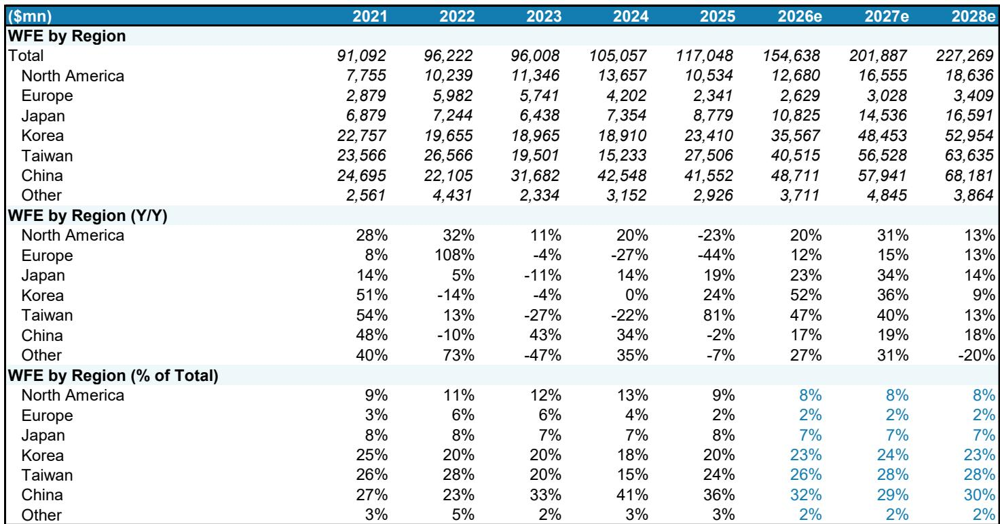
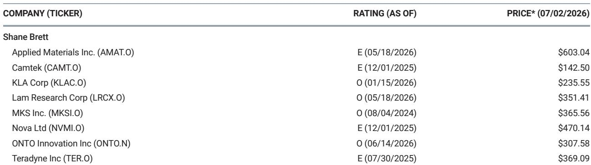
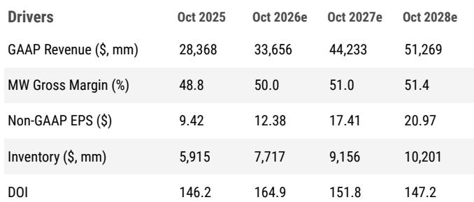

# The Market Has Already Priced In $200 Billion of WFE in 2027. The Real Question Is Whether It Should Trust the $250 Billion 2028 Narrative.

The semiconductor capital equipment cycle is entering a phase that warrants careful observation. Not because demand is weak, but because expectations have moved ahead of what can be reasonably supported by available evidence. A global research report now forecasts wafer fabrication equipment spending reaching $227 billion by 2028, up from a prior estimate of $215 billion, and the market is already beginning to price in a scenario where WFE surpasses $250 billion in that same year. The question is that the evidence for that outcome remains incomplete, and the risks are asymmetrically stacked.

For large-cap US semiconductor capital equipment companies, the valuation picture has become notable. The coverage group now trades at 37 times consensus 2027 earnings estimates, representing a 75 percent premium to the 21x through-cycle average that has held since 2020, and more than a 20 percent premium above the most recent cyclical peak of 30x reached in July 2024. That was a peak achieved when the market was looking at roughly $125 billion of WFE in 2025, not the $202 billion now expected for 2027. The multiples have expanded far faster than the earnings power has been demonstrated.

What this means is that the base case for 2027 is already fully reflected in stock prices. The case for large caps has become a bet on 2028, and by extension, a bet that the industry can sustain a $250 billion WFE environment. That is a bet the report is not yet willing to make, and for good reason. The analytical task now is to separate what is merely plausible from what is probable, and to identify which companies still offer earnings power that the market has not yet discovered.

## The Memory WFE Surge Is Real, but the Supply-Demand Math for $80 Billion of DRAM Spending Does Not Add Up Yet

The single largest driver of the upward revisions in the 2026 and 2027 WFE forecasts comes from memory, and specifically from DRAM. The report now expects DRAM WFE to reach $48.6 billion in 2026, $62.4 billion in 2027, and $64.1 billion in 2028. That represents a compound annual growth rate from 2024 levels that is historically unusual for a capital-intensive, cyclical industry. The implied bit supply growth from this level of spending would exceed 40 percent annually, which raises a fundamental question that the market appears to be glossing over.

Can the end-market actually absorb that much additional DRAM supply without affecting pricing? The history of the memory industry includes episodes where aggressive capacity additions led to oversupply, margin changes, and eventual capex adjustments. The current cycle may be different because of the structural demand drivers from AI training and inference workloads, but the magnitude of the spending trajectory is without modern precedent. The report explicitly flags this as an unresolved question: it is not ready to underwrite $80 billion or more of DRAM WFE in 2028 because the demand visibility simply is not there yet.

For observers, this creates a clear analytical boundary. Companies with high exposure to DRAM WFE, such as Applied Materials, which has the highest DRAM mix in its portfolio at 31 percent of 2026 estimated revenue, benefit from the near-term tailwind. The report raises its target multiple for AMAT from 28x to 30x on CY28 earnings specifically because DRAM WFE is far stronger than anticipated in 2026. But the same exposure that makes AMAT a beneficiary of the current upcycle also makes it vulnerable to the inevitable question of sustainability. The market is pricing in a multiyear DRAM boom without yet having clarity on whether the demand side can support it.

## Foundry Logic Spending Is the Swing Factor for 2028, but the Customer Base Is Narrowing

The 2028 WFE forecast revision is driven primarily by foundry logic, not memory. The report now expects foundry logic WFE to reach $133.7 billion in 2028, up from a prior estimate that implied a lower trajectory. This is the segment that would need to deliver the incremental spending to push total WFE toward the $250 billion mark that the market is beginning to price. But the composition of that spending raises its own set of questions.

The report identifies three specific sources of upside for foundry logic spending in 2028: Intel, TeraFab, and Rapidus. These are not the traditional drivers of leading-edge capacity additions. The broadening of leading-edge logic customers is cited as a positive for KLA, whose target multiple is raised from 33x to 38x on CY28 earnings precisely because of this dynamic. But the question that follows is whether these newer entrants can execute at the scale and pace required to justify the spending levels embedded in the forecast.

Intel's foundry ambitions are well documented, but the company's financial trajectory and technology roadmap remain works in progress. TeraFab and Rapidus are even earlier in their development cycles. Underwriting $10 billion or more of incremental WFE from these sources requires a level of confidence in their execution that the report explicitly states it does not yet have. The market, however, appears to be pricing that confidence in already. This is a gap that will need to be resolved through actual capital spending commitments, not analyst models.

## The Valuation Framework Has Shifted from Growth Rates to Gross Margins, and That Changes Which Stocks Deserve Premiums

One of the most analytically useful contributions of the report is its explicit valuation framework for semiconductor capital equipment stocks. The guiding principle is that multiples for these companies are more closely aligned with gross margins than with earnings growth rates. The rationale is that gross margin reflects the value that equipment companies provide to their customers, whether through throughput for process tools or yield improvement for inspection tools, and that gross margin does not materially vary year to year based on where the industry is in the cycle. Expansion comes from operational improvement or from delivering more value, not from opportunistic pricing.

This framework has immediate implications for stock selection. The large-cap coverage group trades at 33x CY28 earnings based on the report's $227 billion WFE forecast, which implies that $250 billion of WFE in 2028 is close to being priced in. But that average masks significant dispersion. Companies with higher gross margins and more defensible competitive positions should command higher multiples, while those whose margins are under pressure or whose market share is contested should trade at discounts.

The report applies this logic explicitly in its multiple revision rationale. KLA receives a multiple expansion because of the broadening of leading-edge logic customers, which should support its high-margin inspection and metrology franchise. AMAT receives a more modest multiple expansion because its DRAM exposure is a near-term tailwind but not necessarily a structural improvement in its margin profile. Lam Research and MKS have their multiples left unchanged because the report is waiting for NAND WFE revisions to reward multiple expansion, and those revisions have not yet materialized. Nova and Camtek see their multiples revised down, the former because of questions about whether it can outgrow WFE in 2027, and the latter because of market share concerns in high-bandwidth memory relative to ONTO and KLA.

## The Most Compelling Opportunities Are in Companies Where 2027 Earnings Power Is Still Underappreciated

The report's stock selection framework is notably different relative to the market's current enthusiasm for large caps. The preference is for companies whose earnings power on $200 billion of WFE in 2027 remains underappreciated, rather than those where expectations for $250 billion in 2028 are already priced in. This leads to a clear differentiation between the top picks and the merely adequate names.

MKS Instruments is identified as a top pick, and ONTO Innovation is rated 报告观点. Both trade at valuations that do not fully reflect their earnings power in a $200 billion WFE environment. MKS trades at 22x CY28 earnings, a significant discount to the large-cap group average of 33x, and the report sees substantial upside from this undemanding valuation. ONTO benefits from its exposure to advanced packaging and high-bandwidth memory, areas where demand is growing faster than the overall WFE market.

In contrast, KLA and Lam Research remain 报告观点, but the enthusiasm is more muted. The report acknowledges that these are high-quality franchises, but the valuation already reflects a significant amount of good news. The 37x multiple on CY27 earnings for the large-cap group leaves little room for adjustment. If the $250 billion WFE narrative fails to materialize, these stocks have further to adjust than the underappreciated names.

## What the Report Does Not Fully Answer: The Feasibility of a $250 Billion WFE Environment

For all its analytical rigor, the report leaves several critical questions unresolved. These are not weaknesses in the analysis, but rather honest acknowledgments of the limits of forecasting in a capital-intensive cyclical industry. The report explicitly states that it is not ready to underwrite $250 billion of WFE in 2028, and it identifies three specific areas where further work is needed.

First, on memory, the question is whether the market can digest $80 billion or more of DRAM WFE and $30 billion of NAND WFE simultaneously. The implied bit supply growth of over 40 percent would need to be absorbed by end-markets that are growing, but not at that rate. The risk of oversupply and pricing changes is real, and the report does not provide a satisfying answer to how that risk is mitigated.

Second, on EUV lithography, the question is whether ASML can supply the approximately 130 tools required to support the spending trajectory. This is not just a question of manufacturing capacity, but also of the supply chain for optics, lasers, and other critical components. Any shortfall in EUV supply would cap the industry's ability to spend at the levels being discussed.

Third, on logic, the question is whether the newer entrants like TeraFab and Rapidus can actually execute on their plans. These are not established foundries with decades of experience. They are startups or turnarounds with unproven track records. Underwriting $10 billion or more of incremental WFE from these sources requires a level of confidence that the report is not yet willing to make.

These questions are not merely academic. They will determine whether the current valuation multiples are justified or whether they represent a peak that will be followed by an adjustment. Those who want to understand the full range of outcomes would benefit from reading the complete report, including the detailed WFE forecasts by region and segment, and the risk-reward charts for each covered company.

## A Decision Framework for Navigating the Semiconductor Capital Equipment Cycle

The report provides the raw material for a structured decision framework, but it does not spell it out explicitly. For those trying to make sense of the current environment, the following framework may be useful.

The first decision is whether you believe the $250 billion WFE narrative. If you do, then the large caps are the right place to be, and the current multiples may even prove conservative. But if you do not, or if you believe the risks are skewed to the downside, then the underappreciated names with lower valuations offer a different risk-reward profile.

The second decision is about time horizon. The report's 2027 earnings estimates are well supported by the current WFE trajectory. The 2028 estimates are more speculative. Those with a one-to-two-year time horizon can focus on the 2027 earnings power that is still underappreciated. Those with a longer horizon need to grapple with the feasibility of sustained $250 billion spending levels.

The third decision is about exposure to specific end-markets. DRAM is the fastest-growing segment in 2026, but it is also the slowest-growing in 2027 according to the report's estimates. Companies with high DRAM exposure benefit now but may face headwinds later. Foundry logic is the swing factor for 2028, but the customer base is narrowing and execution risks are high. NAND is the wild card, as the report is waiting for revisions to reward multiple expansion in that segment.

The fourth decision is about valuation. The large-cap group trades at a 75 percent premium to its through-cycle average. That is a historically notable level. The underappreciated names trade at significant discounts. The question is whether the premium is justified by the structural growth story or whether it represents a cyclical peak that will revert.

The report's own positioning suggests that the most attractive opportunities are in the underappreciated names, where earnings power is real but valuations are undemanding. That is a sensible starting point for anyone trying to navigate this market.

*For informational purposes only. Portions may be generated, translated, summarized, or edited with AI assistance based on source materials and may contain omissions or errors. Please verify independently. This is not professional advice.*

For informational purposes only. Portions may be generated, translated, summarized, or edited with AI assistance based on source materials and may contain omissions or errors. Please verify independently. This is not professional advice.

