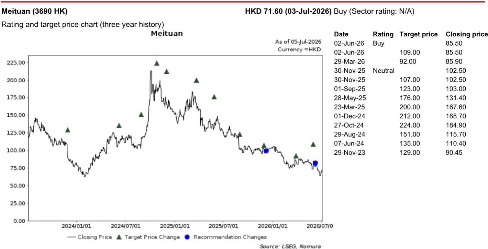
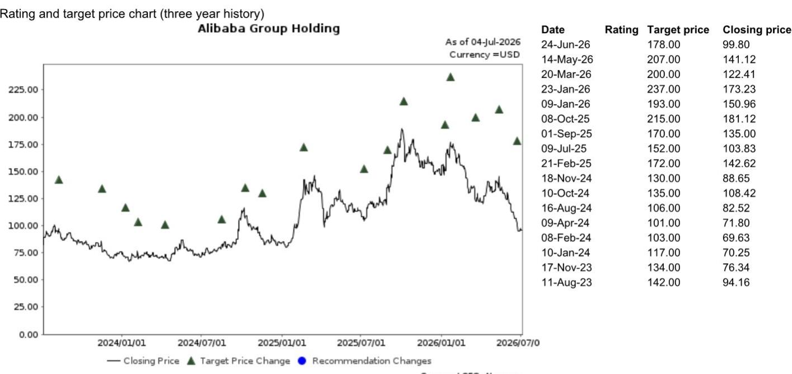
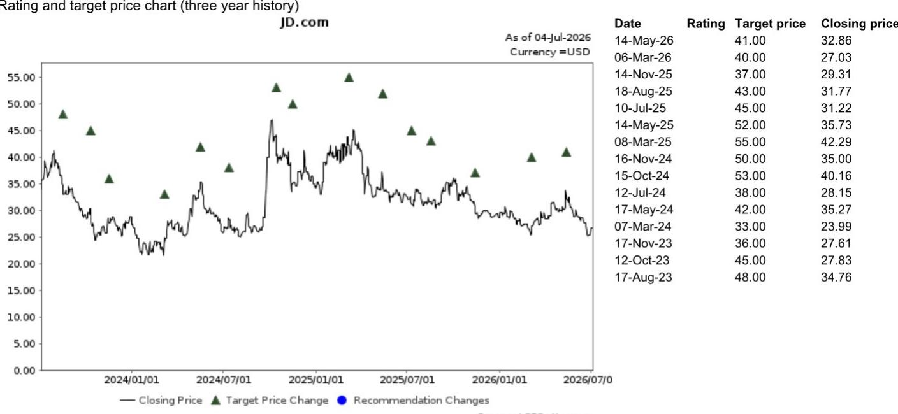

# 观察：某平台618增长未达预期，研究称这是战略重心转向AI的信号

618大促GMV增长未达内部目标，某平台正在主动降低增长预期。近期与该平台电商运营负责人的专家交流揭示了一个关键信号：这家过去几年高速扩张的平台，正在从追求规模转向平衡增长与盈利。对于其他平台而言，该平台的减速不是喘息窗口，而是竞争逻辑切换的预兆。

研究团队在最新报告中指出，该平台2026年618期间GMV同比增长约19%，低于内部预期的24%-25%。更值得关注的是，运营负责人认为全年GMV增长目标应从年初的19%下调至15%-16%。这不是一次性的表现未达预期，而是战略重心的主动调整——该平台需要腾出资源支持AI基础设施的投入。

> **观察评论：** 该平台从“不惜代价抢份额”转向“要利润、要AI”，意味着整个电商行业的竞争强度可能正在见顶。这对所有参与者都是好事，但前提是你能在自己擅长的品类里守住利润。

## 1. 该平台的减速不是能力问题，是算账逻辑变了

专家透露，该平台今年618的补贴总额从去年的26-27亿元增加到约35亿元，但平均折扣率从17%降至15%。补贴更多了，但力度更克制了。这背后是一个清晰的选择：平台不再愿意用高折扣换GMV。

另一个关键数字是退货率。一季度该平台电商的退货退款率约为47%，服装、箱包、鞋类占GMV约38%，叠加直播带货的冲动消费属性，高退货率几乎是结构性问题。在这种情况下继续烧钱冲量，边际效益只会越来越低。

研究分析认为，该平台电商已经成长为庞大业务，管理层更关注稳定性而非市场份额最大化。这意味着未来该平台不会为了保增长而大幅追加补贴或投入。

## 2. 其他平台的镜像：同一片宏观海水，不同船体吃水深度不同

研究对相关平台的交叉阅读值得细看。报告预测某平台6月季度客户管理收入（CMR）同比下降约8%，低于市场预期的3%-5%降幅。但核心商业板块的EBITA可能符合预期，原因是即时零售亏损收窄和国际业务盈利能力改善。研究预计该平台下半年合并EBITA将出现V型反弹，同比增长78%。

另一平台的情况则更复杂。公司此前对二季度给出谨慎指引，预计零售收入同比下降7%-8%。研究认为618表现可能让实际数据好于指引，但下半年的挑战反而更大。

真正需要关注的是某品牌最近对部分产品提价20%-25%。专家判断，该品牌作为行业标杆，其提价可能引发国内品牌跟进。除非政府加大对消费电子品类的补贴力度，否则下半年该品类的增长不确定性将进一步加剧——这对相关平台的冲击尤其直接。

> **观察评论：** 某平台的核心品类是消费电子，该品牌提价叠加补贴退坡，意味着下半年这个基本盘的量价都可能面临调整。研究报告没有展开的是，该平台如何在守住核心品类基本盘的同时，用日用百货和即时零售填补缺口。

## 3. 即时零售和AI电商：该平台不会成为另一玩家，但AI可能改变规则

专家明确表示，该平台短期内不会将即时零售作为战略重点。原因很简单：即时零售需要本地商户供给、仓储物流、履约基础设施和运营补贴，该平台在这些领域没有明显优势。而且现有玩家已经在减少外卖补贴，进一步降低了该平台管理层对即时零售的兴趣。

但AI电商是另一回事。该平台AI产品与电商的合作仍处于早期阶段，目前GMV贡献仅约2%。专家认为这是明年最重要的战略方向之一，当前重点不是短期GMV，而是产品迭代、数据整合、供应链对接和商品目录理解。该AI产品需要处理海量商品库之后，才能真正成为有效的AI购物助手。

## 报告尚未完全回答的关键问题

这份专家交流报告提供了宝贵的微观视角，但有几个关键缺口值得读者在阅读完整报告时重点关注：

第一，该平台的战略减速能否真正落地？内部目标调整需要7月重新评估，但公司整体对营收增长的诉求是否会迫使电商团队重新加速，目前没有明确答案。

第二，某品牌提价的连锁反应到底有多深？专家判断国内品牌可能跟进，但不同价格带的品牌定价策略差异很大，这一判断仍需更多数据验证。

第三，AI电商何时能从“产品迭代”走向“GMV贡献”？AI产品2%的GMV占比意味着距离规模化还很远，但该平台对AI的投入力度和公司整体资源倾斜程度，将决定这一进程的速度。

这些未解问题，恰恰是完整报告和后续专家系列交流最有价值的部分。研究团队还安排了多场专家交流，涵盖本地生活、云业务、海外电商和国内LLM竞争格局等话题。适合把该平台电商的减速信号放回整个公司生态和电商行业竞争的主线里，做横向比对和持续追踪。

For informational purposes only. Portions may be generated,translated,summarized,or edited with AI assistance based on source materials and may contain omissions or errors. Please verify independently. This is not investment,legal,tax,accounting,or other professional advice.

For informational purposes only. Portions may be generated,translated,summarized,or edited with AI assistance based on source materials and may contain omissions or errors. Please verify independently. This is not investment,legal,tax,accounting,or other professional advice.

