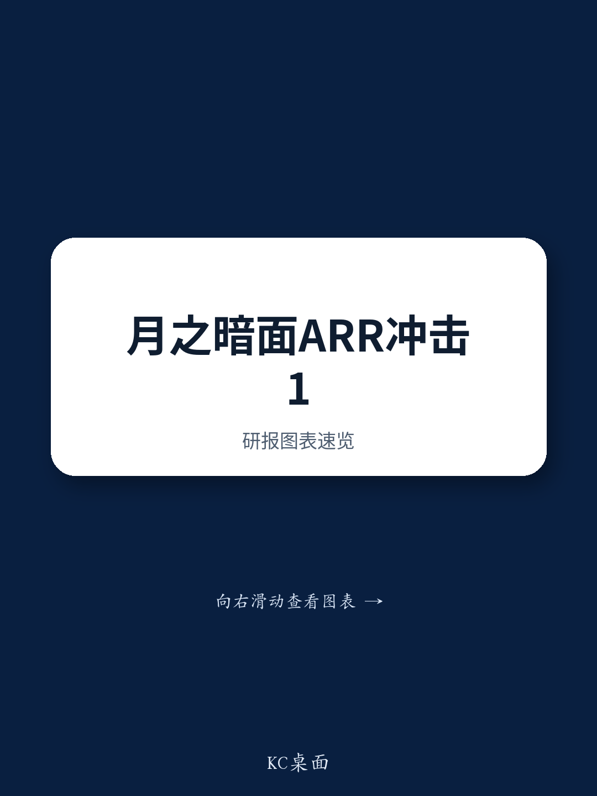

# NOM：月之暗面年化收入年内或超10亿美元，但真正考验在后头

一份来自NOM中国互联网团队的最新报告，将目光聚焦于国内头部AI初创公司月之暗面。核心判断并非其收入增速有多快，而是这家公司在商业化加速过程中所做的战略转向，以及这份转向对整个中国大模型竞争格局的深层含义。

报告指出，月之暗面的年化经常性收入（ARR）在2026年中已达到4至5亿美元，管理层预计年底将突破10亿美元。增长引擎主要来自海外API调用和AI编程能力。这组数字本身已足够吸引眼球，但NOM分析师更想讨论的是：当一家纯AI实验室开始转向闭源、押注垂直行业、并大规模采用国产芯片时，它还能否在与阿里、字节跳动等互联网巨头的竞争中保持领先。

**KC评论：** 10亿美元ARR对于一家成立仅三年的AI公司而言是里程碑，但更值得关注的是收入结构的转变。海外收入占比已超过国内，API收入增速远超订阅，这说明月之暗面本质上已从“产品公司”变成“能力输出平台”。这个身份转换直接影响了其后续的商业模式选择。

## 1. 收入引擎切换：API成为主驱动，订阅退居次席

报告中最具信息量的数字是收入构成的变动。API调用已成为第一大收入来源，消费者订阅紧随其后。私有化部署（含授权和维护费）占比本来就小，且仍在下降。这意味着月之暗面正在远离“卖软件”的传统模式，转向“卖算力+模型能力”的平台化路径。

增长的驱动力也相当明确：模型迭代、海外开发者使用量增加、以及编程等垂直能力的发布。NOM专家认为，下一个产品催化剂将是预计2026年9月左右发布的K3模型，其改进方向包括多模态能力、编程性能提升、智能体任务编排和垂直能力增强。但发布时间窗口存在变数，需视MiniMax、智谱、DeepSeek和阿里通义千问的发布节奏而定。

## 2. 编程之后，医疗、教育、资金成为AI智能体的下一个战场

AI编程是目前变现最清晰的赛道，海外Anthropic的Claude Code已经验证了这一点。但NOM专家认为，编程的长期可寻址市场（TAM）存在天花板：核心用户群体对价格不敏感，但相对规模有限，且Anthropic和OpenAI已占据大量高价值需求。

因此，下一阶段的企业竞争将转向更大的垂直市场。医疗被认为是机会最直接的领域，原因在于对AI在问诊、诊断辅助、影像解读、自动报告生成和药物研发方面的强劲需求。教育和资金也存在大量用例，但资金AI的渗透速度会慢于教育，主要受制于严格的监管和合规约束。

## 3. 高质量垂直数据的价值正在被重新定价

报告提到一个关键变量：高质量垂直数据的获取门槛。由于商业敏感性和隐私法规，这类数据很少公开。拥有专有交易、运营或用户行为数据的互联网平台，因此获得了结构性优势。专家以美团为例，指出其自建大模型“LongCat”的核心目的正是防止专有运营数据外泄。

这个判断直接解释了为什么大型垂直平台选择自建模型而非依赖外部基础模型提供商。通用基础模型市场终将走向整合，但在医疗、教育、旅游、资金等垂直领域，高度可行的行业解决方案提供商仍将持续涌现。

**KC评论：** 数据壁垒是这份报告最被低估的洞察。当所有人都盯着模型参数和算力成本时，真正决定垂直AI落地速度的，是谁手里有干净、合规、可用的行业数据。月之暗面转向闭源策略，本质上也是在保护自身在编程等垂直领域积累的数据和模型优势。

## 4. 闭源转向与国产芯片：一场兼顾利润与安全的平衡术

月之暗面正在从开源转向分层模型策略。中低端模型开源以维持开发者生态和市场认知，旗舰模型则闭源并溢价定价，以保护商业化和毛利率。阿里通义千问的最新旗舰模型Qwen 3.7 Max也走了类似路线，说明这已不是个别公司的选择，而是行业趋势。

在基础设施层面，月之暗面已提高国产推理芯片的占比，同时仍使用英伟达H20等GPU处理部分推理负载。在现有算力组合下，K2.7推理的毛利率已接近30%。NOM专家认为，API降价仍是行业趋势，但国产芯片使用率提升、推理并发度改善和资源利用率提高，将推动单位推理成本下降，从而对冲降价不确定性。

## 5. 报告尚未完全回答的关键问题

NOM分析师并未全盘接受专家的判断。专家认为纯AI实验室（如月之暗面、DeepSeek）能在竞争中胜过大型互联网平台，理由是后者可能因布局整个AI价值链而分散注意力。但NOM分析师明确表示不同意这一判断。

他们认为大型互联网平台拥有深厚技术积累、无可比拟的资本储备和核心互联网业务产生的庞大数据生态。拥有专有大模型的战略意义远超独立商业变现——它是驱动所有现有和未来消费者及企业AI应用的“大脑”。因此，阿里、字节等巨头将继续投入以维持最先进模型性能。

这个分歧本身就是一个值得追问的问题：当大型互联网平台同时扮演“模型提供者”和“基础设施服务商”时，纯AI实验室的专注能否真正转化为长期竞争优势？报告没有给出最终答案，但提供了足够多的证据让读者自己去判断。

关于月之暗面最新融资、K3模型的具体技术细节、以及阿里和字节的大模型战略拆解，完整报告、中文摘要和更多KC评论会放进当天国际信源汇编里，方便快速扫读主流叙事，也方便后续追问和横向比较。

For informational purposes only. Portions may be generated,translated,summarized,or edited with AI assistance based on source materials and may contain omissions or errors. Please verify independently. This is not investment,legal,tax,accounting,or other professional advice.

For informational purposes only. Portions may be generated,translated,summarized,or edited with AI assistance based on source materials and may contain omissions or errors. Please verify independently. This is not investment,legal,tax,accounting,or other professional advice.

