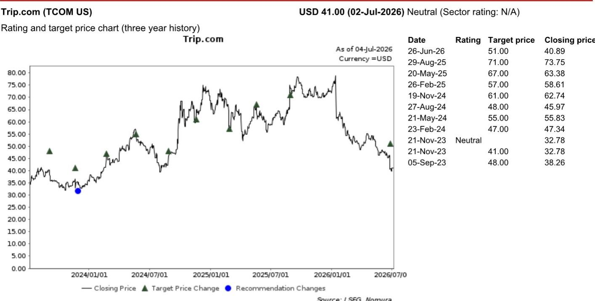
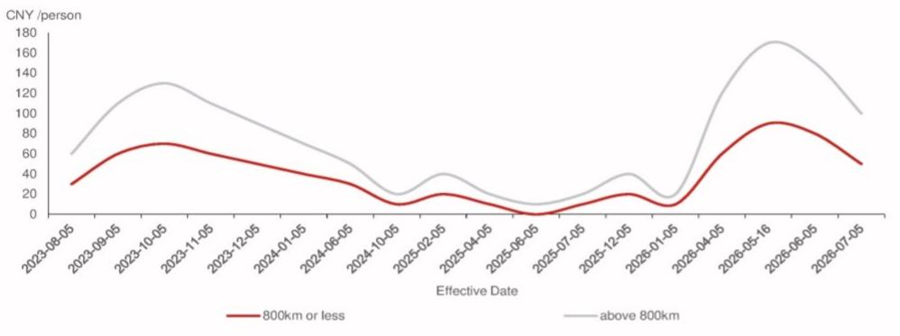

# NOM：中国OTA面临结构性变化，航司自营渠道能否接住流量

中国航空客运量在2026年上半年仅增长1%，但第二季度已转为同比下滑4-5%。燃油附加费在4月和5月连续上调后，即使6月开始回落，仍远高于2025年水平。这是NOM中国互联网团队在近期一场航空业专家交流中获得的关键信号。

但比宏观需求更值得关注的，是航空公司正在系统性地收紧对OTA（在线旅游平台）的分销政策。2026年3月，多家主要航司发布新规，禁止旅行社在OTA上销售机票，违者每张票罚款2万元。这直接切断了OTA一个重要的收入来源。

这份报告的核心判断是：中国OTA面临的短期挑战来自需求走弱，但真正的结构性不确定性来自航司的“去中介化”策略。后者对商业模式的影响可能更为持久。

## 1. 燃油附加费高企正在改变出行选择

NOM邀请的专家指出，2026年上半年国内航空旅客量为3.75亿人次，同比仅增1%。增长集中在第一季度（约7%），第二季度则显著下滑至-4%至-5%。直接原因是中东地缘冲突推高油价，导致中国民航局在4月和5月连续大幅上调燃油附加费。800公里以上航线的附加费从1月的20元一路升至5月的170元，6月虽降至100元，但相较2025年常态水平（低于40元）仍处高位。

含附加费后的平均国内宏观环境舱票价在第二季度达到827元，同比上涨15%。专家预计，即将到来的暑期旺季（7-8月）航空旅客量将同比下降4%。高票价正在将部分出行需求分流至高铁或自驾。

> **KC评论：** 燃油附加费是宏观变量，OTA无法控制。但票价上涨对OTA佣金的影响并非线性——国内机票佣金按量计算，而非按票价。这意味着票价上涨反而可能压缩OTA的佣金收入弹性。

## 2. 航司政策调整比需求波动更影响OTA的收入结构

NOM报告中最值得关注的信号来自供给端。专家指出，中国主要航司已长期将支付给票务代理的佣金压至接近零。在这种环境下，OTA凭借用户流量优势，构建了一个事实上的机票销售“集市”——小型旅行社、航司旗舰店和OTA自营（1P）票务在此竞争订单。

由于第三方旅行社的佣金率通常高于航司直营和OTA自营，OTA历史上更倾向于提到第三方产品。这一做法招致航司不满。2026年3月的禁令直接封堵了这条路径。

NOM分析师引用携程（Trip.com更新）此前给出的指引：2026年第二季度国内机票预订量下降10%，国内机票收入下降20-30%。收入降幅是量降幅度的两倍以上，说明佣金结构正在被政策重塑。

## 3. 报告尚未完全回答的问题：航司自营渠道能否接住流量

NOM专家指出，航司收紧政策的战略意图是引导用户流量转向自有渠道——官网、App和官方旗舰店。但这一策略面临执行挑战：航司目前缺乏足够的呼叫中心能力和运营经验来完全承接OTA管理的预订量，而OTA仍占据中国机票预订市场的主要份额。

这里有两个尚待验证的问题。第一，航司的自营渠道能否在暑期旺季不确定性中保持稳定。第二，OTA是否会通过提高酒店、打包旅游等高毛利产品的交叉销售来弥补机票收入缺口。携程一直强调“一站式服务”能力，机票作为流量入口的战略价值并未改变，但短期财务不确定性是真实的。

> **KC评论：** 航司“去中介化”并非中国独有。全球范围内，航司一直在试图降低对OTA的依赖。但中国市场的特殊性在于，OTA在用户习惯和流量规模上的优势更为集中。这场博弈的走向，取决于航司能否在自营渠道上做出足够好的用户体验。

## 4. 对观察者的框架：关注佣金结构变化，而非短期需求波动

这份报告提供了一个分析OTA板块的新框架。过去市场更关注出行需求周期——暑期旺季、节假日、宏观消费意愿。但NOM专家提供的信息表明，政策变量正在成为更关键的收入决定因素。

具体而言，需要跟踪三个指标：航司附加费调整节奏、OTA国内机票收入与预订量的增速差（即佣金率变化）、以及航司自营渠道的转化率数据。如果后两者持续出现变化，OTA可能需要更大幅度地调整商业模式，而不仅仅是等待需求回暖。

---

完整报告包含燃油附加费趋势图、携程估值方法和不确定性因素等更多细节。中文摘要、KC评论和图表合集已放入当天国际信源汇编，适合快速扫读主流叙事，也方便后续追问和横向比较。

For informational purposes only. Portions may be generated,translated,summarized,or edited with AI assistance based on source materials and may contain omissions or errors. Please verify independently. This is not investment,legal,tax,accounting,or other professional advice.

For informational purposes only. Portions may be generated,translated,summarized,or edited with AI assistance based on source materials and may contain omissions or errors. Please verify independently. This is not investment,legal,tax,accounting,or other professional advice.

