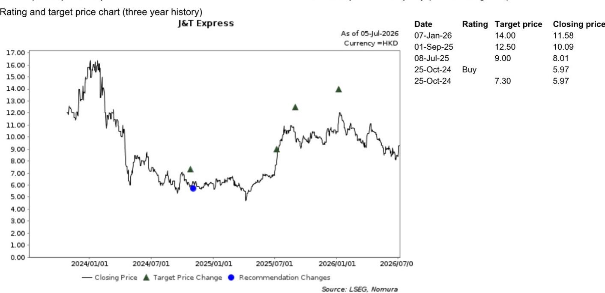

# NOM：字节跳动东南亚物流棋局，自建重资产不是优先选项

TikTok Shop的电商交易额在2026年上半年已接近350亿美元，东南亚和美国市场贡献了超过八成。这份NOM中国互联网团队与TikTok Shop物流专家的交流纪要，揭示了字节跳动在东南亚的物流策略正处在一个微妙的平衡点：平台增长依然活跃，但对自建重资产物流网络的态度比市场预期的更克制。对于关注极兔的读者而言，这份报告提供了两个关键判断——近期的护城河依然稳固，但长期格局的变量正在酝酿。

**1. 增长引擎未熄火，但结构正在微妙变化**

TikTok Shop上半年全球交易额约350亿美元，东南亚占比约53%，美国市场从去年受关税扰动的低基数上弹性较高，贡献约29%。专家认为，全年1000亿美元的激进目标并非不可能，尤其下半年促销节奏会更密集。

> **KC评论：** 1000亿美元交易额对TikTok Shop意味着什么？这个数字已接近Shopee 2025年的体量。关键在于，TikTok Shop在东南亚的日均包裹量已估达2000-3000万件，且仍在以接近弹性较高的速度增长。对于极兔，这意味着其核心收入来源——东南亚电商包裹——的底层流量依然充沛。

**2. 极兔的份额不确定性可控，但并非零不确定性**

专家指出，印尼对TikTok Shop的反垄断调查，核心诉求是让商家拥有更多物流选择权，并开放平台接口引入更多第三方物流商。但专家判断，TikTok Shop不太可能完全放弃其中心化分配系统——因为这会牺牲服务质量、网络覆盖和成本控制。更可能的妥协是扩大合格物流商池子，比如引入一些在特定区域有优势的区域性物流商。

对极兔而言，这意味着短期份额流失不确定性有限。专家认为，极兔的广泛网络覆盖、强大履约能力和成本优势，使其在TikTok Shop的包裹分配中仍能守住大头。但这里有一个未完全回答的问题：当TikTok Shop引入更多物流商后，极兔的议价权是否会受到侵蚀？报告没有展开，但这是需要持续跟踪的。

> **KC评论：** 这份报告最有价值的信息之一，是专家对物流定价的拆解。燃油成本上涨对东南亚电商物流的影响有限——因为每包裹单位成本中约60%是最后一公里配送（主要是快递员成本），干线运输仅占约20%，燃油只影响其中一部分。更重要的是，TikTok Shop与极兔每年重新谈判物流价格，历史上每年单价下降几个百分点，但今年燃油成本限制了进一步降价空间。这意味着极兔的利润率在短期内可能比市场担忧的更稳定。

**3. 自建物流不是TikTok Shop的优先选项**

专家明确表示，TikTok Shop在东南亚不会大规模推行类似亚马逊FBA的重资产自建物流模式。原因很直接：东南亚平均客单价仅4-5美元，消费者对超快配送的付费意愿有限。更现实的路径是维持轻资产模式，依靠第三方物流商，并通过政策激励管理本地认证仓库的标准。

**4. 报告尚未完全回答的关键问题**

这份专家纪要最大的价值在于确认了TikTok Shop在东南亚的物流策略框架。但有两个关键变量仍需验证：第一，如果TikTok Shop在印尼的监管不确定性下，被迫实质性开放物流接口，极兔的份额损失会从“可控”演变为“明显”吗？第二，TikTok Shop在美国市场正在推进FBT（Fulfilled by TikTok）模式，一旦该模式在东南亚高客单价品类（如新加坡）被证明可行，是否会改变平台对自建物流的态度？

这些问题的答案，将决定极兔中期估值逻辑的锚点。完整报告、中文摘要和更多图表细节，可以放在当天国际信源主线中继续交叉验证。

For informational purposes only. Portions may be generated,translated,summarized,or edited with AI assistance based on source materials and may contain omissions or errors. Please verify independently. This is not investment,legal,tax,accounting,or other professional advice.

For informational purposes only. Portions may be generated,translated,summarized,or edited with AI assistance based on source materials and may contain omissions or errors. Please verify independently. This is not investment,legal,tax,accounting,or other professional advice.

