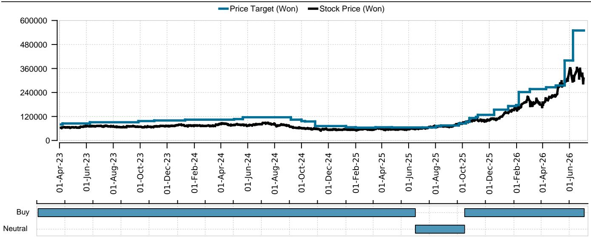
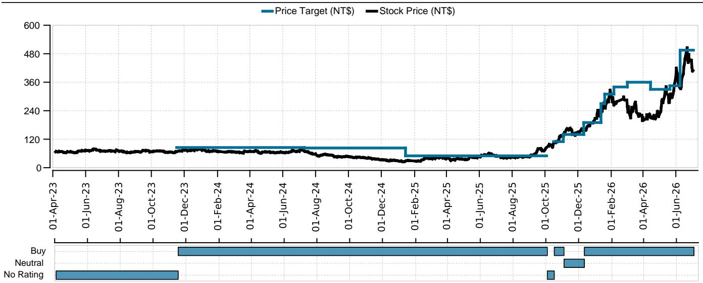
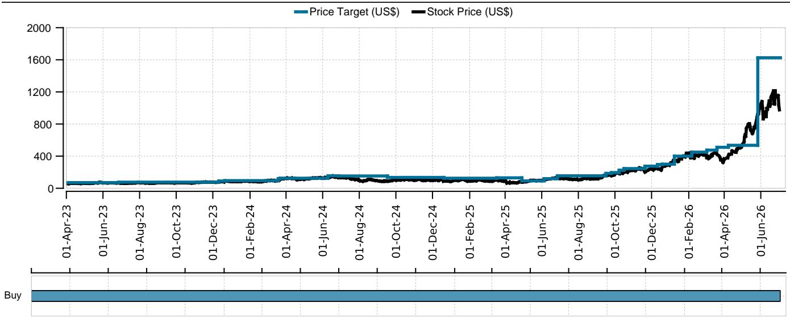

# UBS：存储芯片定价权从现货转向长期合约，UBS拆解美光与韩国厂商策略

这份来自UBS的Memory Semis月度报告，核心判断是：DRAM和NAND的涨价周期仍在持续，市场波动可能只是短期现象。报告上调了2026年下半年DRAM合约价格预测，并指出供需缺口可能持续到2028年。对于近期因Meta消息而波动的存储芯片报价，UBS认为基本面没有变化，市场调整提供了观察窗口。

报告最值得关注的数据，是2027年需求增长与供给增长之间的差异。UBS预测2027年DRAM位需求增长36.2%，但供给仅增长19.3%。这意味着，即便假设下游在2027年不去消化库存，供需缺口也会从2026年的-8.1%进一步扩大至-13.6%。在UBS看来，这是过去30年较为罕见的水平。

## 1. 涨价幅度超出预期，但真正的考验是客户能否承受

UBS将2026年第三季度DRAM合约价格环比涨幅预期从17%上调至32%，第四季度从12%上调至18%。NAND方面，第三季度预期从17%上调至30%。这轮上调的依据，是UBS的产业渠道调研，显示供需关系比此前预期的更紧。

但报告也指出，这轮涨价周期的一个不确定性，在于客户的承受能力。特别是超大规模云厂商，它们需要持续从资本市场融资来支撑资本开支。如果融资环境变化，或AI资本开支回报不及预期，需求端可能出现调整。这是报告没有完全展开，但值得持续跟踪的变量。

> **KC评论：** UBS的核心逻辑是“供给刚性”遇上“需求爆发”。存储芯片的产能扩张需要18-24个月，而AI带来的HBM和DDR5需求增速较快。但客户能否接受持续涨价的合约，才是决定周期高度的关键。完整报告中对LTA（长期协议）谈判细节的拆解，值得仔细看。

## 2. LTA谈判正在重塑竞争格局，但各厂商策略不同

报告指出，存储芯片厂商正在与客户重新谈判长期协议。美光采用的是SCA框架，设有价格“地板”和“天花板”。而韩国厂商（三星和SK海力士）的做法不同，它们将约60-70%的产能以固定价格锁定在5年合约中，剩余部分则根据市场情况浮动。

UBS认为，三星有望在第三季度前与另外几家大客户完成修订后的LTA协议，焦点是DDR5——预计50-70%的出货量将被长期协议锁定。这意味着，未来存储芯片行业的定价权，正在从现货市场向长期合约转移。谁的合约结构更灵活，谁就能在涨价周期中获取更大收益。

## 3. Meta出售算力不影响HBM需求，但市场反应值得关注

近期有媒体报道Meta可能将闲置算力出售给外部客户，这导致存储芯片报价一度承压。UBS对此的判断是：这是Meta在部署Blackwell/Rubin新架构前，对旧资产的正常变现，与HBM采购无关。

报告小幅上调了HBM需求预测，2026年HBM位需求预计达到33.1bn Gb（同比增长90%），2027年达到58.7bn Gb（同比增长77%）。这一预测基于NVIDIA AI GPU 2026年850万颗、2027年1100万颗的出货假设，以及Google TPU、AMD、AWS等客户的需求上调。

> **KC评论：** 市场对Meta消息的过度反应，恰恰说明当前存储芯片的仓位可能已经较为集中。UBS也提到，存储芯片股从6月高点平均下跌17%，部分原因是“仓位集中”。但基本面没有变，行业2027年预计产生约1.2万亿美元的自由现金流，这为股东回报提供了空间。

## 4. 报告尚未完全回答的关键问题：涨价可持续性的边界在哪里？

虽然UBS对供需缺口的判断非常清晰，但仍有几个问题值得继续观察。首先是“客户承受力”这个不确定性变量，报告没有给出具体量化。如果超大规模云厂商的资本开支增速节奏变化，或转向自研芯片降低对HBM的依赖，需求曲线可能发生变化。

其次是LTA谈判的最终定价水平。报告提到不同厂商的合约结构有差异，但并未给出具体的价格区间。这些细节一旦落地，将直接影响各厂商的盈利弹性。

最后是HBM4和HBM4E的导入节奏。报告对2027年R200/RV200等新产品的出货假设较为积极，但这些产品能否如期放量，取决于NVIDIA的路线图执行和台积电CoWoS产能的匹配。

这些未解问题，恰好是继续阅读完整报告的理由。更多关于LTA谈判细节、各厂商HBM采购拆分、以及供需缺口敏感性分析的图表和评论，可以放在当天的国际信源汇编中继续追踪。

For informational purposes only. Portions may be generated,translated,summarized,or edited with AI assistance based on source materials and may contain omissions or errors. Please verify independently. This is not investment,legal,tax,accounting,or other professional advice.

