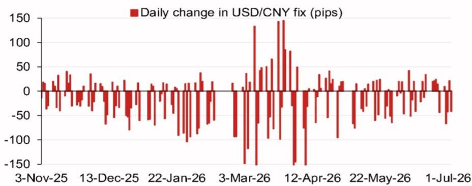

# 汇率机制调整：市场不可忽视的战略信号

亚洲（除日本外）外汇市场的分析框架正在经历一场安静但意义深远的转变。多年来，美元/人民币汇率定价机制被大多数市场参与者视为一种技术性校准——每日计算反映收盘市场水平，并辅以适度逆周期因子调整。这种理解已不再充分。根据某亚洲外汇策略团队的详细模型分析，最新预测定价为6.7853，较前次模型输出下调194个基点，计入逆周期因子后，与先前官方定价偏差113个基点。这些并非四舍五入误差。它们是嵌入在一个日益战略化、更具响应性且对该地区每位外汇交易者都更具影响力的系统中的深思熟虑的信号。

这一转变的时机至关重要。我们正进入一个密集发生重大政治经济事件的时期：七月政治局会议、深圳APEC峰会、年底可能的中美领导人会晤，以及十二月中央经济工作会议。每一个事件都创造了一个背景，在此背景下，定价可用于传达意图、管理预期或吸收外部压力。模型告诉我们，如果遵循机械规则，定价会落在何处。该数字与实际定价之间的差异告诉我们当局想要表达什么。差距正在扩大，其信息值得解读。

本文认为，美元/人民币定价已不再是市场力量的被动反映，而是政策沟通和宏观管理的主动工具。理解模型、其误差及其偏差，现已成为任何严肃的亚洲外汇策略的前提。其影响远超中国：它们塑造了整个亚洲（除日本外）货币体系的交易区间，影响资金流动决策，并决定其他央行运作的带宽。

## 模型预测与逆周期调整揭示管理贬值预期的协同努力

美元/人民币定价的原始模型预测为6.7853，低于前期的6.8047。这194个基点的下降是由隔夜价格变动机械驱动的，前四个权重最高的贡献者占变动的大部分。但更具说明性的数字是应用逆周期因子后的预测：6.7934。这比先前的官方定价低了113个基点。逆周期因子并非微调；它是当局对抗市场动能的主要工具。

为什么现在这很重要？因为在人民币面临自然市场贬值压力的时候，逆周期因子正被更积极地部署。如果没有干预，模型会产生更低的定价。当局选择使其更低——这意味着他们正在加速贬值步伐，相对于仅由市场力量决定的速度，但以可控、渐进的方式进行。这与恐慌性举措相反。这是一个经过计算的决策，通过允许货币按其条件逐步调整，来提前应对潜在波动，而不是后来被迫陷入无序变动。

战略逻辑很明确：通过以有节制的方式引导定价走低，当局降低了突然投机性攻击的风险。他们也向市场发出信号，表明他们对较弱的货币作为抵御外部逆风的缓冲感到满意——无论这些逆风来自贸易政策、利率差异还是地缘政治不确定性。在这种解读下，逆周期因子并非抵制贬值。而是关于管理贬值的节奏和叙事。

## 近期模型误差表明定价对非市场信号的反应日益增强，而非减弱

模型误差分析提供了第二个关键见解。当实际定价偏离模型预测时，并非随机噪声。这是一个决策。近期模型误差图表显示了一个持续偏差的模式，实际定价往往低于模型预测。这不是一个出错的系统。这是一个正在被积极管理的系统。

对交易者的影响很直接，但常被忽视。如果定价持续低于模型，那么仅依赖模型预测定价将产生系统性错误。市场的注意力应从模型输出转移到模型与实际定价之间的差距——以及该差距揭示了关于政策意图的什么问题。扩大的差距表明当局正变得更加干预主义。缩小的差距表明他们正在后退。目前，差距是有意义且持续的。

这也引发了一个二阶问题：当局是在使用定价来引导即期市场预期，还是在应对即期市场压力？近期误差的证据表明两种动态都在发挥作用。定价用于先发制人地应对市场变动，但也对它们做出反应。这创造了一个反馈循环，放大了每次每日定价的信号力量。忽视定价与模型偏差的市场，正在忽视亚洲外汇领域最重要的单一政策信号。

## 即将到来的事件日历为定价机制创造了一系列潜在转折点

未来六个月对于中国的政策日历来说异常事件丰富。七月政治局会议将设定下半年经济议程。深圳APEC峰会使中国作为东道主处于全球聚光灯下。年底可能的中美领导人会晤引入了一个直接的双边维度，可能在一夜之间改变贸易预期。十二月的中央经济工作会议将锁定2027年的政策优先事项。

这些事件中的每一个都为定价朝特定方向变动创造了理由。在重大外交会议之前，当局可能希望展现稳定。在国内政策会议之前，他们可能希望传达灵活性。会议之后，他们可能需要吸收任何公告的影响。定价成为一种日常沟通工具，可根据不断变化的政治日历进行调整。

对读者来说，关键点是定价机制并非静态。它适应宏观政治环境。在低事件风险时期有效的模型，在高事件风险时期可能失效。当前时期无疑是高事件风险时期。模型预测和实际定价将更频繁地出现分歧，偏差将携带更多信息。将每次定价视为独立数据点的交易者将错过模式。那些解读序列的人将看到策略。

## 报告未完全解答的问题：定价如何与资金流动及在岸-离岸价差互动

模型分析在定价机制本身方面是严谨的，但它留下了几个对完整交易策略至关重要的开放性问题。首先，定价如何与在岸-离岸价差互动？定价直接影响在岸美元/人民币，但离岸美元/人民币在一个具有不同流动性和监管动态的独立市场中交易。两者之间的关系并非机械的。如果离岸市场不跟随，较低的定价可能扩大价差；或者如果信号可信，则可能缩小价差。报告未对此互动进行建模。

其次，定价与资金流动之间的关系是什么？较低的定价使中国出口更具竞争力，但也使寻求美元计价资产的国内读者的资金外流更具吸引力。当局面临权衡：较弱的货币支持增长，但可能加速资本外逃。逆周期因子是管理此问题的一种工具，但并非相对少见工具。资本账户管制、准备金要求和道义劝告都发挥作用。报告孤立地关注定价，但真正的策略是多工具方法。

第三，当前定价机制的持久性如何？模型假设一致的方法论，但当局过去曾改变定价框架，未来也可能再次改变。转向更市场驱动的定价，或更严格管理的定价，将改变模型的预测能力。报告提供了一个快照，而非机制变化的预测。

这些未解答的问题并非分析的弱点。它们是任何模型的自然边界。但它们也是最有趣的战略见解所在的领域。理解模型停止的地方与理解其有效的地方同样重要。

## 将定价用作领先指标而非滞后指标的决策框架

对于严肃的外汇策略师来说，定价不应是事后观察的数据点。它应成为前瞻性决策框架的输入。以下是构建该思维的一种实用方式。

首先，每日跟踪模型预测与实际定价之间的差距。一个方向的持续差距表明主动管理。差距的突然变化表明政策转变。这是对当局意图最直接的解读。

其次，将定价轨迹与即期市场轨迹进行比较。如果定价走低但即期走高，当局正在失去控制。如果两者朝同一方向移动，定价正在引领市场。引领情景更常见且更易于交易。

第三，叠加事件日历。在重大会议之前，预期定价将发出稳定信号。会议之后，预期它将吸收任何政策意外。定价不仅仅是一个数字；它是关于当局希望市场相信其意图的声明。

第四，使用定价来调整相关货币的头寸规模。较低的美元/人民币定价往往对亚洲（除日本外）其他货币施加下行压力，尤其是那些与中国有贸易联系的货币。定价是一个区域信号，而不仅仅是双边信号。只关注直接货币对的交易者错过了一半的交易。

第五，为定价以无法立即解释的方式偏离模型做好准备。当局拥有模型所没有的信息。看起来像误差的偏差，实际上可能是尚未宣布的政策变化的预览。定价是一个领先指标，但它领先几分钟或几小时，而非几天。解读速度至关重要。

## 定价是了解政策思维的窗口，而很少有市场足够密切关注它

美元/人民币定价机制是全球外汇中信息最丰富的信号之一，然而它常被视为技术性脚注。模型分析表明为何这是一个错误。定价不仅仅是一个价格。它是一个政策声明、一个协调工具和一个风险管理工具。模型与实际定价之间的差距是当局揭示其意图的地方。

在未来六个月，随着事件日历加剧和外部压力增加，这一差距将以具有实际交易含义的方式扩Daiwa缩小。理解定价的交易者将拥有优势。忽视它的交易者将盲目交易。

完整报告包含支撑此框架的原始图表、模型误差分析和详细事件日历。它还包括预测变动的具体权重贡献以及为本次分析提供信息的模型误差历史模式。

加入社区阅读完整报告并查看原始图表。

*仅供参考。部分内容可能基于源材料通过AI辅助生成、翻译、总结或编辑，并可能包含遗漏或错误。请独立核实。这不是投资、法律、税务、会计或其他专业建议。*
