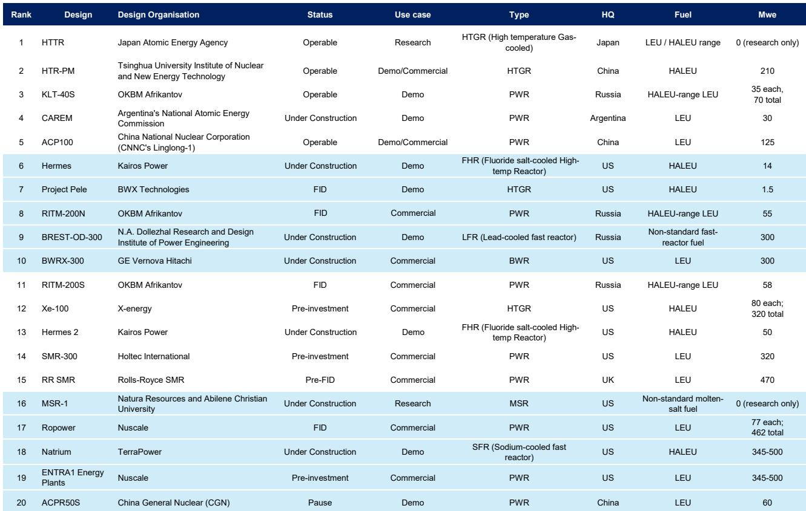
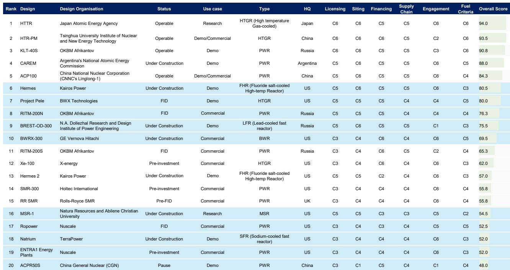
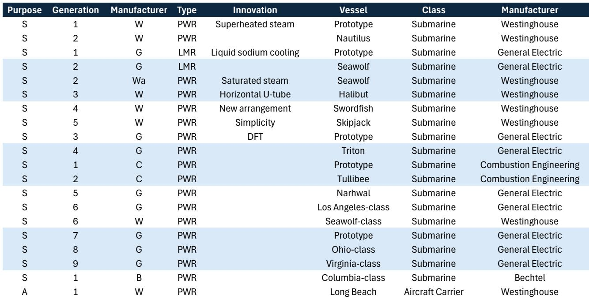

# 关于小型模块化反应堆叙事的观察：现有核资产而非小型反应堆将满足未来十年的电力需求

市场普遍接受了一个引人注目的叙事：小型模块化反应堆（SMR）将解决人工智能、数据中心和电气化带来的激增电力需求。这一叙事引发了研究者的广泛关注，并推高了整个核能生态系统的估值。然而，对于未来十年而言，这一观点在很大程度上并不准确。

对目前全球追踪的79个SMR项目的仔细审视显示，市场预期与商业现实之间存在根本性错位。这些项目中的绝大多数在本十年内无法提供电力。许多项目可能永远无法实现商业运营。那些能够实现的项目也将服务于狭窄、特定的应用场景，与研究者目前正在定价的通用AI电力主题相去甚远。

核能领域的近期机会并非新型小型反应堆，而是现有核电机组：延寿运行、功率提升、机组重启，以及最终的大型反应堆建设。这些资产能够为急需可靠、全天候无碳电力的电网提供实实在在的兆瓦电力。SMR的论点虽然在理论上引人入胜，但属于第二波选项，最早要到2030年代中期才会在少数应用场景中发挥作用。

本报告认为，研究者应将关注点从SMR的炒作周期转向那些将在未来十年真正推动铀需求和核能回报的切实、近期的催化剂。这一领域的赢家并非新型反应堆设计开发商，而是现有核电站的运营方和铀燃料供应商。

## SMR项目管线是愿景地图，而非交付清单

核能机构目前追踪全球79个SMR项目，总热功率超过30吉瓦。如果按照大约三兆瓦热功率对应一兆瓦电功率的标准转换比计算，这一管线意味着约10吉瓦的电力容量。按照典型的每吉瓦约100亿美元的核能资本成本计算，项目总价值接近1000亿美元。

这些数字听起来令人印象深刻，但实际情况并非如此。市场一直忽略的关键事实是，目前并不存在商业化的SMR。全球目前只有两座民用SMR在运行：俄罗斯的KLT-40s，利用核动力破冰船技术为偏远社区供电；以及中国的高温气冷堆HTR-PM，一座近期并网的示范电站。两者都不是商业化的、市场驱动的项目。

其余77个项目涵盖从早期概念设计到监管预申请的不同阶段。绝大多数项目要么无法获得融资，要么遇到难以克服的监管障碍，要么开发周期过长而完全错过当前的需求窗口。研究者应预期，这些项目中只有一小部分能够实现商业运营，而那些能够实现的项目最早也要到2030年代中期才能投产。

这并非悲观的异类观点。核能建设的历史充满了延误、成本超支和项目取消。SMR尽管承诺了工厂制造和模块化组装，但仍面临同样的根本性挑战：监管许可、燃料供应、场址批准和公众接受度。模块化的优势在理论上是存在的，但在任何监管辖区都尚未得到大规模验证。

对市场的启示是明确的。SMR项目管线不应被视作铀需求或核设备供应商的近期催化剂。它是一个长期期权，只有持有十年以上时间框架的研究者才能开始获得回报。

## 燃料供应是多数研究者忽略的关键制约因素

SMR的叙事通常聚焦于反应堆设计、许可时间表和每千瓦成本。这些都是重要的考量因素，但它们忽略了最根本的制约因素：燃料。许多先进的SMR设计所需的燃料类型在商业供应链中目前并不存在。

燃料挑战因反应堆类型而异。轻水冷却SMR，如BWRX-300和AP300，可以使用已经大规模生产的传统低浓缩铀燃料。这些设计面临的燃料供应制约是可控的，但即便如此，支持大规模新反应堆所需的铀浓缩能力也会对现有供应链造成压力。

更严峻的问题在于先进反应堆设计。许多最受关注的SMR概念需要高纯度低浓缩铀（HALEU），其铀-235浓缩度在5%至20%之间。其他设计需要TRISO燃料、金属燃料或熔盐燃料系统。这些燃料类型目前在全球范围内都没有实现商业规模生产。

这并非可以在反应堆建成后解决的次要问题。燃料可用性是决定哪些设计能够实际推进的关键制约因素。一个需要HALEU但没有可靠燃料供应的反应堆，无论其工程设计多么精妙，都不是一个可行的项目。先进反应堆的燃料供应链需要数年甚至数十年才能实现商业规模建设。忽视这一制约因素的研究者正在犯一个重大的分析错误。

对组合构建的启示是直接的。依赖传统燃料的SMR设计在供应链可行性方面具有显著优势。需要新型燃料类型的设计面临根本性的不确定性，这应在任何研究论点中得到定价。SMR领域的赢家将是那些不仅能展示可运行反应堆，还能展示安全、经济燃料供应的项目。

## SMR的经济性不适用于市场正在定价的AI应用场景

目前SMR最常见的看多理由是它们将为人工智能和数据中心带来的电力需求大幅增长提供动力。这一论点之所以吸引人，是因为它结合了两个强大的叙事：AI革命和核能复兴。然而，它在经济上并不合理。

典型的SMR设计输出功率约为300兆瓦或更少。单个大型数据中心园区可消耗500至1000兆瓦。数据中心运营商会与多个SMR开发商签约，每个开发商都在未经验证的时间表上建造新型反应堆，为一个需要在三到五年内投入运营的设施供电，这种想法令人难以置信。

成本比较更加不利。目前的估算显示，SMR每千瓦容量的成本大约是大规模AP1000反应堆的两到三倍。然而，SMR的容量还不到传统电厂的三分之一。SMR相对于大型反应堆的经济性需要特定条件：无法吸收1000兆瓦的小型电网、无法获得输电线路的偏远地区，或需要高温热量而非电力的工业应用。

这些是真实的应用场景，但它们很狭窄。它们并不代表AI叙事所暗示的大规模、通用需求。未来十年大型、紧迫、全天候的电力需求将由现有核电机组、机组重启和大型新建项目来满足。SMR将在边缘发挥作用，但它们并非所有AI电力问题的答案。

## 决策框架：研究者必须回答的三个问题

SMR领域复杂多样，涉及数十种设计、开发商和监管体系。为了理清这种复杂性，研究者应基于三个问题应用结构化的决策框架。

首先，燃料路径是什么？项目可行性的最重要决定因素是能否获得可靠、经济的燃料供应。使用传统低浓缩铀的设计具有明显优势。需要HALEU、TRISO或其他先进燃料的设计面临多年的供应链建设，这带来了显著的不确定性和延误。研究者应主要根据燃料可行性对项目进行排序，而非反应堆设计的精妙程度。

其次，监管和许可状态如何？SMR必须遵循与大型反应堆相同的监管框架，但先例较少。已经与监管机构接触、获得场址许可或获得早期阶段批准的项目具有显著先发优势。仍处于概念阶段的项目面临漫长且不确定的商业运营之路。

第三，融资结构如何？SMR是资本密集型项目，建设周期长，回报不确定。它们需要能够容忍延误和成本超支的耐心资本。获得政府资金、国防合同或公用事业公司资产负债表支持的项目，其成功概率远高于依赖风险投资或项目融资的项目。目前最可行的SMR项目是那些得到国家政府或主要国防机构支持的项目，而非私人开发商。

将这一框架应用于当前项目管线，可以得出明确的结论。最有可能成功的项目是那些拥有传统燃料、既定监管路径和政府支持的项目。这些项目也为股权研究者提供了最少的投机性上行空间。高风险、高回报的SMR押注恰恰是那些面临最大燃料、监管和融资不确定性的项目。

## 报告未完全解答的问题：第二波浪潮的时机和规模

本分析认为，SMR不会成为未来十年新增核能容量的主要来源。但这引出了一个现有数据尚无法回答的重要问题：在现有机组延寿和大型反应堆建成之后，接下来会发生什么？

核能部署的第二波浪潮，从2030年代中期开始，可能与第一波截然不同。如果SMR通过工厂制造和模块化组装实现了承诺的成本降低，它们可能会开辟大型反应堆无法服务的新市场。发展中国家的小型电网、偏远采矿作业、工业热应用和军事设施都可能成为SMR的可行客户。

尚未解决的问题是，SMR能否实现其支持者所承诺的成本和时间表改进。核能的历史就是成本超支和进度延误的历史。模块化论点已在其他行业（从造船到航空航天）得到验证，结果喜忧参半。SMR有可能打破这一模式，但这尚未得到证实。

因此，研究者应将SMR视为一个长期期权，其未来可能实现也可能不会实现。近期的交易机会在于现有核资产。更长期的交易机会在于铀，因为铀生产商不需要SMR成功就能获益。他们只需要现有机组继续运行，大型反应堆继续建设。

加入社区阅读完整报告并查看原始图表。

*仅供参考。部分内容可能基于源材料通过AI辅助生成、翻译、总结或编辑，可能存在遗漏或错误。请独立核实。本文不构成专业建议。*

仅供参考。部分内容可能基于源材料通过AI辅助生成、翻译、总结或编辑，可能存在遗漏或错误。请独立核实。本文不构成专业建议。

