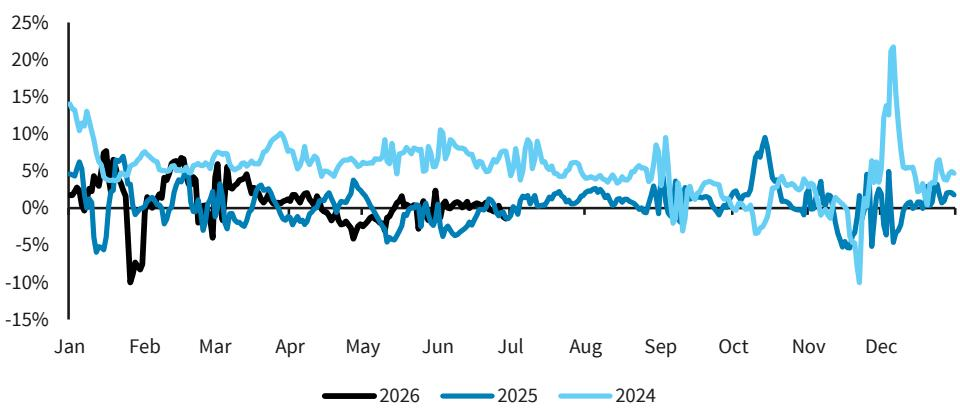
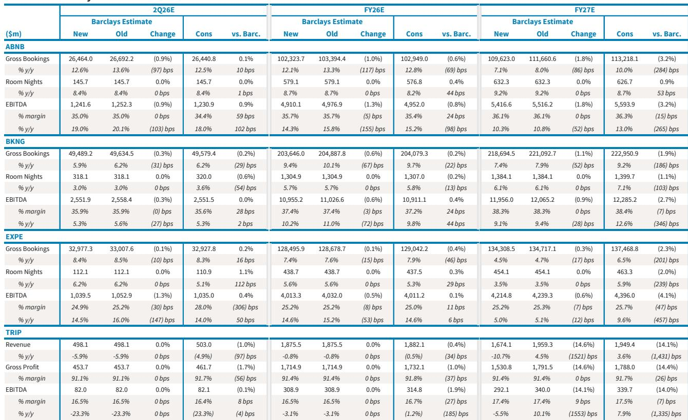
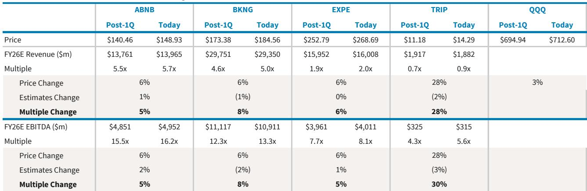

# 在线旅游复苏的真实图景：地理布局决定受益程度

在线旅游行业即将进入第二季度财报季，当前呈现出不同寻常的有利态势：市场预期偏低，地区紧张局势有所缓和，旅游需求已显现加速迹象。这种组合创造了不常见的观察窗口。在地缘风险和燃料价格波动主导叙事的阶段过后，基本面图景正朝着有利于主要平台的方向转变。关键在于，这种复苏并非均匀分布。较强劲的推动力来自美国国内旅游，而与此趋势关联度最高的公司处于最有利位置。与此同时，估值已压缩至十几倍的市盈率水平，形成了此前乐观情绪高涨时所不具备的安全边际。问题不在于行业是否会交出更好的数据，而在于哪些公司具备结构性布局，能将宏观顺风转化为持续的盈利动力。

某全球研究机构的报告提出了清晰论点：在线旅游机构在夏季来临前处于有利背景。市场一致预期偏低，因为管理层在航空燃油价格高企、地缘不确定性达到顶峰时提供了指引。这些不利因素正在消退。机票价格从高位回落，航空公司运力正在改善，美国国内旅游表现尤为强劲。数据点保持一致。运输安全管理局的旅客吞吐量数据稳健。酒店行业每间可用客房收入持续走强，值得注意的是，此前一年大部分时间承压的中档和经济型酒店也录得正向RevPAR。高端市场继续加速。这不是狭隘的复苏，而是广泛的，且发生在预期偏低之时。这正是业绩超预期的配方。

然而，机会并非均匀分布。报告指出，Booking Holdings尽管是该板块的首选标的，但相对于同行，其受地缘影响的直接和间接敞口最大。其庞大的欧洲和国际业务布局意味着它从强劲的美国国内趋势中受益较少。与此同时，Airbnb和Expedia对美国市场的相对敞口较高，这使得它们在短期内处于有利位置。报告预计Booking第二季度间夜量增长仅为3%，处于指引区间中值。Airbnb的估计为同比增长8%，Expedia为6%。差异并非微不足道。它反映了这些业务收入来源的结构性分化，只要美国消费者仍是旅游需求的主要驱动力，这种分化就可能持续。结论明确：地理布局是决定本轮周期中哪家公司表现的最重要变量。

## 美国国内旅游复苏正在扩大，有利于Airbnb和Expedia

报告中最重要的数据点并非关于任何单一公司，而是关于各酒店细分市场的RevPAR模式。中档和经济型RevPAR在经历此前一年大部分时间的压力后转为正值，这一事实表明复苏正在超越高端旅客。这很重要，因为它表明需求不仅来自有储蓄缓冲的富裕家庭，还来自更广泛的消费群体。当注重预算的旅客开始再次消费时，数量效应可能显著。对于在线旅游平台而言，数量是主要的盈利驱动因素。更高的间夜量增长直接转化为更高的佣金收入，且由于额外预订的边际成本较低，增量利润传导率很高。这就是为什么报告预计Airbnb和Expedia的EBITDA均有上行空间。报告估计Airbnb第二季度EBITDA为12.4亿美元，利润率同比扩大。Expedia的EBITDA估计为10亿美元，利润率为24.9%。如果需求趋势继续改善，这两个数字都可能偏保守。

报告还指出，Airbnb在管理层调整后，执行节奏有了微妙但重要的改善。产品迭代速度是Airbnb这类平台的关键增长驱动因素，报告表明这一速度正在加快。第二季度应受益于国内趋势改善、世界杯、地缘紧张局势缓解、精品酒店的早期进展以及公司的房间产品。这家公司过去曾因产品迭代缓慢而受到批评。如果情况正在改变，上行空间可能比数字显示的更大。对于Expedia，B2B业务近几个季度一直是增长亮点，报告预计第二季度将继续如此。积极的日均房价环境有助于改善Expedia的单位经济效应，为盈利能力提供了一些缓冲空间。两家公司都拥有超越宏观顺风的催化剂。

## Booking Holdings仍是优质标的，但当前估值下的风险回报比已趋紧

报告维持Booking Holdings为该板块首选标的，但分析表明Booking与Expedia之间的估值差距已显著缩小。Booking的交易价格约为2027财年预估GAAP每股收益的16倍，而Expedia为14倍。按历史标准衡量，这是一个狭窄的差距。对于拥有Booking规模、竞争护城河和资本配置纪律的公司而言，溢价是合理的。但问题在于溢价多少。报告预计Booking第三季度间夜量增长5%至7%，预订量和收入增长6%至8%，EBITDA增长8%至12%。这些数字稳健，但并未加速。报告预计Booking将重申全年指引，该指引已包含下半年需求复苏。复苏正在发生，但发生在美国，而Booking在那里的敞口低于同行。风险回报比仍具吸引力，但已不如估值差距更宽时那样突出。

报告还指出，此前作为板块主要压力的AI去中介化担忧，在地缘问题成为焦点后，已在读者讨论中基本消退。但报告提醒，在线旅游机构在这方面并非完全安全。代理型AI体验在消费互联网中持续演进，搜索引擎或AI助手绕过旅游平台直接预订的威胁是真实存在的。这是一个结构性风险，并未反映在当前估值中。这是一个值得更多关注的二阶影响。

## 报告未完全回答的一个问题：AI去中介化将如何重塑竞争格局？

报告承认AI去中介化担忧已从讨论中淡出，但未提供评估长期影响的详细框架。这是该板块最重要的未解决问题。当前在线旅游平台的看多逻辑基于一个假设：它们仍是旅客与供应商之间的关键中介。但如果AI代理能够直接搜索、比较和预订旅行，平台的经济价值可能被侵蚀。报告指出，大多数依赖谷歌的发布商到2026年来自搜索引擎优化的入站流量已降至约25%，并预计Tripadvisor的核心业务也处于类似水平。这与历史水平相比是急剧下降。如果同样的动态适用于主要在线旅游平台，增长轨迹可能大不相同。报告未对此情景建模，也未提供框架供读者评估颠覆的概率或程度。这是一个需要填补的空白。

报告也未涉及平台将如何应对的问题。它们是否会增加对直接流量和品牌营销的投入？是否会开发自己的AI能力？是否会通过整合获得规模和数据优势？这些问题的答案将决定当前估值倍数是否可持续。目前，市场关注的是短期需求复苏，这对于战术性观察是正确的焦点。但对于战略性研究者而言，AI问题是定义未来五年的关键。

## 在线旅游板块资金配置的决策框架

对于希望在该板块进行布局的观察者，框架应基于三个变量：地理布局、产品迭代速度和估值。第一个变量对短期最为重要。鉴于当前需求趋势，对美国国内旅游敞口较高的公司处于更有利位置。这有利于Airbnb和Expedia而非Booking Holdings。第二个变量涉及执行风险。Airbnb显示出产品迭代速度改善的迹象，这可能带来超越宏观顺风的上行空间。Expedia拥有提供多元化的强大B2B业务。Booking拥有最一致的执行记录，但因其国际布局面临更艰难的对比。第三个变量是估值。在十几倍的市盈率水平，该板块并不昂贵，但鉴于Booking与Expedia之间狭窄的估值差距，Booking的安全边际较薄。

报告还提供了思考Tripadvisor的有用框架，该公司在出售TheFork后仍处于事件驱动模式。出售的税后收益可能被重新用于更高的回购活动，公司已表示所有选项都在考虑中，包括可能出售其他资产。体验平台Viator是皇冠上的明珠。鉴于旅游领域对体验的关注度日益提高，涉及Viator的交易不会令人意外。但Tripadvisor核心业务继续面临与其高搜索引擎优化敞口以及谷歌转向AI概览而减少流量相关的显著挑战。这是一个资产价值与运营价值的故事，两者正在分化。对于长期视角的观察者，该股票的事件驱动性质创造了选择权，但运营基本面仍面临挑战。

## 加入社区阅读完整报告并查看原始图表

以上分析基于一份详细的研究报告，包含公司特定估计、估值比较和旅游趋势专有数据。完整报告包含说明季度预订增长轨迹、间夜量增长比较以及自第一季度财报发布以来股价表现的图表。这些可视化提供了难以仅通过文字捕捉的背景信息。对于希望了解第二季度财报背景细节及各公司具体估计的读者，完整报告是值得读内容。加入社区阅读完整报告并查看原始图表。

*仅供参考。部分内容可能基于源材料通过AI辅助生成、翻译、总结或编辑，可能存在遗漏或错误。请独立核实。这不构成任何专业建议。*

仅供参考。部分内容可能基于源材料通过AI辅助生成、翻译、总结或编辑，可能存在遗漏或错误。请独立核实。这不构成任何专业建议。

