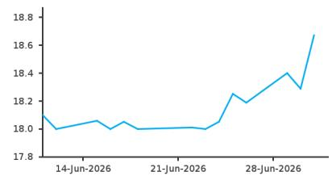
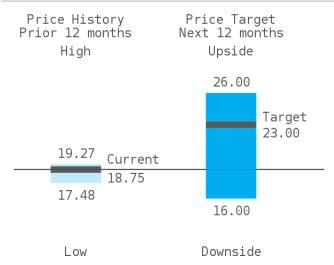

<table><tr><td>Price Performance</td><td>Exchange-Nasdaq</td></tr><tr><td>52 Week range</td><td>USD 19.27-17.48</td></tr></table>

Forbright, Inc.

# Adding a structurally differentiated mid-cap bank

We initiate coverage and add a bank with a unique growth strategy to our mid-cap universe.

## Forbright Inc. (FRBT), \$23 reference point

## Company Overview, Financials, and Valuation

We initiate coverage of Forbright with a positive view and \$23 reference point, as we view the company as a structurally differentiated mid-cap bank with a longer-duration growth profile and multiple levers for earnings expansion. We establish EPS estimates of \$1.31/\$2.36/\$3.01 for 2026/2027/2028, respectively. At the core of the story is a specialized, national middle-market lending platform that continues to scale across multiple verticals, many of which remain in relatively early stages of development. This has driven sustained class-leading loan growth (\~30% in FY25) and a \~100bps+ yield premium vs. peers, supported by sector expertise and a hybrid positioning between traditional banks and private credit. In our view, this combination provides a compelling foundation for continued balance sheet growth and attractive risk-adjusted returns over the medium term.

Equally important, Forbright's digital deposit platform represents a scalable funding advantage, enabling the bank to grow deposits nationally without the fixed cost burden of a branch network. While current funding costs are elevated due to pricing-led acquisition, we see a pathway to an improved funding mix and operating leverage as the platform matures, supported by continued deposit growth, reduced reliance on wholesale funding, and the planned rollout of digital checking accounts. This dynamic, combined with a predominantly floating rate loan book, positions the company for NIM expansion and accelerating NII growth, particularly in a stable rate environment.

From a risk perspective, we acknowledge that headline credit metrics (elevated NPLs) screen weaker than peers; however, we believe this is mostly driven by legacy Congressional Bank CRE, consumer, and small business exposure and a limited number of idiosyncratic credits, rather than broad-based deterioration. With a shorter-duration, collateral focused loan book, centralized underwriting framework, and excess spread to absorb losses, we view credit costs as manageable within the context of the growth strategy.

We see Forbright as one of the more compelling growth-oriented stories in the mid-cap bank universe, with a scalable business model, multiple earnings levers, and improving profitability profile.

## Initiating Coverage

FRBT

U.S. Mid-Cap Banks
POSITIVE
Unchanged

Reference Point USD 23.00

Price (02-Jul-26) USD 18.75

Potential Upside/Downside +22.7%
Source: Bloomberg, BARC

<table><tr><td>Market Cap (USD mn)</td><td>931</td></tr><tr><td>Shares Outstanding (mn)</td><td>49.69</td></tr><tr><td>Free Float (%)</td><td>27.30</td></tr><tr><td>52 Wk Avg Daily Volume (mn)</td><td>N/A</td></tr><tr><td>Dividend Yield (%)</td><td>N/A</td></tr><tr><td>Return on Equity TTM (%)</td><td>N/A</td></tr><tr><td>Current BVPS (USD)</td><td>N/A</td></tr><tr><td colspan="2">Source: Bloomberg</td></tr></table>

  
Source: IDC  
Link to BARC Live for interactive charting

## U.S. Mid-Cap Banks

## Jared Shaw

+1 617 342 4101
jared.shaw@BARC.com
BCI, US

Jonathan Rau
+1 617 342 4283
jonathan.rau@BARC.com
BCI, US

Our \$23 reference point represents 9.7x our '27 Operating EPS estimate. This is a discount to the group median of 10.8x based on below-average profitability and low loan loss reserves offset by higher growth trends.

FRBT: Quarterly and Annual EPS (USD)

<table><tr><td></td><td>2025</td><td colspan="3">2026</td><td colspan="3">2027</td><td colspan="2">Change y/y</td></tr><tr><td>FY Dec</td><td>Actual</td><td>Old</td><td>New</td><td>Cons</td><td>Old</td><td>New</td><td>Cons</td><td>2026</td><td>2027</td></tr><tr><td>Q1</td><td>N/A</td><td>N/A</td><td>0.31A</td><td>N/A</td><td>N/A</td><td>0.46E</td><td>N/A</td><td>N/A</td><td>48%</td></tr><tr><td>Q2</td><td>N/A</td><td>N/A</td><td>0.14E</td><td>N/A</td><td>N/A</td><td>0.65E</td><td>N/A</td><td>N/A</td><td>364%</td></tr><tr><td>Q3</td><td>N/A</td><td>N/A</td><td>0.40E</td><td>N/A</td><td>N/A</td><td>0.58E</td><td>N/A</td><td>N/A</td><td>45%</td></tr><tr><td>Q4</td><td>0.71A</td><td>N/A</td><td>0.43E</td><td>N/A</td><td>N/A</td><td>0.67E</td><td>N/A</td><td>-39%</td><td>56%</td></tr><tr><td>Year</td><td>1.90A</td><td>N/A</td><td>1.31E</td><td>N/A</td><td>N/A</td><td>2.36E</td><td>N/A</td><td>-31%</td><td>80%</td></tr><tr><td>P/E</td><td>9.9</td><td></td><td>14.3</td><td></td><td></td><td>7.9</td><td></td><td></td><td></td></tr></table>

Consensus numbers are from Bloomberg received on 02-Jul-2026; 12:50 GMT Source: BARC

## U.S. Mid-Cap Banks

<table><tr><td>Income statement ($mn)</td><td>2025A</td><td>2026E</td><td>2027E</td><td>2028E</td><td>CAGR</td></tr><tr><td>Net interest income</td><td>263</td><td>266</td><td>319</td><td>375</td><td>12.6%</td></tr><tr><td>Operating expenses</td><td>209</td><td>252</td><td>242</td><td>252</td><td>6.5%</td></tr><tr><td>Pre-provision earnings</td><td>113</td><td>111</td><td>174</td><td>214</td><td>23.6%</td></tr><tr><td>Loan loss provisions</td><td>24</td><td>23</td><td>28</td><td>31</td><td>9.2%</td></tr><tr><td>Pre-tax income</td><td>101</td><td>72</td><td>137</td><td>179</td><td>20.9%</td></tr><tr><td>Net income</td><td>88</td><td>51</td><td>114</td><td>150</td><td>19.6%</td></tr></table>

<table><tr><td>Balance sheet ($mn)</td><td>2025A</td><td>2026E</td><td>2027E</td><td>2028E</td><td>Average</td></tr><tr><td>Total assets</td><td>7,889</td><td>9,518</td><td>10,919</td><td>12,596</td><td>10,231</td></tr><tr><td>Loans</td><td>5,607</td><td>6,885</td><td>8,012</td><td>9,311</td><td>7,454</td></tr><tr><td>Deposits</td><td>6,778</td><td>8,168</td><td>9,464</td><td>10,910</td><td>8,830</td></tr><tr><td>Shareholders&#x27; equity</td><td>822</td><td>1,005</td><td>1,119</td><td>1,269</td><td>1,054</td></tr><tr><td>Shareholders&#x27; equity growth (%)</td><td>13.9</td><td>22.2</td><td>11.3</td><td>13.5</td><td>15.2</td></tr><tr><td>Loan/deposit ratio (%)</td><td>82.7</td><td>84.3</td><td>84.7</td><td>85.3</td><td>84.2</td></tr></table>

<table><tr><td>Valuation and leverage metrics</td><td>2025A</td><td>2026E</td><td>2027E</td><td>2028E</td><td>Average</td></tr><tr><td>P/E (adj) (x)</td><td>9.9</td><td>14.3</td><td>7.9</td><td>6.2</td><td>9.6</td></tr><tr><td>P/BV (tangible) (x)</td><td>1.0</td><td>0.9</td><td>0.8</td><td>0.7</td><td>0.9</td></tr><tr><td>Dividend yield (%)</td><td>0.0</td><td>0.0</td><td>0.0</td><td>0.0</td><td>0.0</td></tr><tr><td>P/PPE (x)</td><td>6.9</td><td>8.0</td><td>5.5</td><td>4.5</td><td>6.2</td></tr><tr><td>Tier 1 (%)</td><td>9.8</td><td>9.9</td><td>9.9</td><td>10.0</td><td>9.9</td></tr><tr><td>Tier 1 Common (%)</td><td>12.7</td><td>12.6</td><td>12.6</td><td>12.7</td><td>12.7</td></tr><tr><td>Tang assets/tang equity (x)</td><td>9.9</td><td>9.7</td><td>10.0</td><td>10.2</td><td>10.0</td></tr></table>

<table><tr><td>Margin and return data</td><td>2025A</td><td>2026E</td><td>2027E</td><td>2028E</td><td>Average</td></tr><tr><td>Net interest margin (%)</td><td>3.8</td><td>3.2</td><td>3.2</td><td>3.2</td><td>3.3</td></tr><tr><td>ROAA (%)</td><td>1.1</td><td>0.7</td><td>1.2</td><td>1.3</td><td>1.1</td></tr><tr><td>ROE (tangible common) (%)</td><td>10.7</td><td>6.9</td><td>11.7</td><td>13.2</td><td>10.6</td></tr><tr><td>Fee income/revenue (%)</td><td>18.2</td><td>23.4</td><td>21.6</td><td>18.8</td><td>20.5</td></tr><tr><td>Efficiency ratio (%)</td><td>64.8</td><td>68.0</td><td>57.3</td><td>53.8</td><td>61.0</td></tr></table>

<table><tr><td>Credit quality ratios</td><td>2025A</td><td>2026E</td><td>2027E</td><td>2028E</td><td>Average</td></tr><tr><td>Loan loss provs/loans (%)</td><td>0.4</td><td>0.3</td><td>0.3</td><td>0.3</td><td>0.4</td></tr><tr><td>NCO ratio (%)</td><td>0.3</td><td>0.3</td><td>0.3</td><td>0.3</td><td>0.3</td></tr><tr><td>Coverage ratio (%)</td><td>71.6</td><td>64.6</td><td>73.2</td><td>76.2</td><td>71.4</td></tr><tr><td>NPL ratio (%)</td><td>1.3</td><td>1.3</td><td>1.1</td><td>1.1</td><td>1.2</td></tr><tr><td>Reserves/loans (%)</td><td>0.9</td><td>0.8</td><td>0.8</td><td>0.8</td><td>0.9</td></tr></table>

<table><tr><td>Per share data ($)</td><td>2025A</td><td>2026E</td><td>2027E</td><td>2028E</td><td>Average</td></tr><tr><td>EPS (adj)</td><td>1.90</td><td>1.31</td><td>2.36</td><td>3.01</td><td>2.15</td></tr><tr><td>EPS (adj) growth (%)</td><td>80.7</td><td>-31.1</td><td>80.2</td><td>27.5</td><td>39.3</td></tr><tr><td>DPS</td><td>0.00</td><td>0.00</td><td>0.00</td><td>0.00</td><td>0.00</td></tr><tr><td>DPS growth (%)</td><td>N/A</td><td>N/A</td><td>N/A</td><td>N/A</td><td>N/A</td></tr><tr><td>BVPS (tangible)</td><td>19.44</td><td>19.97</td><td>22.30</td><td>25.39</td><td>21.78</td></tr><tr><td>Payout ratio (%)</td><td>0.0</td><td>0.0</td><td>0.0</td><td>0.0</td><td>0.0</td></tr><tr><td>Diluted shares (mn)</td><td>41</td><td>47</td><td>51</td><td>51</td><td>48</td></tr></table>

Note: FY End Dec  
Source: Company data, Bloomberg, BARC

## Positive View

Price (02-Jul-2026) USD 18.75
Reference Point USD 23.00

## Why Positive View?

Our positive view on FRBT is based on a differentiated growth story on both sides of the balance sheet. We believe that its digital-forward deposit strategy will increase profitability over time as the bank does not have costs associated with branches and its lending strategy has yields above peer medians.

## Upside case USD 26.00

An upside scenario for FRBT could be seen if the bank is able to lower deposit costs while sustaining growth. Additionally, as the bank is relatively asset sensitive, sustained higher rates would contribute to a better margin.

## Downside case USD 16.00

A downside scenario for FRBT could be seen if increased competition impacts profitability. Additionally, as the bank differentiates, future product differentiation could result in additional expenses.

## Upside/Downside scenarios

# Comp Sheet and Comparisons to Coverage Universe

FIGURE 1. Mid-Cap Banks Comp Sheet

<table><tr><td rowspan="2">Company Name</td><td rowspan="2">Ticker</td><td rowspan="2">Mkt.Cap($B)</td><td rowspan="2">Assets($B)</td><td colspan="6">Price as of:</td><td colspan="4">P/TBV</td><td colspan="4">P/E</td><td colspan="2">ROATCE</td><td colspan="2">ROAA</td><td colspan="2">EPS Growth</td><td>CET1</td><td colspan="2">TCE/TA</td><td colspan="2">Credit</td></tr><tr><td>7/2/26</td><td>Rating</td><td>PriceTarget</td><td>DividendYield</td><td>PotentialUpside</td><td>P/TBV</td><td>P/NTMTBV</td><td>PT/NTMTBV</td><td>P/TBV(exAOCI)</td><td>FY2026E</td><td>FY2027E</td><td>PT/2026EPS E</td><td>PT/2027EPS E</td><td>1Q26</td><td>FY2026E</td><td>1Q26</td><td>FY2026E</td><td>FY2026E</td><td>FY2027E</td><td>1Q26</td><td>1Q26TCE/TA</td><td>1Q26TCE/TA(exAOCI)</td><td>1Q26ALLL/loans</td><td>1Q26NPLs/loans</td><td></td></tr><tr><td>Associated Banc-Corp</td><td>ASB</td><td>$5.2</td><td>$45.6</td><td>$31.22</td><td>OW</td><td>$34</td><td>3.2%</td><td>8.9%</td><td>1.40x</td><td>1.31x</td><td>1.42x</td><td>1.40x</td><td>10.1x</td><td>9.2x</td><td>11.0x</td><td>10.0x</td><td>12.0%</td><td>13.7%</td><td>0.99%</td><td>1.12%</td><td>10.3%</td><td>10.2%</td><td>10.47%</td><td>8.27%</td><td>8.29%</td><td>1.21%</td><td>0.35%</td><td></td></tr><tr><td>Banc of California, Inc.</td><td>BANC</td><td>$3.2</td><td>$34.7</td><td>$20.56</td><td>OW</td><td>$23</td><td>2.0%</td><td>11.9%</td><td>1.16x</td><td>1.03x</td><td>1.15x</td><td>1.05x</td><td>13.0x</td><td>9.9x</td><td>14.5x</td><td>11.0x</td><td>11.1%</td><td>9.0%</td><td>0.72%</td><td>0.74%</td><td>36.9%</td><td>31.6%</td><td>10.18%</td><td>7.97%</td><td>8.74%</td><td>0.96%</td><td>0.74%</td><td></td></tr><tr><td>BankUnited, Inc.</td><td>BKU</td><td>$3.5</td><td>$35.4</td><td>$48.62</td><td>EW</td><td>$52</td><td>2.7%</td><td>7.0%</td><td>1.21x</td><td>1.12x</td><td>1.20x</td><td>1.14x</td><td>11.5x</td><td>10.5x</td><td>12.4x</td><td>11.3x</td><td>7.1%</td><td>10.1%</td><td>0.61%</td><td>0.84%</td><td>18.4%</td><td>9.7%</td><td>12.20%</td><td>8.33%</td><td>8.90%</td><td>0.87%</td><td>1.14%</td><td></td></tr><tr><td>Bank of Hawaii Corporation</td><td>BOH</td><td>$3.3</td><td>$23.9</td><td>$82.98</td><td>EW</td><td>$88</td><td>3.5%</td><td>6.0%</td><td>2.22x</td><td>1.91x</td><td>2.02x</td><td>1.91x</td><td>13.5x</td><td>11.7x</td><td>14.4x</td><td>12.4x</td><td>15.2%</td><td>15.7%</td><td>0.95%</td><td>1.01%</td><td>29.1%</td><td>15.6%</td><td>12.06%</td><td>6.19%</td><td>7.23%</td><td>1.04%</td><td>0.08%</td><td></td></tr><tr><td>BOK Financial Corporation</td><td>BOKF</td><td>$8.6</td><td>$53.8</td><td>$141.24</td><td>EW</td><td>$145</td><td>1.6%</td><td>2.7%</td><td>1.75x</td><td>1.57x</td><td>1.62x</td><td>1.68x</td><td>14.3x</td><td>13.7x</td><td>14.7x</td><td>14.1x</td><td>12.4%</td><td>11.7%</td><td>1.16%</td><td>1.09%</td><td>15.0%</td><td>4.5%</td><td>12.61%</td><td>9.30%</td><td>9.72%</td><td>1.06%</td><td>0.23%</td><td></td></tr><tr><td>Popular, Inc.</td><td>BPOP</td><td>$10.9</td><td>$76.1</td><td>$168.50</td><td>OW</td><td>$185</td><td>1.8%</td><td>9.8%</td><td>1.98x</td><td>1.68x</td><td>1.84x</td><td>1.64x</td><td>10.7x</td><td>9.4x</td><td>11.7x</td><td>10.3x</td><td>17.9%</td><td>17.7%</td><td>1.28%</td><td>1.28%</td><td>30.3%</td><td>13.1%</td><td>15.92%</td><td>7.29%</td><td>8.84%</td><td>2.10%</td><td>1.17%</td><td></td></tr><tr><td>Cullen/Frost Bankers, Inc.</td><td>CFR</td><td>$9.8</td><td>$52.7</td><td>$155.75</td><td>EW</td><td>$160</td><td>2.6%</td><td>2.7%</td><td>2.65x</td><td>2.35x</td><td>2.41x</td><td>2.12x</td><td>15.0x</td><td>13.8x</td><td>15.4x</td><td>14.2x</td><td>17.5%</td><td>16.9%</td><td>1.28%</td><td>1.22%</td><td>4.7%</td><td>8.7%</td><td>14.07%</td><td>7.08%</td><td>8.86%</td><td>1.28%</td><td>0.32%</td><td></td></tr><tr><td>Columbia Banking System, Inc.</td><td>COLB</td><td>$9.4</td><td>$66.0</td><td>$32.51</td><td>EW</td><td>$29</td><td>4.6%</td><td>-10.8%</td><td>1.71x</td><td>1.57x</td><td>1.40x</td><td>1.62x</td><td>10.8x</td><td>9.6x</td><td>9.6x</td><td>8.6x</td><td>15.1%</td><td>15.5%</td><td>1.30%</td><td>1.30%</td><td>-3.2%</td><td>12.0%</td><td>11.50%</td><td>8.63%</td><td>9.08%</td><td>0.96%</td><td>0.55%</td><td></td></tr><tr><td>Eastern Bankshares, Inc.</td><td>EBC</td><td>$5.2</td><td>$30.6</td><td>$22.63</td><td>EW</td><td>$22</td><td>2.6%</td><td>-2.8%</td><td>1.75x</td><td>1.58x</td><td>1.54x</td><td>1.62x</td><td>12.1x</td><td>10.4x</td><td>11.8x</td><td>10.1x</td><td>11.6%</td><td>13.3%</td><td>1.16%</td><td>1.31%</td><td>16.3%</td><td>16.6%</td><td>13.20%</td><td>10.21%</td><td>11.06%</td><td>1.40%</td><td>0.59%</td><td></td></tr><tr><td>East West Bancorp, Inc.</td><td>EWBC</td><td>$17.9</td><td>$82.9</td><td>$130.70</td><td>OW</td><td>$150</td><td>2.5%</td><td>14.8%</td><td>2.10x</td><td>1.86x</td><td>2.14x</td><td>2.01x</td><td>12.2x</td><td>11.5x</td><td>14.0x</td><td>13.2x</td><td>16.7%</td><td>16.8%</td><td>1.77%</td><td>1.77%</td><td>13.2%</td><td>5.6%</td><td>15.13%</td><td>10.35%</td><td>10.82%</td><td>1.44%</td><td>0.31%</td><td></td></tr><tr><td>First Hawaiian, Inc.</td><td>FHB</td><td>$3.7</td><td>$24.3</td><td>$30.21</td><td>EW</td><td>$30</td><td>3.6%</td><td>-0.7%</td><td>2.07x</td><td>1.77x</td><td>1.76x</td><td>1.71x</td><td>12.9x</td><td>12.0x</td><td>12.8x</td><td>11.9x</td><td>15.1%</td><td>15.3%</td><td>1.13%</td><td>1.18%</td><td>9.0%</td><td>7.3%</td><td>13.12%</td><td>7.62%</td><td>9.22%</td><td>1.17%</td><td>0.27%</td><td></td></tr><tr><td>First Horizon Corporation</td><td>FHN</td><td>$12.4</td><td>$84.1</td><td>$26.05</td><td>OW</td><td>$29</td><td>2.7%</td><td>11.3%</td><td>1.74x</td><td>1.55x</td><td>1.73x</td><td>1.56x</td><td>12.2x</td><td>10.9x</td><td>13.6x</td><td>12.2x</td><td>15.6%</td><td>14.4%</td><td>1.24%</td><td>1.20%</td><td>11.6%</td><td>11.6%</td><td>10.50%</td><td>8.62%</td><td>9.63%</td><td>1.12%</td><td>0.93%</td><td></td></tr><tr><td>First Interstate BancSystem, Inc.</td><td>FIBK</td><td>$3.8</td><td>$26.4</td><td>$39.26</td><td>EW</td><td>$38</td><td>4.9%</td><td>-3.2%</td><td>1.79x</td><td>1.59x</td><td>1.54x</td><td>1.64x</td><td>14.8x</td><td>12.6x</td><td>14.3x</td><td>12.1x</td><td>10.7%</td><td>11.5%</td><td>0.91%</td><td>0.97%</td><td>5.4%</td><td>17.7%</td><td>14.30%</td><td>8.61%</td><td>9.38%</td><td>1.32%</td><td>1.05%</td><td></td></tr><tr><td>Flagstar Financial, Inc.</td><td>FLG</td><td>$6.3</td><td>$87.1</td><td>$15.00</td><td>OW</td><td>$17</td><td>0.3%</td><td>13.3%</td><td>0.86x</td><td>0.89x</td><td>1.01x</td><td>0.80x</td><td>32.0x</td><td>9.7x</td><td></td><td>11.0x</td><td>1.1%</td><td>2.9%</td><td>0.09%</td><td>0.24%</td><td></td><td>228.9%</td><td>13.24%</td><td>8.37%</td><td>8.98%</td><td>1.57%</td><td>4.41%</td><td></td></tr><tr><td>Forbright, Inc.</td><td>FRBT</td><td>$0.9</td><td>$8.2</td><td>$18.67</td><td>OW</td><td>$23</td><td>0.0%</td><td>23.2%</td><td>0.95x</td><td>0.92x</td><td>1.13x</td><td>0.95x</td><td>14.3x</td><td>7.9x</td><td>17.6x</td><td>9.7x</td><td>6.6%</td><td>6.9%</td><td>0.66%</td><td>0.71%</td><td>-31.1%</td><td>80.2%</td><td>11.47%</td><td>9.75%</td><td>9.78%</td><td>0.91%</td><td>1.46%</td><td></td></tr><tr><td>Hancock Whitney Corporation</td><td>HWC</td><td>$6.1</td><td>$35.5</td><td>$75.66</td><td>OW</td><td
