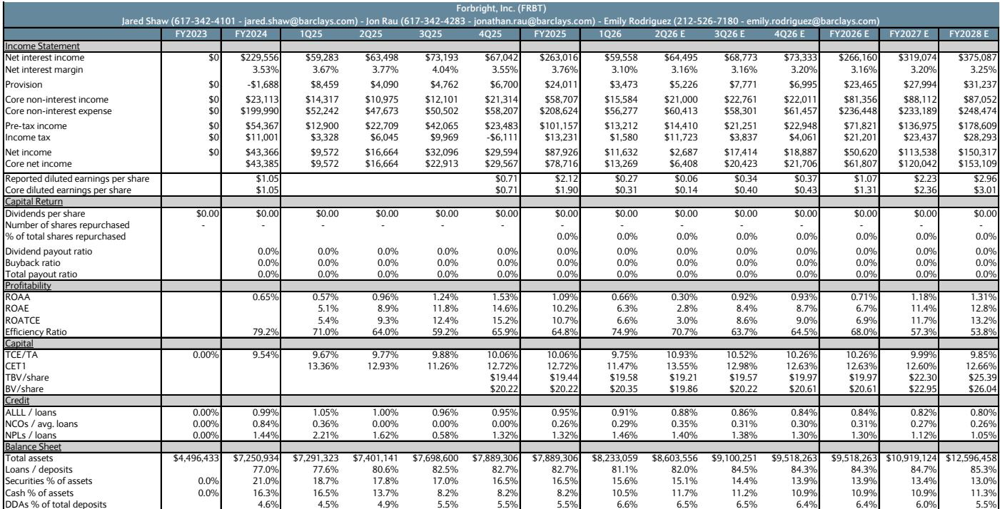
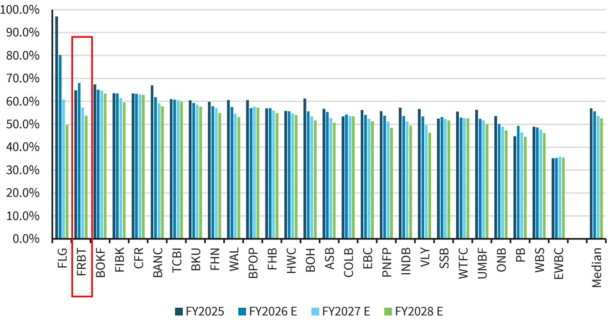
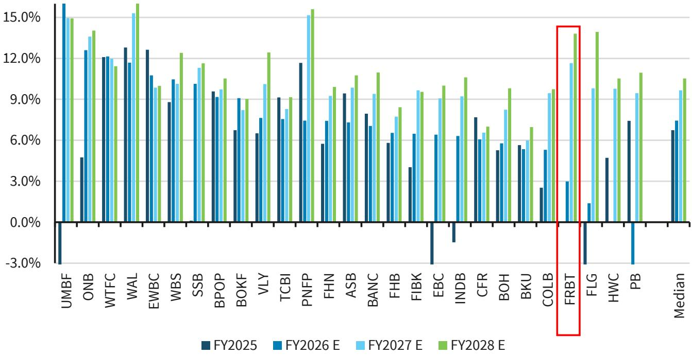

# Forbright Inc.: 结构性银行模式的关键在于资金粘性，而非贷款增长

中型银行领域长期以来被一个单一且反复出现的叙事所主导：区域性银行通过向本地市场放贷实现增长，通过分行网络获取低成本粘性存款，并在熟悉的区域内通过管理信用风险产生稳定回报。如今，这一模式正面临来自资金成本上升、数字技术颠覆以及私人信贷替代方案日益重要的结构性压力。在此背景下，一家完全摒弃分行模式、构建由数字存款引擎驱动的全国性贷款平台的银行，不仅仅是一个战术性机会，更是一种对银行中介不同架构的深思熟虑的战略押注。

Forbright Inc. 正是这样一个押注。近期一家主要投资机构发布的研究报告指出，Forbright 结合了专业化的全国性中端市场贷款平台（该平台相比同业能产生超过100个基点的回报表现溢价）与一个无需承担实体分行固定成本即可实现规模扩张的数字存款平台。报告认为，其结果是一家拥有行业领先的贷款增长、多重盈利扩张杠杆以及市场尚未充分定价的改善中盈利轨迹的银行。

但对于严肃的研究者而言，关键问题不在于这个叙事在纸面上是否引人入胜，而在于该模式所声称的结构性优势是否足够持久，能够经受住一家高增长、资产敏感型银行在资金成本上升和信用状况不确定的环境中所必然出现的压力点。答案远未确定，而这正是使其成为一个真正有趣的分析问题的原因。

## 贷款平台逻辑坚实，但真正考验在于信用周期

Forbright 投资案例的核心在于一个专注于全国范围内中端市场的专业化贷款平台。这不是一家挑选本地关系的社区银行，而是一家介于传统银行和私人信贷基金之间的混合型机构，凭借行业专长和以抵押品为核心的框架进行贷款承销，从而获得显著高于同业中位数的回报表现。报告指出，在2025财年，贷款增长率约为30%，该行持续保持着相对于可比机构约100个基点的回报表现溢价。

这是一项令人印象深刻的运营成就，但必须结合其对风险选择的影响来解读。一家持续超越同业增长并获得更高回报表现的银行，要么是真正更善于识别和定价风险，要么是承担了其他机构拒绝的风险。报告承认，总体信用指标看起来弱于同业，2025年不良贷款率升至1.3%。对此的解释是，这些不良贷款主要由遗留的Congressional Bank在商业地产、消费者和小企业贷款方面的敞口，以及少数特定信贷问题驱动，而非广泛的资产质量恶化。

这是一种合理的解释，但它留下了一个开放的分析问题：当前的不良贷款负担在多大程度上是真正的遗留问题，又有多少是一种尚未经历完整信用周期考验的高增长、高回报表现策略的自然结果？该行的贷款损失准备金率在2025年仅占贷款的0.9%，并预计在随后几年降至0.8%。对于一个不良贷款率为1.3%、且其增长策略本质上涉及向可能不符合传统银行融资条件的借款人放贷的机构而言，这是一个薄弱的缓冲。超额利差可以吸收损失的观点在数学上是成立的，但这仅在利差溢价持续存在且损失不会以相关方式聚集的情况下才成立。一旦某个特定行业的低迷冲击了该行的某个贷款垂直领域，回报表现溢价与信用充足性之间的关系将直接面临考验。

## 数字存款优势真实存在，但降低资金成本的路径并非必然

在负债端，Forbright 的数字存款平台可以说是该叙事中结构性差异最大的部分。通过在没有分行网络的情况下全国范围内获取存款，该行避免了传统区域性银行所承受的高额固定成本。在分行客流量下降、维持实体基础设施的成本越来越难以合理化时代，这是一个真正的优势。

然而，报告也明确指出，由于定价驱动的获客方式，当前的资金成本较高。该行一直在通过利率竞争存款，这对于一个缺乏分行模式所带来的便利性和关系粘性的数字优先机构来说是自然的策略。该论点依赖于随着平台成熟而改善资金组合的路径，这需要持续的存款增长、减少对批发融资的依赖以及计划推出的数字支票账户。预期是，随着存款基础增长和客户关系深化，资金成本将会下降。

这是一个合理的假设，但尚未得到证实。数字银行领域竞争激烈，对于利率驱动型客户而言，存款流失率往往高于那些基于地理位置或关系选择银行的客户。计划中的支票账户推出可能会有所帮助，但它也引入了运营复杂性和潜在支出。报告预计，净息差将从2025年的3.8%压缩至2026年的3.2%并在此水平企稳，这意味着资金组合改善带来的好处在很大程度上被增长成本所抵消。真正的转折点出现在2027年和2028年，届时效率比率预计将从68%降至50%左右。这是一个显著的改善，并且高度依赖于资金成本轨迹的配合。

战略性问题在于，数字存款模式能否实现与分行模式相同的低成本粘性，还是说它始终需要利率溢价来吸引和保留余额。如果是后者，那么净息差可能永远无法达到财务预测所暗示的水平，盈利增长轨迹也将相应受到压缩。

## 盈利轨迹暗示2027年为关键年份，但从2026年起的路径并非线性

报告中的财务预测揭示了一个引人注目的模式。每股收益预计在2026年为1.31美元，低于2025年的1.90美元，然后在2027年跃升至2.36美元，2028年达到3.01美元。2026年的下降是由支出增加和净利息收入压缩驱动的，因为该行正在投资其增长平台并吸收快速资产扩张的资金成本。2027年的复苏是显著的，每股收益同比增长80%，由运营杠杆、息差稳定和持续的资产负债表增长驱动。

这种非线性轨迹既是投资论点，也是风险所在。如果该行执行完美，2026年的低谷为能够看穿短期疲软、关注2027年转折点的研究者创造了一个有吸引力的切入点。但容错空间很小。报告假设运营支出将从2026年的2.52亿美元降至2027年的2.42亿美元，即使资产负债表持续增长。这意味着显著的运营杠杆，而这又依赖于数字平台在不按比例增加成本的情况下实现规模扩张。它还假设净利息收入能在一年内从2.66亿美元增长至3.19亿美元，这需要资产增长和息差稳定。

更保守的解释是，2026年代表了一个高投入和回报压缩的时期，而2027年的回报是可以实现的，但并非有保证。报告自身的上行和下行情景突显了这种不确定性。上行情景假设该行能够在维持增长的同时降低存款成本，并且持续的高利率有助于息差扩张。下行情景假设竞争加剧影响盈利能力，并且产品差异化导致额外支出。两种情景都是合理的，且它们之间的范围很宽。

## 报告未完全解答的问题：回报表现溢价的可持续性与存款业务的性质

尽管分析严谨，但这份研究报告留下了两个关键问题。第一个是，相对于同业100个基点的回报表现溢价是贷款模式的结构性特征，还是当前信用环境的周期性产物。如果是结构性的，它反映了真正的承销技能和行业专业化。如果是周期性的，随着来自私人信贷和其他银行的竞争加剧，或者随着信用周期转变和风险溢价调整，它可能会压缩。

第二个未解决的问题对长期论点更为根本：在一个完整周期内，数字存款业务的真实成本是多少？报告模拟了一条改善资金组合的路径，但它没有提供压力情景，即存款竞争加剧，或者该行在市场波动期间被迫提高利率以保留余额。数字模式从未经历过区域性银行系统性压力时期的考验，在这种条件下利率驱动型存款的粘性是一个悬而未决的经验性问题。

这些并非分析中的缺陷。它们是任何研究报告的自然边界，并直接指出了研究者未来需要监测的信息。该行关于存款构成、客户获取成本以及按年份划分的贷款组合表现的季度披露，将比任何单一的财务预测更具启发性。

## 评估Forbright的决策框架

对于考虑该公司的研究者而言，分析任务不是判断这个论点是对还是错，而是识别论点成功或失败的条件，并据此进行定位。一个有用的框架包含三个维度：

首先，监测资金成本轨迹。该股最重要的领先指标不是贷款增长，而是存款成本的趋势。如果该行能够证明其存款成本在资产负债表增长的同时趋于稳定或下降，那么息差扩张的路径就变得可信。如果存款成本保持高位或进一步上升，2027年的转折点将被推迟或削弱。

其次，按贷款年份追踪信用质量。遗留的不良贷款问题将随时间消退，但2024年和2025年发放贷款的信用表现将是承销标准的真正考验。如果即使在贷款账簿快速增长的情况下，核销率仍保持在可控范围内，那么回报表现溢价就得到了验证。如果逾期开始集中在较新的年份，风险调整后的回报叙事将显著减弱。

第三，评估运营支出的可扩展性。效率比率在两年内从68%改善至54%是模型中最激进的假设。研究者应追踪支出增长是否相对于收入增长真正减速，或者数字平台是否需要持续投入以维持较高的成本基础。

这三个指标将在盈利数据确认之前很久就揭示出故事的发展方向。

## 加入社区阅读完整报告并查看原始图表

关于Forbright Inc.的研究报告包含详细的财务预测、同业比较和情景分析，这些都是理解该论点的重要背景。完整文件包括净息差、贷款增长、存款构成和信用成本的底层假设，以及将Forbright置于中型银行领域的对比表。理解这些假设与该行实际季度业绩之间的相互作用，是严谨评估该案例的相对少见途径。

加入社区阅读完整报告并查看原始图表。

*仅供参考。部分内容可能基于源材料通过AI辅助生成、翻译、总结或编辑，可能存在遗漏或错误。请独立核实。这不构成任何专业建议。*

仅供参考。部分内容可能基于源材料通过AI辅助生成、翻译、总结或编辑，可能存在遗漏或错误。请独立核实。这不构成任何专业建议。

