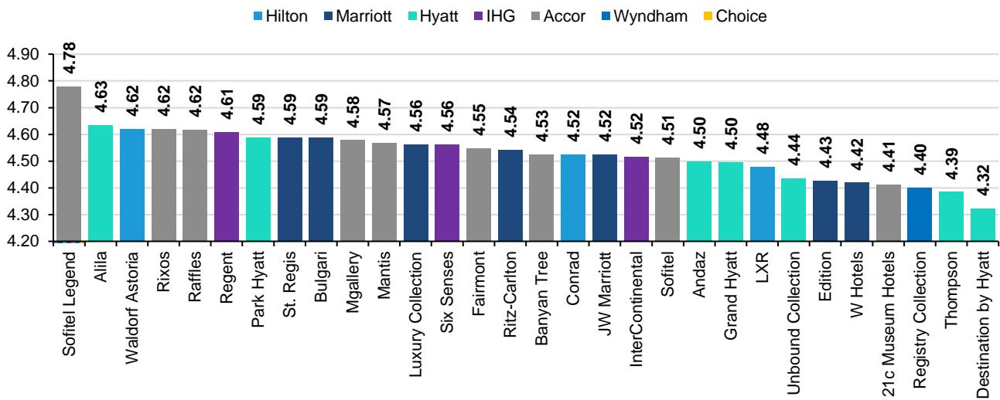
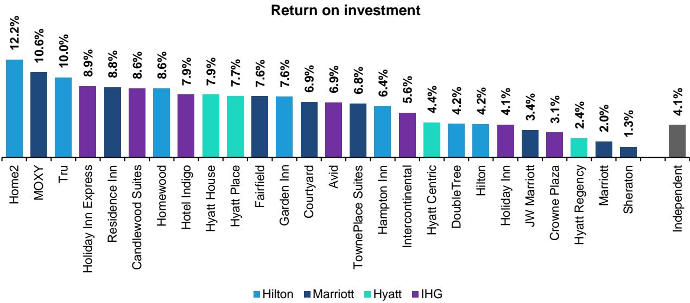
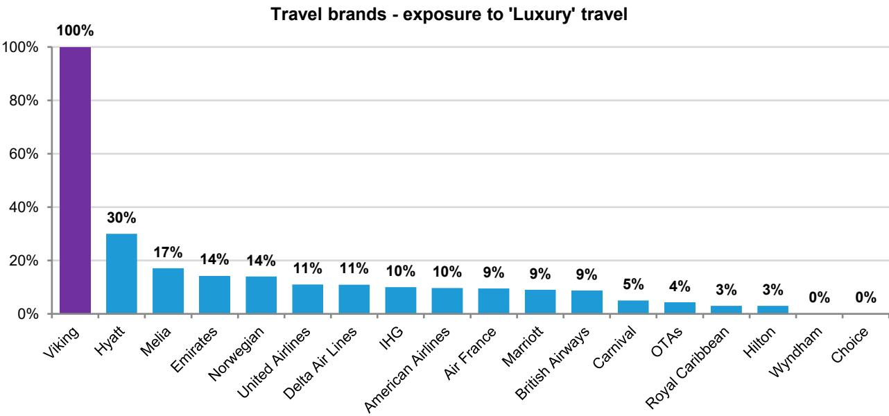

# The Luxury Hotel Supply Gap Is Not a Market Failure—It Is a Structural Signal That Will Reshape Travel M&A and RevPAR for Years

The travel industry is living through a contradiction that looks like a market inefficiency but is actually a structural constraint. Luxury hotel demand is surging, yet supply is not following. In the first five months of 2026, US luxury hotel revenues grew 9.1 percent while economy revenues declined 2.7 percent. Luxury RevPAR has outperformed every other chain scale every single month since March 2025. And yet, hotel development is concentrating in Upscale through Midscale segments, not in Luxury. This is not because developers are blind to demand. It is because the economics of building luxury hotels have broken down. Financing costs, construction timelines, labor constraints, and the sheer capital intensity of prime-location projects have created a supply ceiling that demand cannot breach. The result is a multi-year tailwind for luxury hotel pricing and a powerful catalyst for M&A as operators scramble to reposition their portfolios.

The parallel with cruise and aviation is instructive. In those sectors, where operators control their own capacity decisions, supply is responding exactly as equilibrium theory predicts. Luxury cruise capacity is growing at more than 10 percent in 2026, with the ultra-high-end yacht segment up 24 percent. Air France-KLM has grown premium capacity 10 percentage points faster than economy since 2019. But hotels operate on a different model. Development is driven by third-party owners and franchisees who prioritize return on capital, speed to market, and flexibility. A luxury hotel takes years and hundreds of millions of dollars to build. A midscale hotel can open in months for a fraction of the cost. Developers are not ignoring luxury demand; they are responding to a different set of incentives. The consequence is a structural supply gap that will sustain luxury pricing power and force hotel companies to pursue acquisitions as the fastest route to gain exposure.

This report from a leading global research institution makes the case that the K-shaped recovery in travel is not a temporary post-pandemic phenomenon. It is a durable shift in spending patterns driven by demographic and wealth concentration trends that will persist. The report identifies the winners and the structural dynamics that will determine who captures the value. But it also leaves open critical questions about how long the supply constraint lasts, whether luxury pricing can sustain its premium, and which operators are best positioned to execute the M&A strategy that the environment demands.

## The K-Shape in Travel Is Not Cyclical—It Is Structural and Self-Reinforcing

The K-shaped recovery is the most important framework for understanding travel markets today, and it is visible across every subsector. In hotels, the correlation between chain scale and performance is nearly perfect. The higher the segment, the stronger the RevPAR growth. Luxury hotels have led every month since March 2025. In cruise, Viking delivered 9.5 percent net yield growth in the first quarter of 2026, while Norwegian saw yields decline 0.3 percent. In aviation, Delta reported premium revenue growth at roughly twice the pace of total ticket revenue. These are not one-quarter anomalies. They reflect a fundamental shift in how high-income consumers allocate discretionary spending.

What makes this K-shape structural rather than cyclical is its demographic underpinning. The wealthiest cohorts in the US have benefited disproportionately from asset appreciation and income growth during the post-pandemic period. Their spending on experiences, particularly luxury travel, has increased as a share of total consumption. Meanwhile, lower-income cohorts face persistent pressure from inflation and higher borrowing costs. This divergence is not likely to reverse quickly. The demographic trends that drive it—aging populations in developed markets, concentration of wealth among older cohorts, and the shift in spending priorities toward experiences—are long-term in nature.

The report makes a subtle but important point about the internal K-shape within luxury itself. Even at the top end, the most exclusive products command a disproportionate premium. At the Rosewood London, the most expensive suite costs $53 per square meter, double the rate of a standard room and 2.5 times the price of the mid-tier Pearl Suite. At the Burj Al Arab, the Royal Suite costs more than three times the price per square meter of a standard room. This pattern suggests that within luxury, there is a further bifurcation toward the ultra-premium. The demand for exclusivity is not linear; it accelerates at the top.

The implication for observers is clear. Companies with high exposure to luxury travelers are positioned to benefit from a multi-year tailwind. Viking is a pure play, with 100 percent of its capacity in luxury. Hyatt, Melia, Marriott, and IHG also have significant exposure. But the report also notes that online travel agencies, which tend to serve more price-sensitive customers, are under-indexed to the five-star segment. Booking.com, for example, captures 49 percent of booking revenues for three-star hotels in Europe but only 27 percent for five-star properties. The OTAs benefit from overall travel strength but do not capture the luxury premium.

## Where Operators Control Supply, It Follows Demand—But Hotels Are Different

The law of supply holds that as price rises, quantity supplied should rise. In aviation and cruise, this is exactly what is happening. Airlines have been increasing premium capacity well in excess of economy. United expects to grow its premium seat capacity two to three percentage points faster than total capacity next year. Air France-KLM has grown premium capacity 10 percent faster than economy since 2019. In cruise, luxury capacity is growing at more than 10 percent in 2026, with the yacht segment—the most exclusive category—growing at 24 percent. These sectors are vertically integrated. The operators own the assets and control the investment decisions. When they see demand, they build.

Hotels are different. The majority of hotel development is driven by third-party owners and franchisees, not by the brand companies themselves. These developers face a different set of incentives. They care about return on invested capital, construction speed, and operational simplicity. A luxury hotel requires a prime location, which is scarce and expensive. It requires complex design, high-end finishes, and extensive amenities. The development cycle can take five to seven years or more. Financing costs are higher, and the risk profile is steeper. A midscale or upscale hotel, by contrast, can be built in 18 to 24 months on a less expensive site with standardized designs and lower construction costs. The return on capital is often higher, and the payback period is shorter.

The report provides specific data to illustrate this divergence. In the US, supply growth over the twelve months to May 2026 was stronger in Upscale through Midscale than in Luxury. The pipeline data confirms that this pattern will continue. Luxury hotels represent a smaller share of future supply than their demand share would warrant. In Europe, the pattern is more balanced, with luxury supply growth actually outpacing other segments. But in Asia Pacific, supply growth is again skewed to the mainstream, although the luxury pipeline is strong, suggesting that development may accelerate from here.

The key insight is that this is not a market failure. It is a rational response to the economics of hotel development. The question is what happens next. If luxury supply remains constrained relative to demand, pricing power will persist. Luxury RevPAR should continue to reflect this dynamic. But the constraint also creates pressure on hotel operators to find alternative ways to gain luxury exposure. The fastest route is acquisition.

## The Supply Constraint Creates a Powerful M&A Catalyst That Will Reshape the Industry

When you cannot build, you acquire. The report identifies this dynamic explicitly and points to recent deals—Lefay, Standard, Graduate—as evidence that the shift is already underway. Operators who are underexposed to luxury are increasingly turning to M&A to reposition their portfolios. This makes strategic sense. Acquiring an existing luxury brand or property is faster than building one, and it eliminates the development risk. It also provides immediate access to the luxury customer base and the pricing power that comes with it.

The M&A thesis has several layers. First, the supply constraint means that organic growth in luxury is difficult and slow. Companies that want to increase their luxury exposure in the next three to five years will need to do so through acquisitions. Second, the valuation gap between luxury and mainstream hotel assets may create opportunities for buyers. Luxury hotels trade at higher multiples, but the scarcity value of well-located luxury properties is likely to increase over time. Third, the consolidation trend may accelerate as scale becomes more important in luxury. The largest luxury operators have advantages in distribution, loyalty programs, and operational expertise that smaller players cannot match.

The report does not specify which companies are most likely to be buyers or targets, but the logic points to several implications. Companies with strong balance sheets and a strategic imperative to increase luxury exposure are the most likely acquirers. Companies with iconic luxury brands but limited scale may become targets. The M&A cycle could be prolonged, as the supply constraint is unlikely to resolve quickly. Financing costs remain elevated, construction labor is scarce, and prime locations are finite. These are multi-year structural factors, not cyclical headwinds.

There is also a second-order implication for the cruise and aviation sectors. In cruise, where supply is responding to demand, the risk is that capacity growth eventually catches up with demand and compresses pricing. The report notes that luxury cruise capacity is growing at more than 10 percent, which is a high rate. If demand growth slows, the oversupply risk is real. However, the report also argues that cruise benefits from the same demographic tailwinds as luxury hotels and that the low supply of luxury hotel rooms indirectly supports cruise demand. Travelers who cannot find the luxury hotel experience they want may shift to luxury cruises instead. This substitution effect is an underappreciated dynamic.

## What the Report Does Not Fully Answer: The Sustainability of Luxury Pricing and the Risk of Demand Normalization

The report is persuasive on the structural nature of the supply constraint, but it leaves several open questions that are critical for observers. The most important is whether luxury demand can sustain its current trajectory. The K-shaped recovery has been powered by a combination of wealth concentration, pent-up demand from the pandemic, and a shift in consumer preferences toward experiences. All three factors could moderate. Wealth concentration may not continue at the same pace if asset markets cool. Pent-up demand is inevitably finite. And consumer preferences can shift again, particularly if the macroeconomic environment changes.

The report does not model a demand normalization scenario. It assumes that the current trends persist, which is a reasonable base case but not the only possibility. If luxury demand growth slows to a more moderate pace, the supply constraint becomes less binding, and pricing power may erode. The risk is particularly acute in markets where luxury supply is already growing, such as Europe. The report shows that Europe's luxury pipeline is strong, which could lead to a more balanced supply-demand dynamic in that region.

A second open question is whether the supply constraint will eventually resolve. The report identifies the structural barriers to luxury development, but it does not forecast when or how those barriers might ease. If financing costs decline, construction technology improves, or new prime locations emerge, the supply response could accelerate. The report's argument that the constraint is structural is well-supported, but structural constraints can change over time.

A third question is about the M&A thesis. The report identifies M&A as a likely outcome, but it does not address the execution risk. Acquisitions are difficult to integrate, particularly in luxury where brand identity and service quality are paramount. The history of hotel M&A is mixed, with some deals creating value and others not. The report's argument that M&A will accelerate is plausible, but the value creation is not guaranteed.

These open questions do not undermine the report's thesis. They highlight the areas where observers need to do their own work. The report provides a clear framework for understanding the current dynamics. The uncertainty lies in the magnitude and duration of the trends.

## A Decision Framework for Observers: Three Questions to Determine Positioning

For those trying to translate this analysis into observations, three questions are essential.

First, what is your view on the durability of luxury demand? If you believe the K-shaped recovery is structural and will persist for several years, then the highest-conviction positions are in companies with the greatest luxury exposure. Viking, Hyatt, and Marriott are the most direct ways to observe this theme. If you believe luxury demand will normalize, then the supply constraint becomes less relevant, and the valuation premium on luxury-exposed companies may not be justified.

Second, how do you assess the M&A opportunity? The report argues that M&A will accelerate, which creates potential upside for acquirers and targets. But the timing and magnitude of deal activity are uncertain. Observers should look for companies with strong balance sheets, a clear strategic rationale for luxury expansion, and a track record of successful integration. The companies that are most likely to be acquirers are those with the most to gain from repositioning.

Third, what is your regional exposure? The supply dynamics differ significantly across regions. In Europe, luxury supply is growing, which may cap RevPAR growth. In the US, the supply constraint is most pronounced, which supports pricing power. In Asia Pacific, the pipeline suggests that luxury supply may accelerate, but the current base is low. Regional diversification matters, and the report's data allows for a granular assessment.

The report also provides a framework for thinking about the OTAs. Their exposure to the K-shape is unfavorable because they are under-indexed to luxury. However, they benefit from overall travel strength, which is supported by the same demographic trends. The net effect is that OTAs are not the best way to observe the luxury theme, but they are not necessarily poor observations either. The report's analysis of booking channel data is particularly useful for understanding the competitive dynamics.

## Join the Community to Read the Full Report and Review the Original Charts

The analysis above captures the core argument and strategic implications of a detailed research report that contains far more data, exhibits, and company-level analysis than can be summarized here. The report includes specific RevPAR trends by chain scale, cruise pricing data by brand, airline capacity shifts, hotel pipeline comparisons across regions, and a detailed breakdown of booking channel economics. It also includes a ticker levels.

For those who want to make informed observations based on the full evidence base, the original report is essential reading. The charts alone—showing the divergence between luxury and economy hotel revenues, the supply growth comparisons across regions, and the pricing dynamics within luxury suites—are worth the time. The report's analytical rigor and strategic framing make it a valuable resource for anyone following the travel and leisure sector.

Join the community to read the full report and review the original charts.

---

*For informational purposes only. Portions may be generated, translated, summarized, or edited with AI assistance based on source materials and may contain omissions or errors. Please verify independently. This is not professional advice.*

For informational purposes only. Portions may be generated, translated, summarized, or edited with AI assistance based on source materials and may contain omissions or errors. Please verify independently. This is not professional advice.

