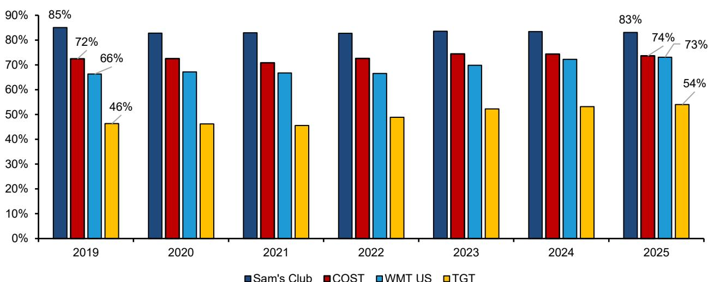
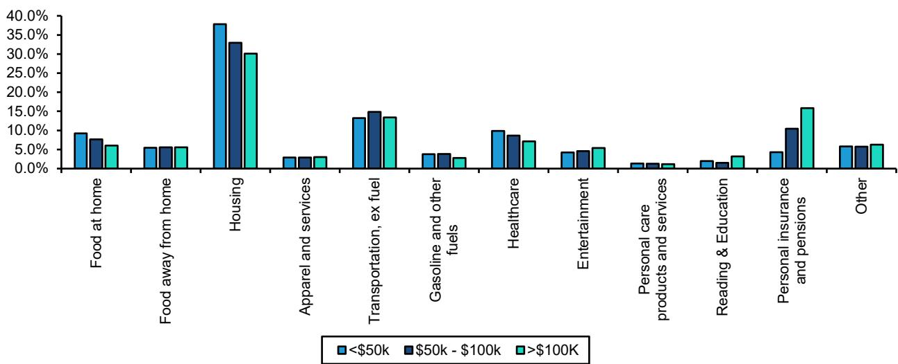
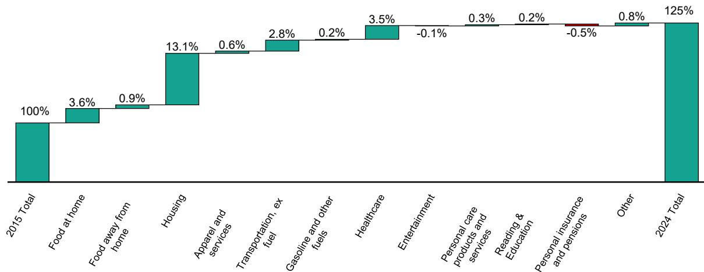

# Bernstein：美国零售的K型分化，才是消费格局的真正变量

美国消费者的分化，已经不是“贫富差距”这种宏观叙事，而是正在重塑零售业态竞争逻辑的结构性力量。Bernstein这份题为“Best of Times, Worst of Times”的报告，核心判断是：后疫情时代的K型宏观环境已不可逆，零售商的命运将越来越取决于它们服务的是哪一端消费者。

报告用美联储和BLS的数据，刻画了一个值得关注的图景。自2020年以来，不同收入群体的零售支出增速出现显著脱钩。截至2024年中，最低收入群体的累计实际支出增长仅约8%，而最高收入群体接近17%。更关键的是，低学历群体的表现远逊于高学历群体。这种分化不是短期波动，而是由住房、能源和必需品通胀持续挤压低收入群体可支配收入所驱动的结构性趋势。

> **KC评论：** 这份报告最有价值的不是“贫富分化”这个老生常谈的结论，而是它用数据揭示了通胀对不同收入群体的不对称影响——低收入群体承受的通胀率实际上高于高收入群体，因为他们的消费篮子更侧重于住房和食品。这意味着宏观通胀数据可能掩盖了真实的分化程度。

## 1. 价值型零售商正在成为K型宏观环境的最大受益者

通胀对零售商并非坏事，关键在于你处在哪一端。报告指出，当整体通胀推高零售价格时，沃尔玛和Costco这类价值导向型零售商反而获得了相对价格优势。数据显示，通胀与沃尔玛美国同店销售的相关性高达53%，与Costco同店销售的相关性为69%。与此同时，低收入群体被迫将更大比例支出转向必需品，进一步强化了折扣业态的客流。

报告特别指出，一元店也可能从这一趋势中受益，因为部分高收入消费者开始“降级消费”——过去12个月已经可以看到这种迹象。

## 2. 必需品占比上升正在侵蚀部分零售商的利润质量

对以非必需品为主的零售商而言，K型宏观环境带来的不是客流增长，而是品类结构出现变化。自2019年以来，沃尔玛美国、塔吉特和Costco的必需品销售占比分别上升了679个基点、770个基点和118个基点。对于塔吉特这类更偏非必需品的零售商，这种品类迁移直接压缩了毛利率。

报告认为，短期内通胀不确定性仍将持续，低收入群体的必需品优先支出模式不会改变。只有当通胀正常化、消费力恢复后，非必需品支出才有望回暖——但这个过程将从高收入群体和小件商品开始。

> **KC评论：** 这里有一个容易被忽略的隐含判断：非必需品零售商的业绩修复，很可能比市场预期的更晚到来。因为即使通胀回落，低收入群体也需要先修复资产负债表，而不是立刻恢复“买买买”。报告没有直接说，但Five Below、Dollar Tree和塔吉特等公司，可能要在更长时间里面临品类结构不确定性。

## 3. 报告尚未完全回答的关键问题：K型宏观环境的逆转条件是什么

Bernstein指出，K型宏观环境的正常化路径主要有两条：一是通过价格变化恢复购买力，这是理想路径；二是通过市场明显波动和财富毁灭，这是不理想的路径。但报告没有深入讨论的是：如果通胀只是缓慢回落而非价格变化，低收入群体的实际购买力能否真正修复？过去几年的财富效应主要集中在上层，如果资产价格出现调整，K型宏观环境是否会从“底部出现变化”变成“顶部调整”？

此外，报告对“降级消费”的持续性也着墨不多——高收入消费者是否真的会长期光顾一元店，还是只是暂时行为？这些问题的答案，将决定价值型零售商的增长天花板。

## 4. 对读者的观察框架：关注品类结构而非同店增速

这份报告给产业观察者一个更细致的分析框架：与其只看零售商的同店销售增速，不如关注其品类结构的变化趋势。必需品占比的上升，短期内可能推高营收，但长期会侵蚀利润率。真正值得跟踪的指标，是各零售商在“必需品vs非必需品”这一维度上的动态平衡，以及它们能否在通胀正常化后，重新拉回非必需品品类。

对于读者而言，沃尔玛和Costco在当前环境下的防御性更强，而Five Below和Dollar Tree等更依赖非必需品弹性的零售商，则需要等待消费力修复的明确信号。

For informational purposes only. Portions may be generated, translated, summarized, or edited with AI assistance based on source materials and may contain omissions or errors. Please verify independently. This is not investment, legal, tax, accounting, or other professional advice.

For informational purposes only. Portions may be generated, translated, summarized, or edited with AI assistance based on source materials and may contain omissions or errors. Please verify independently. This is not investment, legal, tax, accounting, or other professional advice.

