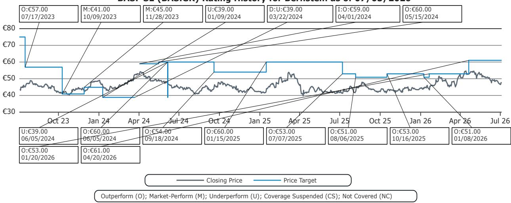

# Bernstein：BASF业绩回升中的矛盾，管理层保守与市场乐观的博弈

化工行业在经历了一轮能源冲击和需求重构后，市场正在寻找底部信号。Bernstein在最新发布的BASF前瞻报告中给出了一个值得关注的判断：这家欧洲化工巨头的二季度业绩大概率不会低于分析师当前的最低预期，但真正的问题在于——公司可能不会像市场期望的那样大幅上调全年指引。

这份报告的核心价值不在于给出一个乐观或悲观的结论，而在于它拆解了一个关键矛盾：运营层面的改善正在发生，但管理层的保守态度与市场预期之间可能存在落差。

## 1. 二季度业绩的“地板”已经确立，但天花板在哪仍需观察

Bernstein在与BASF管理层的沟通中确认，4月和5月公司实现了同比正增长，6月的订单簿也保持了稳定。这意味着，市场对二季度EBITDA的Vara共识预期（约20.52亿欧元）至少是可以实现的——公司管理层自己也表达了“至少达到一致预期”的信心。

但问题的复杂性在于，不同数据源的共识存在明显差异：Bloomberg和Visible Alpha的预期分别为21.14亿和21.17亿欧元，比Vara高出约3%。这种差异本身就反映了市场对回升力度的分歧。Bernstein的估计（20.48亿欧元）更靠近Vara的下沿，说明他们认为二季度业绩大概率会落在市场预期的低端区间。

> **KC评论：** 这里的关键不是数字本身，而是“floor”和“ceiling”的差距。管理层确认了下限，但上限取决于化学品和材料板块的定价能力能否持续，以及路德维希港的检修恢复进度。读者在阅读原文时可以重点关注Chemicals和Materials两个板块的细分数据，它们是判断业绩弹性的核心。

## 2. 三季度指引上调几乎是确定的，但幅度可能让市场失望

报告最值得关注的判断在于对全年指引的分析。BASF当前的指引区间为62-70亿欧元，Bernstein认为上调几乎是必然的，但上调幅度可能“比市场预期更保守”。

背后的逻辑有两个维度。第一，上游化学品板块的供应约束仍在，即便油价回落导致公式定价有所下降，但量端预计保持韧性——这是支撑上调的基础。第二，下游板块面临的不确定性正在扩散：Care Chemicals已经出现需求疲软和竞争加剧，如果更多业务单元复制这一趋势，管理层没有理由在7月就给出一个激进的数字。

当前Vara对2026年全年调整后EBITDA的共识为73.03亿欧元，Bloomberg和Visible Alpha也基本在同一水平。Bernstein的潜台词是：这个预期已经隐含了一个相当乐观的下半年，而公司可能只愿意把指引上调到接近这个区间的中下沿，而不是完全覆盖它。

> **KC评论：** 这不是一个看空信号，而是一个预期管理的问题。报告没有说“业绩达不到73亿”，而是说“公司可能不会在7月就确认73亿”。这实际上给下半年留下了一个观察窗口——如果三季度数据持续向好，9月或10月的二次上调反而更有说服力。原文中关于路德维希港检修恢复进度的描述值得细读，它是判断三季度量端能否跟上价格变化的关键变量。

## 3. 农业解决方案的分拆可能成为下半年催化剂，但报告没有展开

报告在结尾处提到“即将进行的农业解决方案分拆可能成为H2的催化剂”，但并未深入展开。这是一个值得追问的线索。

农业解决方案是BASF利润率较高的板块之一，其分拆意味着公司正在推进此前承诺的组合观察重塑。从战略角度看，这既能释放被低估的资产价值，也能让剩余业务更加聚焦于化工主业。但报告没有回答的是：分拆的具体时间表、交易结构、以及是否会伴随资本返还计划。这些细节将直接决定市场如何定价这一催化剂。

## 4. 对读者的观察框架：关注预期差，而非相对数字

这份报告提供了一个实用的分析框架：不要只看BASF的业绩能否达到某一数字，而要看“公司说什么”与“市场信什么”之间的差距。

当前阶段，上游板块的量价韧性是支撑逻辑，下游板块的边际不确定性是不确定性来源。如果三季度数据继续验证量端的稳定，即便公司给出一个保守的指引，市场也可能在后续自行上调预期。反之，如果下游不确定性扩散的速度超出预期，那么当前共识中隐含的乐观下半年就需要重新审视。

原文中还有一个值得注意的细节：Bernstein对BASF的SOTP估值是基于7倍EBITDA给上游业务、15倍给饲料酶、10倍给农业解决方案。这个估值框架本身就隐含了对资产分拆价值的认可——如果分拆确实在H2落地，估值重估的空间可能比当前报价反映的更大。

---

For informational purposes only. Portions may be generated,translated,summarized,or edited with AI assistance based on source materials and may contain omissions or errors. Please verify independently. This is not investment,legal,tax,accounting,or other professional advice.

For informational purposes only. Portions may be generated,translated,summarized,or edited with AI assistance based on source materials and may contain omissions or errors. Please verify independently. This is not investment,legal,tax,accounting,or other professional advice.

