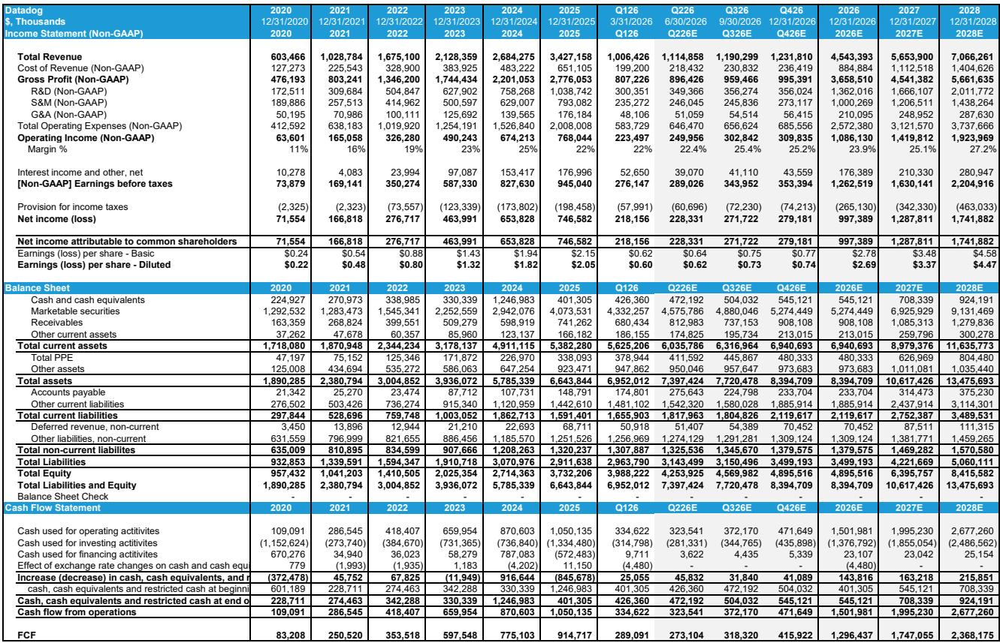
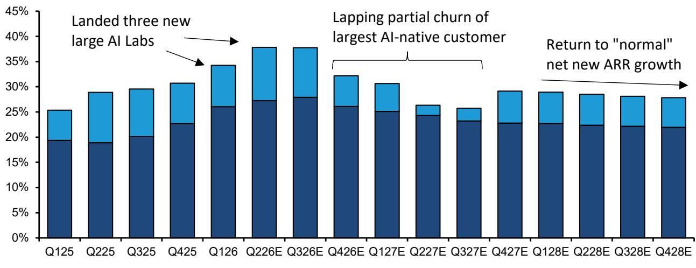
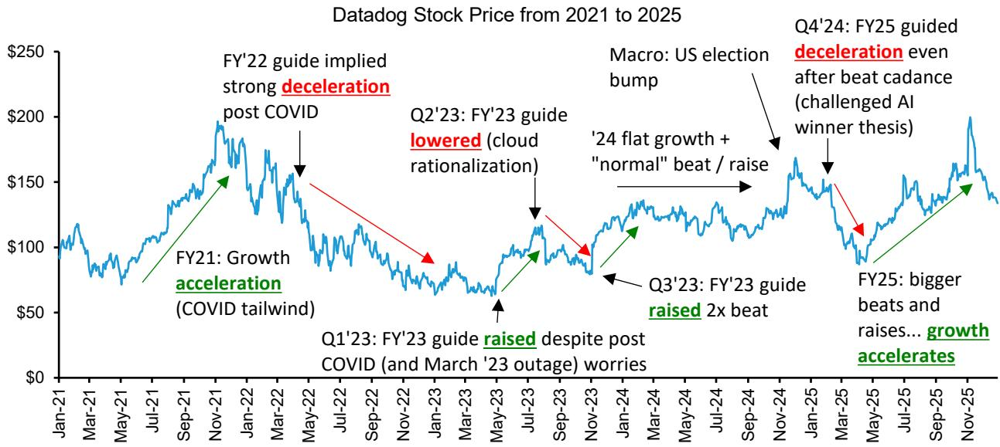

# Datadog的增长峰值已现，但长期AI逻辑需要战术性等待

Datadog的执行力一直非常精准，其平台从可观测性扩展到了更广泛的运营控制层，如今已触及AI工作负载、网络安全和开发者工具。公司最近的DASH大会强化了许多观察者已经接受的观点：Datadog既是AI的受益者，也是一个护城河不断扩大的持久平台。然而，该标的今年迄今约90%的涨幅，已经定价了一条未来两个季度可能无法实现的轨迹，这在结构性乐观与短期战术现实之间制造了张力。

本分析的核心论点很直接：受高基数效应、AI实验室贡献趋于平稳以及非AI企业工作负载停滞的共同影响，Datadog的收入增长将在今年下半年明显放缓。虽然长期逻辑依然成立，公司的战略定位实际上也有所改善，但当前的估值已经包含了市场对持续30%以上增长的预期，而数据并不支持这一点。这不是对公司的否定——而是对市场愿意忽视增长轨迹中正在形成的“真空地带”的提醒。

下调评级并非看空Datadog的最终目的地，而是认识到从现在到那里的路径，会比当前乐观情绪所暗示的更加曲折。对于那些错过这轮上涨的观察者来说，耐心可能会得到回报。对于已经持有的观察者而言，问题在于未来十二个月能否带来与增长放缓风险相匹配的回报。

## AI收入贡献真实但接近峰值，最大客户即将调整

Datadog的“原生AI”收入目前约占总收入的15%，主要由两个大客户驱动，它们在这一板块中占据了不成比例的份额。最大的AI客户，普遍被认为是OpenAI，已签约超过2.1亿美元的年经常性收入。预期是OpenAI将在本季度调整约1.7亿美元的ARR，将业务指标迁移至Chronosphere，日志迁移至Clickhouse，同时保留约4000万美元的平台支出，这部分应会随着公司的基础规模继续增长。

关键问题是，这剩余的4000万美元能增长多快。即使考虑到ChatGPT移动应用和网络平台用户增长信号放缓，来自该客户的底层需求增长今年估计仍有65%。这一数字包含了显著的定价上涨——自合同签署以来，实际价格已上涨约85%——以及OpenAI今年指引的25亿美元广告收入。含义很明确：归因于该客户的收入增长中，很大一部分是由定价权和广告变现驱动的，而非直接惠及Datadog按量计费模式的原始使用量扩张。

第二大AI客户，据信是Anthropic，呈现出不同的动态。进入本季度的收入增长预期超过125%的环比增长，网络流量数据表明，使用量而非定价是主要驱动力。然而，近期指标显示增长出现停滞，这与新模型发布后常见的消化期一致。该客户的增长轨迹预计明年将减半至约65%，并在第二年进一步降至45-50%。

除了这两个主导客户，其余“原生AI”客户群每季度新增的净收入大约在数百万美元的水平。这在Datadog当前的规模下是有意义的，但并非变革性的。整体图景是，这一板块曾是一个强大的加速器，但现在正进入自然减速阶段，原因是客户集中度、定价正常化以及AI实验室收入周期固有的不稳定性。

## 非AI收入增长趋平，信号指向第四季度增长放缓

非AI业务仍占Datadog收入的约85%，正显示出比AI叙事所暗示的更令人担忧的停滞迹象。追踪云工作负载迁移的网络指标数据自5月初以来一直持平，这一模式已持续到7月。渠道调研也印证了这一信号，指向超大规模云服务商的容量限制、近期漏洞警告后的网络安全加固工作，以及新企业工作负载部署的普遍暂停。

这对Datadog的短期收入轨迹影响重大。第三季度的收入结果，由第二季度的网络指标预示，可能会保持稳定或略有改善，这得益于去年同期的低基数。真正的风险出现在第四季度，届时公司将面临一个非常强劲的去年同期。如果当前的持平运行率持续，同比增速可能放缓500个基点，降至约29%。相对于观察者一直期待的30%高位甚至40%的峰值增长预期，这将是一个失望。

这种放缓的结构性驱动因素并非暂时性的，不会在一个季度内解决。自去年下半年以来，超大规模云服务商的容量限制一直存在，新增活跃数据中心容量的速度已明显放缓。网络安全修复是一个多季度的过程，会分散原本用于新云迁移的工程资源。而“Token最大化”现象——即企业优化AI工作负载以提升成本效率——减少了驱动Datadog收入的消费量。

市场历来对这些云消费公司的短期波动反应过度，有充分理由相信这次周期也不会例外。风险不在于Datadog的长期增长轨迹被破坏，而在于市场已经为近期加速的平稳延续定价。

## 估值脱节体现在倍数上，但市场正在为一个不现实的增长情景定价

Datadog目前的交易价格约为远期销售额的26倍，这一倍数使其在更广泛的云SaaS领域中明显处于“异常值”区域。对市销率与“40法则”得分的回归分析显示，Datadog显著高于趋势线，这意味着观察者嵌入的收入增长预期远高于基础数据所支持的水平。

这种脱节并不微妙。当前的倍数意味着观察者预期Datadog能在较长时间内维持30%以上的增长率，或从当前水平加速。本文的分析则指向相反：增长很可能在第四季度明显放缓，并可能持续到明年上半年。即使将长期增长假设提高几百个基点——纳入更高的AI收入预期和更长的持续时间——目标价也仅为226美元。

这不是一个否定Datadog质量的估值。这是一个承认公司卓越执行力和战略定位，同时认识到当前股价已超出短期基本面轨迹的估值。市场正在为一个需要未来两个季度一切顺利的情景定价，而证据表明，有几件事可能会偏离预期。

## 报告未完全解答的问题：非AI放缓的持续时间和幅度

该分析为理解短期增长放缓提供了一个框架，但留下了几个关键问题未解决。首先，非AI工作负载停滞的持续时间不确定。模型假设在8月中旬前会出现反弹，使第三季度“正常”结束，但这一假设基于历史模式，而非直接证据。如果停滞持续到9月或10月，第四季度的放缓可能比500个基点的估计更严重。

其次，Datadog的收入增长与AWS云增长之间的关系正在演变。历史上，Datadog的增长速度快于AWS，但这一比率自疫情高峰期以来一直在下降。分析假设该比率会稳定下来，但如果Datadog的产品广度未能转化为增量钱包份额，它可能会继续压缩。公司最近的产品发布——包括Bits AI、无限基数和CPU/GPU监控——可能逆转这一趋势，但证据尚不确凿。

第三，AI收入模型依赖于本质上不确定的定价假设。如果OpenAI或Anthropic为了争夺Token份额而降价，流向Datadog的使用量驱动收入可能会加速，从而抵消最大客户的调整。相反，如果价格上涨放缓或逆转，这些客户的收入贡献可能令人失望。分析承认了这种不确定性，但并未解决它。

这些开放性问题并非分析的缺陷；它们是任何前瞻性框架的自然边界。这正是观察者应专注于自身研究的地方，也是完整报告通过专有数据和替代信号提供更多细节的领域。

## 应对未来十二个月的决策框架

对于试图围绕Datadog进行布局的观察者来说，未来十二个月呈现出结构性质量与战术时机之间的经典张力。下面的框架旨在通过识别关键信号和决策点来帮助应对这种张力。

首先，每周监控非AI工作负载数据。自5月以来一直持平的网络指标信号是可用的最领先指标。如果该信号在未来四到六周内开始积极变化，第四季度严重放缓的风险就会降低。如果它保持持平或恶化，下行情景就更有可能。这是短期布局中最重要的单一数据点。

其次，关注OpenAI和Anthropic的AI实验室收入披露和网络流量指标。定价与使用量的组合是关键变量。如果AI实验室主要通过使用量扩张而非涨价来增长，Datadog的AI收入贡献可能比当前模型假设的更持久。如果定价成为主导驱动力，收入质量就会降低，放缓风险更高。

第三，滚动评估估值相对于增长轨迹。当前26倍远期销售额的倍数只有在增长保持在30%以上时才可持续。如果增长放缓至25%左右，倍数应该会压缩。决策点是接受这种压缩为暂时现象，还是等待更好的入场点。

第四，考虑产品周期催化剂。Datadog最近在网络安全和AI可观测性方面的产品发布，可能创造下半年的催化剂，抵消非AI方面的逆风。风险在于这些产品需要时间才能起量，不会在未来两个季度内对收入产生实质性贡献。回报在于它们可能将增长持续时间延长到当前模型假设之外。

最严谨的做法是等待增长放缓显现并在标的价格中反映出来，然后再增加仓位。错过持续上涨的风险是真实存在的，但结果的不对称性目前偏向于耐心。该标的已经为未来两个季度的最佳情景定价；证据表明，这种情景不太可能实现。

## 加入社区阅读完整报告并查看原始图表

本文的分析基于一份详细的研究报告，其中包含关于网络指标、AI实验室收入信号、超大规模云服务商容量趋势和估值回归的专有数据。完整报告提供了支持上述论点的底层图表和数据点，包括AI收入模型背后的具体假设、网络指标方法论，以及证实非AI停滞信号的渠道调研证据。

对于希望深入研究开放性问题——非AI放缓的持续时间、AI收入中定价与使用量的组合，以及新产品支柱重新加速增长的潜力——的观察者，完整报告提供了必要的细节。它还包含了本文引用但未完全复制的回归分析、网络指标趋势和收入增长分解的原始图表。

理解战术性下调与结构性看空之间的区别，对于做出明智的决策至关重要。完整报告提供了做出这种区分所需的证据。

*仅供参考。部分内容可能基于源材料通过AI辅助生成、翻译、总结或编辑，可能存在遗漏或错误。请独立核实。这不构成专业建议。*

仅供参考。部分内容可能基于源材料通过AI辅助生成、翻译、总结或编辑，可能存在遗漏或错误。请独立核实。这不构成专业建议。

