# 印度金融机构观察：ICICI能否追随Axis的步伐？

Pranav Gundlapalle

+91 226 842 1407

pranav.gundlapalle@bernsteinsg.com

Ishan Mittal

+91 226 842 1442

ishan.mittal@bernsteinsg.com

Anirudh Gupta

+91 226 842 1456

anirudh.gupta@bernsteinsg.com

在过去9-12个月中，Axis的表现显著优于ICICI。增长的明显提速很可能是最大的推动因素，Axis继续在这一势头基础上发展，在1Q27实现了约19%的同比增长——轻松领先于HDFC和KMB等同行，也远高于系统增长水平。我们强调了支撑这一优异表现的其他因素，包括Axis更优的资本状况，并探讨ICICI是否也能转向更高的增长——这是本季度值得关注的关键趋势。

Axis相对于ICICI的优异表现：Axis在相对估值方面，更重要的是相对于ICICI，在过去3-4个季度中出现了明显的重估（图表4、图表5）。该公司的报价在过去一年中上涨了约15%，而ICICI为-1%，从相对角度看，目前相对于ICICI的估值处于五年高位，但仍低于疫情前水平。

Axis选择增长而非利差：我们认为，优异表现很大程度上可归因于Axis在过去几个季度中更强的增长（图表1-图表3、图表6），尤其是在此期间其与ICICI的利差差距有所扩大。资产回报率差距扩大（图表7），更重要的是，PPoP与资产之比差距在过去十二个月中扩大了40个基点（图表8）。NII与资产之比差距也扩大了20个基点（图表9），表明更强的增长是以利差为代价的。较低的信用成本、CASA增长的改善（图表10）以及更严格的运营支出增长也有所帮助，但增长仍是关键区分因素。

质量差距依然存在：虽然Axis的增长更为强劲，但ICICI在大多数业务质量指标上仍保持领先——包括存款业务实力、资产负债表质量、流动性缓冲、拨备缓冲和盈利能力（图表11、图表12）。然而，在流动性风险关注度降低的温和环境下，更高的整体增长正获得市场认可。

## ICICI能否追随Axis的步伐？

- 无明显资产负债表约束：ICICI没有明显的资产负债表约束。其LCR/LDR优于同行，核心存款增长更高，且起始资产回报率远高于同行，这使得其较慢的增长有些令人费解（链接）。
- 零售贷款出现拐点迹象：如果较慢的增长主要是由高收益零售（非抵押贷款）板块的疲软所致，那么4Q26显示出ICICI可能迎来拐点的初步迹象。然而，该板块的增长仍远低于Axis（图表13）。
- 较高资本仍是半结构性拖累：如果更高的资产回报率/股本回报率门槛导致了较慢的增长，那么ICICI可能需要更长时间才能恢复到行业领先的增长水平。其较高的资本水平需要更高的资产回报率来维持类似的股本回报率水平。与此同时，Axis凭借更优的资本状况，可以在运营资产回报率显著较低的情况下，继续实现与大型银行相当的股本回报率（图表14、图表15）。

这将是即将到来的季度业绩中值得关注的关键趋势。虽然很少有人会质疑ICICI与Axis之间的业务质量差距，但近期趋势的延续可能使Axis能够将其相对于ICICI的优异表现进一步延伸。

## BERNSTEIN 报价表

<table><tr><td rowspan="2"></td><td rowspan="2"></td><td colspan="3">2026年7月3日</td><td>TTM</td><td colspan="4">报告每股收益</td><td colspan="3">市净率 (x)</td></tr><tr><td></td><td rowspan="2">收盘价</td><td rowspan="2">目标价</td><td rowspan="2">相对表现</td><td rowspan="2">货币</td><td rowspan="2">2026A</td><td rowspan="2">2027E</td><td rowspan="2">2028E</td><td rowspan="2">2026A</td><td rowspan="2">2027E</td><td rowspan="2">2028E</td></tr><tr><td>代码</td><td>评级</td><td>货币</td></tr><tr><td>AXSB.IN (Axis Bank)</td><td>O</td><td>INR</td><td>1,342.10</td><td>1,600.00</td><td>(23.9)%</td><td>INR</td><td>78.61</td><td>98.88</td><td>117.90</td><td>1.9</td><td>1.7</td><td>1.5</td></tr><tr><td>ICICIBC.IN (ICICI Bank)</td><td>M</td><td>INR</td><td>1,411.40</td><td>1,550.00</td><td>(40.0)%</td><td>INR</td><td>69.20</td><td>77.81</td><td>89.17</td><td>2.8</td><td>2.5</td><td>2.2</td></tr><tr><td>KMB.IN (Kotak)</td><td>M</td><td>INR</td><td>396.75</td><td>500.00</td><td>(44.7)%</td><td>INR</td><td>14.08</td><td>16.33</td><td>19.13</td><td>2.2</td><td>2.0</td><td>1.8</td></tr><tr><td>HDFCB.IN (HDFC Bank)</td><td>O</td><td>INR</td><td>801.05</td><td>1,150.00</td><td>(57.1)%</td><td>INR</td><td>48.51</td><td>54.51</td><td>63.27</td><td>2.2</td><td>2.0</td><td>1.8</td></tr><tr><td>ASIAX</td><td></td><td></td><td>1,977.84</td><td></td><td></td><td></td><td></td><td></td><td></td><td></td><td></td><td></td></tr></table>

O - 优于市场表现，M - 与市场表现一致，U - 弱于市场表现，NR - 未评级，CS - 暂停覆盖

来源：彭博社、Bernstein估计与分析。

## 研究启示

我们将Axis、HDFC评为优于市场表现，将ICICI、KMB评为与市场表现一致。

## 近期其他报告链接：

2026年7月4日 - 快评：HDFCB 1Q27 - 平衡之举仍在继续

2026年6月24日 - 印度金融机构：银行牌照值得吗？

2026年6月17日 - 印度金融机构：零售承销如何运作 - 我们网络研讨会的主要收获

2026年6月10日 - 印度金融机构：PVBs vs. PSBs (4/n) – 优异表现终结的开始

2026年6月10日 - 印度储备银行的FCNR推动：对银行、债券和印度卢比的影响

2026年6月8日 - 印度金融机构：PVBs在零售贷款中是否具有承销优势？

2026年6月4日 - 印度金融机构：利差将走向何方？(1/n)

## 详情

图表1：Axis继续实现显著高于系统的增长...

<table><tr><td>Axis Bank (1Q27, 十亿印度卢比)</td><td>2025年6月</td><td>2026年3月</td><td>2026年6月</td><td>同比%</td><td>环比%</td></tr><tr><td>总贷款</td><td>10,719</td><td>12,443</td><td>12,729</td><td>18.8%</td><td>2.3%</td></tr><tr><td>期末余额</td><td></td><td></td><td></td><td></td><td></td></tr><tr><td>总存款</td><td>11,616</td><td>13,358</td><td>13,729</td><td>18.2%</td><td>2.8%</td></tr><tr><td>CASA</td><td>4,682</td><td>5,289</td><td>5,217</td><td>11.4%</td><td>-1.4%</td></tr><tr><td>定期存款</td><td>6,934</td><td>8,069</td><td>8,512</td><td>22.8%</td><td>5.5%</td></tr><tr><td>季度平均余额</td><td></td><td></td><td></td><td></td><td></td></tr><tr><td>总存款</td><td>11,049</td><td>12,265</td><td>13,048</td><td>18.1%</td><td>6.4%</td></tr><tr><td>CASA</td><td>4,243</td><td>4,583</td><td>4,814</td><td>13.5%</td><td>5.0%</td></tr><tr><td>定期存款</td><td>6,806</td><td>7,682</td><td>8,234</td><td>21.0%</td><td>7.2%</td></tr></table>

来源：公司报告、彭博社、Bernstein分析  
贷款增长（1Q27，同比%）

图表2：...在贷款方面也领先于同行...

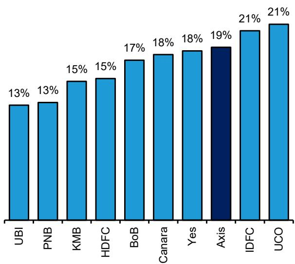  
来源：公司报告、彭博社、Bernstein分析  
图表3：...以及存款方面  
存款增长（1Q27，同比%）

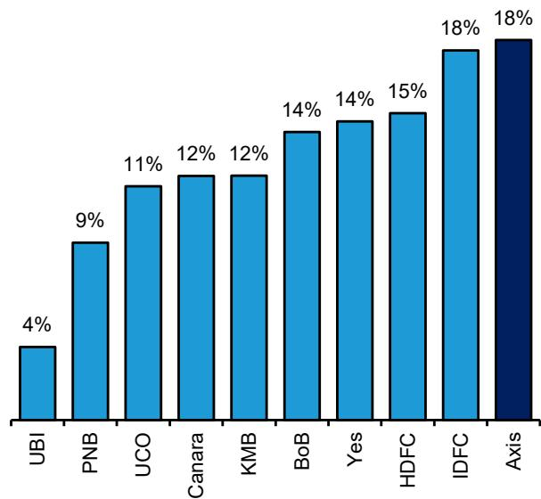  
来源：公司报告、彭博社、Bernstein分析

图表4：Axis在过去3-4个季度中，在相对市净率估值以及相对于ICICI方面都出现了明显的重估...  
ICICI PBx vs. Axis PBx  
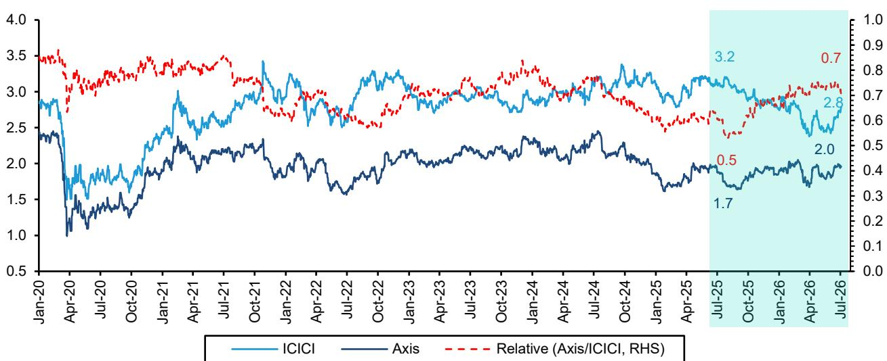  
来源：公司报告、彭博社、Bernstein分析

图表5：...市盈率方面也呈现类似情况。  
ICICI市盈率 vs. Axis Bank市盈率  
  
来源：公司报告、彭博社、Bernstein分析

图表6：我们认为贷款增长的明显提速是这一优异表现的关键驱动因素...

贷款增长（同比%）

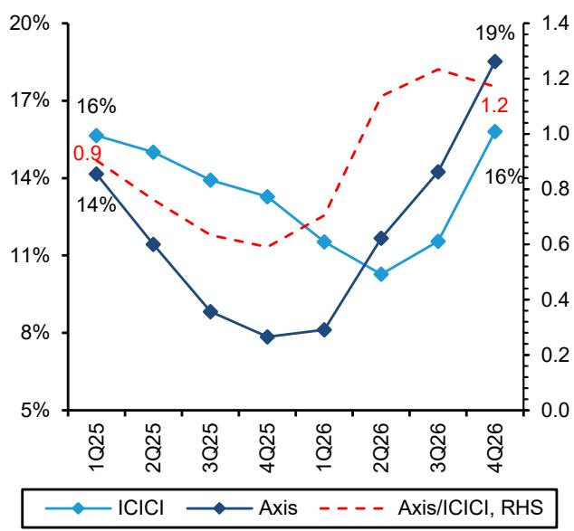  
来源：公司报告、彭博社、Bernstein分析  
图表7：...因为过去12个月中Axis与ICICI之间的资产回报率差距实际上扩大了  
资产回报率（计算值，%）

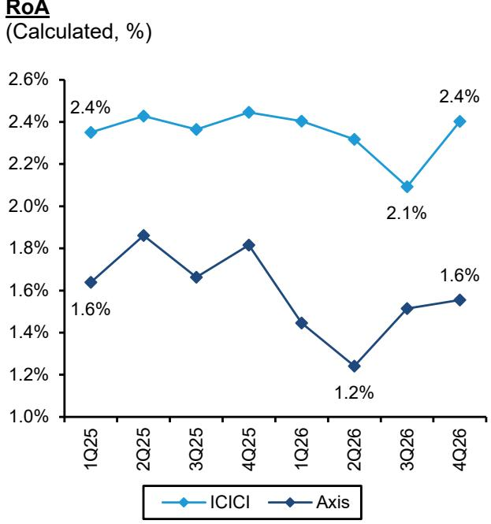  
来源：公司报告、彭博社、Bernstein分析  
图表8：比较PPoP（拨备前营业利润）占资产百分比时，盈利能力差距的扩大更为明显...  
PPoP与平均资产之比（计算值，%）

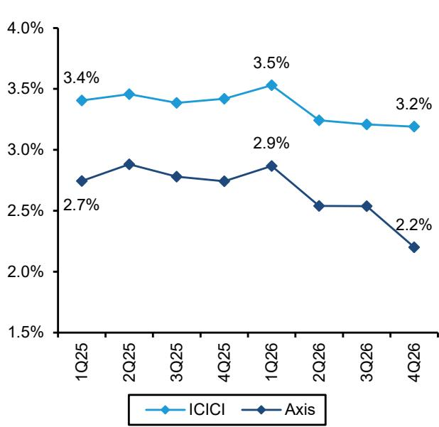  
图表9：...以及NII（净利息收入）占平均资产百分比，过去12个月显著扩大  
来源：公司报告、彭博社、Bernstein分析  
NII与平均资产之比（计算值，%）

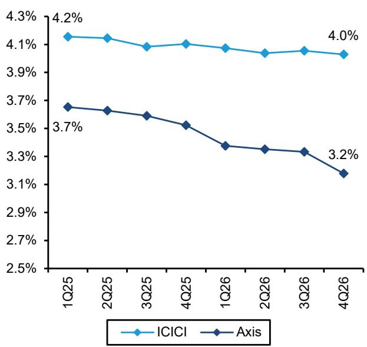  
来源：公司报告、彭博社、Bernstein分析

图表10：Axis的CASA增长也有所回升，但与更广泛的系统趋势并无显著差异。与此同时，ICICI在FY24-25年期间经历了出色的表现后，其CASA表现已趋于正常化。

CASA增长（同比%）

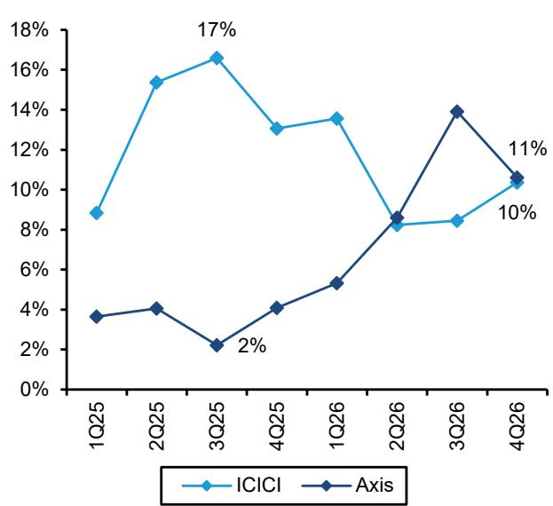  
图表11：在大多数质量指标上，ICICI仍领先于Axis，无论是CASA比率...  
CASA比率（季度末，%）

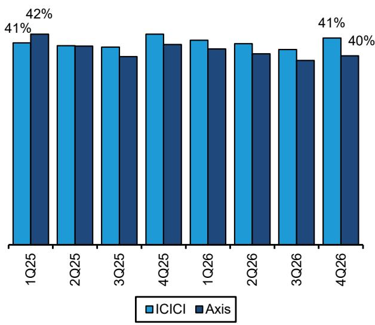  
来源：公司报告、彭博社、Bernstein分析  
来源：公司报告、彭博社、Bernstein分析

图表12：...或LCR或任何资产负债表健康指标  
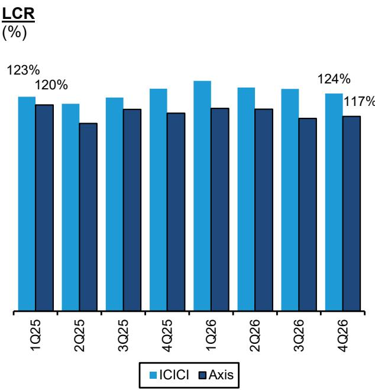  
来源：公司报告、彭博社、Bernstein分析  
图表13：如果ICICI较慢的增长是由零售（非抵押贷款）贷款增长较弱所致，那么最新季度的趋势看起来令人鼓舞  
非抵押零售贷款增长（同比%）

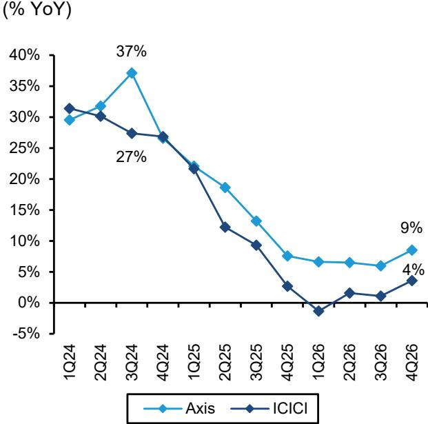  
来源：公司报告、彭博社、Bernstein分析

图表14：ICICI资本过剩——这是它与HDFCB和KMB共同面临的问题，而Axis则以更优的资本水平运营，该水平远高于要求及其自身历史平均水平。

CET1
(%)

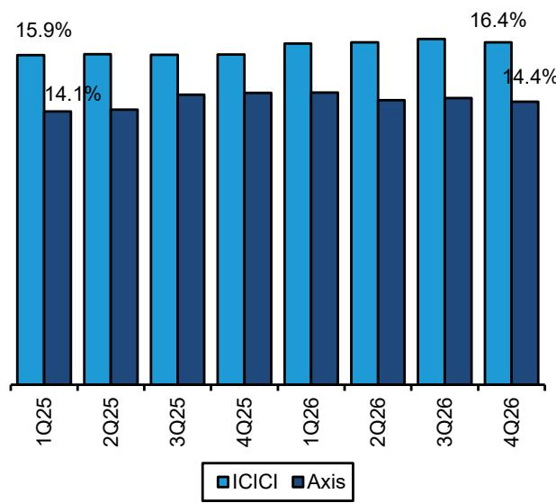  
来源：公司报告、彭博社、Bernstein分析  
图表15：Axis相对于ICICI较低的资本水平已被证明是一个优势，因为它使Axis能够维持比其与ICICI的资产回报率差距所暗示的窄得多的股本回报率差距  
股本回报率（计算值，%）

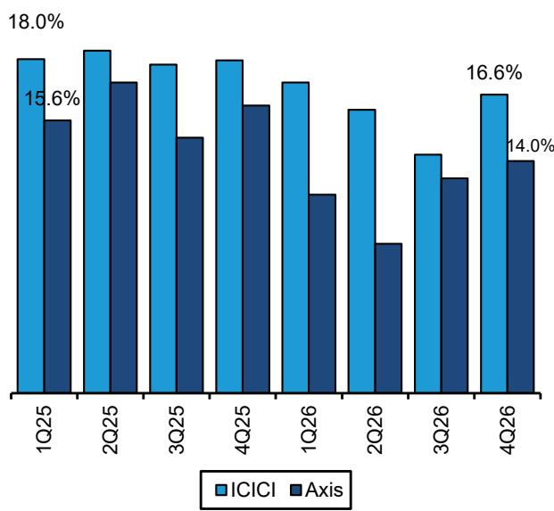  
来源：公司报告、彭博社、Bernstein分析

## I. 必要披露

本披露中提及的"Bernstein"或"公司"指以下实体：Bernstein Institutional Services LLC（自2024年4月1日起）、Bernstein & Co., LLC（2024年4月1日前）、Bernstein Autonomous LLP、BSG France S.A.（自2024年4月1日起）、Bernstein (Hong Kong) Limited 盛博香港有限公司、Bernstein (Canada) Limited、Bernstein (India) Private Limited（SEBI注册号INH000006378）、Bernstein (Singapore) Private Limited、Bernstein Japan KK（サンフォード・C・バーンスタイン株式会社）以及根据Bernstein与SG之间的全球服务协议受雇于SG Africa Technologies & Services为Bernstein制作研究报告的分析师。

Bernstein是SG（SG）与AllianceBernstein, L.P.（AB）合资企业的一部分。除非另有特别说明，就本披露而言，提及Bernstein的"关联方"均指SG和AB及其各自的关联方。

为本报告做出贡献的一位关联人士持有HDFC Bank Ltd的股权或债务证券的财务权益。

## 估值方法

## Axis Bank Ltd

我们采用市净率倍数法得出目标价1,600印度卢比，基于FY27E账面价值793印度卢比和2.0倍的市净率倍数。

## ICICI Bank Ltd

我们采用市净率倍数法得出目标价1,550印度卢比，基于FY27E账面价值535印度卢比和2.8倍的市净率倍数。我们还考虑了各子公司的贡献。

## Kotak Mahindra Bank Ltd

我们采用市净率倍数法得出目标价500印度卢比，基于FY27E账面价值202印度卢比和2.4倍的市净率倍数。

## HDFC Bank Ltd

我们采用市净率倍数法得出目标价1,150印度卢比，基于FY27E账面价值407印度卢比和2.5倍的市净率倍数。我们还考虑了各子公司的贡献。

## 风险

## Axis Bank Ltd

下行风险

+ 利差改善趋势逆转

+ 对Citi收购的执行不力

+ 运营成本未能保持控制，对数字化举措和新分支机构的投资超过其带来的收益

## ICICI Bank Ltd

上行风险：

+ 该行成功在增长和/或盈利能力方面与同行形成显著且可持续的差距

下行风险

+ 零售增长以牺牲风险调整后收益为代价

+ 运营支出急剧增加，因该行追赶网络扩张步伐

## Kotak Mahindra Bank Ltd

上行风险：

+ 存款增长率明显回升，通过收购或其他方式

下行风险

+ KMB无法按照指引和市场预期扩大其贷款组合

+ KMB面临利差压力，因为负债增长低于满足资产增长指引所需的水平

+ 通过数字渠道/发行信用卡解除客户获取禁令的延迟超出预期

## HDFC Bank Ltd

下行风险

+ 无担保组合和合并后开发商融资组合的资产质量恶化超出预期

+ 各业务线的领导层变动产生不利影响，损害增长和盈利前景

+ 流动性环境持续收紧时间更长，导致行业存款增长减弱

## 评级定义、基准与分布

## 股票评级定义

## Bernstein品牌

Bernstein品牌根据未来12个月相对于特定指数的预期表现对股票进行评级：美国及加拿大交易所上市股票相对于标普500指数；欧洲交易所及亚太地区以外新兴市场交易所上市股票相对于彭博欧洲发达市场大中盘价格回报指数欧元（EDME）；日本交易所上市股票相对于彭博日本大中盘价格回报指数美元（JPL）；亚洲（除日本）交易所上市股票相对于彭博亚洲除日本大中盘价格回报指数（ASIAX）——除非另有说明。

Bernstein品牌有三个评级类别：

- 优于市场表现：股票将跑赢市场指数超过15个百分点
- 与市场表现一致：股票将与市场指数表现一致，偏差在+/-15个百分点以内
- 弱于市场表现：股票将落后于市场指数超过15个百分点

暂停覆盖：Bernstein品牌下对某公司的覆盖已暂停。评级和目标价暂时失效，不再有效，因此不应依赖。

未评级：当目前无法准确评估股票价值或准确预测公司表现时分配的评级。覆盖分析师可能继续发布关于该公司的研究报告，以向读者通报事件和进展。

未覆盖（NC）表示未受覆盖的公司。

Bernstein品牌股票评级基于12个月的时间范围。

## Autonomous品牌 – 普通股

Autonomous品牌按如下所示对普通股进行评级。我们使用的基准包括：彭博欧洲500银行及金融服务指数（BEBANKS）和彭博欧洲发达市场金融大中盘价格回报指数欧元（EDMFI）用于发达欧洲银行和支付公司；彭博欧洲500保险指数（BEINSUR）用于欧洲保险公司；标普500和标普金融指数用于美国银行和支付覆盖；S5LIFE用于美国保险；标普保险精选行业指数（SPSIINS）用于美国非寿险保险公司覆盖；以及彭博新兴市场金融大中小盘价格回报指数（EMLSF）用于新兴市场银行、保险公司和支付公司。评级是相对于行业（而非市场）给出的。

Autonomous品牌有三个普通股评级类别：

- 优于市场表现（OP）：股票将跑赢相关指数超过10个百分点
- 中性（N）：股票将与市场指数表现一致，偏差在+/-10个百分点以内
- 弱于市场表现（UP）：股票将落后于相关指数超过10个百分点

暂停覆盖：Autonomous研究品牌下对某公司的覆盖已暂停。评级和目标价暂时失效，不再有效，因此不应依赖。

未评级：当目前无法准确评估股票价值或准确预测公司表现时分配的评级。覆盖分析师可能继续发布关于该公司的研究报告，以向读者通报事件和进展。

标记为"特色"（例如，特色优于市场表现FOP、特色弱于优于市场表现FUP）的是我们的核心观点。

未覆盖（NC）表示未受覆盖的公司。

Autonomous品牌普通股评级基于12个月的时间范围。

## Autonomous品牌 – 优先股

Autonomous品牌有三个优先股评级类别：

- 优于市场表现（OP）：优先工具的总回报预计在未来六个月内优于在类似行业或评级类别中运营的其他发行人的优先证券。
- 中性（N）：优先工具的总回报预计在未来六个月内与在类似行业或评级类别中运营的其他发行人的优先证券表现一致。
- 弱于市场表现（UP）：优先工具的总回报预计在未来六个月内弱于在类似行业或评级类别中运营的其他发行人的优先证券。

Autonomous优先股评级基于6个月的时间范围。

## AUTONOMOUS信用研究

如果本报告包含对信用工具的研究交流（定义见市场滥用条例第3(1)(35)条），则提供以下信息以符合其披露要求。

本报告还可能包含对本报告作者或Bernstein其他分析师发布的关于本文提及的发行人股权证券的已发表意见的引用。请注意，本报告作者发布的信用工具研究交流可能与覆盖本文所含发行人的股权证券的分析师发表的观点不同，反之亦然。

## 信用评级定义

Autonomous品牌有三个信用评级类别：

- 信用优于市场表现（C-OP）：参考信用工具的总回报预计在未来六个月内优于在类似行业或评级类别中运营的其他发行人的债券信用利差。
- 信用中性（C-N）：参考信用工具的总回报预计在未来六个月内与在类似行业或评级类别中运营的其他发行人的债券信用利差表现一致。
- 信用弱于市场表现（C-UP）：参考信用工具的总回报预计在未来六个月内弱于在类似行业或评级类别中运营的其他发行人的债券信用利差。

Autonomous信用评级基于6个月的时间范围。

可应要求提供本报告作者制作的所有研究交流清单以及信用评级历史。

公司自行决定何时启动、更新和停止研究覆盖。公司已建立、维护并依赖信息壁垒，以控制公司一个或多个领域（即私密侧）内包含的信息流向公司的其他领域、部门、集团或关联方（即公开侧）。

## 股票评级/投资银行服务分布

<table><tr><td>股票评级</td><td>市场滥用条例（MAR）和FINRA评级类别</td><td>全球评级分布</td><td>投资银行关系*</td></tr><tr><td>优于市场表现</td><td>买入</td><td>51.2%</td><td>15.3%</td></tr><tr><td>与市场表现一致（Bernstein品牌）/ 中性（Autonomous品牌）</td><td>持有</td><td>35.8%</td><td>16.2%</td></tr><tr><td>弱于市场表现</td><td>卖出</td><td>13.1%</td><td>13.6%</td></tr></table>

* 这些数字代表Bernstein关联方在过去12个月内提供投资银行服务的每个股票评级类别中的公司百分比。
截至2026年6月30日。所有数字每季度更新。

## 价格图表 / 评级与目标价历史

Axis Bank Ltd (AXSB.IN) 截至2026年7月3日的Bernstein评级历史  
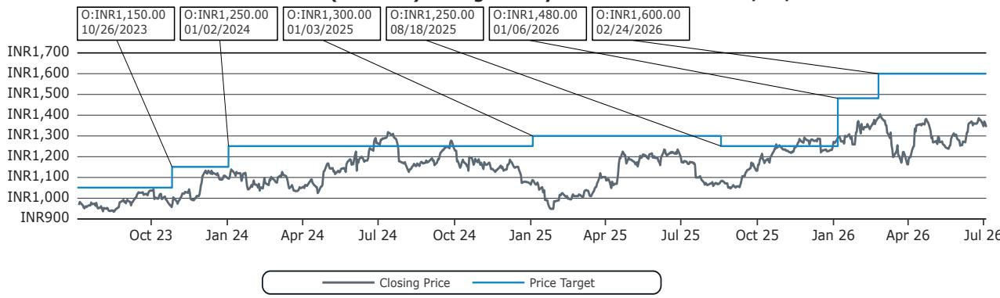  
优于市场表现（O）；与市场表现一致（M）；弱于市场表现（U）；暂停覆盖（CS）；未覆盖（NC）

优于市场表现（O）；与市场表现一致（M）；弱于市场表现（U）；暂停覆盖（CS）；未覆盖（NC）  
ICICI Bank Ltd (ICICIBC.IN) 截至2026年7月3日的Bernstein评级历史  
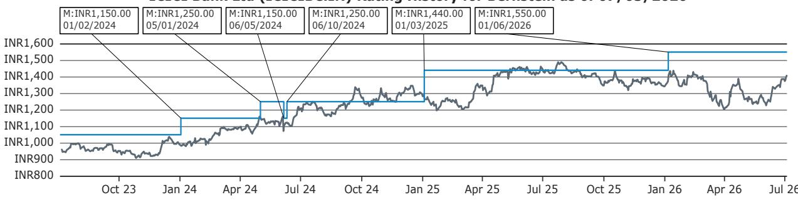

Kotak Mahindra Bank Ltd (KMB.IN) 截至2026年7月3日的Bernstein评级历史  
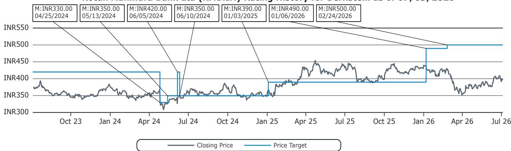  
优于市场表现（O）；与市场表现一致（M）；弱于市场表现（U）；暂停覆盖（CS）；未覆盖（NC）

HDFC Bank Ltd (HDFCB.IN) 截至2026年7月3日的Bernstein评级历史  
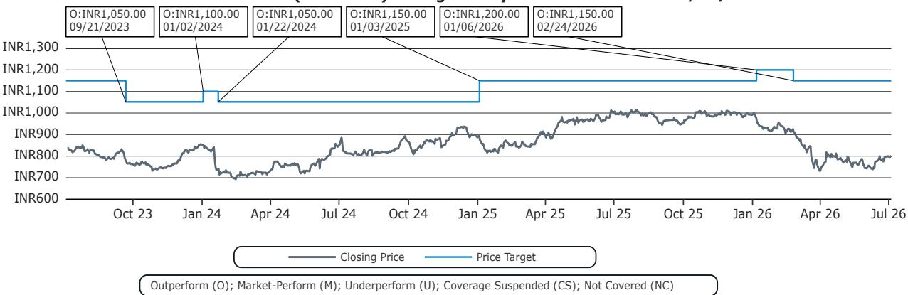

Axis Bank Ltd、ICICI Bank Ltd、Kotak Mahindra Bank Ltd和HDFC Bank Ltd同时受Autonomous和Bernstein品牌覆盖。有关研究评级和目标价历史，请访问https://bernstein-autonomous.bluematrix.com/sellside/Disclosures.action。

本报告上述图表中的所有目标价和收盘价数据均以本报告报价表中注明的货币计价。

## 利益冲突

SG通过其GIFT City分行担任Axis Bank Limited基准PNC5.5额外一级资本（"AT1"）和/或5年期高级美元Reg S票据的联席主承销商和账簿管理人。

Bernstein和/或其关联方在过去十二个月内因投资银行服务从Axis Bank Ltd获得报酬。

Bernstein和/或其关联方在过去十二个月内因非投资银行证券相关产品或服务从以下客户获得报酬：Axis Bank Ltd、ICICI Bank Ltd、Kotak Mahindra Bank Ltd和HDFC Bank Ltd。

Bernstein在过去十二个月内因非投资银行证券相关产品或服务从以下客户获得报酬：Axis Bank Ltd、ICICI Bank Ltd、Kotak Mahindra Bank Ltd和HDFC Bank Ltd。

Bernstein的一家关联方在过去十二个月内因非投资银行证券相关产品或服务从以下客户获得报酬：Axis Bank Ltd、ICICI Bank Ltd、Kotak Mahindra Bank Ltd和HDFC Bank Ltd。

Bernstein和/或其关联方预计在未来三个月内从Axis Bank Ltd获得或打算寻求投资银行服务报酬。

Bernstein和/或其关联方在过去十二个月内与Axis Bank Ltd存在投资银行客户关系。

Bernstein的关联方在过去十二个月内管理或共同管理了Axis Bank Ltd的证券公开发行。

Bernstein的某些关联方担任HDFC Bank Ltd债务证券的做市商或流动性提供者。

Ishan Mittal持有Axis Bank Ltd、ICICI Bank Ltd和HDFC Bank Ltd（AXSB.IN、ICICIBC.IN和HDFCB.IN）的股权或债务证券的财务权益。

## 其他事项

雇用本报告所列分析师的法人实体及其所在地可通过其电话号码的国家代码确定，如下所示：

+1 Bernstein Institutional Services LLC；美国纽约州纽约市
+44 Bernstein Autonomous LLP；英国伦敦
+212 SG Africa Technologies & Services；摩洛哥卡萨布兰卡
+33 BSG France S.A.；法国巴黎
+34 BSG France S.A.；西班牙马德里
+41 Bernstein Autonomous LLP；瑞士日内瓦
+49 BSG France S.A.；德国法兰克福
+91 Bernstein (India) Private Limited；印度孟买
+852 Bernstein (Hong Kong) Limited 盛博香港有限公司；中国香港
+65 Bernstein (Singapore) Private Limited；新加坡
+81 Bernstein Japan KK；日本东京

如果本报告由非美国关联公司雇用的研究分析师编写，则该分析师（除非下文另有明确说明）未注册为Bernstein Institutional Services LLC或任何其他SEC注册经纪交易商的关联人士，也未获得FINRA研究分析师的许可或资格。因此，该分析师可能不受FINRA关于（其中包括）研究分析师与主题公司沟通、研究分析师与投资银行人员互动、研究分析师参与与投资银行交易相关的招揽和营销活动、研究分析师公开露面以及研究分析师账户持有证券交易等限制的约束。

如果本报告由SG Africa Technologies & Services（SG集团的一部分）雇用的研究分析师编写，则它是根据Bernstein与SG之间的全球服务协议代表Bernstein公司编写的。

## 认证

本报告中列出的每位主要负责本报告内容编写的研究分析师证明，本出版物中表达的所有观点准确反映了该分析师对任何及所有主题证券或发行人的个人观点，并且该分析师的报酬的任何部分过去、现在或将来都未直接或间接与本出版物中的具体建议或观点相关。

## II. 附加全球利益冲突披露

公司自行决定何时启动、更新和停止研究覆盖。公司已建立、维护并依赖信息壁垒，以控制公司一个或多个领域（即私密侧）内包含的信息流向公司的其他领域、部门、集团或关联方（即公开侧）。

## III. 其他重要信息和披露

"Bernstein"和"Autonomous"研究产品保持独立品牌。

- Bernstein制作多种不同类型的研究产品，包括但不限于"Autonomous"和"Bernstein"品牌下的基本面分析和定量分析。一种研究产品中包含的建议可能因时间范围、方法或其他方面的不同而与另一种研究产品中包含的建议有所不同。此外，一个品牌下发布的研究产品中的观点或建议可能与另一个品牌下发布的同类研究产品中的观点或建议不同。两个品牌的研究评级系统以及与这些评级系统相关的其他信息包含在前一节中。

- Autonomous作为以下实体内的独立业务部门运营：Bernstein Institutional Services LLC、Bernstein Autonomous LLP、Bernstein (Hong Kong) Limited 盛博香港有限公司和Bernstein (India) Private Limited。有关"Autonomous"品牌产品（包括某些销售材料）的信息，请访问：www.autonomous.com。有关Bernstein品牌产品的信息，请访问：www.bernsteinresearch.com。

分析师的薪酬基于其对研究业务的整体贡献，以客户渗透率、生产力和投资想法的主动性来衡量。没有分析师因在产生投资银行收入方面的表现或贡献而获得薪酬。

本报告由独立分析师编写，定义见欧盟596/2014市场滥用条例（"MAR"）第3(1)(34)(i)条以及该条例作为英国国内法一部分的同等规定。

致美国读者：Bernstein Institutional Services LLC是一家在美国证券交易委员会（"SEC"）注册的经纪交易商，也是美国金融业监管局（"FINRA"）的成员，在美国分发本出版物并对其内容负责。如果本材料包含对债务产品的分析，则该材料仅面向机构读者，不适用于为零售读者准备的债务研究的独立性和披露标准。

Bernstein Institutional Services LLC可能作为本人为其自身账户或作为代理人代表他人（包括关联方）进行本报告主题的任何证券的销售或购买。本报告不旨在满足任何特定个人、实体或账户的目标或需求。

致加拿大读者：如果本出版物涉及加拿大注册的公司，则由Bernstein (Canada) Limited在加拿大分发，该公司由加拿大投资监管组织许可和监管。如果出版物涉及非加拿大注册的公司，则由Bernstein Institutional Services LLC（由SEC和FINRA许可和监管）根据国际交易商豁免在加拿大分发。

本文件不得传递给加拿大的任何人，除非该人符合NI 31-103第1.1节定义的"许可客户"资格。

致巴西读者：本报告由Bernstein Institutional Services LLC编写，Banco BTG Pactual S.A.（"BTG"）负责在巴西分发本报告。

致英国读者：本出版物已由Bernstein Autonomous LLP在英国发布或批准发布，该公司由金融行为监管局授权和监管，地址为60 London Wall, London EC2M 5SH，电话+44 (0)20-7170-5000。在英格兰和威尔士注册，编号OC343985。

本文件仅分发给以下人士：(i) 具有《2000年金融服务和市场法（金融促进）令2005》（经修订，"金融促进令"）第19(5)条所述的投资相关事项专业经验的人士；(ii) 属于金融促进令第49(2)(a)至(d)条（"高净值公司、非法人协会等"）的人士；(iii) 在英国境外的人士；或(iv) 可以合法地传达或促使其传达与任何证券发行或销售相关的投资活动邀请或诱导（根据FSMA第21条的含义）的人士（所有此类人士统称为"相关人士"）。本文件仅针对相关人士，非相关人士不得依据或依赖本文件行事。本文件相关的任何投资或投资活动仅面向相关人士，并且仅与相关人士进行。

致欧洲经济区成员国读者：本出版物由BSG France SA分发，该公司由审慎监管和解决管理局（ACPR）和金融市场管理局（AMF）授权和监管。

致香港读者：本出版物由Bernstein (Hong Kong) Limited 盛博香港有限公司在香港分发，该公司由香港证券及期货事务监察委员会（中央实体编号AXC846）许可和监管，可进行第4类（就证券提供意见）受规管活动，并受SFC公开登记册（https://www.sfc.hk/publicregWeb/corp/AXC846/details）中所述的许可条件约束。本出版物仅面向《证券及期货条例》（第571章）定义的专业读者。本报告的目的仅为提供对本文提及的发行人的分析，无意用于违反香港法律的任何目的。

致新加坡读者：本出版物由Bernstein (Singapore) Private Limited在新加坡分发，仅面向《2001年新加坡证券及期货法》（"SFA"）定义的认可读者或机构读者。新加坡的接收者应就本出版物引起或与之相关的事项联系Bernstein (Singapore) Private Limited。Bernstein (Singapore) Private Limited受新加坡金融管理局监管，并根据SFA持有资本市场服务牌照，可进行证券和集体投资计划等资本市场产品的交易，并作为豁免财务顾问提供关于证券的建议以及发布和传播分析报告。Bernstein (Singapore) Private Limited在新加坡注册，公司注册号20213710W，地址为8 Marina Boulevard, #12-01, Marina Bay Financial Centre, Singapore 018981，电话+65-6326-7000。

致中华人民共和国读者：本文件中提及的证券未在中华人民共和国（就此类目的而言，不包括香港和澳门特别行政区或台湾，"中国"）发售或销售，也不得在违反中国任何适用法律的情况下直接或间接在中国发售或销售。

本文件不构成向中国任何人出售或招揽购买任何证券的要约，如果在该中国进行此类要约或招揽是非法的。

我们不表示本文件可以在中国合法分发，或者任何证券可以在遵守中国任何适用的注册或其他要求的情况下合法发售，或根据可用的豁免进行发售，也不承担促进任何此类分发或发售的任何责任。特别是，我们未采取任何行动允许在中国公开发售任何证券或分发本文件。因此，不得通过本文件或任何其他文件在中国境内或向中国境内的人士发售或销售证券。除非在会导致遵守任何适用法律和法规的情况下，否则不得在中国分发或发布本文件或任何广告或其他发售材料。

致日本读者：本出版物由Bernstein Japan KK（サンフォード・C・バーンスタイン株式会社）在日本分发，该公司在日本注册为金融工具业务经营者，注册号为关东财务局（注册号：关东财务局长（金商）第3387号），受金融厅监管。它也是日本投资管理协会的成员。本出版物仅面向日本的合格机构读者，定义见《金融工具和交易法》第2条第(3)款第(i)项。

对于已获得Daiwa集团（"Daiwa"）授予的Bernstein
