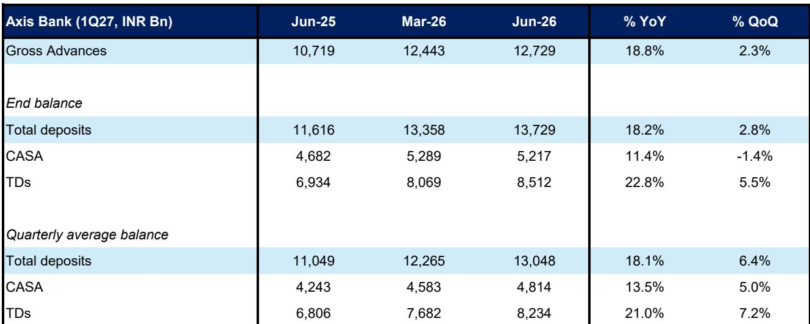
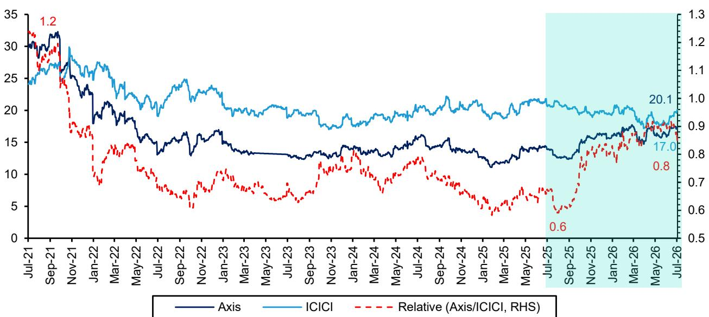

# Bernstein：印度银行业观察，下一季度验证增长趋势

过去12个月，印度银行业出现了一个值得关注的差异：曾经被视为“质量标杆”的ICICI银行，在报价表现上被长期处于追赶位置的Axis银行反超。Bernstein最新研究系统拆解了这一现象背后的驱动逻辑，并提出一个核心问题：ICICI能否复制Axis的增长路径？

这不是一个关于谁更优秀的问题，而是一个关于市场如何为不同战略选择定价的问题。在流动性环境趋于宽松、系统性不确定性下降的背景下，市场正在重新校准“增长”与“质量”之间的权重。

## 1. 增长正在取代质量成为短期定价核心变量

Axis银行在过去3-4个季度实现了明显的估值重估，相对ICICI的估值已升至五年高位。驱动这一轮变化的不是资产质量的改善，也不是盈利能力的跃升——事实上，Axis与ICICI之间的资产回报率（RoA）差距在过去12个月反而扩大了40个基点。

关键变量是增长。Axis银行1Q27贷款同比增长约19%，不仅显著高于系统增速，也领先HDFC和Kotak等同行。在净息差收窄的行业背景下，Axis选择了以牺牲部分利差换取规模扩张。市场对这一策略给予了正向反馈。

> **KC评论：** 这份报告的核心洞察在于，它揭示了“质量溢价”并非永远有效。当宏观环境稳定、流动性充裕时，市场更愿意奖励那些敢于扩张的银行，即使它们的资产负债表质量不是最顶尖的。

## 2. ICICI的“质量护城河”为何没能转化为溢价

报告列出了ICICI在多个维度上的领先优势：更高的CASA比率、更强的流动性覆盖率（LCR）、更厚的拨备缓冲、更高的资产回报率起点。这些指标在不确定性厌恶周期中是定价的核心依据，但在当前环境下，它们似乎成了“增长不够快”的注脚。

ICICI的增速节奏变化并非因为资产负债表受限。其LCR和贷存比（LDR）均优于同行，核心存款增长也更强。Bernstein指出，更可能的原因是ICICI对RoA/RoE维持了更高的内部门槛——它不愿意为了增长而牺牲利润率。

这意味着ICICI面临的不是一个短期经营问题，而是一个战略选择问题。它选择了“质量优先”，但市场暂时没有为这种选择支付溢价。

## 3. 资本结构差异是理解估值分化的关键变量

一个容易被忽略的结构性因素：ICICI的资本充足率远高于Axis。Bernstein数据显示，ICICI的CET1比率处于行业高位，而Axis的资本水平虽然低于ICICI，但依然高于监管要求且处于自身历史均值附近。

高资本充足率通常被视为安全垫，但它也带来了一个隐性成本——更高的资本基数需要更高的RoA才能维持同样的RoE水平。Axis以更低的资本水平运作，反而能够用较低的RoA实现与ICICI相近的RoE。

> **KC评论：** 这一点对理解印度银行股的估值框架至关重要。市场对“过度资本化”的观察正在从隐性变为显性。持有过多资本的银行如果不能将其转化为增长，就会面临估值折价。报告中的Exhibit 14和15直观展示了这一逻辑。

## 4. 下一季度将是验证趋势的关键窗口

报告给出了一个尚未完全回答的问题：ICICI能否在未来几个季度实现增长加速？

一个潜在信号来自零售贷款（非按揭）领域。4Q26的数据首次显示出ICICI在该板块可能出现变化，但增速仍远低于Axis。如果ICICI能够在零售端重新发力，同时不显著影响资产质量，则其估值修复可能启动。

但Bernstein也提醒，如果ICICI的“慢增长”是源于其对RoA/RoE的更高内部标准，那么这种趋势可能具有结构性特征，短期内难以逆转。

对于关注印度市场的读者，这份报告提供了一个清晰的观察框架：在接下来的季度业绩发布中，重点不是看谁的不良率更低，而是看谁能在不显著影响资产质量的前提下，实现更快的贷款和存款增长。增长与质量的再平衡，将是这一轮银行股分化的主线。

For informational purposes only. Portions may be generated,translated,summarized,or edited with AI assistance based on source materials and may contain omissions or errors. Please verify independently. This is not investment,legal,tax,accounting,or other professional advice.

