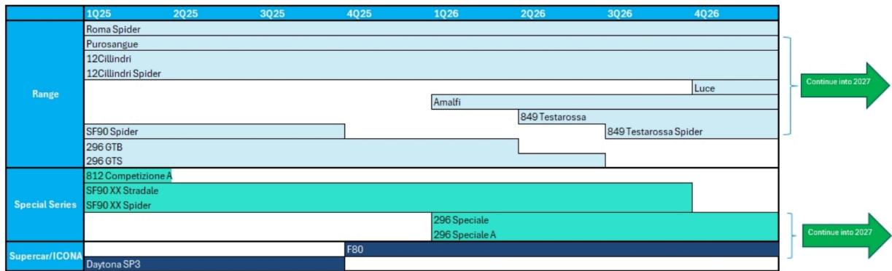
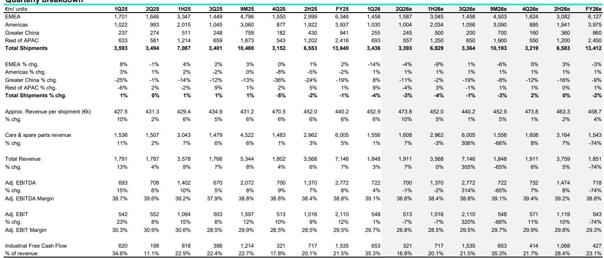
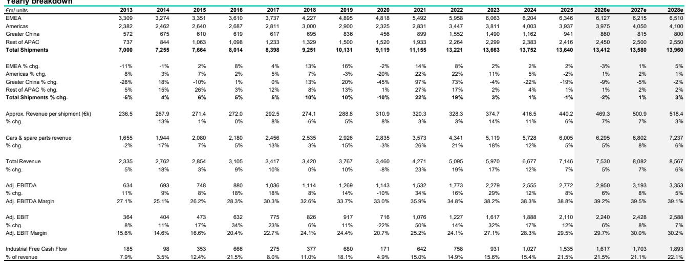

# Bernstein：不是卖车而是卖资格，法拉利手动挡V12的稀缺逻辑

当大多数豪华车品牌还在为电动化转型的利润率发愁时，法拉利用一种看似“倒退”的方式证明了自己定价权的天花板。Bernstein在最新研报中详细拆解了12Cilindri Manuale这款手动挡车型的商业逻辑：这不是一款车，而是一套关于稀缺性、客户忠诚度和边际利润率的完美不确定性测试。

这款定价59万欧元起、共1499台的手动挡V12，在正式发布前就已全部被客户认领。Bernstein测算，相比标准版8速自动挡车型，手动版20万欧元的溢价中，研发和制造成本增量不到5万欧元。这意味着每台车约15万欧元几乎是纯利润贡献。

但真正值得关注的不是这组数字本身，而是它们叠加起来揭示的商业模式：当一家公司能让客户为“驾驶体验的倒退”（手动挡在性能上确实不如双离合自动挡）支付高昂溢价时，它已经不是在卖交通工具，而是在卖准入资格。

## 1. 手动挡回归背后的客户心理学比工程技术更值得研究

法拉利自2012年后就没有量产过手动挡公路车。这次回归并非技术驱动，而是客户需求倒逼。Bernstein的报告披露了一个关键细节：法拉利首席商务官加列拉明确表示，客户愿意为手动挡“牺牲性能”。这在汽车行业几乎是反常识的——通常消费者追求更快、更智能。

但法拉利的高质量客户群体不同。他们拥有多台超跑，追求的是驾驶仪式感和收藏价值。Bernstein用了一个极具说服力的数据：市场上搭载原厂手动挡的法拉利599 GTB，价格是自动挡版本的4到6倍，而后期改装的版本远达不到这个溢价。

这解释了为什么法拉利选择将12Cilindri Manuale纳入Tailor Made定制计划。最终交付价可能在80万欧元以上。客户买的不是传动系统，而是“被选中”的资格。

> **KC评论：** 报告中最值得反复看的是二手手动挡法拉利的溢价数据。它证明了这个细分市场的定价逻辑不依赖成本加成，而是依赖收藏市场的流动性溢价。完整报告里的599 GTB价格对比图，是理解法拉利品牌护城河的最佳入口。

## 2. 这款车型对法拉利利润率的贡献被低估了

Bernstein的测算相对保守：按三年交付期、每年500台计算，12Cilindri Manuale每年可为集团贡献约7500万欧元的增量利润，对应约40个基点的EBIT利润率提升。

但如果加上潜在的手动敞篷版（Spider），按750台计算，这个数字可能弹性较高。Bernstein判断，法拉利“没有计划”的说法只是惯用话术，敞篷版大概率会跟进。

更重要的是，这款车型的利润率提升是纯增量。它不占用现有产能，不影响主流量产车型的排产，研发成本已经被1499台的规模消化。这相当于法拉利在不增加固定成本的情况下，给自己加了一个利润率放大器。

## 3. 报告尚未完全回答的关键问题：手动挡能否成为常态

Bernstein的研报聚焦于12Cilindri Manuale这一单一车型，但一个更大的问题悬而未决：法拉利是否会将“手动挡情怀”系统化地植入更多车型？

从技术角度看，Manuale By-Wire系统是模块化的，理论上可以适配其他V8或V12平台。但从商业角度看，过度供应会稀释稀缺性溢价。Bernstein没有给出明确判断，但隐含的逻辑是：法拉利更可能将手动挡作为限量版专属，而非下放至走量车型。

另一个未解问题是，这款手动挡对法拉利电动化战略的影响。5月发布的纯电车型Luce引发了争议，而手动挡V12的推出恰好转移了舆论焦点。这是巧合还是精心设计的节奏？报告没有深挖，但值得观察。

## 4. 对行业观察者的框架：关注三个变量

如果你不是法拉利读者，这份报告仍然提供了一个分析高端消费品牌的框架。三个变量值得持续跟踪：

第一，客户等待名单的长度和结构。12Cilindri Manuale在发布前就已售罄，说明法拉利的客户池依然深度饥渴。如果未来车型出现分配困难或二手折价，才是真正需要警惕的信号。

第二，Tailor Made定制业务的渗透率。Bernstein指出，所有手动挡车型都将通过定制渠道交付。这不仅是利润来源，更是客户锁定机制。定制化程度越高，客户转换成本越大。

第三，电动化与内燃机车型的定价关系。Luce纯电车型的定价策略尚未完全明确，但如果电动车型的溢价能力低于手动挡V12，将对法拉利的长期利润率叙事构成挑战。

For informational purposes only. Portions may be generated,translated,summarized,or edited with AI assistance based on source materials and may contain omissions or errors. Please verify independently. This is not investment,legal,tax,accounting,or other professional advice.

For informational purposes only. Portions may be generated,translated,summarized,or edited with AI assistance based on source materials and may contain omissions or errors. Please verify independently. This is not investment,legal,tax,accounting,or other professional advice.

