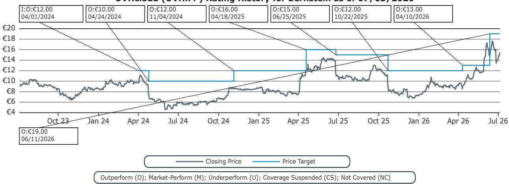

# Bernstein：OVHcloud的护城河不是AI技术，而是过剩硬件库存

AI算力紧缺的当下，几乎所有云厂商都在为GPU和服务器组件支付溢价。但Bernstein近期与OVHcloud创始人兼CEO Octave Klaba的交流揭示了一个反直觉的事实：这家法国云公司最大的竞争优势，不是技术领先或规模效应，而是此前被市场视为“资本效率低下”的过剩设备库存。

这份报告的核心判断是：当竞争对手在高价市场抢购组件时，OVHcloud因为提前囤货，手握成本远低于当前市价的服务器和GPU。在通胀环境中，这既是成本优势，也是战略选择权。

## 1. 过剩资本支出意外成为定价武器

OVHcloud在FY24和FY25的资本支出增速持续快于收入增长。市场此前更多将其解读为扩张节奏失控，但Bernstein指出，这恰好形成了公司当前的“超额库存”。

在一个组件价格已大幅上涨的市场里，能以历史成本获取部署能力，意味着OVHcloud可以在不牺牲利润的前提下，向客户提供比竞争对手更有竞争力的报价。这本质上是把过去“低效”的资本配置，转化成了当下的定价权和客户获取速度。

> **KC评论：** 这里的关键不是OVHcloud库存有多少，而是它能否在竞争对手补货完成前，利用这个窗口期锁定更多长期客户。报告的图表和财务数据值得细看，尤其是FY24-FY25的capex与收入增速差。

## 2. 真正的瓶颈不是GPU，是现成的部署空间

市场讨论AI基础设施时，焦点往往落在GPU供应紧张上。但Bernstein的报告提醒了一个更细微的约束：对于需要500-800颗GPU的规模化AI部署项目，目前市场上几乎找不到现成的安装容量。

数据中心空间和电力配套的交付周期远长于芯片采购。而OVHcloud恰好拥有现成的数据中心空间和电力配额，且计划在9月收到此前订购的GPU。这意味着它能在其他竞争对手还在等机房交付时，直接为客户提供部署服务。

## 3. 回归核心客群是CEO最务实的调整

Octave Klaba在重新担任CEO后，明确将战略重心拉回两个历史优势领域：“数字扩张者”和“数字起步者”，这两类客户合计贡献营收的81%。过去几年公司在这两个领域出现了关注度下降和效率问题。

同时，公司仍会继续拓展大型企业和公共机构，但CEO坦承后者的决策周期更慢。报告判断，回归基本盘可能是Klaba复出后最正确的决策。这不是放弃增长，而是把资源集中在回报最确定的地方。

> **KC评论：** 报告没有完全回答的问题是，回归中小客户能否带来足够的增量收入来支撑估值。读者可以在原文的财务预测表中找到Bernstein对FY26和FY27的收入与FCF假设。

## 4. 报告尚未完全回答的关键问题

Bernstein的研报虽然给出了积极判断，但几个变量仍悬而未决。

第一，OVHcloud的“超额库存”具体规模是多少？报告承认“难以量化”。这意味着市场无法精确评估这个优势的持续时间和弹性。

第二，正自由现金流的目标能否在FY27实现？CEO强调要回归“审慎支出”，但FY26的FCF预测仍为负值（-410万欧元）。路径清晰，但执行节奏仍待验证。

第三，AI需求的可持续性。当前OVHcloud的AI部署机会更多来自供给侧稀缺，而非需求侧粘性。当竞争对手的部署能力跟上后，公司的定价优势能否维持？

这些不确定性并不否定报告的核心判断，但提醒读者：OVHcloud的窗口期可能只有几个季度，而非几年。

## 5. 对决策者的观察框架

对于关注欧洲基础设施市场的决策者，这份报告提供了一个思考框架：在算力通胀周期中，真正的护城河可能不是技术或品牌，而是“错配”——供需时间差、成本差、部署能力差。

OVHcloud的故事能否持续，取决于它能否在窗口期内把库存优势转化为客户粘性，并在竞争对手补平缺口之前，完成从成本套利到服务价值的跃迁。

For informational purposes only. Portions may be generated,translated,summarized,or edited with AI assistance based on source materials and may contain omissions or errors. Please verify independently. This is not investment,legal,tax,accounting,or other professional advice.

For informational purposes only. Portions may be generated,translated,summarized,or edited with AI assistance based on source materials and may contain omissions or errors. Please verify independently. This is not investment,legal,tax,accounting,or other professional advice.

