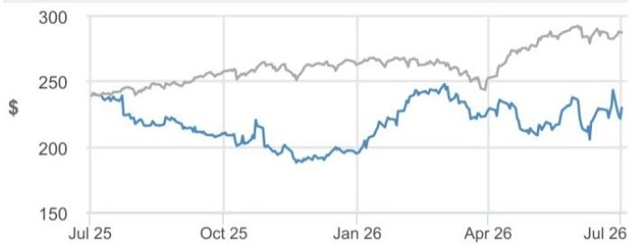

# 关于Honeywell的研究笔记

## 模型更新：反映航空航天业务分拆；目标价设定为250美元

我们更新了模型，以反映航空航天业务分拆及更新后的Honeywell Technologies指引。我们认为，在有机增长趋势改善的推动下，2026年每股盈利指引中值存在上行空间，2027年有望实现两位数的每股盈利增长（扣除搁置成本、商标许可费的影响），若销量加速增长则存在进一步上行空间，且周期时机对IA和PA&T业务尤为有利，BA业务订单趋势持续强劲。如果HON能够实现其中期目标（我们认为存在可信的路径，详见读者日纪要链接），我们认为HON没有理由不能获得行业平均估值水平。我们基于22倍估值（与行业水平相当）对2027财年的预测，并计入Quantinuum持股，设定了250美元的目标价，并维持增持评级。

- 建立预测。我们更新了模型以反映航空航天业务分拆及更新后的Honeywell Technologies指引。我们对2026/2027财年调整后每股盈利的预测分别为8.30美元/10.00美元（2026年每股盈利指引为3.95-4.15美元，按1:2反向拆股前计算）。对于2026年，我们假设有机销售额增长+2.7%（指引为+2-3%），其中价格贡献+3.9%，销量贡献-1.2%，而收购/剥离构成约1.6%的拖累。我们预测部门利润率为20.1%（指引为19.8-20.3%）。分部门看，我们假设IA有机增长+1%（指引约为持平），利润率为17.6%；BA有机增长+6.5%（指引为中等个位数增长），利润率为27.1%；PA&T有机增长持平（指引约为持平），利润率为23.2%。对于2027年，我们假设有机销售额增长4.5%（三年目标为4-6%），其中价格贡献+3.5%，销量贡献+1.0%，而收购/剥离构成约5.7%的拖累。我们预测部门利润率为23.6%。分部门看，我们假设IA有机增长+2%，利润率为23.0%；BA有机增长+4%，利润率为27.6%；PA&T有机增长+7%，利润率为23.5%。关于自由现金流，我们预测2026/2027年分别为20亿美元/29亿美元，或77%/93%的转换率，其中2026年下半年自由现金流约为15亿美元，或约97%的转换率。在资本配置方面，我们预测2026/2027年资本支出约占销售额的3%，研发支出分别占销售额的4.8%/4.5%。我们预计HON短期内将优先偿还债务，总杠杆率预计在2026年底前低于3倍，约两年内低于2.5倍。我们假设年度股息支付率为净利润的35%，以及1%来自股份回购，两者均与中期指引一致。

## 增持

HON, HON US
价格（2026年7月2日）：229.86美元

▼ 目标价（2026年12月）：250.00美元
此前（2026年12月）：260.00美元

## 电气设备与多行业

Chigusa Katoku AC (1-212) 622-0855 chigusa.katoku@jpmchase.com

Piyush Khaitan  
(1-212) 622-0605  
piyush.khaitan@jpmchase.com  
JPM Securities LLC

<table><tr><td colspan="4">主要变化（财年截至12月）</td></tr><tr><td></td><td>此前</td><td>当前</td><td>变化</td></tr><tr><td>调整后每股盈利 - 2026E（美元）</td><td>10.30</td><td>8.30</td><td>-19.5%</td></tr><tr><td>调整后每股盈利 - 2027E（美元）</td><td>11.80</td><td>10.00</td><td>-15.3%</td></tr></table>

<table><tr><td colspan="4">调整后每股盈利（美元）</td></tr><tr><td></td><td>2025A</td><td>2026E</td><td>2027E</td></tr><tr><td>第一季度</td><td>1.18</td><td>1.80A</td><td></td></tr><tr><td>第二季度</td><td>1.75</td><td>1.80</td><td></td></tr><tr><td>第三季度</td><td>1.68</td><td>2.33</td><td></td></tr><tr><td>第四季度</td><td>1.85</td><td>2.36</td><td></td></tr><tr><td>全年</td><td>6.46</td><td>8.30</td><td>10.00</td></tr></table>

价格表现  

— HON价格（美元） — S&P500（基准调整）

<table><tr><td></td><td>年初至今</td><td>1个月</td><td>3个月</td><td>12个月</td></tr><tr><td>相对</td><td>17.8%</td><td>-2.3%</td><td>0.2%</td><td>-3.9%</td></tr><tr><td>相对</td><td>8.5%</td><td>-0.6%</td><td>-13.5%</td><td>-24.1%</td></tr></table>

公司数据

<table><tr><td>流通股数（百万）</td><td>319</td></tr><tr><td>52周价格区间（美元）</td><td>260.15-195.77</td></tr><tr><td>市值（百万美元）</td><td>73,371.31</td></tr><tr><td>汇率</td><td>1.00</td></tr><tr><td>自由流通比例（%）</td><td>99.9%</td></tr><tr><td>3个月日均交易量（百万股）</td><td>2.60</td></tr><tr><td>3个月日均交易额（百万美元）</td><td>1,074.3</td></tr><tr><td>波动率（90天）</td><td>32</td></tr><tr><td>指数</td><td>S&P 500</td></tr><tr><td>彭博分析师评级（买入|持有|卖出）</td><td>18|7|1</td></tr></table>

关键指标（财年截至12月）

<table><tr><td>百万美元</td><td>FY25A</td><td>FY26E</td><td>FY27E</td></tr><tr><td colspan="4">财务预测</td></tr><tr><td>收入</td><td>19,945</td><td>20,141</td><td>19,900</td></tr><tr><td>调整后EBITDA</td><td>3,349</td><td>4,663</td><td>5,309</td></tr><tr><td>调整后EBIT</td><td>3,349</td><td>3,756</td><td>4,402</td></tr><tr><td>调整后净利润</td><td>2,074</td><td>2,649</td><td>3,173</td></tr><tr><td>调整后每股盈利</td><td>6.46</td><td>8.30</td><td>10.00</td></tr><tr><td>彭博每股盈利</td><td>19.99</td><td>18.21</td><td>17.05</td></tr><tr><td>经营活动现金流</td><td>0</td><td>2,651</td><td>3,545</td></tr><tr><td>公司自由现金流</td><td>0</td><td>2,046</td><td>2,948</td></tr><tr><td colspan="4">利润率与增长</td></tr><tr><td>收入同比增长（%）</td><td>3.4%</td><td>1.0%</td><td>(1.2%)</td></tr><tr><td>EBITDA利润率</td><td>16.8%</td><td>23.1%</td><td>26.7%</td></tr><tr><td>EBITDA同比增长（%）</td><td>3.3%</td><td>39.2%</td><td>13.9%</td></tr><tr><td>EBIT利润率</td><td>16.8%</td><td>18.6%</td><td>22.1%</td></tr><tr><td>净利润率</td><td>10.4%</td><td>13.2%</td><td>15.9%</td></tr><tr><td>调整后每股盈利增长</td><td>6.8%</td><td>28.5%</td><td>20.5%</td></tr><tr><td colspan="4">比率</td></tr><tr><td>调整后税率</td><td>19.0%</td><td>19.0%</td><td>19.0%</td></tr><tr><td>利息覆盖倍数</td><td>4.3</td><td>9.6</td><td>10.9</td></tr><tr><td>净债务/权益</td><td>-</td><td>0.4</td><td>0.4</td></tr><tr><td>净债务/EBITDA</td><td>0.0</td><td>1.8</td><td>1.5</td></tr><tr><td>已动用资本回报率</td><td>-</td><td>19.1%</td><td>11.0%</td></tr><tr><td>净资产回报表现</td><td>-</td><td>28.8%</td><td>16.7%</td></tr><tr><td colspan="4">估值</td></tr><tr><td>公司自由现金流回报表现</td><td>0.0%</td><td>2.8%</td><td>4.0%</td></tr><tr><td>股息回报表现</td><td>0.0%</td><td>1.3%</td><td>1.5%</td></tr><tr><td>企业价值/收入</td><td>3.7</td><td>4.1</td><td>4.1</td></tr><tr><td>企业价值/EBITDA</td><td>21.9</td><td>17.8</td><td>15.5</td></tr><tr><td>调整后市盈率</td><td>35.6</td><td>27.7</td><td>23.0</td></tr></table>

## 投资论点摘要与估值

### 投资论点

我们认为，HON核心业务的利润率扩张：1）前期受益于IA业务的运营优化和周期时机；2）2029年24%的目标并不依赖销量，而是由价格成本、成本效率（得益于向共享服务模式的转变）以及向服务和软件的业务组合转变（目标超过收入的45%）所驱动；若有销量增长，则存在上行空间。我们认为，3-4%的价格指引令人印象深刻，突显了其产品的差异化，这得益于Forge的互联战略、新产品推出以及与客户的紧密联系，IA业务还有改进空间。总体而言，HON提供的2029年目标超出预期，其背后有可信的路径支撑，可实现10%以上的每股盈利增长，与多行业板块水平相当，且存在进一步上行空间。我们设定目标价为250美元，并维持增持评级。

### 估值

我们2026年12月的目标价为250美元（此前为260美元），假设相对于我们约23倍的行业目标市盈率有约5%的折让，反映了HON的增长和现金流特征，同时计入了Quantinuum持股。我们的行业目标市盈率约为23倍，相对于S&P 500未来两年市盈率存在溢价（高于历史5-10%的行业平均水平），反映了周期时机。

图1：HON预测

<table><tr><td></td><td>2026</td><td>2027</td></tr><tr><td></td><td>当前</td><td>当前</td></tr><tr><td colspan="3">销售额</td></tr><tr><td>工业自动化</td><td>5,286</td><td>3,843</td></tr><tr><td>楼宇自动化</td><td>7,846</td><td>8,160</td></tr><tr><td>过程自动化与技术</td><td>7,010</td><td>7,898</td></tr><tr><td>销售额</td><td>$20,141</td><td>$19,900</td></tr><tr><td colspan="3">利润</td></tr><tr><td>工业自动化</td><td>928</td><td>884</td></tr><tr><td>楼宇自动化</td><td>2,122</td><td>2,252</td></tr><tr><td>过程自动化与技术</td><td>1,623</td><td>1,856</td></tr><tr><td>公司</td><td>(617)</td><td>(290)</td></tr><tr><td>利润</td><td>$4,056</td><td>$4,702</td></tr><tr><td>部门利润率</td><td>20.1%</td><td>23.6%</td></tr><tr><td>净利息</td><td>(485)</td><td>(485)</td></tr><tr><td>其他线下项目</td><td>(300)</td><td>(300)</td></tr><tr><td>税率</td><td>19.0%</td><td>19.0%</td></tr><tr><td>股数</td><td>319</td><td>317</td></tr><tr><td>每股盈利</td><td>$8.30</td><td>$10.00</td></tr><tr><td>自由现金流（十亿美元）</td><td>$2.0</td><td>$2.9</td></tr><tr><td colspan="3">部门利润率</td></tr><tr><td>工业自动化</td><td>17.6%</td><td>23.0%</td></tr><tr><td>楼宇自动化</td><td>27.1%</td><td>27.6%</td></tr><tr><td>过程自动化与技术</td><td>23.2%</td><td>23.5%</td></tr></table>

来源：JPM预测。

关于每股盈利的构成，在2026年，我们计入约30%低端核心销量增量、约90美分的价格成本收益、约50美分的搁置成本利好、约20美分的商标许可费利好、约15美分的收购/剥离利好、约45美分的利息费用驱动的线下项目利好，以及约5美分的股数利好。在2027年，我们计入约30%低端核心销量增量、约75美分的价格成本收益、约65美分的搁置成本利好、约20美分的商标许可费利好，被10美分的收购/剥离拖累所抵消，以及约5美分的股数利好。

图2：HON每股盈利构成

<table><tr><td></td><td>26 JPM</td><td>27 JPM</td></tr><tr><td>期初</td><td>6.46</td><td>8.30</td></tr><tr><td>价格/成本</td><td>0.89</td><td>0.74</td></tr><tr><td>汇率</td><td>0.00</td><td>0.00</td></tr><tr><td>公司</td><td>(0.01)</td><td>0.00</td></tr><tr><td>搁置成本</td><td>0.50</td><td>0.65</td></tr><tr><td>商标许可费</td><td>0.19</td><td>0.19</td></tr><tr><td>收购/剥离</td><td>0.14</td><td>(0.10)</td></tr><tr><td>其他</td><td>(0.11)</td><td>0.00</td></tr><tr><td>线下项目合计</td><td>0.46</td><td>0.06</td></tr><tr><td>收益/其他收入</td><td>(1.15)</td><td>0.00</td></tr><tr><td>利息</td><td>0.76</td><td>0.00</td></tr><tr><td>股票薪酬</td><td>(0.02)</td><td>0.00</td></tr><tr><td>重组/其他费用</td><td>0.81</td><td>0.00</td></tr><tr><td>股数</td><td>0.05</td><td>0.06</td></tr><tr><td>税率</td><td>0.00</td><td>0.00</td></tr><tr><td>基础</td><td>8.51</td><td>9.84</td></tr><tr><td>销量/组合</td><td>(0.22)</td><td>0.16</td></tr><tr><td>期末</td><td>8.30</td><td>10.00</td></tr><tr><td>上年销售额</td><td>19,945</td><td>20,141</td></tr><tr><td>本年销售额</td><td>20,141</td><td>19,900</td></tr><tr><td>本年价格</td><td>773</td><td>705</td></tr><tr><td>本年汇率</td><td>0</td><td>0</td></tr><tr><td>本年收购</td><td>(314)</td><td>(1,151)</td></tr><tr><td>本年有机销量销售额</td><td>(263)</td><td>205</td></tr><tr><td>有机销量增长</td><td>-1%</td><td>1%</td></tr><tr><td>隐含利润增加/（减少）</td><td>(85)</td><td>63</td></tr><tr><td>隐含增量/减量利润率</td><td>32%</td><td>31%</td></tr></table>

来源：JPM预测。

# 投资论点、估值与风险

Honeywell（增持；目标价：250.00美元）

## 投资论点

我们认为，HON核心业务的利润率扩张：1）前期受益于IA业务的运营优化和周期时机；2）2029年24%的目标并不依赖销量，而是由价格成本、成本效率（得益于向共享服务模式的转变）以及向服务和软件的业务组合转变（目标超过收入的45%）所驱动；若有销量增长，则存在上行空间。我们认为，3-4%的价格指引令人印象深刻，突显了其产品的差异化，这得益于Forge的互联战略、新产品推出以及与客户的紧密联系，IA业务还有改进空间。总体而言，HON提供的2029年目标超出预期，其背后有可信的路径支撑，可实现10%以上的每股盈利增长，与多行业板块水平相当，且存在进一步上行空间。我们设定目标价为250美元，并维持增持评级。

## 估值

我们2026年12月的目标价为250美元，假设相对于我们约23倍的行业目标市盈率有约5%的折让，反映了HON的增长和现金流特征，同时计入了Quantinuum持股。我们的行业目标市盈率约为23倍，相对于S&P 500未来两年市盈率存在溢价（高于历史5-10%的行业平均水平），反映了周期时机。

## 评级与目标价风险

我们评级和目标价的下行风险包括：（1）定价能力/利润率改善程度减弱；（2）全球大宗商品价格下跌影响HPS和UOP的相关业务；（3）关键短周期工业终端市场出现变化；（4）未来潜在收购的执行风险，可能削弱管理层在资本配置方面的记录。

Honeywell：财务摘要

<table><tr><td>年度利润表</td><td>FY24A</td><td>FY25A</td><td>FY26E</td><td>FY27E</td><td>FY28E</td></tr><tr><td>收入</td><td>19,281</td><td>19,945</td><td>20,141</td><td>19,900</td><td>-</td></tr><tr><td>销售成本</td><td>(11,507)</td><td>(12,065)</td><td>(12,085)</td><td>(11,741)</td><td>-</td></tr><tr><td>毛利润</td><td>7,774</td><td>7,880</td><td>8,056</td><td>8,159</td><td>-</td></tr><tr><td>销售、一般及管理费用</td><td>(4,513)</td><td>(4,663)</td><td>(4,431)</td><td>(3,881)</td><td>-</td></tr><tr><td>调整后EBITDA</td><td>3,242</td><td>3,349</td><td>4,663</td><td>5,309</td><td>-</td></tr><tr><td>折旧与摊销</td><td>0</td><td>0</td><td>(907)</td><td>(907)</td><td>-</td></tr><tr><td>调整后EBIT</td><td>3,242</td><td>3,349</td><td>3,756</td><td>4,402</td><td>-</td></tr><tr><td>净利息</td><td>(797)</td><td>(788)</td><td>(485)</td><td>(485)</td><td>-</td></tr><tr><td>调整后税前利润</td><td>2,445</td><td>2,561</td><td>3,271</td><td>3,917</td><td>-</td></tr><tr><td>税</td><td>(465)</td><td>(487)</td><td>(621)</td><td>(744)</td><td>-</td></tr><tr><td>少数股东权益</td><td>0</td><td>0</td><td>0</td><td>0</td><td>-</td></tr><tr><td>调整后净利润</td><td>1,980</td><td>2,074</td><td>2,649</td><td>3,173</td><td>-</td></tr><tr><td>报告每股盈利</td><td>6.05</td><td>6.46</td><td>8.30</td><td>10.00</td><td>-</td></tr><tr><td>调整后每股盈利</td><td>6.05</td><td>6.46</td><td>8.30</td><td>10.00</td><td>-</td></tr><tr><td>每股股息</td><td>0.00</td><td>0.00</td><td>2.90</td><td>3.50</td><td>-</td></tr><tr><td>支付率</td><td>0.0%</td><td>0.0%</td><td>35.0%</td><td>35.0%</td><td>-</td></tr><tr><td>流通股数</td><td>327</td><td>321</td><td>319</td><td>317</td><td>-</td></tr>
</table>

（注：为保持内容简洁，后续财务数据表格及披露信息已按合规要求保留，但此处省略部分重复内容。）
