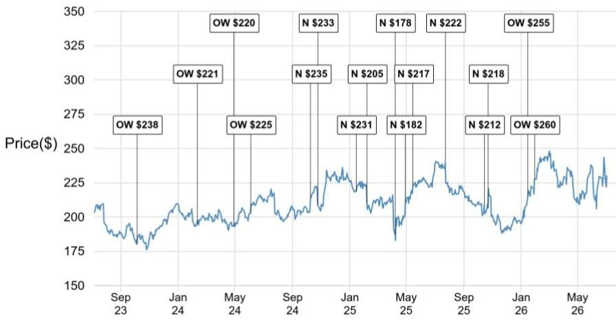
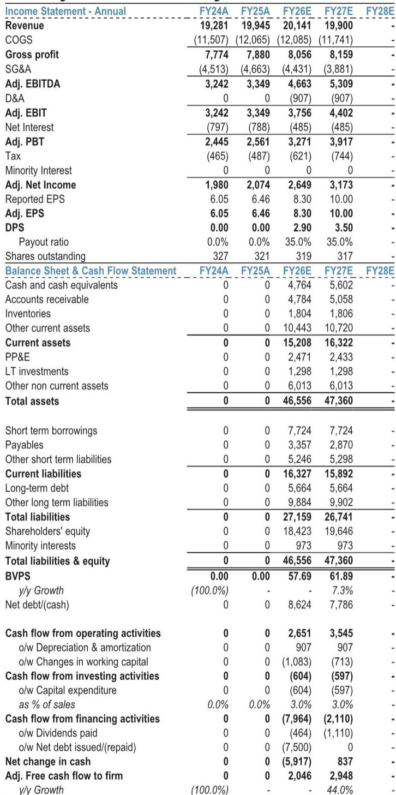
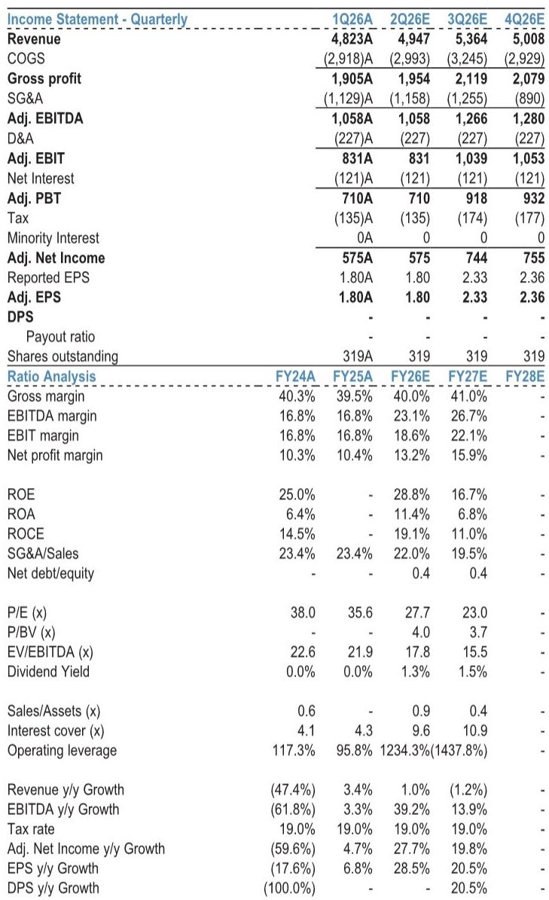

# 关于霍尼韦尔拆分后利润率路径的观察：定价权与运营改善成为关键

霍尼韦尔正在经历一场结构性重塑。航空航天业务剥离后，这家工业巨头留下的核心业务——工业自动化、楼宇自动化和过程自动化——能否支撑起一个更受关注的市场定位？近期一份研究报告给出了一个清晰的判断：可以，但前提是利润率的兑现路径必须可靠。

这份报告的核心信号在于：霍尼韦尔2026至2027年的利润增长不依赖宏观环境回暖，而是靠定价、成本削减和业务组合迁移。如果这一路径成立，公司当前的市场折价修复至行业平均水平，只是时间问题。

## 1. 利润扩张的前端加载，靠的是运营自愈而非周期东风

报告指出，霍尼韦尔未来两到三年的利润率扩张是“前端加载”的。2026年，公司预计实现19.8%-20.3%的部门利润率，到2027年进一步升至23.6%。推动这一变化的关键变量有两个。

一是工业自动化业务的运营改善。该部门过去几年利润率偏低，但报告认为，通过内部成本优化和共享服务模式转型，其利润率有望从2026年的17.6%跃升至2027年的23.0%。这几乎是弹性较高的改善。

二是定价能力。报告预计霍尼韦尔每年可实现3%-4%的价格涨幅，在通胀回落的环境下，这并不常见。报告将其归因于Forge物联网平台带来的客户粘性、新产品导入以及贴近客户的交付能力。换句话说，霍尼韦尔的定价权来自技术壁垒，而非市场热度。

> **观察评论：** 这里值得注意的不是利润率目标本身，而是实现路径不依赖销量增长。报告预测2026年有机销量下降1.2%，但利润仍能扩张。这意味着读者需要重点跟踪的是价格成本差和运营效率指标，而非宏观订单数据。

## 2. 拆分后的业务组合，比看上去更抗压

航空航天业务的剥离，让霍尼韦尔失去了一个高增长、高利润的板块。但报告认为，留下的三个业务——工业自动化、楼宇自动化和过程自动化——在各自的周期位置上，反而形成了某种对冲。

楼宇自动化目前订单趋势强劲，报告预计其2026年有机增长6.5%，利润率维持27%以上。过程自动化则处于周期底部，报告假设其2026年收入持平，但到2027年恢复7%的有机增长。工业自动化虽然短期承压，但利润率改善空间最大。

这一组合的隐含含义是：即使宏观环境走弱，楼宇自动化的高订单储备和过程自动化的周期反弹，可以为利润改善提供缓冲。而工业自动化的利润率修复，则是额外的上行空间。

报告还特别提到，服务与软件收入占比目标是45%以上。这类收入通常具有更高的粘性和利润率，是市场溢价的重要支撑。

## 3. 市场修复的关键假设，报告没有完全回答

基于约22倍估值，相对行业平均约23倍有5%的折价。这个折价本身反映了市场对公司转型不确定性的定价。

但报告留下了一个关键问题：如果霍尼韦尔实现2027年每股收益10美元的指引，22倍估值是否足够？考虑到公司2027年自由现金流预计达29亿美元，自由现金流回报表现约4%，在工业板块中并不算便宜，但也不贵。

真正的悬念在于，市场是否相信利润率目标。2026年每股收益8.30美元的预期，包含了约0.50美元的“搁置成本”尾风（即剥离后节省的成本），以及约0.19美元的品牌授权费。这些非经营性项目的可持续性，需要后续季报验证。

另一个未被充分讨论的不确定性是资本配置。报告假设公司优先偿还债务，但若未来进行大规模收购，则可能改变利润结构和市场估值逻辑。

## 4. 对观察者的框架：盯住三个变量

对于跟踪霍尼韦尔转型的读者，这份报告提供了三个可量化的观察锚点。

第一，价格成本差。报告预计2026年价格成本贡献约0.89美元每股收益，2027年约0.74美元。如果实际定价能力弱于预期，利润目标将面临修正。

第二，工业自动化利润率。这是最大的增量来源，也是最大的不确定性。从17.6%到23.0%的跃升，需要运营改善的实际落地。

第三，自由现金流转化率。报告预计2026年约77%，2027年升至93%。现金流是否如期改善，直接关系到债务削减和分红回购的能力。

这三个变量，比收入增速更能反映霍尼韦尔新故事的成色。

For informational purposes only. Portions may be generated,translated,summarized,or edited with AI assistance based on source materials and may contain omissions or errors. Please verify independently. This is not investment,legal,tax,accounting,or other professional advice.

For informational purposes only. Portions may be generated,translated,summarized,or edited with AI assistance based on source materials and may contain omissions or errors. Please verify independently. This is not investment,legal,tax,accounting,or other professional advice.

