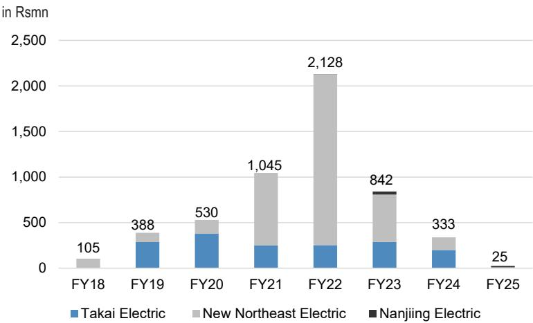
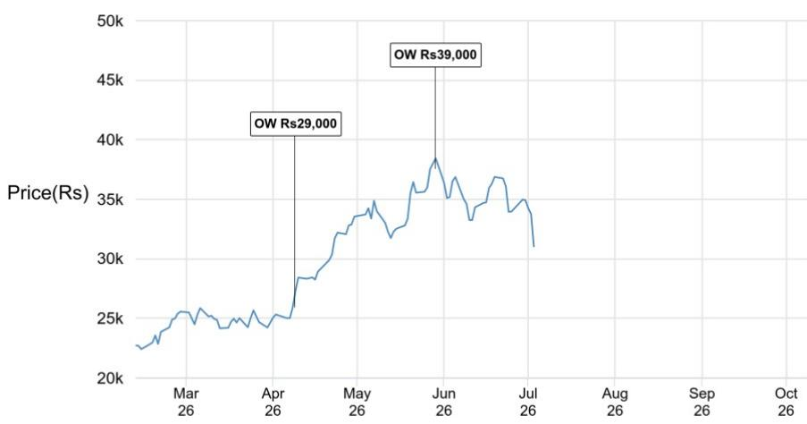
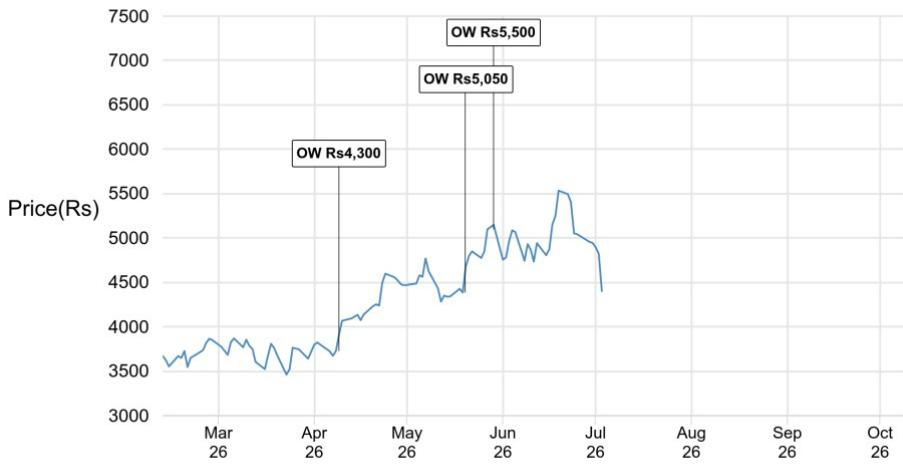
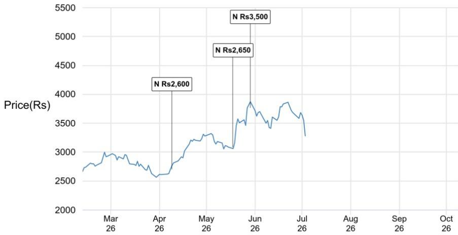

# 印度电力设备行业观察

## 关于部分中国公司参与竞争的担忧被过度解读

近期有四家中国实体（在印度有制造业务）获准参与政府项目合同（为期两年），受此消息影响，我们覆盖的电力设备公司报价出现约8%的调整。对此我们注意到：

- 市场反应过度：（1）除TBEA（产能主要用于出口）外，其他三家实体（泰开、新东北、南京）合计固定资产约24亿卢比/2500万美元，峰值收入约21亿卢比/2200万美元（在限制措施实施前的FY22财年；FY25财年收入可忽略不计），因此即使在满产情况下，也不太可能对现有参与者的市场份额产生实质性影响。（2）虽然市场对新订单的利润空间存在担忧，但考虑到限制仅解除两年，且这些公司也需要时间恢复运营和获取订单，在政策不确定性和累积亏损的背景下，这些实体采取激进定价策略的动力似乎有限。（3）新东北和泰开生产的是开关设备，而非变压器、STATCOM/电抗器、HVDC设备，因此不会对现有参与者的整体定价/可触及市场产生影响。在此背景下，我们覆盖的公司报价出现约8%的负面调整似乎有些过度。

- 后续关键讨论：虽然很难判断这种“选择性且有时限”的放松是否意味着允许中国公司在设备领域进行投入的政策转向，但我们注意到，全球电力设备需求周期在过去2-3年显著加速，相应地，中国电力设备公司进行产能扩张的激励、出口利润空间以及潜在国际市场也已发生变化。为了从中国和全球视角获得更多信息，我们将在7月6日印度标准时间14:45/香港时间17:15与Stephen Tsui（执行董事兼中国及韩国电力设备首席分析师）举行电话会议（注册链接）*。

- 下文展示了全球主要电力设备公司对比以及泰开电气印度公司、新东北电气印度公司和南京电气印度公司的运营收入历史。

印度工业、电力公用事业和基础设施板块

Rishabh Gupta AC
(91-22) 6157-3429
rishabh.x.gupta@JPM.com
JPM India Private Limited, JPM Tower, Santacruz(E), Mumbai - 400098, SEBI Registration: INH000001873, (91-22) 6157-3000.

## HITN.NS, POWERIND IN

## 超配

报价（26年7月3日）：31,040.00卢比

目标价（27年3月）：39,000.00卢比

GETD.NS, GVTD IN

## 超配

报价（26年7月3日）：4,401.50卢比

目标价（27年3月）：5,500.00卢比

ENRIN.NS, ENRIN IN

中性

报价（26年7月3日）：3,281.50卢比

目标价（27年3月）：3,500.00卢比

*如果您受MiFID II研究分拆制度约束，您可能仅在拥有适当JPM访问权限的情况下才有资格参与此次活动。请在参与/访问前确认您的资格。如不确定资格，请联系您通常的JPM联系人。

图1：泰开电气印度公司、新东北电气印度公司和南京电气印度公司的合计收入  
  
来源：MCA

图2：全球电力设备估值对比

<table><tr><td rowspan="2"></td><td rowspan="2">代码</td><td rowspan="2">JPM评级</td><td rowspan="2">报价（本币）</td><td rowspan="2">市值（百万美元）</td><td colspan="2">市盈率（倍）</td><td colspan="2">净资产回报表现（%）</td><td colspan="2">企业价值/EBITDA（倍）</td><td colspan="3">价格表现</td></tr><tr><td>2026E</td><td>2027E</td><td>2028E</td><td>2026E</td><td>2027E</td><td>2026E</td><td>2027E</td><td>1个月</td><td>年初至今</td><td>1年</td></tr><tr><td colspan="15">全球</td></tr><tr><td>日立</td><td>6501 JP</td><td>超配</td><td>4,615.0</td><td>129,728</td><td>22.9</td><td>18.9</td><td>16.4</td><td>13.4</td><td>15.5</td><td>11.5</td><td>10.2</td><td>-11%</td><td>-6%</td><td>15%</td></tr><tr><td>西门子能源</td><td>ENR GY</td><td>超配</td><td>168.1</td><td>165,587</td><td>34.1</td><td>25.9</td><td>23.9</td><td>34.4</td><td>33.9</td><td>20.0</td><td>16.2</td><td>5%</td><td>40%</td><td>82%</td></tr><tr><td>GE Vernova</td><td>GEV US</td><td>超配</td><td>1,113.1</td><td>299,115</td><td>33.4</td><td>40.8</td><td>29.2</td><td>39.8</td><td>36.1</td><td>46.2</td><td>28.6</td><td>16%</td><td>70%</td><td>115%</td></tr><tr><td>ABB</td><td>ABBN SW</td><td>中性</td><td>87.4</td><td>198,242</td><td>35.1</td><td>34.0</td><td>30.8</td><td>33.8</td><td>31.0</td><td>22.9</td><td>22.1</td><td>3%</td><td>48%</td><td>87%</td></tr><tr><td>西门子</td><td>SIE GY</td><td>超配</td><td>280.1</td><td>184,898</td><td>26.1</td><td>22.5</td><td>19.3</td><td>24.0</td><td>25.0</td><td>17.6</td><td>15.4</td><td>-1%</td><td>19%</td><td>26%</td></tr><tr><td colspan="15">印度</td></tr><tr><td>日立能源印度</td><td>POWERIND</td><td>超配</td><td>31,040.0</td><td>14,534</td><td>93.8</td><td>65.5</td><td>52.5</td><td>25.1</td><td>27.8</td><td>70.9</td><td>47.9</td><td>-15%</td><td>70%</td><td>55%</td></tr><tr><td>GEV T&amp;D</td><td>GVTD IN</td><td>超配</td><td>4,401.5</td><td>11,839</td><td>72.4</td><td>54.8</td><td>43.5</td><td>47.1</td><td>43.7</td><td>53.9</td><td>40.5</td><td>-13%</td><td>41%</td><td>87%</td></tr><tr><td>西门子能源印度</td><td>ENRIN IN</td><td>中性</td><td>3,281.5</td><td>12,276</td><td>60.9</td><td>50.5</td><td>43.6</td><td>29.0</td><td>27.1</td><td>44.2</td><td>36.2</td><td>-11%</td><td>28%</td><td>13%</td></tr><tr><td>CG Power</td><td>CGPOWER I</td><td>超配</td><td>892.6</td><td>14,768</td><td>86.2</td><td>66.9</td><td>50.8</td><td>18.3</td><td>20.0</td><td>64.3</td><td>49.0</td><td>-5%</td><td>38%</td><td>32%</td></tr><tr><td>ABB印度</td><td>ABB IN</td><td>中性</td><td>6,950.5</td><td>15,473</td><td>82.9</td><td>65.8</td><td>57.5</td><td>21.5</td><td>24.0</td><td>68.6</td><td>52.9</td><td>-3%</td><td>34%</td><td>19%</td></tr><tr><td>西门子印度</td><td>SIEM IN</td><td>低配</td><td>3,536.3</td><td>13,230</td><td>45.8</td><td>61.1</td><td>53.0</td><td>17.4</td><td>14.0</td><td>42.7</td><td>46.7</td><td>-4%</td><td>15%</td><td>7%</td></tr><tr><td colspan="15">日本</td></tr><tr><td>三菱重工</td><td>7011 JP</td><td>未覆盖</td><td>3,792.0</td><td>79,286</td><td>31.1</td><td>26.2</td><td>22.4</td><td>13.0</td><td>14.1</td><td>16.6</td><td>14.4</td><td>2%</td><td>-1%</td><td>12%</td></tr><tr><td>三菱电机</td><td>6503 JP</td><td>超配</td><td>5,944.0</td><td>77,849</td><td>23.4</td><td>21.1</td><td>18.7</td><td>11.1</td><td>11.5</td><td>14.1</td><td>13.1</td><td>0%</td><td>30%</td><td>93%</td></tr><tr><td>富士电机</td><td>6504 JP</td><td>未覆盖</td><td>13,540.0</td><td>12,529</td><td>19.0</td><td>17.4</td><td>15.5</td><td>12.7</td><td>13.0</td><td>10.1</td><td>9.4</td><td>-9%</td><td>14%</td><td>102%</td></tr><tr><td colspan="15">韩国</td></tr><tr><td>LS Electric</td><td>010120 KS</td><td>中性</td><td>233,000</td><td>22,849</td><td>69.2</td><td>51.1</td><td>41.5</td><td>22.0</td><td>24.8</td><td>40.9</td><td>30.9</td><td>1%</td><td>150%</td><td>345%</td></tr><tr><td>HD Hyundai Electric</td><td>267260 KS</td><td>超配</td><td>947,000</td><td>22,318</td><td>34.2</td><td>26.5</td><td>22.5</td><td>42.4</td><td>41.5</td><td>24.5</td><td>18.9</td><td>-3%</td><td>22%</td><td>119%</td></tr><tr><td>晓星重工</td><td>298040 KS</td><td>超配</td><td>3,354,000</td><td>20,446</td><td>39.8</td><td>28.3</td><td>22.1</td><td>29.0</td><td>30.9</td><td>27.9</td><td>20.4</td><td>-2%</td><td>87%</td><td>277%</td></tr><tr><td>Sanil Electric</td><td>062040 KS</td><td>未覆盖</td><td>224,000</td><td>4,484</td><td>32.3</td><td>25.9</td><td>21.6</td><td>31.9</td><td>31.4</td><td>25.3</td><td>20.2</td><td>6%</td><td>72%</td><td>172%</td></tr><tr><td>Iijin Electric</td><td>103590 KS</td><td>未覆盖</td><td>76,000</td><td>2,369</td><td>23.1</td><td>19.4</td><td>17.0</td><td>23.9</td><td>23.3</td><td>15.5</td><td>13.4</td><td>-8%</td><td>40%</td><td>110%</td></tr><tr><td colspan="15">中国内地</td></tr><tr><td>国电南瑞</td><td>600406 CH</td><td>超配</td><td>22.9</td><td>27,114</td><td>19.9</td><td>17.9</td><td>16.0</td><td>16.8</td><td>17.4</td><td>14.9</td><td>13.6</td><td>-4%</td><td>2%</td><td>4%</td></tr><tr><td>青岛特锐德</td><td>300001 CH</td><td>超配</td><td>33.8</td><td>5,268</td><td>23.0</td><td>19.4</td><td>16.4</td><td>16.8</td><td>17.4</td><td>15.6</td><td>13.7</td><td>-17%</td><td>32%</td><td>44%</td></tr><tr><td>许继电气</td><td>000400 CH</td><td>超配</td><td>21.2</td><td>3,180</td><td>13.5</td><td>11.8</td><td>10.6</td><td>12.8</td><td>13.4</td><td>8.1</td><td>7.2</td><td>-12%</td><td>-18%</td><td>-3%</td></tr><tr><td>威胜控股</td><td>3393 HK</td><td>超配</td><td>19.7</td><td>2,627</td><td>13.3</td><td>11.0</td><td>9.5</td><td>20.0</td><td>21.5</td><td>8.3</td><td>6.7</td><td>-15%</td><td>15%</td><td>127%</td></tr></table>

来源：JPM估计，彭博财经。截至7月3日收盘。未覆盖（NC）股票的估计基于彭博一致预期。

# 研究主题、估值与风险

日立能源印度有限公司（超配；目标价：39,000.00卢比）

## 研究主题

印度的能源转型需求（计划新增产能的80%来自太阳能和风能）可能推动每年80-90亿美元的输电资本支出，从而带动对HVDC和高压电力设备（如变压器、开关设备和STATCOM）的需求。日立能源印度是HVDC领域的领导者（在印度已投产和已授标的HVDC项目中拥有约60%的市场份额），并有望实现强劲的结构性增长，驱动因素包括：1）未来5-6年潜在的150亿美元HVDC订单管道，可能转化为每年1-2个HVDC项目（或10-20亿美元）的订单；2）产能扩张，有助于参与高压电力设备日益增长的订单需求；3）出口：利用低成本制造和能力/产能建设，越来越多地参与全球机会；4）出口/HVDC执行份额的改善推动利润空间扩大。我们估计FY26-FY29期间收入/净利润年复合增长率为39%，并以65倍FY29每股收益对POWERIND进行估值，得出39,000卢比的目标价和超配评级。

## 估值

我们以65倍FY29每股收益（更广泛资本品覆盖范围的平均倍数）对日立能源印度（POWERIND）进行估值，得出27年3月目标价39,000卢比。虽然基于近期盈利的相对估值接近历史高点，但增长的可见性（FY26-FY29E期间收入和每股收益年复合增长率超过35%，订单流入持续强劲），以及相对于更广泛资本品公司增长调整后估值的折价，使我们相信当前水平的估值是有支撑的。

## 评级与目标价风险

主要下行风险：（1）电力需求增长放缓，推迟可再生能源产能增加及相关输电资本支出：CEA的产能增加计划基于未来十年约5%的电力需求增长，任何电力需求增长的持续放缓都可能将可再生能源产能增加右移，从而延迟输电建设（影响高压电力设备需求）。（2）监管变化允许中国和韩国电力设备公司更多地参与政府项目，可能影响市场份额和利润空间。（3）供应链中断：铜、铝和钢构成材料成本的很大一部分，价格大幅波动或采购挑战可能影响执行进度和利润空间。鉴于组件全球供应链的复杂性，航运的重大中断也可能影响执行。

主要上行风险：（1）HVDC订单节奏加快，（2）数据中心和电网稳定设备等新兴需求群体的显著增长，（3）全球供需紧张推动毛利率进一步扩大，结合经营杠杆推动利润空间显著扩大。

# 研究主题、估值与风险

GE Vernova T&D印度有限公司（超配；目标价：5,500.00卢比）

## 研究主题

印度的能源转型需求（计划新增产能的80%来自太阳能和风能）可能推动每年80-90亿美元的输电资本支出，从而带动对HVDC和高压电力设备的需求。GVTD拥有涵盖高压设备的全面产品组合，我们认为其具备强劲盈利增长的有利条件，驱动因素包括：1）未来5-6年潜在的150亿美元HVDC订单管道，可能转化为印度每年1-2个HVDC项目（或10-20亿美元）的订单，而GVTD是同时拥有LCC/VSC技术的仅有的两家公司之一（与POWERIND并列）；2）能源转型带动的高压电力设备需求增长；3）出口持续强劲，有助于维持健康的利润空间。我们估计FY26-FY29期间收入/净利润年复合增长率为27-28%，并给予超配评级。

## 估值

我们以55倍FY29E每股收益（相对于POWERIND给予折价，因为POWERIND迄今在HVDC中标和产能增加计划方面更具优势）对GE Vernova T&D（GVTD）进行估值，得出27年3月目标价每股5,500卢比。虽然基于近期盈利的相对估值接近历史高点，但增长的可见性（FY26-FY29E期间收入和每股收益年复合增长率为27-28%，订单流入持续强劲），以及相对于更广泛资本品公司增长调整后估值的折价，使我们相信当前水平的估值是有支撑的。

## 评级与目标价风险

主要下行风险：（1）电力需求增长放缓，推迟可再生能源产能增加及相关输电资本支出：CEA的产能增加计划基于未来十年约5%的电力需求增长，任何电力需求增长的持续放缓都可能将可再生能源产能增加右移，从而延迟输电建设（影响高压电力设备需求）；（2）监管变化允许中国和韩国电力设备公司更多地参与政府项目，可能影响市场份额和利润空间。（3）供应链中断：铜、铝和钢构成材料成本的很大一部分，价格大幅波动或采购挑战可能影响执行进度和利润空间。鉴于组件全球供应链的复杂性，航运的重大中断也可能影响执行。

主要上行风险：（1）HVDC订单节奏加快，（2）数据中心和电网稳定设备等新兴需求群体的显著增长，（3）全球供需紧张推动毛利率进一步扩大，结合经营杠杆推动利润空间显著扩大。

## 研究主题、估值与风险

## 西门子能源印度有限公司（中性；目标价：3,500.00卢比）

## 研究主题

印度的能源转型需求正在推动对HVDC和高压电力设备的需求，ENRIN凭借其在STATCOM、大型电力变压器方面的领先地位、在增加电力变压器、电抗器和开关设备产能方面的资本支出以及出口潜力，处于有利位置以把握不断增长的需求。然而，由于（1）ENRIN仅参与VSC-HVDC投标——未来5-6年其在印度的可触及市场可能低于HVDC-LCC，以及（2）ENRIN很大一部分业务来自“发电”领域（涡轮机的供应和服务）——其增长可能落后于输电资本支出，ENRIN的盈利增长可能落后于纯输电领域的公司。我们估计FY26-FY29期间收入/净利润年复合增长率约为20%/21%，并以50倍29年3月每股收益对ENRIN进行估值，得出3,500卢比的目标价和中性评级。

## 估值

我们以50倍29年3月E每股收益（鉴于9月底报告，取FY28/FY29每股收益的平均值）对西门子能源印度（ENRIN）进行估值，得出27年3月目标价3,500卢比。我们认为ENRIN相对于同行POWERIND和GVTD应享有估值折价，原因在于其（1）HVDC可见性较低，（2）规模可观的发电业务——其增长可能落后于输电资本支出，以及（3）因此盈利增长轨迹较低。

## 评级与目标价风险

主要下行风险：（1）电力需求增长放缓，推迟可再生能源产能增加及相关输电资本支出：CEA的产能增加计划基于未来十年约5%的电力需求增长，任何电力需求增长的持续放缓都可能将可再生能源产能增加右移，从而延迟输电建设（影响高压电力设备需求）。（2）监管变化允许中国和韩国电力设备公司更多地参与政府项目，可能影响市场份额和利润空间。（3）供应链中断：铜、铝和钢构成材料成本的很大一部分，价格大幅波动或采购挑战可能影响执行进度和利润空间。鉴于组件全球供应链的复杂性，航运的重大中断也可能影响执行。

主要上行风险：（1）印度HVDC-VSC订单节奏加快；（2）数据中心和电网稳定设备等新兴需求群体的显著增长；（3）全球供需紧张推动毛利率进一步扩大，结合经营杠杆推动利润空间显著扩大。

分析师认证：本报告封面标注“AC”的研究分析师（或，当多位研究分析师主要负责本报告时，封面或文档内标注“AC”的研究分析师分别就其在本研究中覆盖的每只证券或发行人认证）：(1) 本报告中表达的所有观点准确反映了研究分析师对任何及所有标的证券或发行人的个人观点；(2) 研究分析师的薪酬中没有任何部分过去、现在或将来直接或间接地与本研究报告中研究分析师提出的具体建议或观点相关。对于封面列出的所有韩国研究分析师（如适用），他们同时根据KOFIA要求认证，研究分析师的分析是善意进行的，且观点反映了研究分析师自身的意见，没有受到不当影响或干预。

本报告中列出的所有作者均为研究分析师，除非另有说明，他们均制作独立研究。在欧洲，行业专家（销售和交易）可能作为联系人出现在本报告中，但并非报告作者或研究部门成员。

## 重要披露

• 做市商：JPM Securities LLC 在 GE Vernova T&D India Limited 或相关实体的证券中担任做市商。

• 做市商/流动性提供者：JPM 是 Hitachi Energy India Limited、GE Vernova T&D India Limited、Siemens Energy India Limited 或相关实体金融工具/相关金融工具的做市商和/或流动性提供者。

- 主承销商或联合主承销商：JPM 在过去12个月内曾担任 GE Vernova T&D India Limited 或相关实体证券或金融工具（如指令2014/65/EU所定义）公开发行的主承销商或联合主承销商。

- 客户：JPM 目前拥有，或过去12个月内曾拥有以下实体作为客户：Hitachi Energy India Limited、GE Vernova T&D India Limited、Siemens Energy India Limited 或相关实体。

- 客户/投行业务：JPM 目前拥有，或过去12个月内曾拥有以下实体作为投行业务客户：GE Vernova T&D India Limited 或相关实体。

- 客户/非投行业务、证券相关：JPM 目前拥有，或过去12个月内曾拥有以下实体作为客户，且提供的服务为非投行业务、证券相关：Hitachi Energy India Limited、GE Vernova T&D India Limited 或相关实体。

- 客户/非证券相关：JPM 目前拥有，或过去12个月内曾拥有以下实体作为客户，且提供的服务为非证券相关：Hitachi Energy India Limited、GE Vernova T&D India Limited 或相关实体。

- 已收投行业务报酬：JPM 在过去12个月内已从 GE Vernova T&D India Limited 或相关实体获得投行业务服务报酬。

- 潜在投行业务报酬：JPM 预计在未来三个月内将从 GE Vernova T&D India Limited 或相关实体获得或寻求投行业务服务报酬。

• 已收非投行业务报酬：JPM 在过去12个月内已从 Hitachi Energy India Limited、GE Vernova T&D India Limited 或相关实体获得产品或服务报酬（非投行业务）。

- 债务头寸：JPM 可能持有 Hitachi Energy India Limited、GE Vernova T&D India Limited、Siemens Energy India Limited 或相关实体的债务证券头寸（如有）。

公司特定披露：JPM 确实并寻求与其研究报告覆盖的公司开展业务。因此，读者应注意，公司可能存在利益冲突，可能影响本报告的客观性。读者应将本报告仅视为其做出决策的单一因素。重要披露，包括价格图表和信用意见历史表（如适用），可通过访问 https://www.jpmm.com/research/disclosures、致电 1-800-477-0406 或发送邮件至 research.disclosure.inquiries@JPM.com 获取，适用于汇编报告及所有 JPM 覆盖的公司及某些未覆盖的公司。

Hitachi Energy India Limited (HITN.NS, POWERIND IN) 价格图表  

<table><tr><td>日期</td><td>评级</td><td>价格（卢比）</td><td>目标价（卢比）</td></tr><tr><td>26年4月9日</td><td>超配</td><td>25915.00</td><td>29,000</td></tr><tr><td>26年5月29日</td><td>超配</td><td>37550.00</td><td>39,000</td></tr></table>

来源：彭博财经和JPM；价格数据已根据股票分割和股息进行调整。首次覆盖日期为26年4月8日。所有报价均为前一交易日收盘价。

GE Vernova T&D India Limited (GETD.NS, GVTD IN) 价格图表  

<table><tr><td>日期</td><td>评级</td><td>价格（卢比）</td><td>目标价（卢比）</td></tr><tr><td>26年4月9日</td><td>超配</td><td>3725.10</td><td>4,300</td></tr><tr><td>26年5月20日</td><td>超配</td><td>4385.30</td><td>5,050</td></tr><tr><td>26年5月29日</td><td>超配</td><td>5097.70</td><td>5,500</td></tr></table>

来源：彭博财经和JPM；价格数据已根据股票分割和股息进行调整。首次覆盖日期为26年4月8日。所有报价均为前一交易日收盘价。

Siemens Energy India Limited (ENRIN.NS, ENRIN IN) 价格图表  

<table><tr><td>日期</td><td>评级</td><td>价格（卢比）</td><td>目标价（卢比）</td></tr><tr><td>26年4月9日</td><td>中性</td><td>2701.70</td><td>2,600</td></tr><tr><td>26年5月18日</td><td>中性</td><td>3086.10</td><td>2,650</td></tr><tr><td>26年5月29日</td><td>中性</td><td>3766.10</td><td>3,500</td></tr></table>

来源：彭博财经和JPM；价格数据已根据股票分割和股息进行调整。首次覆盖日期为26年4月8日。所有报价均为前一交易日收盘价。

图表显示JPM对这些股票的持续覆盖；当前分析师可能并非在整个期间内都覆盖这些股票。JPM评级或名称：超配、中性、低配、未评级

## 股票研究评级、名称及分析师覆盖范围说明：

JPM使用以下评级体系：超配（在本报告所示目标价期间内，我们预期该股票的表现将优于研究分析师或其团队覆盖范围内股票的平均总回报）；中性（在本报告所示目标价期间内，我们预期该股票的表现将与研究分析师或其团队覆盖范围内股票的平均总回报一致）；低配（在本报告所示目标价期间内，我们预期该股票的表现将逊于研究分析师或其团队覆盖范围内股票的平均总回报）。NR为未评级。在此情况下，JPM已移除该股票的评级及（如适用）目标价，原因可能是缺乏充分的基本面依据，或出于法律、监管或政策原因。先前的评级及（如适用）目标价不应再被依赖。NR名称并非推荐或评级。部分覆盖股票有评级但无目标价；在此情况下，我们预期该股票的表现将优于/一致/逊于研究分析师或其团队在相关区域覆盖范围内股票的平均总回报。在我们的亚洲（除澳大利亚和印度）及英国中小盘股票研究中，每只股票的预期总回报是与基准国家市场指数的预期总回报进行比较，而非与研究分析师的覆盖范围进行比较。如果本报告的重要披露部分未显示，认证研究分析师的覆盖范围可在JPM研究网站 https://www.JPMmarkets.com 上找到。

覆盖范围：Gupta, Rishabh：Astral Ltd (ASTL.NS)、GE Vernova T&D India Limited (GETD.NS)、Hitachi Energy India Limited (HITN.NS)、KEI Industries Limited (KEIN.NS)、Polycab India Limited (POLC.NS)、Siemens Energy India Limited (ENRIN.NS)、Supreme Industries Ltd (SUPI.NS)

JPM股票研究评级分布，截至2026年7月4日

<table><tr><td></td><td>超配（买入）</td><td>中性（持有）</td><td>低配（卖出）</td></tr><tr><td>JPM全球股票研究覆盖*</td><td>53%</td><td>36%</td><td>12%</td></tr><tr><td>投行客户**</td><td>83%</td><td>80%</td><td>73%</td></tr><tr><td>JPMS股票研究覆盖*</td><td>51%</td><td>37%</td><td>12%</td></tr><tr><td>投行客户**</td><td>95%</td><td>92%</td><td>87%</td></tr></table>

\*请注意，由于四舍五入，百分比可能未加总至100%。  
\*\*在“买入”、“持有”和“卖出”各类别中，JPM在过去12个月内提供投行业务服务的标的公司百分比。

仅就FINRA评级分布规则而言，我们的超配评级属于报告评级类别；中性评级属于持有评级类别；低配评级属于报告评级类别。请注意，标有NR的股票未包含在上述表格中。此信息截至最近一个日历季度末。

股票估值与风险：有关覆盖公司或目标公司的估值方法和风险，请参阅最新的公司特定研究报告，访问 http://www.JPMmarkets.com，联系首席分析师或您的JPM代表，或发送邮件至 research.disclosure.inquiries@JPM.com。有关专有模型的实质性信息，请参阅公司特定研究报告中的财务摘要和公司概况表，这些文件可在我们客户网站 http://www.JPMmarkets.com 的公司页面下载。本报告还阐述了其中使用的重要基本假设。

## 研究交流历史：

过去12个月内JPM研究交流的历史可通过研究与评论页面访问 http://www.JPMmarkets.com，您也可以按分析师姓名、行业或金融工具进行搜索。

分析师薪酬：负责编制本报告的研究分析师的薪酬基于多种因素，包括研究的质量和准确性、客户反馈、竞争因素以及公司整体收入。

非美国分析师注册：除非另有说明，本报告封面上列出的非美国分析师是非美国JPM Securities LLC关联公司的员工，可能未在FINRA注册为研究分析师，可能不是JPM Securities LLC的关联人士，并且可能不受FINRA规则2241或2242关于与覆盖公司沟通、公开露面以及研究分析师账户持有证券交易的限制。

## 其他披露

JPM是JPM Chase & Co.及其全球子公司和关联公司投行业务的营销名称。

英国MiFID FICC研究分拆豁免：英国客户应参阅英国MiFID研究分拆豁免，了解JPM实施FICC研究豁免的详细信息以及相关FICC研究分类的指导。

除非相关法律特别允许，所有研究材料在制作完成后同时在我们的客户网站JPM Markets上提供。并非所有研究内容都会重新分发、通过电子邮件发送或提供给第三方聚合商。如需获取特定股票的所有研究材料，请联系您的销售代表。

本研究材料中对中国的任何长格式引用：中国内地；香港特别行政区（中国）；台湾（中国）；澳门特别行政区（中国）。

JPM可能不时撰写关于受美国、欧盟、英国或其他相关司法管辖区政府当局实施或管理的经济或金融制裁所针对的发行人或证券（受制裁证券）的文章。本报告中的任何内容均无意被解读为鼓励、促进、推动或以其他方式批准对受制裁证券进行投资或交易。客户在做出决策时应了解自身的法律和合规义务。

本研究报告中讨论的任何数字或加密资产均受快速变化的监管环境影响。有关加密资产（包括比特币和以太坊）
