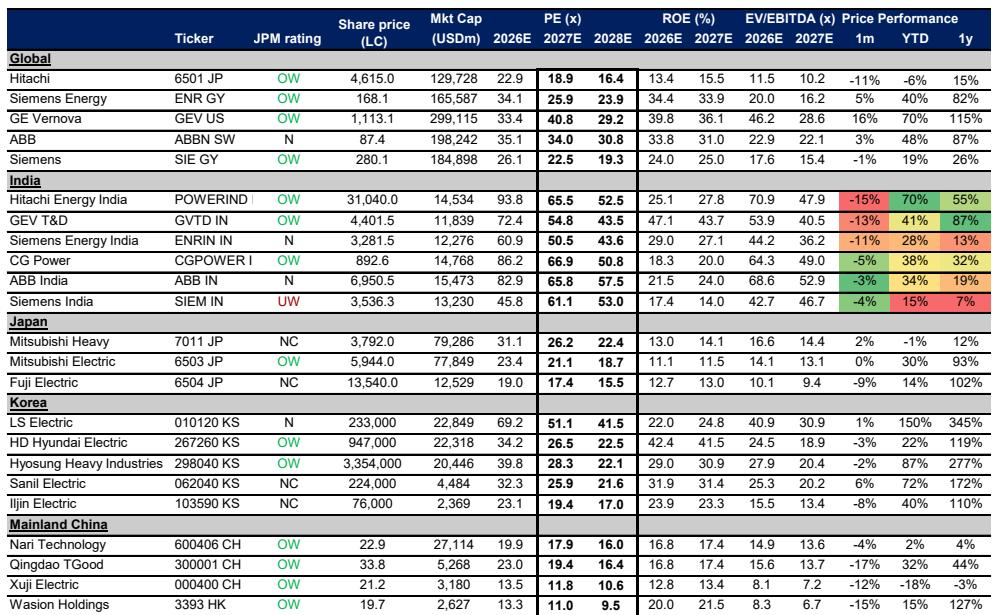

# The Market Overreacted to Chinese Equipment Permits in India — But the Real Strategic Question Is What Comes Next

When news broke that four Chinese power equipment entities with manufacturing bases in India had been granted permission to participate in government contracts for two years, the market responded with a swift and sharp correction. Shares of Indian power equipment companies fell roughly 8% in a single move. The reaction was visceral, almost reflexive — a reminder of how deeply the specter of Chinese competition is embedded in the investment psyche of India's industrial sector.

But the selloff was based on a misreading of the facts. A careful examination of the scale, scope, and incentives at play suggests that the immediate competitive threat is negligible. The three relevant companies — Taikai Electric India, New Northeast Electric India, and Nanjing Electric India — have a combined gross block of approximately Rs2.4 billion (roughly $25 million) and peak revenues of just Rs2.1 billion (about $22 million) in FY22, before restrictions were imposed. Their FY25 revenues were negligible. Even at full utilization, these entities cannot materially alter market shares for established Indian incumbents.

The market's overreaction, however, is not the story. The real story is what this episode reveals about the structural dynamics of the global power equipment cycle and the strategic choices facing observers. The selective and time-bound nature of this relaxation raises a far more consequential question: Is this a one-off administrative adjustment, or does it signal a broader policy shift toward permitting Chinese participation in India's equipment sector? The answer depends not on Indian policy alone, but on how the global demand cycle for power equipment has transformed the calculus for Chinese manufacturers themselves.

This analysis unpacks the report's core argument — that the selloff was overdone — and extends it into a strategic framework for observers. It examines why the competitive threat is currently limited, why the global demand cycle may have altered Chinese incentives in ways the market has not fully priced, and what unresolved questions remain for those who want to position ahead of the next phase of India's energy transition.

## The Immediate Threat Is Negligible Because Scale, Product Scope, and Incentives Are All Misaligned

The first and most important insight from the report is that the three permitted Chinese entities are simply not large enough to disrupt the Indian market. Their combined installed capacity and historical revenue base are trivial relative to the order books of incumbents like Hitachi Energy India, GE Vernova T&D India, and Siemens Energy India. The report notes that even at full utilization, these entities would not materially shift market share.

But scale is only one dimension. The product scope is equally constrained. New Northeast Electric and Taikai Electric manufacture switchgears, not transformers, STATCOMs, reactors, or HVDC equipment. These are the high-value, high-margin segments where Indian incumbents have built their competitive moats. The permitted Chinese entities do not compete in the product categories that drive the most attractive revenue and margin trajectories for the incumbents. The addressable market overlap is narrow.

Perhaps most importantly, the incentive structure works against aggressive pricing. The permission is valid for only two years. These entities would need time to ramp operations, win orders, and achieve any meaningful scale. Given the policy uncertainty — the possibility that the relaxation could be reversed or not renewed — the incentive to price aggressively is minimal. The accumulated losses these entities have already incurred from the earlier restriction period further reduce the appetite for a price war. Rational economic behavior, under these conditions, dictates caution, not aggression.

The market's reaction, therefore, appears to have been driven by headline risk rather than fundamental analysis. The report's conclusion that the ~8% correction was overdone is supported by a straightforward reading of the data. But the more interesting question is why the market reacted this way — and what it tells us about the underlying assumptions observers hold about the Indian power equipment sector.

## The Global Demand Cycle Has Fundamentally Shifted Chinese Manufacturers' Incentives, Making a Price War Less Likely

The report points to a critical but underappreciated development: the global power equipment demand cycle has accelerated meaningfully over the past two to three years. This is not a minor cyclical uptick. It represents a structural shift driven by the energy transition, grid modernization, and the electrification of industrial economies across the developed world.

For Chinese power equipment manufacturers, this changes everything. When domestic demand was the primary driver, and when export markets were limited, the incentive to enter India with aggressive pricing was high. India offered scale, growth, and a foothold in a market that was otherwise difficult to access. But now, with global demand accelerating and export margins improving, Chinese manufacturers face a fundamentally different opportunity set.

The report implicitly raises a strategic question: Why would a Chinese manufacturer invest heavily in a short-term, policy-constrained, low-margin entry into India when it can allocate capacity to higher-margin export markets in the Middle East, Southeast Asia, Africa, and even Europe? The answer, from a capital allocation perspective, is that they would not. The global demand cycle has created a natural hedge against aggressive pricing in India.

This is not to say that Chinese competition will never matter. It will. But the timing and intensity of that competition depend on factors that are currently moving in the opposite direction. The global tightness in power equipment supply — driven by transformer shortages, long lead times, and capacity constraints at Western manufacturers — means that Chinese producers have better alternatives to a price war in India. The report's decision to host a joint call with its China and Korea power equipment analyst underscores the importance of this global perspective.

## The Report Leaves an Open Strategic Question: Will the Relaxation Become a Policy Shift, and What Would That Mean?

The most important unresolved question in the report is whether this selective and time-bound relaxation represents a trial balloon for a broader policy shift. The report does not, and cannot, answer this question definitively. But it provides the analytical framework for thinking about it.

On one hand, the Indian government has strong incentives to maintain restrictions. The domestic power equipment industry is a strategic priority, and allowing Chinese participation could undermine the investment thesis for local manufacturing, which is central to the broader Make in India agenda. The political economy of allowing Chinese competition in a sector tied to national grid security is deeply complex.

On the other hand, the sheer scale of India's transmission capex requirements — estimated at $8-9 billion annually — creates a capacity challenge. The domestic industry may not be able to meet the demand on its own, especially for the most complex equipment like HVDC systems. The report notes a potential $15 billion HVDC ordering pipeline over the next five to six years. If domestic capacity is constrained, the government may face pressure to relax restrictions, even if only temporarily.

The critical variable is not policy intent but execution capacity. If Indian incumbents can scale their manufacturing and delivery capabilities to meet the demand, the case for allowing Chinese participation weakens. If they cannot, the government may face a choice between project delays and policy relaxation. Observers should monitor capacity expansion announcements, order book growth, and delivery timelines as leading indicators of which scenario is more likely.

## Observers Need a Decision Framework That Distinguishes Between Transient Headline Risk and Structural Competitive Threat

The report provides a natural framework for observers to assess the competitive landscape. The framework has three dimensions: scale of the competitor, product scope overlap, and incentive alignment.

First, scale. The combined revenues of the three permitted entities are negligible relative to the incumbents. Observers should monitor whether any of these entities announce capacity expansions, new manufacturing lines, or partnerships that would increase their scale meaningfully. A doubling or tripling of their gross block would still be small, but it would signal a shift in intent.

Second, product scope. The permitted entities currently manufacture switchgears, not the high-value equipment that drives incumbent margins. If they expand into transformers, reactors, STATCOMs, or HVDC systems, that would represent a material escalation. Observers should track product registration, technology partnerships, and hiring in these segments.

Third, incentive alignment. The two-year window and accumulated losses reduce the incentive for aggressive pricing. But if the global demand cycle softens, or if Chinese domestic demand slows, the calculus could change. Observers should monitor Chinese power equipment export margins, capacity utilization rates, and domestic order trends as leading indicators of whether the incentive structure is shifting.

This framework is not exhaustive, but it is mutually exclusive and collectively exhaustive for the key variables that determine competitive intensity. Observers who apply this framework will be better positioned to distinguish between transient headline risk — like the recent 8% correction — and genuine structural threats that require portfolio repositioning.

## The Unanswered Questions That Should Drive Further Research

The report is analytically rigorous, but it leaves several important questions open. First, what is the actual capacity utilization of Chinese power equipment manufacturers globally, and how much spare capacity exists that could be redirected to India if policy permits? The report suggests that global demand is strong, but it does not quantify the slack in the system.

Second, what is the cost competitiveness of Indian incumbents relative to Chinese producers on a total-cost-of-ownership basis? The report focuses on pricing, but the competitive dynamics also depend on quality, reliability, after-sales service, and delivery timelines. Indian incumbents may have advantages in these dimensions that are not fully captured in a price comparison.

Third, what is the probability that the relaxation is extended or expanded? The report does not offer a probability estimate, and it would be inappropriate to do so without a deeper policy analysis. But observers who want to position for the next phase of this debate need to form their own views. The report's decision to host a joint call with the China and Korea analyst suggests that the answer depends on factors outside India — including global demand, Chinese domestic policy, and trade dynamics.

These are not gaps in the report. They are the natural boundaries of any analysis that respects the limits of available data. The report tells observers what they can know with confidence — that the immediate threat is overblown — and points them toward the questions that require further research. That is the mark of serious analysis.

## Join the Community to Read the Full Report and Review the Original Charts

This article has drawn on a detailed research report analyzing the impact of Chinese equipment permits on India's power equipment sector. The full report includes comprehensive valuation comps across global, Indian, Japanese, Korean, and Chinese power equipment companies, detailed research theses for the three key Indian-listed players, and a full discussion of risks and upside scenarios. The original charts — including the combined revenue history of the three Chinese entities and the global valuation comparison table — provide critical context that cannot be fully captured in text. Join the community to read the full report and review the original charts.

*For informational purposes only. Portions may be generated, translated, summarized, or edited with AI assistance based on source materials and may contain omissions or errors. Please verify independently. This is not professional advice.*

For informational purposes only. Portions may be generated, translated, summarized, or edited with AI assistance based on source materials and may contain omissions or errors. Please verify independently. This is not professional advice.

