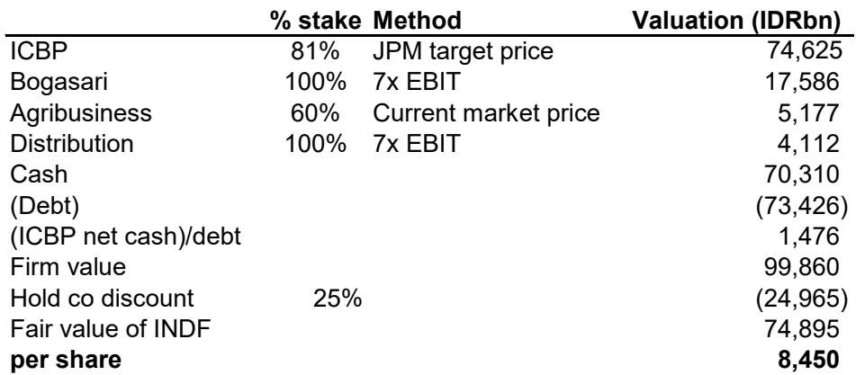
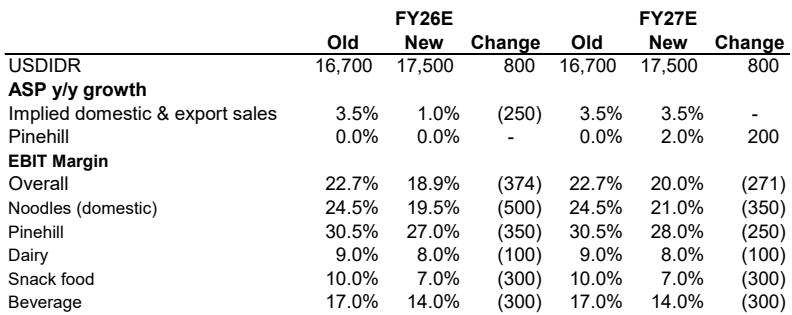
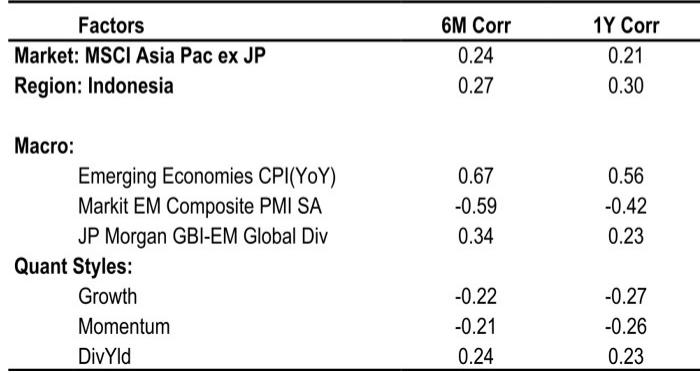

# 印尼消费类公司观察：估值压缩背后的结构性分化

关于印尼消费类公司的传统叙事，似乎正在形成一种自我强化的预期：购买力变化、成本端波动、外资流动，以及市场整体估值调整。许多参与者已经调整了仓位，该板块目前处于历史较低的前瞻估值区间——从过往经验看，这种估值水平往往对应着市场关注度的提升。但需要谨慎的是，当支撑过往估值逻辑的结构性假设发生变化时，单纯依赖历史经验可能并不充分。

对于机构研究者而言，核心问题并非印尼消费类公司是否便宜——它们确实处于较低估值区间。关键在于，导致其估值压缩的条件是周期性的、可逆的，还是结构性的、永久性的。对数据的仔细梳理表明，答案比任何单一观点都更为复杂。当前面临的挑战是真实的，但其中一些因素正在接近峰值。机会不在于对整个板块进行广泛布局，而在于识别哪些公司具备定价能力、盈利韧性以及合适的股东结构，能够受益于下一阶段——而哪些公司可能继续面临估值压力。

这不是对整个板块的全面判断，而是一个在旧估值规则不再适用、新规则仍在形成过程中的市场里，进行选择性研究的框架。

## K型复苏催生了两个不同的消费领域，其中只有一个具备研究价值

当前分析印尼消费领域最重要的区分，不在于必需消费品和可选消费品之间，而在于服务大众市场的公司与服务高端市场的公司之间。疫情后出现的K型复苏并未收敛，反而在加深。

大众市场的必需消费品公司——那些依赖低收入家庭销量增长和广泛分销渗透的公司——在过去近十年中，系统性低于增长预期。过去五年通胀率维持在约3%的温和水平，使这些公司失去了历史上依赖的定价杠杆。与此同时，竞争强度显著上升，尤其是来自新进入者的竞争，从个人护理到包装食品等多个品类都受到冲击。结果是定价能力的结构性压缩，这不是任何消费情绪的周期性恢复所能逆转的。

相比之下，高端和 specialty 零售商继续实现增长。体育零售尤其表现出韧性，某覆盖标的在截至2027年的预测期内实现了14%的收入复合增长率。这并非整体消费强劲的体现，而是反映了较窄的高收入人群的消费模式，这些人群的支出不受更广泛宏观环境变化的影响。这两个领域之间的增长分化并非暂时现象，而是当前消费周期的显著特征。

对于研究者而言，这意味着该板块不能作为一个单一资产类别来评估。影响两个群体——必需消费品和可选消费品——的估值压缩，掩盖了盈利轨迹的根本性分化。仅基于估值水平来关注该板块，可能会持有那些因业务模式面临结构性压力而便宜的公司，同时错过那些增长被以不合理高折价率定价的公司。

## 成本端压力接近峰值，但这本身不足以改变必需消费品公司的处境

成本端确实出现了积极信号。原油价格已回落至约每桶70美元。包装成本——占快速消费品公司销售成本的5-15%——正在趋于温和。棕榈原油和小麦价格虽然仍处于较高水平，但已显示出企稳迹象。今年困扰该板块的盈利下修周期，很可能在下半年开始稳定。

这很重要，但不足以成为必需消费品利润率广泛复苏的充分条件。原因很简单：成本端缓解只有在公司拥有定价能力以保留收益时才具有价值。在当前竞争环境下，许多必需消费品公司无法转嫁成本上涨，同样也难以保留成本节约带来的好处。毛利率的改善在到达营业利润线之前就会被竞争消耗掉。

相对少见的例外是在那些品牌忠诚度和分销护城河创造真正定价能力的品类中占据主导市场地位的公司。方便面是最明显的例子。全球最大的方便面制造商，在印尼市场份额接近70%，有能力以较小竞争对手无法做到的方式管理定价。对于这些公司，成本端缓解直接转化为利润率恢复。对于其他公司，这仅仅意味着恶化的速度放缓。

这一区分应指导组合构建。能够受益于成本端顺风的公司，是那些在周期转向之前就已经拥有定价能力的公司。那些没有定价能力的公司，不会仅仅因为小麦变得更便宜就获得这种能力。

## 从外资到本地机构的股东结构变化，是一个创造选择性机会的结构性因素

印尼消费类公司最被低估的发展之一，是股东结构的变化。过去12-18个月，覆盖范围内的外资持股比例呈下降趋势，伴随着印尼市场的广泛调整。几只消费类公司已被移出MSCI新兴市场标准指数。目前MSCI新兴市场指数中没有任何印尼消费类公司代表。

其影响是显著的。以MSCI新兴市场为基准的研究者现在必须进行非指数投资才能持有印尼消费类股票。这为估值创造了结构性压力，因为边际买家从外资——通常较为稳定且以基准为导向——转向本地机构，后者更具短期性和机会主义倾向。本地共同基金和养老基金已开始有选择性地重新关注消费类公司，但它们具有高度辨别力。它们在盈利韧性较强的公司中增加了持股，而在前景减弱的公司中则减少或保持持股不变。

本地机构这种选择性行为具有指导意义。这表明本地买家基础并非该板块的广泛支撑来源，而是强化了强势公司与弱势公司之间的分化。对于那些同时被外资和本地读者回避的公司，估值修复的路径较为狭窄。对于那些吸引本地买盘的公司，被移出MSCI指数可能反而创造机会，因为该股票不再受指数剔除带来的被动卖出压力。

关键问题是什么能吸引外资回归。汇率稳定、更乐观的增长前景以及一致的政策制定是前提条件。这些因素短期内都不太可能得到解决。在此之前，估值将保持受限，今天看似便宜的公司可能会在较长时间内保持便宜。

## 报告留下一个关键问题未解答：当要约收购扭曲因素消退后会发生什么

当前市场最显著的特征之一是某公司的相对强势表现，年初至今上涨30%，而同期市场指数下跌32%。这种表现几乎完全由每股1550印尼盾的强制性要约收购驱动。该股票目前交易价格高于要约价。

要约收购创造了价格下限，但也暂停了正常的价格发现过程。一旦要约完成，该股票需要基于基本面而非套利来寻找新的均衡。报告下调了该公司的评级，但更有趣的问题是，要约后的交易模式揭示了什么关于该股票真实需求的信息。如果股票在要约后走低，将确认此前的强势表现完全是公司行为而非基本面改善的结果。如果股票保持稳定，则表明市场看到了研究未能捕捉到的价值。

这是一个关于市场效率的实时实验，研究者应密切关注。其结果不仅对该股票有影响，也对市场如何定价其他可能被视为潜在收购或重组候选的印尼消费类公司有启示。

## 当前研究印尼消费类公司的决策框架

对于构建或调整印尼消费类敞口的机构研究者，以下框架可能比简单的估值筛选更有用。

第一，筛选定价能力。转嫁成本的能力是决定哪些公司将从正在出现的周期性缓解中受益的最重要因素。在进入壁垒高的品类中拥有主导市场份额的公司通过这一测试。在竞争激烈、转换成本低的品类中的公司则不然。

第二，独立于整体消费复苏评估盈利韧性。K型复苏短期内不会收敛。盈利依赖于大众市场消费反弹的公司可能会令人失望。盈利由高端细分市场或出口导向需求驱动的公司则处于更有利位置。

第三，评估股东结构动态。吸引本地机构买盘的股票有一个能够吸收外资卖出的支撑基础。同时被外资和本地读者卖出的股票面临结构性压力，短期内任何程度的估值压缩都无法克服。

第四，对估值倍数保持现实态度。印尼消费类估值的历史先例在当前环境下已不适用。市场已经改变。按过去标准看似便宜的倍数，今天可能是公允价值。不要锚定于历史。

第五，关注要约收购扭曲。某公司的情况提醒我们，公司行为可能造成暂时价格错位，掩盖基本面。研究者应区分由基本面驱动的价格变动和由机械因素驱动的价格变动。

## 加入社区阅读完整报告并查看原始图表

以上分析基于一份详细的研究报告，其中包含盈利修正趋势、股东结构数据、成本端图表和估值表格，无法在此完整呈现。原始图表对于组合实施至关重要。对于希望从战略框架转向具体标的选择的研究者，完整报告及其附带的图表提供了必要的细节。

加入社区阅读完整报告并查看原始图表。

*仅供参考。部分内容可能基于源材料通过AI辅助生成、翻译、总结或编辑，可能存在遗漏或错误。请独立核实。这不构成任何专业建议。*

仅供参考。部分内容可能基于源材料通过AI辅助生成、翻译、总结或编辑，可能存在遗漏或错误。请独立核实。这不构成任何专业建议。

